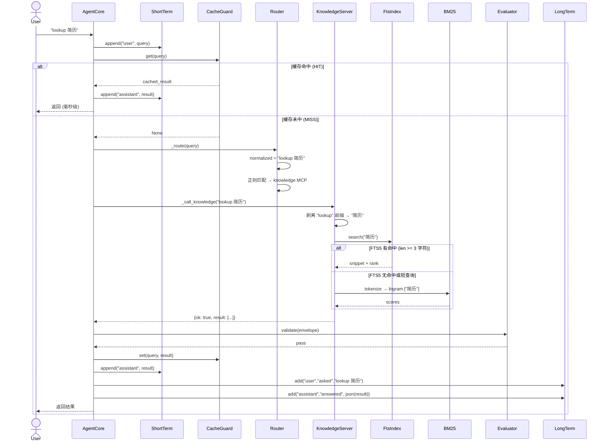
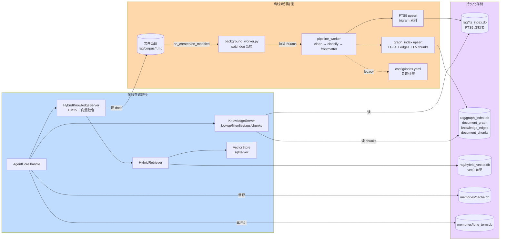
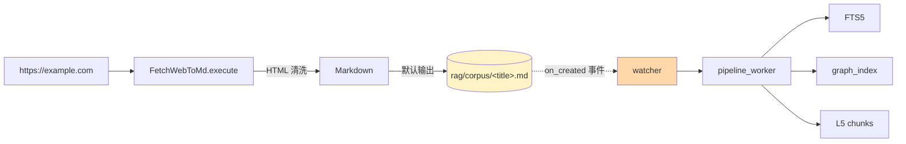
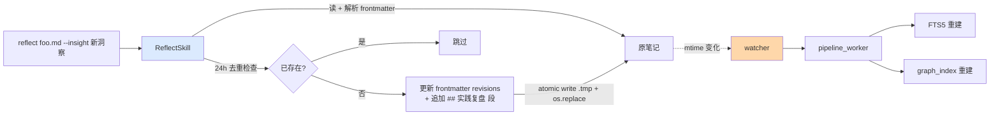
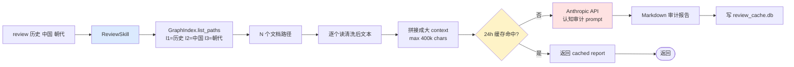
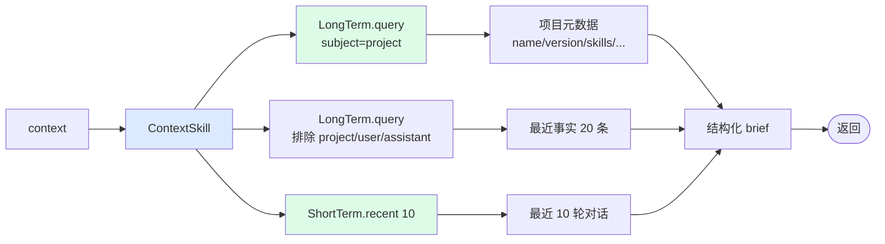

# AI Agent Core

> Token-efficient Agentic Core — deterministic-first routing (cache → skills → MCP → LLM), hybrid RAG retrieval, and tiered memory.

A lightweight, extensible agent framework that prioritizes deterministic, low-cost execution paths before falling back to LLM calls. Every query is matched against a configurable regex routing table; skills and MCP tools run locally with zero token cost before any Anthropic API call.

---

## Table of Contents

- [What This Does](#what-this-does)
- [Architecture](#architecture)
- [Design Principles](#design-principles)
- [Prerequisites](#prerequisites)
- [Quick Start](#quick-start)
- [Environment Variables](#environment-variables)
- [Usage](#usage)
- [Module Breakdown](#module-breakdown)
- [Routing](#routing)
- [Extending](#extending)
- [Testing](#testing)
- [Project Structure](#project-structure)
- [Dependencies](#dependencies)
- [Watcher Pipeline](#watcher-pipeline)

---

## What This Does

`ai-agent-core` is a Python agent framework that routes natural-language queries through deterministic layers (cache → skill → MCP) before falling back to an LLM. The goal: minimize token spend while preserving flexible, correct behavior.

Typical uses:

- **Arithmetic / statistics** — `calc 2 + 3 * 4`, `stats 1, 2, 3, 4, 5` (safe AST eval, no `eval()`)
- **File operations** — `read file /path/to/x.txt`, `clean file /path/to/x.txt`
- **Knowledge lookup** — `lookup python`, `filter [精华] [职场]`, `tags`, `list`, `chunks <path>`, `chunks_by_cat l1 l2 l3` (FTS5 → substring → BM25)
- **Hybrid RAG** — `hybrid query about X` (BM25 + vector fusion via sqlite-vec)
- **File search** — `find files *.py`, `glob **/*.md`
- **Web → Markdown** — `fetch https://example.com/article` (default output goes to `rag/corpus/` for auto-ingest)
- **Context resume** — `context` rebuilds a project brief from long-term memory + recent conversation
- **Reflect on notes** — `reflect rag/corpus/foo.md --insight "..."` appends a `## 实践复盘` section + updates `revisions` frontmatter (Phase 6)
- **Cross-domain review** — `review 历史 中国 朝代` batches all docs in a category to LLM for cognitive audit (Phase 5)
- **ReAct multi-step** — `react 先算 10/2 再 find *.md` lets LLM drive other skills/MCP tools via tool-use API (max 5 steps)
- **Free-form** — anything else falls back to Anthropic Claude

---

## Architecture

```
User Query
  ↓
agent.py: AgentCore.handle(query)
  ↓
1. Append to short-term memory
  ↓
2. Semantic cache check ─── HIT → return cached
  ↓ MISS
3. Route matching (routing.yaml regex intents)
  ↓
4. ├─ skill → local deterministic (math / file_ops / fetch_web / context / find_ops / grep_ops / tree_ops / pipeline_ops / reflect / review / react)
   ├─ mcp   → external tool (knowledge / hybrid_knowledge / file_search)
   └─ llm   → Anthropic API (catch-all fallback)
  ↓
5. Evaluator: envelope validation + format check
  ↓ FAIL + fallback=llm → retry via LLM
  ↓
6. Success → write cache + short-term memory + long-term triplets
  ↓
Return {"ok": ..., "result": ..., "error": ...}
```

### Design Principles

- **Deterministic-first** — every query is matched against a configurable regex routing table. Skills and MCP tools run locally with zero token cost before ever calling an LLM.
- **Envelope protocol** — all outputs follow `{"ok": bool, "result": Any, "error": str | None}`. Simple, machine-parseable, easy to validate.
- **Semantic caching** — SHA256-hashed normalized queries with TTL, backed by SQLite. `"Hello   World"` and `"hello world"` hit the same cache entry. Optional embedding-based semantic similarity fallback.
- **Tiered memory** — short-term (`deque`-buffered JSON) for conversation context, long-term (SQLite triplets) for persistent factual recall.
- **Hybrid RAG** — BM25 + vector search with min-max score fusion, mixed CN/EN tokenizer (English whitespace + Chinese bigram), optional paragraph chunking.
- **Shared corpus loader** — `knowledge` and `hybrid_knowledge` MCP servers share the same `CorpusLoader` instance to avoid duplicate file I/O.

---

## Prerequisites

- Python >= 3.11
- An Anthropic API key (only required for LLM fallback; skill/MCP-only usage works without it)
- Optional: `sentence-transformers` for real semantic embeddings (falls back to deterministic pseudo-embedder)

---

## Quick Start

```bash
cd ai-agent-core

# Create virtual environment
python -m venv .venv
source .venv/bin/activate

# Install with dev dependencies
pip install -e ".[dev]"

# Configure environment
cp .env.example .env
# Edit .env: set ANTHROPIC_API_KEY if you need LLM fallback

# Run
python -m agent "calc 2 + 2"
python -m agent "context"            # rebuild project brief from memory
python -m agent "lookup python"      # search rag/corpus/
python -m agent "fetch https://example.com/article"
```

Expected output:

```json
{
  "ok": true,
  "result": 4,
  "error": null
}
```

---

## Environment Variables

| Variable | Default | Description |
|---|---|---|
| `ANTHROPIC_API_KEY` | — | Anthropic API key (required for LLM fallback) |
| `ANTHROPIC_MODEL` | `claude-opus-4-5-20250929` | Model ID for LLM calls |
| `EMBEDDING_MODEL` | — | Sentence-transformers model name (e.g. `all-MiniLM-L6-v2`). Empty / `pseudo` → deterministic hash embedder |
| `CORPUS_CHUNK_ENABLED` | `1` | `1`/`true` enables paragraph chunking for hybrid retrieval |
| `CORPUS_CHUNK_SIZE` | `1200` | Max chars per chunk |
| `CORPUS_CHUNK_OVERLAP` | `150` | Overlap chars between adjacent chunks |
| `RULES_CONFIG` | `config/rules.yaml` | Path to system rules config |
| `ROUTING_CONFIG` | `config/routing.yaml` | Path to intent routing table |
| `CACHE_PATH` | `memories/cache.db` | Semantic cache SQLite DB |
| `SHORT_TERM_PATH` | `memories/short_term.json` | Short-term memory file |
| `LONG_TERM_DB_PATH` | `memories/long_term.db` | Long-term memory SQLite DB |
| `CACHE_EMBEDDING_MODEL` | `local-hashing` | Embedding model label for cache (informational) |
| `FTS_INDEX_PATH` | `rag/fts_index.db` | FTS5 index SQLite DB path |
| `TAG_RULES_CONFIG` | `config/tag_rules.yaml` | Path to keyword→(L1,L2,L3) classification rules |
| `INDEX_YAML_PATH` | `config/index.yaml` | Path to read-only YAML snapshot of graph_index.db |
| `WATCHER_DIR` | `rag/corpus` | Watcher monitor directory |
| `WATCHER_DEBOUNCE_MS` | `500` | Watcher event debounce in milliseconds |
| `WATCHER_LOG_LEVEL` | `INFO` | Watcher log level |
| `REFLECT_DEDUP_WINDOW_HOURS` | `24` | Phase 6 — dedup window for same insight text |
| `REVIEW_CACHE_DB` | `memories/review_cache.db` | Phase 5 — Review skill LLM result cache DB |
| `PIPELINE_CHUNK_ENABLED` | `1` | Phase 7 — write L5 chunks to `document_chunks` table |
| `PIPELINE_CHUNK_SIZE` | `1200` | Phase 7 — chunk size for pipeline |
| `PIPELINE_CHUNK_OVERLAP` | `150` | Phase 7 — chunk overlap for pipeline |
| `OLLAMA_URL` | `http://localhost:11434` | Phase 7 — Ollama API base URL |
| `OLLAMA_MODEL` | `qwen2.5:3b` | Phase 7 — Ollama model name |
| `OLLAMA_CLASSIFY_TIMEOUT` | `30` | Phase 7 — Ollama classify request timeout (s) |
| `OLLAMA_CLASSIFY_ENABLED` | `0` | Phase 7 — `1`/`true` enables Ollama classifier fallback in pipeline |
| `URL_REGISTRY_PATH` | `memories/url_map.db` | P0-2 — SQLite DB backing the URL→path dedup registry for `fetch` |
| `GRAPH_DB_PATH` | `rag/graph_index.db` | P1 — graph DB path used by `build_similarity_edges.py` |
| `SERVER_PORT` | `8000` | HTTP API listen port (`server.py`) |
| `SERVER_HOST` | `127.0.0.1` | HTTP API listen address (`server.py`) |
| `SERVER_PID_FILE` | `memories/server.pid` | PID file for `server.py` daemon |
| `SERVER_LOG_FILE` | `memories/server.log` | Log file for `server.py` daemon |
| `REVIEW_CRON_EVERY_HOURS` | `24` | Review cron interval in hours (`review_cron.py`) |
| `REVIEW_CRON_POLL_SECONDS` | `60` | Review cron poll interval in seconds |
| `REVIEW_CRON_PID_FILE` | `memories/review_cron.pid` | PID file for `review_cron.py` daemon |
| `REVIEW_CRON_LOG_FILE` | `memories/review_cron.log` | Log file for `review_cron.py` daemon |
| `REVIEWS_DIR` | `reviews/` | Output directory for cron-generated review reports |

---

## Usage

### CLI

The single entry point is `python -m agent "<query>"`. The query is normalized (lowercased, whitespace-collapsed) then matched against `config/routing.yaml`.

```bash
# Arithmetic
python -m agent "calc 2 + 3 * 4"
python -m agent "what is 6 * 7"
python -m agent "compute 100 / 4"

# Statistics
python -m agent "stats 1, 2, 3, 4, 5"

# File operations
python -m agent "read file /path/to/file.txt"
python -m agent "clean file /path/to/file.txt"

# Knowledge lookup (searches rag/corpus/)
python -m agent "lookup python"
python -m agent "filter [精华] [职场]"
python -m agent "list"
python -m agent "tags"
python -m agent "查询简历"          # Chinese natural-language lookup

# Hybrid RAG (semantic + BM25 fusion)
python -m agent "hybrid 个人主权系统"

# File search
python -m agent "find files *.py"
python -m agent "glob **/*.md"

# Web fetch (WeChat articles / generic pages)
python -m agent "fetch https://example.com/article"

# Linux-style file tools (registered as Skills)
python -m agent "tree skills -L 2"                           # directory tree
python -m agent "tree tests -d"                              # dirs only
python -m agent 'find skills -name *.py -maxdepth 1'         # find by name
python -m agent 'find . -type d -recursive -maxdepth 2'      # find dirs
python -m agent 'grep -n "import" tests/ -r'                 # recursive grep
python -m agent 'grep -iE "def\\s+test_\\w+" tests/ -r -n'   # regex grep
python -m agent 'find_grep skills --name *.py --pattern import -r -n -m 5'   # find | xargs grep

# Context resume — rebuild project brief from memories
python -m agent "context"

# Phase 6: Reflect — append practice insight to an existing note
python -m agent "reflect rag/corpus/foo.md --insight 这个模式与汉代监察制度同构 --source manual"

# Phase 5: Review — batch-pack a category for LLM cognitive audit
python -m agent "review 科技 AI 模型"                  # 24h cache, full LLM call
python -m agent "review 科技 AI 模型 --dry-run"         # context only, no LLM
python -m agent "review 科技 AI 模型 --query 聚焦模型演进 --max-chars 5000"

# Phase 7: chunk-level retrieval
python -m agent "chunks rag/corpus/foo.md"             # all L5 chunks of a doc
python -m agent "chunks_by_cat 科技 AI 模型"            # chunks filtered by category

# Free-form query → LLM fallback
python -m agent "explain quantum computing"
```

### HTTP API

`server.py` exposes `AgentCore.handle()` over FastAPI. All `/query` calls are serialized via a process-wide lock (AgentCore is not thread-safe).

```bash
# Foreground
python3 server.py run --port 8000

# Background (writes PID to memories/server.pid)
python3 server.py start
python3 server.py status
python3 server.py stop
python3 server.py restart
```

Query the API:

```bash
curl -s localhost:8000/health
# {"ok":true}

curl -s -X POST localhost:8000/query \
  -H "Content-Type: application/json" \
  -d '{"query":"calc 2 + 2"}'
# {"ok":true,"result":4.0,"error":null}
```

### ReAct Skill (tool-use loop)

The `react` skill lets the LLM drive multi-step tasks by calling other skills/MCP tools via Anthropic's tool-use API. Useful for multi-hop queries like "先算 10/2，再 find *.md".

```bash
python -m agent "react 先算 10/2 再 find *.md"
```

Returns `{answer, steps, tool_calls}` where `tool_calls` lists every skill/MCP invocation the LLM made. `max_steps` defaults to 5, hard-capped at 10. Pass `allowed_tools` to restrict which skills the LLM can call.

### Review Cron Daemon

`review_cron.py` periodically runs `ReviewSkill` for every distinct L1 in `graph_index.db`, writing reports to `reviews/YYYYMMDD_HHMMSS_<l1>.md`.

```bash
# Run every hour (foreground)
python3 review_cron.py run --every-hours 1

# Background (default every 24h)
python3 review_cron.py start
python3 review_cron.py status
python3 review_cron.py stop
python3 review_cron.py restart
```

Env: `REVIEW_CRON_EVERY_HOURS` (default 24), `REVIEW_CRON_POLL_SECONDS` (default 60), `REVIEWS_DIR` (default `reviews/`).

### Programmatic

#### Quick start — `build_agent()` factory (recommended)

All wiring is centralized in `harness/factory.py`. This is what `python -m agent` and `server.py` use internally:

```python
from harness.factory import build_agent

agent = build_agent()  # reads env vars, registers all skills + MCP servers, bootstraps memory

result = agent.handle("calc 2 + 2")
print(result)  # {"ok": True, "result": 4.0, "error": None}
```

#### Manual wiring (full control)

```python
from agent import AgentCore
from skills.math_logic import MathLogic
from skills.file_ops import FileOps
from skills.fetch_web_to_md import FetchWebToMd
from skills.context import ContextSkill
from skills.reflect import ReflectSkill
from skills.review import ReviewSkill
from skills.find_ops import FindOps
from skills.grep_ops import GrepOps
from skills.tree_ops import TreeOps
from skills.pipeline_ops import PipelineOps
from skills.react import ReactSkill
from mcp.servers.knowledge_server import KnowledgeServer
from mcp.servers.hybrid_knowledge_server import HybridKnowledgeServer
from mcp.servers.file_search_server import FileSearchServer
from rag.corpus_loader import CorpusLoader
from rag.metadata import MetadataIndex
from rag.embedder import get_embedder
from rag.fts_index import FtsIndex
from memories.url_registry import UrlRegistry

agent = AgentCore(
    rules_path="config/rules.yaml",
    routing_path="config/routing.yaml",
    cache_path="memories/cache.db",
    short_term_path="memories/short_term.json",
    long_term_path="memories/long_term.db",
)

# Shared corpus loader + metadata index for both knowledge servers
full_loader = CorpusLoader("rag/corpus", chunk=False)
chunked_loader = CorpusLoader("rag/corpus", chunk=True, chunk_size=1200, chunk_overlap=150)
metadata = MetadataIndex("rag/corpus")
metadata.build()
embedder = get_embedder()
fts_index = FtsIndex("rag/fts_index.db")  # Phase 1: write-time FTS5 index
url_registry = UrlRegistry("memories/url_map.db")  # P0-2: URL dedup

agent.register_skill("math_logic", MathLogic())
agent.register_skill("file_ops", FileOps())
agent.register_skill("fetch_web", FetchWebToMd(url_registry=url_registry))
agent.register_skill("context", ContextSkill())
agent.register_skill("reflect", ReflectSkill())   # Phase 6
agent.register_skill("review", ReviewSkill())     # Phase 5
agent.register_skill("find_ops", FindOps())
agent.register_skill("grep_ops", GrepOps())
agent.register_skill("tree_ops", TreeOps())
agent.register_skill("pipeline_ops", PipelineOps())
agent.register_skill("react", ReactSkill(agent=agent))  # ReAct tool-use loop
agent.register_mcp("knowledge", KnowledgeServer(
    full_loader, metadata=metadata, fts_index=fts_index,
    graph_db_path="rag/graph_index.db",  # Phase 7: enables chunks op
))
agent.register_mcp("hybrid_knowledge", HybridKnowledgeServer(chunked_loader, embedder=embedder))
agent.register_mcp("file_search", FileSearchServer())

agent.bootstrap_memory()  # idempotent: writes project metadata to long-term memory

result = agent.handle("calc 2 + 2")
print(result)  # {"ok": True, "result": 4.0, "error": None}
```

---

## Module Breakdown

### `agent.py` — Core Orchestrator

Stateless `AgentCore` class. Entry point and flow control center.

- **Constructor** takes 5 paths (rules, routing, cache, short_term, long_term) and initializes all subsystems.
- **`handle(query)`** is the main entry point:
  1. Append `("user", query)` to short-term memory.
  2. Check semantic cache (return immediately on hit).
  3. Route match → call corresponding skill / mcp / llm.
  4. Validate output via `Evaluator`.
  5. On failure with `fallback="llm"`, retry via Anthropic API.
  6. On success, write to cache + short-term memory + long-term triplets.
- **`bootstrap_memory()`** — idempotently writes project metadata (name, version, description, architecture, skills, MCP servers) into long-term memory. `ContextSkill` reads this to rebuild a project brief.
- **`_parse_skill_args`** — parses natural-language query into a skill `args` dict. Supports `calc`, `stats`, `read/load/show file`, `clean/sanitize file`, `context/brief/resume/status/whoami`, `fetch/crawl`, `reflect`, `review/evolve`, plus CLI-style parsers for `find`, `grep`, `tree`, `find_grep` (each delegating to the corresponding `_parse_*_args` helper).
- **`_call_knowledge`** — routes knowledge queries: `filter [tags]`, `list`, `tags`, or `lookup` (with CN/EN prefix stripping).
- **`_call_llm`** — calls Anthropic API. Model ID via `ANTHROPIC_MODEL` env var. **Multi-turn** (P0-1): injects `short_term.recent(10)` as `user`/`assistant` history via `_build_llm_messages`, so free-form queries see prior context. Final user message is rewritten with `rules.prompt_prefix` + `Output JSON only.` directive.
- **`main()`** — CLI entry point. Delegates to `harness.factory.build_agent()` for wiring, then calls `agent.handle(query)` and prints JSON to stdout.

### `config/` — Configuration Layer

Pydantic v2 models with strict validation (`extra="forbid"`).

- **`models.py`** — `RulesConfig` (constrains `max_output_tokens ∈ [64, 8192]`, `output_format: Literal["json", "text"]`), `RoutingEntry` (`tool_type: Literal["skill", "mcp", "llm"]`), `RoutingConfig`.
- **`loader.py`** — YAML safe loading (`yaml.safe_load`); raises `FileNotFoundError` on missing file.
- **`rules.yaml`** — system rules: role `"Senior AI Infrastructure Engineer"`, token budget 1024, prompt prefix forcing JSON output.
- **`routing.yaml`** — intent → tool routing table (see [Routing](#routing)).

### `harness/` — Anti-Hallucination Layer + Daemon Utilities

- **`cache_guard.py`** — semantic cache. Key = `SHA256(lowercase + collapsed whitespace)`. Default TTL 3600s. SQLite-backed with auto schema migration. Optional `embedder` parameter enables semantic similarity fallback (cosine similarity ≥ `semantic_threshold=0.85` returns the cached result for a near-duplicate query).
- **`evaluator.py`** — output validator. Checks envelope keys `{ok, result, error}` are present; failure envelopes (`ok=False`) pass through unchanged; JSON mode accepts `dict`/`list`/`scalar`/JSON-parseable string.
- **`factory.py`** — `build_agent()` factory: centralized wiring of all skills + MCP servers + corpus loaders + FTS5/graph indexes. Used by `agent.py:main()`, `server.py`, and `review_cron.py`.
- **`daemon.py`** — shared daemon helpers: PID file management, signal-based process control, orphan process discovery via `pgrep`. Used by `background_worker.py`, `server.py`, and `review_cron.py` to avoid duplicating boilerplate.

### `skills/` — Local Deterministic Skills

All skills implement `execute(args: dict) -> dict`, returning the standard envelope.

| Skill | File | Operations |
|---|---|---|
| `MathLogic` | `math_logic.py` | `calc` — safe AST arithmetic (whitelist: `BinOp`, `UnaryOp`, `Constant`); rejects `__import__`, `Call`, `Attribute`. `stats` — mean/sum/count over numeric lists |
| `FileOps` | `file_ops.py` | `read` — read file text; `clean` — strip whitespace, drop blank lines |
| `FetchWebToMd` | `fetch_web_to_md.py` | `fetch` — scrape web pages (WeChat / generic) → Markdown/JSON/HTML. **Default output directory: `rag/corpus/`**; filename based on title (`<title>.<ext>`). Supports `save_img` (download images to `<dir>/images/` + rewrite .md URLs), `save_attachments` (download pdf/zip/docx/mp4/... to `<dir>/attachments/` + rewrite URLs). `<iframe>`/`<video>`/`<audio>`/`<embed>` converted to clickable Markdown links (`[📎 Video](url)`) preserving original URL. **URL dedup** (P0-2): optional `UrlRegistry` (SQLite) caches URL→filepath; repeat `fetch` of the same URL returns the cached path with `source_type="cached"`, `deduped=true`. `force=True` bypasses the cache; missing cached files fall back to re-download. |
| `ContextSkill` | `context.py` | `context` / `brief` / `resume` / `status` — reads long-term + short-term memory, returns a structured project brief (project metadata, recent conversation, known facts, summary) |
| `ReflectSkill` | `reflect.py` | **Phase 6** — `reflect <path> --insight "..."` appends `## 实践复盘 YYYY-MM-DD` section + updates `revisions` frontmatter; idempotent within 24h window (configurable via `REFLECT_DEDUP_WINDOW_HOURS`); atomic write via `.tmp + os.replace` |
| `ReviewSkill` | `review.py` | **Phase 5** — `review [l1] [l2] [l3] [--query "..."] [--max-chars N] [--dry-run] [--no-cache]` batches all docs in a category into a single context, calls LLM for cognitive audit; 24h cache keyed on domain+query (`REVIEW_CACHE_DB`); max 400k chars (~100k tokens) |
| `FindOps` | `find_ops.py` | Linux `find`-style file search (name/regex/type/size/time/max_depth). Registered as `find_ops`; route `^find\s` → `find <path> [-name X] [-type f\|d] [-maxdepth N] [-recursive] [-empty] [-mtime -7]` |
| `GrepOps` | `grep_ops.py` | Linux `grep`-style text search (regex/ignore_case/invert/context_before/after/count/files_with_matches). Registered as `grep_ops`; route `^grep\b` → `grep <pattern> [path] [-i] [-n] [-r] [-l] [-c] [-v] [-E] [-C N] [-g glob]` |
| `TreeOps` | `tree_ops.py` | Linux `tree`-style directory listing (max_depth/dirs_only/all_files/show_size/human_size/full_path/pattern/ignore). Registered as `tree_ops`; route `^(tree\|目录树\|目录结构)\b` → `tree [path] [-L N] [-d] [-a] [-s] [-h] [-f] [-P pat] [-I pat] [--noreport]` |
| `PipelineOps` | `pipeline_ops.py` | Unix-pipe skill combinator + knowledge-graph maintenance ops. Registered as `pipeline_ops`. Ops: `find_grep` (route `^find_grep\b` → `find_grep <path> --name "*.py" --pattern TODO`, chains `FindOps` → `GrepOps`); `build_similarity_edges` (route `^(build\|rebuild\|update)_similarity.*(edge\|graph)?\b` → wraps `scripts/build_similarity_edges.build_edges`, args: `corpus_dir` + `graph_db` required, `top_k=5`, `min_score=-1.0`, `clear=false`) |
| `ReactSkill` | `react.py` | ReAct tool-use loop — lets LLM drive multi-step tasks by calling other skills/MCP tools via Anthropic's tool-use API. Registered as `react`; route `^react\s+` → `react <query>`. `max_steps` defaults to 5, hard-capped at 10. Returns `{answer, steps, tool_calls}`. |

### `mcp/` — Protocol Tool Integration

- **`mcp_client.py`** — lightweight tool registry: `register(name, tool)`, `list_tools()` (sorted), `call(name, args)`. Catches tool exceptions and converts them to error envelopes.
- **`servers/knowledge_server.py`** — knowledge base MCP server. Recursively loads `.txt`/`.md` from a corpus directory. Ops: `lookup` (FTS5 → substring → BM25 fallback), `filter [tags...]`, `list`, `tags`, `chunks <path>` (Phase 7 — L5 chunks of a doc), `chunks_by_cat l1 [l2] [l3]` (Phase 7 — chunks filtered by category). Supports shared `CorpusLoader` + `MetadataIndex` + `FtsIndex` + `graph_db_path` (for chunks ops).
- **`servers/hybrid_knowledge_server.py`** — hybrid RAG MCP server. Wraps `HybridRetriever` (BM25 + vector fusion). Auto-detects embedding dim. Lazy-loads corpus on first query.
- **`servers/file_search_server.py`** — recursive file glob MCP server. Returns path/size/modified-time. Supports `max_results` and `case_sensitive`.

### `rag/` — Knowledge Retrieval (Cold Data)

- **`corpus_loader.py`** — `CorpusLoader`: recursive `.txt`/`.md` loader. Optional paragraph/fixed chunking (`chunk=True, chunk_size=1200, chunk_overlap=150`). Single source of truth shared by both knowledge servers.
- **`metadata.py`** — `MetadataIndex`: fast in-memory tag/date/source filter. Parses `[tag]` from filenames, date from `YYYYMMDD_HHMMSS_` prefix, title from first `#` heading, source URL from body. O(1) per-tag lookup.
- **`chunker.py`** — `TextChunker`: paragraph strategy (split on `\n\n`, merge short paragraphs, split overlong ones at sentence boundary) or fixed strategy (sliding window with overlap, breaks at CJK/ASCII sentence punctuation).
- **`tokenizer.py`** — mixed-language tokenizer: English whitespace split + Chinese 2-character bigrams. Handles `"AI 简历优化"` → `["ai", "简历", "历优", "优化"]`.
- **`embedder.py`** — embedder factory. Priority: explicit `model_name` → `EMBEDDING_MODEL` env var → pseudo-embedder (SHA256 hash → deterministic `[-1, 1]` vector). Supports `sentence-transformers` models (e.g. `all-MiniLM-L6-v2` 384-dim).
- **`retriever.py`** — `HybridRetriever`: BM25 + vector search, min-max score normalization, weighted fusion (`0.5 * bm25 + 0.5 * vector`), top-k results.
- **`fts_index.py`** — **Phase 1** — SQLite FTS5 virtual table with `trigram` tokenizer; short queries (< 3 chars) fall back to `instr()` substring match. Upsert via `DELETE + INSERT` (FTS5 PK limitation).
- **`graph_index.py`** — **Phase 2** — SQLite `document_graph` (L1/L2/L3/L4 paths) + `knowledge_edges` (Phase 4 wikilinks) + `document_chunks` (Phase 7 L5 chunks). WAL mode + module-level migration singleton (`_ensure_migrated`) for safe concurrent writes.
- **`vector_db/store.py`** — sqlite-vec vector store with `vec0` virtual table. Cosine similarity via `1.0 - distance`. Uses `DELETE + INSERT` pattern for upserts (vec0 primary key limitation).
- **`corpus/`** — knowledge base source documents. `fetch_web_to_md` writes here by default for auto-ingest.

### `memories/` — Tiered Memory

- **`short_term.py`** — conversation buffer using `deque(maxlen=N)`. Persisted to JSON on every `append`/`clear`. Survives restarts via `_load()`.
- **`long_term.py`** — SQLite triplets `(subject, predicate, object, ts)`. Indexed by subject and predicate. `summarize_as_text()` returns `"subject predicate object"` joined text.
- **`url_registry.py`** — P0-2 — `UrlRegistry` (SQLite) backs `fetch_web` URL→filepath dedup. Repeat `fetch` of the same URL returns the cached path; `force=True` bypasses.
- Runtime files (`short_term.json`, `long_term.db`, `cache.db`, `url_map.db`, `review_cache.db`) are gitignored.

---

## Routing

The routing table (`config/routing.yaml`) maps user intent patterns to execution targets. Intents are regexes matched against the normalized query (lowercased, whitespace-collapsed). First match wins.

```yaml
entries:
  - intent: "^(calc|compute|what is).*\\d"
    tool_type: "skill"
    tool_name: "math_logic"
    fallback: "llm"

  - intent: "^stats.*"
    tool_type: "skill"
    tool_name: "math_logic"
    fallback: "llm"

  - intent: "^(context|brief|resume|status|whoami).*"
    tool_type: "skill"
    tool_name: "context"
    fallback: null

  - intent: "^(read|load|show|clean|sanitize).*file"
    tool_type: "skill"
    tool_name: "file_ops"
    fallback: "llm"

  - intent: "^(clean|sanitize).*"
    tool_type: "skill"
    tool_name: "file_ops"
    fallback: null

  - intent: "^(fetch|抓取|下载|crawl).*http"
    tool_type: "skill"
    tool_name: "fetch_web"
    fallback: "llm"

  - intent: "^find_grep\\b"
    tool_type: "skill"
    tool_name: "pipeline_ops"
    fallback: "llm"

  - intent: "^(build|rebuild|update)_similarity.*(edge|graph)?\\b"
    tool_type: "skill"
    tool_name: "pipeline_ops"
    fallback: "llm"

  - intent: "^find\\s"
    tool_type: "skill"
    tool_name: "find_ops"
    fallback: "llm"

  - intent: "^grep\\b"
    tool_type: "skill"
    tool_name: "grep_ops"
    fallback: "llm"

  - intent: "^(tree|目录树|目录结构)\\b"
    tool_type: "skill"
    tool_name: "tree_ops"
    fallback: "llm"

  - intent: "^(ls|dir|glob|file.search|find.files|find files|find file).*"
    tool_type: "mcp"
    tool_name: "file_search"
    fallback: "llm"

  - intent: "^(hybrid|rag|deep.search|semantic).*"
    tool_type: "mcp"
    tool_name: "hybrid_knowledge"
    fallback: "llm"

  - intent: "^(lookup|search|find|filter|list|tags|chunks|chunks_by_cat|查询|搜索|查找|寻找|找|帮我|什么是|怎么|标签|列出|所有).*"
    tool_type: "mcp"
    tool_name: "knowledge"
    fallback: "llm"

  - intent: "^reflect\\s+"
    tool_type: "skill"
    tool_name: "reflect"
    fallback: "llm"

  - intent: "^react\\s+"
    tool_type: "skill"
    tool_name: "react"
    fallback: "llm"

  - intent: "^(review|evolve)\\b"
    tool_type: "skill"
    tool_name: "review"
    fallback: "llm"

  - intent: ".*"
    tool_type: "llm"
    tool_name: "claude"
    fallback: null
```

**Tool types:** `skill` | `mcp` | `llm`

**Fallback:** when a skill/MCP call fails and `fallback` is `"llm"`, the query is retried via the Anthropic API. Set to `null` to disable fallback.

---

## Extending

### Adding a New Skill

1. Create `skills/my_skill.py`:

```python
from skills.base import ok, err

class MySkill:
    def execute(self, args: dict) -> dict:
        op = args.get("op")
        if op == "greet":
            name = args.get("name", "World")
            return ok(f"Hello, {name}!")
        return err(f"unknown op: {op}")
```

2. Register and add a route:

```python
agent.register_skill("my_skill", MySkill())
```

```yaml
# config/routing.yaml
- intent: "^greet.*"
  tool_type: "skill"
  tool_name: "my_skill"
  fallback: null
```

### Adding a New MCP Tool

Create a class with `execute(args: dict) -> dict` and register:

```python
agent.register_mcp("my_tool", MyTool())
```

### Adding a New Knowledge Source

Drop `.txt` or `.md` files into `rag/corpus/`. Both `KnowledgeServer` and `HybridKnowledgeServer` load recursively, so subdirectories are supported. The `fetch_web_to_md` skill writes fetched articles here by default, so a `fetch ...` followed by `lookup ...` immediately finds the new content.

For tag-based filtering, name files with bracket tags: `[精华][职场]some_topic.md`. `MetadataIndex` parses these for O(1) tag lookup.

---

## Testing

```bash
pytest -v                              # Run all tests (357 cases)
pytest -v tests/test_agent.py          # Core agent tests
pytest -v tests/test_p0_multiturn.py   # P0-1 — multi-turn LLM conversation
pytest -v tests/test_p0_url_dedup.py   # P0-2 — URL→path dedup registry
pytest -v tests/test_p1_similarity_edges.py  # P1 — BM25 similarity edges
pytest -v tests/test_phase5_review.py  # Phase 5 — Review skill
pytest -v tests/test_phase6_reflect.py # Phase 6 — Reflect skill
pytest -v tests/test_phase7_chunks.py  # Phase 7 — L5 chunks
pytest -v tests/test_phase7_offline_classifier.py  # Phase 7 — Ollama fallback
pytest -v tests/test_phase4_graph_edges.py  # Phase 4 — wikilinks + multi-homing
pytest -v tests/test_factory.py        # build_agent() factory
pytest -v tests/test_react_skill.py    # ReAct tool-use loop
pytest -v tests/test_server.py         # HTTP API server
pytest -v tests/test_review_cron.py    # Review cron daemon
pytest --cov=. tests/                  # With coverage
```

35 test files, 357 cases covering all phases (1-7) plus P0/P1 gap-closure and the factory/HTTP/ReAct/cron/tree_ops active-output layer: config, short/long-term memory, file ops, math logic, cache guard, evaluator, vector store, retriever, MCP client, knowledge server (FTS5 + chunks), fetch_web_to_md, agent, end-to-end integration, Phase 4 graph edges, Phase 5 review, Phase 6 reflect, Phase 7 chunks, Phase 7 offline classifier, pipeline clean/classify/fts5/index_yaml/worker_e2e, multi-turn LLM (P0-1), URL dedup (P0-2), BM25 similarity edges (P1), build_agent factory, ReAct tool-use loop, FastAPI server, review cron daemon, tree_ops. AAA pattern (Arrange-Act-Assert), descriptive `test_<behavior>` naming.

---

## Project Structure

```
ai-agent-core/
├── agent.py                       # AgentCore orchestrator (stateless)
├── background_worker.py           # Watchdog file watcher (start/stop/restart/status/run)
├── server.py                      # HTTP API server (FastAPI + uvicorn, start/stop/restart/status/run)
├── review_cron.py                 # Review cron daemon (per-L1 periodic review, start/stop/restart/status/run)
├── pyproject.toml                 # Dependencies & tool config
├── .env.example                   # Environment template
├── .gitignore
│
├── config/                        # Configuration layer
│   ├── __init__.py
│   ├── models.py                  # Pydantic v2 models (RulesConfig / RoutingEntry / RoutingConfig)
│   ├── loader.py                  # YAML safe loader
│   ├── rules.yaml                 # System rules & prompt
│   ├── routing.yaml               # Intent → tool routing table
│   ├── tag_rules.yaml             # keyword → (L1, L2, L3) classification rules (pipeline)
│   └── index.yaml                 # Read-only snapshot of graph_index.db (Phase 2: deprecated as source of truth)
│
├── harness/                       # Anti-hallucination layer + daemon utilities
│   ├── __init__.py
│   ├── cache_guard.py             # Semantic cache (SHA256 + SQLite + optional embedding)
│   ├── evaluator.py               # Output envelope validator
│   ├── factory.py                 # build_agent() factory (centralized wiring)
│   └── daemon.py                  # Shared PID/pgrep/signal daemon helpers (server/cron/worker)
│
├── skills/                        # Local deterministic skills
│   ├── __init__.py
│   ├── base.py                    # Skill Protocol + ok/err helpers
│   ├── math_logic.py              # Safe AST arithmetic + statistics
│   ├── file_ops.py                # File read & text cleaning
│   ├── fetch_web_to_md.py         # Web → Markdown/JSON/HTML
│   ├── context.py                 # Project brief from memories
│   ├── reflect.py                 # Phase 6 — append practice insights to notes
│   ├── review.py                  # Phase 5 — batch review/evolve via LLM
│   ├── find_ops.py                # Linux find-style file search (registered as find_ops)
│   ├── grep_ops.py                # Linux grep-style text search (registered as grep_ops)
│   ├── tree_ops.py                # Linux tree-style directory listing (registered as tree_ops)
│   ├── pipeline_ops.py            # Unix-pipe skill combinator (registered as pipeline_ops)
│   └── react.py                   # ReAct tool-use loop (LLM drives other skills/MCP)
│
├── mcp/                           # Protocol tool integration
│   ├── __init__.py
│   ├── mcp_client.py              # Tool registry
│   └── servers/
│       ├── __init__.py
│       ├── knowledge_server.py        # lookup/filter/list/tags/chunks/chunks_by_cat (FTS5 + Phase 7 chunks)
│       ├── hybrid_knowledge_server.py # BM25 + vector fusion
│       └── file_search_server.py      # Recursive glob
│
├── rag/                           # Knowledge retrieval
│   ├── __init__.py
│   ├── corpus_loader.py           # Shared loader (optional chunking)
│   ├── metadata.py                # Tag/date/source index
│   ├── chunker.py                 # Paragraph / fixed chunking
│   ├── tokenizer.py               # CN bigram + EN word tokenizer
│   ├── embedder.py                # sentence-transformers or pseudo
│   ├── retriever.py               # HybridRetriever (BM25 + vector fusion)
│   ├── fts_index.py               # Phase 1 — FTS5 trigram index
│   ├── graph_index.py             # Phase 2 — SQLite document_graph + knowledge_edges (Phase 4) + document_chunks (Phase 7)
│   ├── vector_db/
│   │   ├── __init__.py
│   │   └── store.py               # sqlite-vec vector store
│   ├── corpus/                    # Knowledge source documents (.txt / .md)
│   │   └── records/               # Nested corpus subdirectory
│   ├── fts_index.db               # FTS5 runtime DB (gitignored)
│   ├── graph_index.db             # Graph + edges + chunks runtime DB (gitignored)
│   └── hybrid_vector.db           # Vector DB (gitignored)
│
├── scripts/                       # Watcher-Pipeline scripts
│   ├── __init__.py
│   ├── pipeline_worker.py         # clean → classify → frontmatter → FTS5 → graph + edges (Phase 4) + chunks (Phase 7)
│   ├── web_scraper.py             # URL → .md into rag/corpus/ (reuses fetch_web_to_md)
│   ├── offline_classifier.py      # Phase 7 — Ollama-based fallback classifier
│   └── build_similarity_edges.py  # P1 — BM25 top-k similarity edges builder
│
├── memories/                      # Tiered memory
│   ├── __init__.py
│   ├── short_term.py              # deque + JSON persistence
│   ├── long_term.py               # SQLite triplets
│   ├── url_registry.py            # P0-2 — URL→path dedup registry (SQLite)
│   ├── short_term.json            # Runtime data (gitignored)
│   ├── long_term.db               # Runtime data (gitignored)
│   ├── cache.db                   # Runtime data (gitignored)
│   ├── url_map.db                 # P0-2 — URL registry runtime DB (gitignored)
│   └── review_cache.db            # Phase 5 — Review skill cache (gitignored)
│
└── tests/                         # pytest suite (35 files, 357 cases)
    ├── __init__.py
    ├── test_config.py
    ├── test_short_term.py
    ├── test_long_term.py
    ├── test_file_ops.py
    ├── test_math_logic.py
    ├── test_cache_guard.py
    ├── test_evaluator.py
    ├── test_vector_store.py
    ├── test_retriever.py
    ├── test_mcp_client.py
    ├── test_knowledge_server.py       # Phase 1 FTS5 + Phase 7 chunks
    ├── test_fetch_web_to_md.py
    ├── test_agent.py
    ├── test_e2e.py
    ├── test_pipeline_clean.py
    ├── test_pipeline_classify.py
    ├── test_pipeline_fts5.py
    ├── test_pipeline_index_yaml.py
    ├── test_graph_index.py            # Phase 2 — SQLite graph
    ├── test_phase4_graph_edges.py     # Phase 4 — wikilinks + multi-homing + codeblock protection
    ├── test_phase5_review.py          # Phase 5 — ReviewSkill
    ├── test_phase6_reflect.py         # Phase 6 — ReflectSkill
    ├── test_phase7_chunks.py          # Phase 7 — L5 chunks API
    ├── test_phase7_offline_classifier.py  # Phase 7 — Ollama fallback
    ├── test_p0_multiturn.py            # P0-1 — multi-turn LLM conversation
    ├── test_p0_url_dedup.py            # P0-2 — URL→path dedup registry
    ├── test_p1_similarity_edges.py     # P1 — BM25 similarity edges builder
    ├── test_p1_pipeline_similarity_op.py  # P1 — pipeline similarity op
    ├── test_pipeline_worker_e2e.py    # pipeline end-to-end + chunk integration
    ├── test_factory.py                # build_agent() factory wiring
    ├── test_react_skill.py            # ReAct tool-use loop skill
    ├── test_server.py                 # HTTP API server (FastAPI)
    ├── test_review_cron.py            # Review cron daemon
    └── test_tree_ops.py              # TreeOps directory listing skill
```

---

## Dependencies

| Package | Purpose |
|---|---|
| `pydantic>=2.6` | Config model validation |
| `pyyaml>=6.0` | YAML config parsing |
| `numpy>=1.26` | Vector storage operations |
| `rank-bm25>=0.2.2` | BM25 text retrieval |
| `sqlite-vec>=0.1.6` | Vector similarity search |
| `mcp>=1.2.0` | MCP protocol support |
| `anthropic>=0.40.0` | LLM API calls |
| `python-dotenv>=1.0.1` | Environment variable loading |
| `fastapi>=0.110` | HTTP API server (`server.py`) |
| `uvicorn[standard]>=0.27` | ASGI server for FastAPI |

Dev (optional via `pip install -e ".[dev]"`):

| Package | Purpose |
|---|---|
| `pytest>=8.0` | Test framework |
| `pytest-cov>=5.0` | Coverage reporting |
| `pytest-asyncio>=0.23` | Async test support |
| `httpx>=0.27` | FastAPI TestClient transport for `test_server.py` |

Optional:

| Package | Purpose |
|---|---|
| `sentence-transformers` | Real semantic embeddings (set `EMBEDDING_MODEL` env var) |

---

## Watcher Pipeline

A separate background process watches `rag/corpus/` and auto-indexes new/modified `.md` files into SQLite FTS5 + a SQLite `document_graph` table (L1→L2→L3→L4 hierarchy). Phase 1 (FTS5 read-path integration with `KnowledgeServer`) and Phase 2 (graph index migrated from YAML to SQLite WAL) are complete.

### Components

- `background_worker.py` — watchdog-based file watcher; supports `start` / `stop` / `restart` / `status` / `run` subcommands
- `scripts/pipeline_worker.py` — clean → classify (regex rules) → inject frontmatter → FTS5 upsert → graph_index upsert
- `scripts/web_scraper.py` — URL → `.md` into `rag/corpus/` (reuses `skills.fetch_web_to_md`; supports `--save-img` / `--save-attachments`)
- `rag/fts_index.py` — `FtsIndex` class wrapping SQLite FTS5 virtual table (trigram tokenizer)
- `rag/graph_index.py` — `GraphIndex` class wrapping SQLite `document_graph` table (WAL mode, native concurrent writes)
- `config/tag_rules.yaml` — keyword → (L1, L2, L3) classification rules
- `config/index.yaml` — read-only snapshot exported from `graph_index.db` (no longer the source of truth since Phase 2)

### Start the watcher

```bash
cd ai-agent-core

# Background mode (writes PID to ./.watcher.pid, logs to ./.watcher.log)
python3 background_worker.py start --dir rag/corpus

# Check status
python3 background_worker.py status

# Stop / restart
python3 background_worker.py stop
python3 background_worker.py restart --dir rag/corpus --debounce-ms 300

# Foreground mode (debug, Ctrl-C to stop)
python3 background_worker.py run --dir rag/corpus
```

The watcher recursively monitors `rag/corpus/`, debounces duplicate events 500ms, and processes files through a 2-worker pool. SQLite WAL mode (`graph_index.db`) handles concurrent writes natively — no application-level lock needed.

### Ingest a URL

```bash
# Dropped into rag/corpus/ and auto-indexed by the watcher
python3 -m scripts.web_scraper "https://example.com/article"

# Download images + attachments (recommended for WeChat articles)
python3 -m scripts.web_scraper "https://mp.weixin.qq.com/s/xxx" --save-img --save-attachments

# Fetch + run pipeline immediately (--sync, no watcher needed)
python3 -m scripts.web_scraper "https://example.com/article" --sync
```

### Manual pipeline run

```bash
python3 -m scripts.pipeline_worker --path rag/corpus/some_doc.md
```

### Query FTS5 directly

```bash
sqlite3 rag/fts_index.db "SELECT path, title, category FROM docs WHERE docs MATCH 'llm' ORDER BY rank LIMIT 5"
```

Or programmatically:

```python
from rag.fts_index import FtsIndex
fts = FtsIndex("rag/fts_index.db")
hits = fts.search("llm", limit=5)
for h in hits:
    print(h["path"], h["category"], h["snippet"])
fts.close()
```

### Inspect the graph index

```bash
# Query SQLite directly
sqlite3 rag/graph_index.db "SELECT path, l1, l2, l3 FROM document_graph WHERE l1='科技' AND l2='AI'"

# Or export to YAML snapshot (read-only)
python3 -c "
from rag.graph_index import GraphIndex
gi = GraphIndex('rag/graph_index.db')
import yaml
print(yaml.safe_dump(gi.export_yaml_dict(), allow_unicode=True, sort_keys=False))
gi.close()
"
```

### How lookup uses FTS5 (Phase 1)

`KnowledgeServer` accepts an optional `FtsIndex` argument. When injected, `lookup` queries FTS5 first (O(log n) with `snippet()` highlighting), falling back to substring match and BM25 if FTS5 misses. The agent's `main()` wires this up automatically:

```python
fts_index = FtsIndex("rag/fts_index.db")
agent.register_mcp("knowledge", KnowledgeServer(corpus_loader, metadata=metadata, fts_index=fts_index))
```

### Auto-tagging

Classification rules live in `config/tag_rules.yaml`. Each rule has `l1`, `l2`, `l3`, and a `keywords` list. The pipeline scans title + first 5000 chars of content (lowercased); first matching rule wins. No match → `defaults` block applies (default `未分类/Misc/General`). Edit the file to add topics — the watcher picks up changes on the next file event (rules load per-invocation).

### Frontmatter injection

If a `.md` file has no YAML frontmatter, the pipeline prepends:

```yaml
---
l1: 科技
l2: AI
l3: 模型
title: <first # heading>
fetched_at: <mtime ISO>
---
```

Existing frontmatter with `l1/l2/l3` is left untouched.

### Phase roadmap

| Phase | Status | Description |
|---|---|---|
| Phase 1 | ✅ Done | `KnowledgeServer` integrates `FtsIndex` — lookup goes FTS5 → substring → BM25 |
| Phase 2 | ✅ Done | `config/index.yaml` → `rag/graph_index.db` (SQLite WAL); YAML becomes read-only snapshot |
| Phase 3 | ✅ Done | `on_deleted` event → auto-cleanup FTS5 + graph_index via `delete_file_indexes()` |
| Phase 4 | ✅ Done | Multi-homing (composite PK `path + l1/l2/l3`) + `knowledge_edges` (wikilinks) + codeblock protection |
| Phase 5 | ✅ Done | `ReviewSkill` — batch-pack a category for LLM cognitive audit with 24h cache |
| Phase 6 | ✅ Done | `ReflectSkill` — append practice insights + `revisions` frontmatter (idempotent within 24h) |
| Phase 7 | ✅ Done | L5 `document_chunks` table + `chunks`/`chunks_by_cat` ops + offline Ollama classifier fallback |
| P0-1 | ✅ Done | `_call_llm` injects `short_term.recent(10)` as multi-turn history (free-form queries see prior context) |
| P0-2 | ✅ Done | `UrlRegistry` (SQLite) backs `fetch_web` — repeat URLs return cached filepath, `force=True` bypasses |
| P1 | ✅ Done | `scripts/build_similarity_edges.py` — BM25 top-k per doc → `knowledge_edges` with `rel_type='bm25_similar'` |

### BM25 similarity edges (P1)

Manually grown similarity network from the existing corpus. For each document in `rag/corpus/`, computes BM25 scores against the rest of the corpus and writes the top-k (default 5) most similar docs as edges into `knowledge_edges` with `rel_type='bm25_similar'`. Grows the graph from a handful of manual wikilink edges to a comprehensive similarity network (1485+ edges on the 477-doc production corpus).

```bash
# Build (idempotent — upserts by source_path + target_path)
python3 scripts/build_similarity_edges.py --corpus rag/corpus --top-k 5

# Wipe existing bm25_similar edges first, then rebuild
python3 scripts/build_similarity_edges.py --clear

# Filter weak matches (negative scores pass by default since BM25 can return negatives)
python3 scripts/build_similarity_edges.py --min-score 0.5
```

Edge weights are raw BM25 scores. Paths stored as absolute corpus-relative so they resolve across tools.

#### Via `pipeline_ops` skill (agent-routable)

The `build_similarity_edges` op wraps the script for LLM/agent invocation. `corpus_dir` and `graph_db` are **required** (no env fallback — prevents accidental mutation of the production graph):

```python
from skills.pipeline_ops import PipelineOps
PipelineOps().execute({
    "op": "build_similarity_edges",
    "corpus_dir": "rag/corpus",
    "graph_db":   "rag/graph_index.db",
    "top_k":     5,
    "min_score": -1.0,   # default — 0.0 would filter all top-k for dissimilar docs
    "clear":     False,  # True wipes bm25_similar edges first
})
# => {"ok": True, "result": {"docs": 477, "edges_added": 1485, ...}, "error": None}
```

Routing: `^(build|rebuild|update)_similarity.*(edge|graph)?\b` → `pipeline_ops`. So `build similarity edges` / `rebuild similarity graph` trigger this op through the agent without a shell.

### Caveats

- The watcher is **independent** from `agent.py` — agent reads corpus via the lazy `CorpusLoader`; FTS5/graph_index are parallel indexes wired into `KnowledgeServer` (Phase 1), pipeline writes (Phase 2), `on_deleted` cleanup (Phase 3), and `chunks` ops (Phase 7).
- Wikilinks inside ```code blocks``` are protected from being parsed (Phase 4 fix — `clean_md(keep_codeblocks_stashed=True)`).
- Phase 7 Ollama classifier is **opt-in**: set `OLLAMA_CLASSIFY_ENABLED=1` to enable. When disabled or unavailable, pipeline falls back to rules-based classification.

---

## 架构图解

> 本章面向首次接触本项目的工程师,用 4 张 Mermaid 图 + 简明文字讲清"整体如何运行、模块如何划分、数据如何流动"。
> 配合 [docs/structure.md](../docs/structure.md) 食用,后者是文件级的逐项注解。

### 1. 系统总体架构(分层视图)

核心思想:**确定性优先,LLM 兜底**。Query 自上而下依次穿过缓存层 → 路由层 → 执行层(skill/mcp/llm)→ 校验层,任何一层命中就短路返回,只有失败才下沉到下一层。Token 消耗从 0 起步,仅在 LLM 兜底时才计费。

```mermaid
flowchart TD
    U([用户输入<br/>python -m agent "lookup 简历"]) --> A[AgentCore.handle]

    subgraph MEM[记忆层 memories/]
        ST[ShortTerm<br/>deque + JSON]
        LT[LongTerm<br/>SQLite triplets]
    end

    subgraph CACHE[缓存层 harness/]
        CG[CacheGuard<br/>SHA256 + TTL + 可选 embedding]
    end

    subgraph ROUTE[路由层 config/routing.yaml]
        R{正则匹配<br/>首条命中胜出}
    end

    subgraph EXEC[执行层]
        SK[Skills 本地确定性<br/>math / file_ops / fetch_web<br/>context / reflect / review<br/>find_ops / grep_ops / tree_ops<br/>pipeline_ops / react]
        MCP[MCP Servers 工具调用<br/>knowledge / hybrid_knowledge / file_search]
        LLM[LLM 兜底<br/>Anthropic API]
    end

    subgraph EVAL[校验层 harness/]
        EV[Evaluator<br/>信封 + 格式校验]
    end

    A -->|append user| ST
    A --> CG
    CG -->|HIT| RET([返回缓存结果])
    CG -->|MISS| R
    R -->|skill| SK
    R -->|mcp| MCP
    R -->|llm / fallback| LLM
    SK --> EV
    MCP --> EV
    LLM --> EV
    EV -->|ok| W[写 cache + short_term + long_term]
    EV -->|fail + fallback=llm| LLM
    W --> ST
    W --> LT
    W --> RET

    style CACHE fill:#fef3c7
    style EXEC fill:#dbeafe
    style MEM fill:#dcfce7
    style LLM fill:#fee2e2
```

**关键设计**:
- **缓存层**用 `SHA256(归一化query)` 作 key,`"  Calc  2+2  "` 与 `"calc 2+2"` 共享同一缓存项;可选 `embedding` 字段支持语义相似度回退 (cosine ≥ 0.85)
- **路由层**纯正则匹配,无 NLU,**零 token 消耗**;首条匹配胜出,顺序由 [routing.yaml](config/routing.yaml) 决定
- **校验层**强制信封 `{ok, result, error}` 协议,失败信封直接透传;`fallback=llm` 时自动重试 LLM 路径
- **记忆层**短期用 deque + JSON (最近 50 轮),长期用 SQLite triplets `(subject, predicate, object, ts)`

### 2. 一次 Query 的运行时流程(时序图)

以 `python -m agent "lookup 简历"` 为例,展示从输入到输出各模块的协作时序。**毫秒级响应**的快速路径。



**要点**:
- `_call_knowledge` 是知识查询的智能分发器,根据前缀路由到 `chunks`/`chunks_by_cat`/`filter`/`list`/`tags`/`lookup` 6 种 op
- FTS5 (trigram 分词) 对 ≥3 字符的查询走 `MATCH` (O(log n)),<3 字符走 `instr()` 子串兜底
- BM25 在内存中**每次 query 时重建索引** (corpus 不大时反而比维护增量索引快)
- LLM 兜底路径**不写 cache** (避免错误结果被缓存),只在 `result.ok=True` 时才写

### 3. 数据流(离线索引 + 在线查询)

橙色为**离线写入路径** (watcher 监听文件变化 → pipeline 处理 → 多索引同步);蓝色为**在线查询路径** (agent → 索引读取)。两条路径通过 SQLite WAL + 模块级迁移单例锁保证并发安全。



**离线索引的 5 个阶段** (pipeline_worker.process_file):
1. **clean_md** — 去 HTML 残留 + 折叠空白 + 代码块保护 (stash 占位符)
2. **classify** — keyword 命中 → L1/L2/L3,支持 multi-homing (Phase 4,最多 3 个标签)
3. **inject_frontmatter** — 写 YAML frontmatter (l1/l2/l3/title/fetched_at/categories)
4. **fts5_upsert** — `DELETE + INSERT` 绕过 FTS5 PK 限制
5. **graph_index_upsert** — 写 document_graph (L4) + knowledge_edges (wikilinks,Phase 4) + document_chunks (L5,Phase 7)

**在线查询的 3 套索引互补**:
| 索引 | 用途 | 延迟 | 适用 |
|------|------|------|------|
| FTS5 | 关键词/BM25 全文 | 毫秒级 | `lookup python`、`查询 简历` |
| graph_index | 分类筛选 + chunks | 毫秒级 | `chunks <path>`、`chunks_by_cat 科技 AI 模型` |
| hybrid (BM25+vec) | 语义相似度 | 100ms 级 | `hybrid 个人主权系统`、跨语言查询 |

### 4. 模块依赖关系(代码层)

展示 `ai-agent-core/` 内各 Python 模块的 import 依赖。**agent.py 是唯一入口**,向下依赖 config/harness/memories/mcp/skills 5 大子系统;skills 与 mcp 之间通过 Pipeline 等组合器互引,但都遵守 `execute(args) -> dict` 信封协议。

```mermaid
flowchart TD
    AGENT[agent.py<br/>AgentCore 编排器]

    subgraph CONFIG[config/]
        LOADER[loader.py]
        MODELS[models.py<br/>Pydantic v2]
        RULES[rules.yaml]
        ROUTING[routing.yaml]
        TAG[tag_rules.yaml]
    end

    subgraph HARNESS[harness/]
        CG[cache_guard.py]
        EV[evaluator.py]
        FACT[factory.py]
        DAEMON[daemon.py]
    end

    subgraph MEMORIES[memories/]
        ST[short_term.py]
        LT[long_term.py]
    end

    subgraph MCP[mcp/]
        CLIENT[mcp_client.py]
        KS[servers/knowledge_server.py]
        HKS[servers/hybrid_knowledge_server.py]
        FSS[servers/file_search_server.py]
    end

    subgraph SKILLS[skills/]
        BASE[base.py<br/>Skill Protocol + ok/err]
        MATH[math_logic.py]
        FILE[file_ops.py]
        WEB[fetch_web_to_md.py]
        CTX[context.py]
        REFL[reflect.py]
        REV[review.py]
        FIND[find_ops.py]
        GREP[grep_ops.py]
        TREE[tree_ops.py]
        PIPE[pipeline_ops.py]
        REACT[react.py]
    end

    subgraph RAG[rag/]
        CL[corpus_loader.py<br/>共享单例]
        META[metadata.py]
        CHUNK[chunker.py]
        TOK[tokenizer.py]
        EMB[embedder.py]
        RETR[retriever.py<br/>HybridRetriever]
        FTS[fts_index.py]
        GI[graph_index.py]
        VDB[vector_db/store.py]
    end

    subgraph SCRIPTS[scripts/]
        PW[pipeline_worker.py]
        WS[web_scraper.py]
        OC[offline_classifier.py]
    end

    AGENT --> LOADER & CG & EV & ST & LT & CLIENT & BASE
    AGENT --> MATH & FILE & WEB & CTX & REFL & REV & FIND & GREP & TREE & PIPE & REACT
    FACT --> AGENT
    FACT --> MATH & FILE & WEB & CTX & REFL & REV & FIND & GREP & TREE & PIPE & REACT
    FACT --> KS & HKS & FSS
    FACT --> CL & META & EMB & FTS
    DAEMON --> AGENT
    AGENT --> KS & HKS & FSS
    AGENT --> CL & META & EMB & FTS & GI

    LOADER --> MODELS
    LOADER --> RULES & ROUTING

    KS --> CL & META & FTS & GI & TOK
    HKS --> CL & RETR & EMB
    RETR --> VDB & TOK
    HKS --> VDB

    PIPE --> FIND & GREP
    CTX --> LT & ST
    REV --> GI
    REFL --> BASE

    PW --> CL & FTS & GI & CHUNK
    PW --> TAG
    WS --> WEB
    OC --> PW

    style AGENT fill:#fde68a
    style CONFIG fill:#fef3c7
    style HARNESS fill:#dcfce7
    style MEMORIES fill:#d1fae5
    style MCP fill:#dbeafe
    style SKILLS fill:#e0e7ff
    style RAG fill:#f3e8ff
    style SCRIPTS fill:#ffedd5
```



**模块设计原则**:
- **单文件单职责** — 每个文件 200-400 行,`agent.py` 仅做编排,不写业务逻辑
- **共享单例** — `CorpusLoader` 被 `KnowledgeServer` + `HybridKnowledgeServer` 共享,避免重复 I/O
- **协议而非继承** — [skills/base.py](skills/base.py) 定义 `Skill` Protocol (`execute(args: dict) -> dict`),鸭子类型,无需继承基类
- **配置即数据** — 路由表、规则、标签规则都是 YAML,改路由不用改代码
- **WAL + 单例锁** — [rag/graph_index.py](rag/graph_index.py) 用模块级 `_migration_done` set 保证多线程并发迁移只执行一次

### 5. 关键数据交互(跨模块)

聚焦"**数据如何从一处流向另一处**",抽取 4 条典型链路:

#### 5.1 Web 抓取 → 知识库自动入库



`fetch_web_to_md` 写入 corpus 后,**watcher 自动接力**完成索引,无需手动触发。下次 `lookup <topic>` 立即可检索。

#### 5.2 Reflect 复盘 → 文件 mtime 变化 → 自动重索引



Reflect 修改文件后,watcher 自动捕获 `on_modified` 事件重跑 pipeline。**用户无需关心索引同步**。

#### 5.3 Review 跨时空审计 → LLM 烧 token



Review 是项目里**唯一主动烧 token**的 skill,与 `lookup` 互补:
- `lookup` 毫秒级返回 snippet (FTS5 + BM25),适合"查一下"
- `review` 秒级烧 token 全量审计 (LLM),适合"周末静思"

#### 5.4 Context 恢复 → 从记忆重建项目简报



`bootstrap_memory()` 在 agent 启动时**幂等**写入项目元数据 (name/version/architecture/skills/mcp_servers/last_boot) 到长期记忆,`ContextSkill` 读取这些字段重建简报。新会话运行 `python -m agent "context"` 即可恢复上下文。

### 6. 部署形态与运行模式

项目有 **3 种运行模式**,共享同一套代码与索引:

```mermaid
flowchart TB
    subgraph MODE1[CLI 模式 — 一次性查询]
        CLI[python -m agent "lookup 简历"]
        CLI --> AGENT1[AgentCore.handle]
        AGENT1 --> OUT1[JSON 输出到 stdout]
    end

    subgraph MODE2[Watcher 守护进程 — 后台索引]
        W[python3 background_worker.py start]
        W --> DAEMON[(pid=.watcher.pid<br/>log=.watcher.log)]
        DAEMON -->|监控 rag/corpus/| FS[(文件系统事件)]
    end

    subgraph MODE3[库模式 — 嵌入其他应用]
        LIB[from agent import AgentCore]
        LIB --> AGENT3[agent = AgentCore ...]
        AGENT3 --> REG[register_skill / register_mcp]
        REG --> HANDLE[agent.handle query]
    end

    style MODE1 fill:#dbeafe
    style MODE2 fill:#fed7aa
    style MODE3 fill:#dcfce7
```

| 模式 | 启动命令 | 适用场景 | 生命周期 |
|------|---------|---------|---------|
| **CLI** | `python -m agent "<query>"` | 单次查询、脚本调用、CI | 进程结束即退出 |
| **Watcher** | `python3 background_worker.py start` | 长期开发,自动维护索引 | 后台守护,`stop` 终止 |
| **库** | `from agent import AgentCore` | 嵌入其他 Python 应用 | 跟随宿主进程 |

3 种模式**共享同一份索引** (fts_index.db / graph_index.db / cache.db / long_term.db),不会冲突 —— SQLite WAL 模式支持并发读 + 串行写。

### 7. 设计哲学小结

| 原则 | 实现 | 收益 |
|------|------|------|
| **确定性优先** | 路由表正则匹配,skill/mcp 本地执行 | 90% 查询零 token 消耗 |
| **信封协议** | `{ok, result, error}` 强制校验 | 机器可解析,易测试,失败可重试 |
| **协议而非继承** | `Skill` Protocol 鸭子类型 | 加新 skill 只需实现 `execute` |
| **配置即数据** | routing/rules/tag_rules 全 YAML | 改路由不用改代码 |
| **共享单例** | CorpusLoader / GraphIndex 单例 | 避免重复 I/O 和索引重建 |
| **WAL + 单例锁** | SQLite WAL + 模块级迁移 set | 多线程并发安全,无锁竞争 |
| **离线/在线分离** | watcher 写索引,agent 读索引 | 读写解耦,互不阻塞 |
| **分层降级** | cache → skill → mcp → llm | 任一层短路返回,失败优雅降级 |

> 阅读建议:先看 [第 1 图 总体架构](#1-系统总体架构分层视图) 建立全局观 → 跑一遍 [Quick Start](#quick-start) 感受用法 → 遇到具体问题再查 [第 3 图 数据流](#3-数据流离线索引--在线查询) 或 [docs/structure.md](../docs/structure.md) 的逐文件注解。
