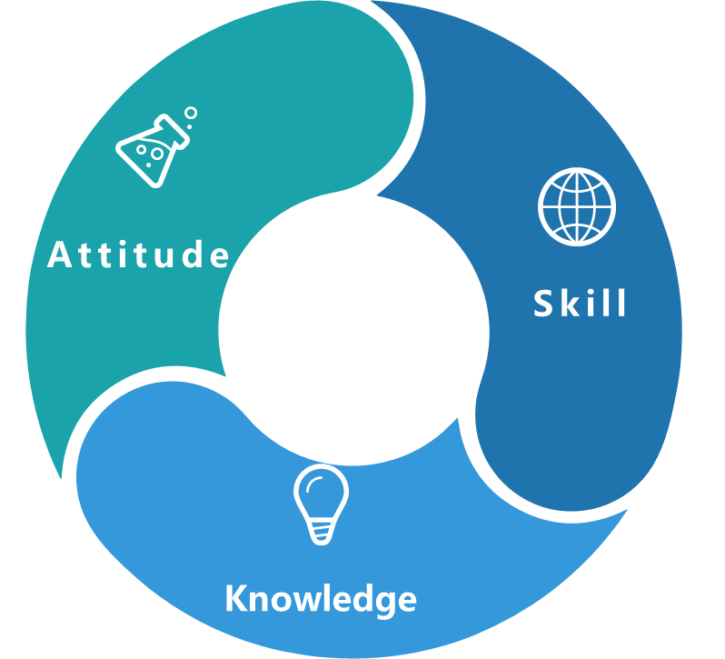
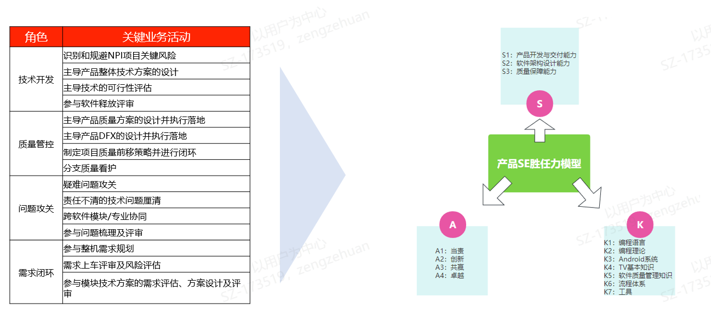
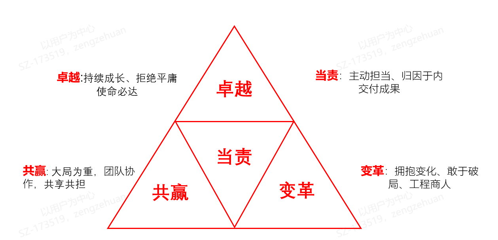

# 02 产品SE能力模型

> pageId: 243450122 | 导出时间: 2026-07-07T14:49:38.220447

## 能力模型

**态度（****A）**:   也称为信念，是指员工的面对工作时应该具备的态度和信念

**技能（****S）**：是指运用知识和经验并通过练习形成的可以完成某件事情的能力

**知识（****K）**:  是指员工面对工作时应该具备的基础知识、原理等

## **Attitude**

### **Attitude 内涵：**

| **价值观** | **正向行为** | **负向行为** |
| --- | --- | --- |
| **当责**  主动担当  归因于内  交付成果 | 1.工作不推诿，主动承担，问题发生后积极补位，解决问题优先  2.勇于承担自己的错误和失误，从自身出发，积极寻找根因和解决措施  3.具备交付意识，使命必达，按时按质完成交付任务 | 1.工作推诿，不愿承担责任，问题发生后先撇清责任  2.不愿承担自己的错误和失误，不做改善，同样的问题反复犯错  3.缺乏交付意识，无法按时按质完成交付任务 |
| **变革**  拥抱变化  敢于破局  工程商人 | 1.不断学习新技术和新方法，结合实际引入先进的开发工具和平台  2.了解行业新技术和趋势，勇于尝试新方法，打破传统思维模式  3.以用户需求为导向，以满足用户需求为目标，让技术服务于用户 | 1.因循守旧，抵触新事物，固守旧的技术和方法  2.缺少行业洞察和竞品学习，思维固化  3.盲目追求新技术和潮流，而忽略了产品的实际需求和用户体验 |
| **共赢**  大局为重  团队协作  共享共担 | 1.不计个人得失，以团队利益为重  2.尊重信任团队成员，积极沟通，互补互助  3.鼓励和认可项目成员的贡献，共同承担项目的风险和责任 | 1.只注重个人得失，不考虑团队利益  2.独断专行，不愿意倾听他人意见和想法  3.漠视团体成员的贡献，逃避自身应承担的责任 |
| **卓越**  持续成长  拒绝平庸  使命必达 | 1.持续学习和提高技术能力，关注行业发展趋势  2.高标准要求自己，交付有竞争力的软件技术方案  3.死磕到底，主动进行疑难攻关，采取一切手段完成交付任务 | 1.技术停滞不前，缺少进取心，对新技术和行业趋势缺乏关注和更新  2.甘于平庸，对软件方案质量把关不严，得过且过  3.项目遇到困难时不作为，消极等待 |

### **正负向行为：**

| **价值观** | **TASK** | **Attitude（正向****）** | **Attitude（负向****）** |
| --- | --- | --- | --- |
| **当责** | 技术开发 | 统筹整体项目的技术可行性评估，深入模块进行风险识别 | 不了解整体技术方案，缺少对项目风险和可行性的技术性思考 |
| 主导项目整体设计方案设计，对方案质量和DFX设计负责 | 技术方案只做信息收集，缺少指导性作用 |  |  |
| 及时梳理项目问题，提前识别关键风险，制定规避措施 | 不了解项目情况，缺少质量管控意识，项目过点时手忙脚乱 |  |  |
| 严格进行软件释放评审，在充分了解问题的前提下，基于专业技术和经验，做出专业评估 | 评审时不了解问题情况，不敢给出评估意见 |  |  |
| 质量管控 | 主导产品质量方案设计，明确质量目标，制定有效的质量策略和行动计划 | 质量方案设计是质量SE和SQA的事情，不关我的事情 |  |
| 主导产品DFX的设计，对整机软件最终交付的质量和DFX承担责任 | 缺少DFX设计思想，只停留在功能交付，不关心产品质量 |  |  |
| 制定分支策略，看护分支质量 | 不遵守分支管理规范，代码review和merge随意 |  |  |
| 问题攻关 | 主动组织项目中的疑难点攻关，并推动解决闭环 | 仅做问题跟进，疑难攻关意愿不强 |  |
| 以项目交付为目标，责任不清问题主导厘清与推动 | 对项目中出现的职责不清问题视而不见，问题长时间无进展 |  |  |
| 需求闭环 | 负责整机软件需求的闭环管理，对特性命中率和实现率承担责任 | 需求是模块开发owner的事情，对需求缺少闭环管理 |  |
| 参与模块技术方案的需求评估、方案设计、方案评审、上车评审，严格把关，从整体方案提供有效意见 | 不了解项目需求，评审形式主义 |  |  |
| **变革** | 技术开发 | 坚持用户洞察和竞品洞察，不断进行开发模式和技术创新，结合实际引入先进的技术方案 | 不了解新技术新方法，固守原有模式和流程 |
| 质量管控 | 借鉴行业质量标准，引入新的工具、方法 | 不做用户和竞争对手洞察，闭门造车 |  |
| 问题攻关 | 挑战传统的工作方法和思维方式，引入其他领域的观念和方法来指导、提升工作效率 | 固步自封，不学习新技术和新方法 |  |
| 需求闭环 | 提升用户意识，从用户出发，保持产品的竞争力 | 缺乏对市场和竞争对手的了解，闭门造车 |  |

| **价值观** | **TASK** | **Attitude（正向****）** | **Attitude（负向****）** |
| --- | --- | --- | --- |
| **共赢** | 技术开发 | 主动推动跨部门、跨团队的协作，能准确识别对方的需求 | 缺乏推动跨部门、跨团队的协作意愿和能力 |
| 质量管控 | 鼓励和认可项目成员的贡献，共同承担项目的风险和责任 | 漠视团体成员的贡献，逃避自身应承担的责任 |  |
| 问题攻关 | 遇到需要协作时主动寻求其他部门团队的支持，尊重并认可他人的协助，倾听他人需求，在被需要时能给予积极响应和提供专业支持； | 缺少团队合作意识，单独独斗，无法整合形成团队战斗力 |  |
| 需求闭环 | 积极参与产品需求规划，主动理解并重视相关方的意见与反馈，共同推进协作； | 不参与产品规划，不做技术可行性评估，被动接收产品需求 |  |
| **卓越** | 技术开发 | 拒绝平庸，关注行业内新技术的发展，并尝试在工作中运用 | 不做用户和竞争对手洞察，闭门造车 |
| 质量管控 | 主动发现软件质量问题并寻求解决方案成功规避风险 | 仅做问题跟进，没有发挥技术优势，深入思考质量问题和解决方案 |  |
| 问题攻关 | 制定高效的问题收敛策略及行动方案，做到有效跟进闭环 | 没有深入了解项目和问题，无法制定有效方法的解决方案 |  |
| 需求闭环 | 以质量第一为原则，完成需求上车闭环 | 缺少对需求用户态的质量监测 |  |

## **Skill**

| **专业能力** | **分类** | **序号** | **Skill** | **Knowledge ID** | **级别** |
| --- | --- | --- | --- | --- | --- |
| **S1:****产品开发与交付能力** | S1.1：编码能力 | S1.1.1 | 掌握至少一种编程语言，了解基本的数据结构和算法 | K1.1、K1.2 | T3 |
| S1.1.2 | 熟练使用开发工具和集成开发环境（IDE），并理解常用的软件设计模式 | K2.3、K7.2 | T4 |  |  |
| S1.1.3 | 掌握常见的软件设计原则，能够根据业务需要进行代码优化 | K2.4 | T5 |  |  |
| S1.2：需求管理能力 | S1.2.1 | 能够理解产品的需求，确保对需求的理解准确且充分 | K4.1 | T3 |  |
| S1.2.2 | 具备评估本领域需求是否合理的能力，能够从产品角度进行综合评估，包括技术可行性、安全性和稳定性等方面 | K4.1、K3.1 | T4 |  |  |
| S1.2.3 | 具备评估跨领域或模块需求是否合理的能力，能够从产品角度进行综合评估，包括技术可行性、安全性和稳定性等方面 | K4.2、K4.3 | T5 |  |  |
| S1.2.2 | 能够评估新需求开发工作量，制定合理的上车时间 | K2.1 | T4 |  |  |
| S1.2.3 | 根据需求的方案设计，能够对从产品的角度进行技术风险的识别，然后进行风险分析和评估，制定风险处理策略 | K5.5、K7.5 | T5 |  |  |
| S1.3：问题攻关能力 | S1.3.1 | 了解其他专业领域（如硬件、电声、PQ等）或模块（应用、中间件）的基本知识和术语 | K4.1、K4.2 | T3 |  |
| S1.3.2 | 具备独立定位和解决系统问题的能力 | K3.1、K3.2、K3.3 | T4 |  |  |
| S1.3.3 | 对于遇到的问题能进行深入思考，从根本上找出问题所在，并探索可能的解决方案 | K2.5 | T4 |  |  |
| S1.3.4 | 通过项目实操和实践经验，具备不断积累解决问题的技能和方法 | K7.3 | T4 |  |  |
| S1.3.5 | 熟悉整个TV软件系统，能定位跨系统、跨产品的疑难问题，能提出多种解决方案，选择最优的解决方案 | K4.3 | T5 |  |  |
| S1.3.6 | 能灵活适应变化并处理不同领域或模块之间的冲突，通过运用合适的沟通技巧和展示有力的论据，谋得共识并正面影响并说服他人。 |  | T5 |  |  |

| **专业能力** | **分类** | **序号** | **Skill** | **Knowledge ID** | **级别** |
| --- | --- | --- | --- | --- | --- |
| **S1:****产品开发与交付能力** | S1.4：分支看护能力 | S1.4.1 | 掌握版本控制工具：如Git、SVN等，了解其基本使用方法和常用命令 | K7.4 | T3 |
| S1.4.2 | 理解三分支管理的概念，熟悉分支合并技巧和方法，能够快速定位和解决分支代码中出现的问题 | K6.1 | T4 |  |  |
| S1.4.4 | 分支生命周期管理，能够处理分支的创建、维护和合并，以确保分支代码的可靠性、稳定性和一致性 |  | T4 |  |  |
| S1.5：跨专业/模块协同能力 | S1.5.1 | 了解其他领域或模块的基本知识，能熟练掌握整机软件及相关基础模块的软件设计 | K4.1、K4.2、K4.3 | T4 |  |
| S1.5.2 | 遵循有效的沟通和协调策略，能准确识别对方的需求，与跨领域团队成员建立良好的关系，并确保清晰的沟通。 |  | T5 |  |  |
| **S2:****软件架构设计能力** | S2.1：方案设计能力 | S2.1.1 | 掌握常见的软件设计原则，以及面向对象编程思想，了解android系统的框架设计 | K2.4、K3.1 | T4 |
| S2.1.2 | 能熟练掌握TV整机软件及相关基础模块的软件架构 | K4.3 | T4 |  |  |
| S2.1.3 | 能够根据业务需要软件架构重构或模块重构 | K2.6 | T5 |  |  |
| S2.2：系统调优能力 | S2.2.1 | 掌握Android常用性能分析工具和性能监测工具 | K7.6 | T4 |  |
| S2.2.2 | 熟悉Android系统的实现细节和内部机制，掌握系统级别的调试和优化技巧 | K3.2 | T5 |  |  |
| S2.3：技术决策能力 | S2.4.1 | 了解软件项目开发流程和相关技术，对软件质量、性能、稳定性、安全性等方面进行评估 | K6.2 | T4 |  |
| S2.4.2 | 具备软件成熟度的评估能力，代码评审能力，及用户态质量数据分析能力 | K2.7、K1.1、K5.6 | T5 |  |  |
| **S3:****质量保障能力** | S3.1：质量方案设计能力 | S3.1.1 | 掌握相关的产品质量管理标准、质量控制流程和规范等 | K6.7 | T3 |
| S3.1.2 | 能够根据实际情况选择合适的标准，并将其应用到具体项目中 | K6.7 | T4 |  |  |
| S3.1.3 | 能够对项目和产品开发过程中各个阶段的进行全面的质量保证和测试计划 | K5.2、K5.3 | T5 |  |  |

| **专业能力** | **分类** | **序号** | **Skill** | **Knowledge ID** | **级别** |
| --- | --- | --- | --- | --- | --- |
| **S3:****质量保障能力** | S3.2：DFX设计能力 | S3.2.1 | 了解DFX的概念、原则和方法 | K5.1 | T3 |
| S3.2.2 | 掌握DFX相关的工具和技术 | K7.9 | T4 |  |  |
| S3.2.3 | 在项目中应用DFX方法，不断改进设计方案，提高设计质量。 | K2.8 | T5 |  |  |
| S3.3：风险识别及闭环能力 | S3.3.1 | 具备较强的质量意识，主动发现软件质量问题并寻求解决方案成功规避风险 | K1.1、K4.1 | T3 |  |
| S3.3.2 | 具备建立一个系统化的风险管理框架能力，包括收集、分析和评估风险的方法和工具，确定风险的级别和优先级，并制定相应的管理计划。 | K5.4、K7.11 | T4 |  |  |
| S3.3.3 | 能够对项目和产品进行全面的建立有效的风险识别、风险监控和反馈机制，然后进行风险分析和评估，制定风险处理策略，对已实施的风险管理策略进行跟踪和监测  及时获取和反馈风险信息，进行跟踪和分析，及时调整和完善风险管理计划和措施 | K5.5、K5.7 | T5 |  |  |
| S3.4：质量前移策略制定及执行能力 | S3.4.1 | 了解TV软件常见的风险类型和可能带来的影响 | K5.8 | T3 |  |
| S3.4.2 | 能够评审测试用例/测试策略对产品系统性的测试和评估，及时发现和修复缺陷 | K5.2 | T4 |  |  |
| S3.4.3 | 引入自动化测试和CICD可持续集成工具，实现软件开发全流程的自动化测试和集成 | K5.3 | T5 |  |  |

## **Knowledge**

| **分类** | **序号** | **Knowledge** | **备注** |
| --- | --- | --- | --- |
| **K1:****编程语言** | K1.1 | Java/C/C++或其他编程语言，及C/C++/Java编码规范 |  |
| K1.2 | 基本的数据结构（数组、链表、栈、队列、树、散列表等）和算法 (排序、递归、散列等算法) |  |  |
| **K2:****软件开发理论** | K2.1 | 软件项目管理的基本流程，从需求分析、设计、编码、测试、发布到维护等各个方面 |  |
| K2.2 | 软件开发模式如瀑布、敏捷、迭代模式等，根据不同阶段之间的关系和活动可以指导如何高效地完成各个阶段。 |  |  |
| K2.3 | 常用软件设计模式（工厂模式、单例模式、观察者模式等） |  |  |
| K2.4 | 常见软件设计原则：单一职责原则（SRP）：一个类或模块应该只有一个责任；  开闭原则（OCP）：系统中的模块应该对于扩展开放，对于修改关闭；  里接口隔离原则（ISP）：客户端不应该强制依赖于它们不需要使用的接口；  依赖反转原则（DIP）：高层模块不应该依赖底层模块，它们应该依赖于抽象；  最少知识原则（LKP）：一个对象应该尽可能少地了解其他对象的信息；  组合/聚合复用原则（CARP）：在系统中使用组合和聚合来达到代码复用的目的； |  |  |
| K2.5 | 问题日志数据收集与分析的方和技术 |  |  |
| K2.6 | 常用的软件设计架构（分层架构、MVC架构、MVVM架构、微服务架构、AOW架构、TIF架构等） |  |  |
| K2.7 | 软件成熟度模型集成(CMMI)体系 |  |  |
| K2.8 | 各领域DFX体系建设：DFX需求、DFX设计、DFX设计评审、DFX验收、DFX评估及刷新DFX基线等 |  |  |
| **K3****：****Android****系统知识** | K3.1 | Android系统架构：包括Linux内核、硬件抽象层（HAL）、原生API、Java框架层、应用层，需要了解其整体结构和各个层次的功能 |  |
| K3.2 | Android系统工作原理，如Android跨进程间通信方式与原理，Android虚拟机的工作原理，Android四大组件的工作原理等 |  |  |
| K3.3 | 了解Linux虚拟文件系统与设备文件系统、Linux 中断、Linux内核中的并发控制、Linux时钟、字符设备驱动、Linux设备树等 |  |  |

| **TASK** | **序号** | **Knowledge** | **备注** |
| --- | --- | --- | --- |
| **K4****：****TV****基础知识** | K4.1 | 掌握电视软件基本功能并可熟练操作，包括不仅限于：Source(DTV/ATV/HDMI/AV/Storage)、Launcher、Setting、VOD、LiveTV、本地播放、工厂菜单、远/近场语音、智能音箱/TV模式、LocalDimming等 |  |
| K4.2 | 掌握整机方案涉及到软件相关功能，包括不仅限于：主板、Tcon/Tconless、驱动板(MCU)、IR、遥控器方案、远场语音、Wifi、Camera、屏、功放、光感、Tunner、Demod等； |  |  |
| K4.3 | TV整体软件和模块架构及原理，包括应用、中间件、TROM、Factoryos、tclconfig、Kernel、Boot等 |  |  |
| K4.4 | 了解TV基本功能的设计规范，如：HDMI CEC-ARC设计规范、EDID设计规范、TV区域设计差异化 |  |  |
| **K5****：软件质量知识** | K5.1 | 了解DFX的概念、原则和方法，如DFM/DFP/DFR/DFS/DFI等 |  |
| K5.2 | 了解软件测试基本理论和方法，测试理论如黑盒测试、白盒测试、灰盒测试等，测试方法如有手动测试、自动化测试、性能测试、稳定性测试、生产适应性测试、安全测试等。 |  |  |
| K5.3 | 质量保证理论和方法：质量保证理论如持续集成、持续交付、敏捷开发等，质量保证方法如代码审查、单元测试、集成测试等 |  |  |
| K5.4 | 监控项目质量的指标和度量方法，如代码覆盖率、缺陷密度等。 |  |  |
| K5.5 | 风险管理框架评估方法 |  |  |
| K5.6 | 用户数据收集与分析的方法、技术 |  |  |
| K5.7 | 常用的质量管理方法和工具，如Six Sigma、PDCA、FMEA、SPC等 |  |  |
| K5.8 | TV软件常见的风险类型：安全风险、稳定性风险、兼容性风险、功能性风险、法律风险 |  |  |
| **K6****：****流程规范** | K6.1 | 《深圳TCL新技术有限公司代码管理规范》 |  |
| K6.2 | 产品开发流程：《软工中心NPI产品开发流程》、《软件需求管理流程》、《认证开发及测试流程》 |  |  |

| **TASK** | **序号** | **Knowledge** | **备注** |
| --- | --- | --- | --- |
| **K6****：****流程规范** | K6.3 | 《1+3+1版本过点评审管理流程》、《软件工程中心版本火车管理奖惩规则V1.2》、《NPI软件释放管理流程 V1.3》 |  |
| K6.4 | 《软硬件分离任务协同流程》、《预抄写软件制作规范与流程》、《TV产品系统软件网络升级管理流程》 |  |  |
| K6.5 | 《安全问题整改流程》、《SEC-NPI软件举旗流程》、《BUG缺陷等级与处理流程 V6.4》、《0901质量-软件售后问题处理流程》 |  |  |
| K6.6 | 《工厂生产流程》，包括工厂适应性、整机贴片装机等 |  |  |
| K6.7 | 质量标准：《SWTC-NPI软件项目各节点准入评审标准》、《TCL智能电视性能流畅度评测标准（V1.1）》、《TCL智能电视稳定性评测标准 V1.0》、《软件技术中心应用性能标准》、《NPI应用集成成熟度评审标准》、《SWTC-NPI各子系统准入评审标准》等 |  |  |
| **K7****：工具** | K7.1 | 项目开发过程中常用工具(Jira、Confluence、Jenkins等) |  |
| K7.2 | 常用的软件开发工具（gerrit、patch_delivery工具、opengrok、MobaXterm、BeyondCompare等）和集成开发环境（IDE）（SourceInsight、Visual Studio、IntelliJ IDEA、Android Studio等） |  |  |
| K7.3 | 知识总结平台（网站论坛、 案例库、知识库等）记录知识总结（工作技巧、方法、心得体会和失败的教训） |  |  |
| K7.4 | Git、gitlab、SVN等的基本使用方法和常用命令 |  |  |
| K7.5 | 风险识别工具，SWOT分析、FMEA分析、事件树分析、风险矩阵、数量化风险分析等 |  |  |
| K7.6 | 性能监测和分析工具（如Systrace、Traceview和Hierarchy Viewer等） |  |  |
| K7.7 | 项目提效工具（预编译系统、PDM 系统 & BOM使用、TCLCONFIG 配置工具、CrossCheck工具等） |  |  |
| K7.8 | Android常用问题定位工具方法，日志分析、trace分析、logkit/红屏断言及调试工具 |  |  |
| K7.9 | DFX常用工具，工厂生产工具、故障树分析（FTA）、失效模式与影响分析（FMEA）、可靠性分析软件、性能跑分工具、CICD流水线等 |  |  |
| K7.10 | 常用的软件测试工具，如静态扫描工具（lint, FindBugs, PMD, CheckStyle）、自动化测试工具（冒烟测试、系统性能测试、稳定性测试等） |  |  |
| K7.11 | 风险管理工具与技术：包括风险登记表、风险矩阵、风险概率图、风险模拟等 |  |  |
