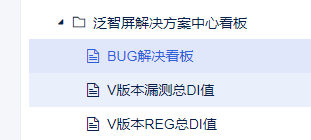
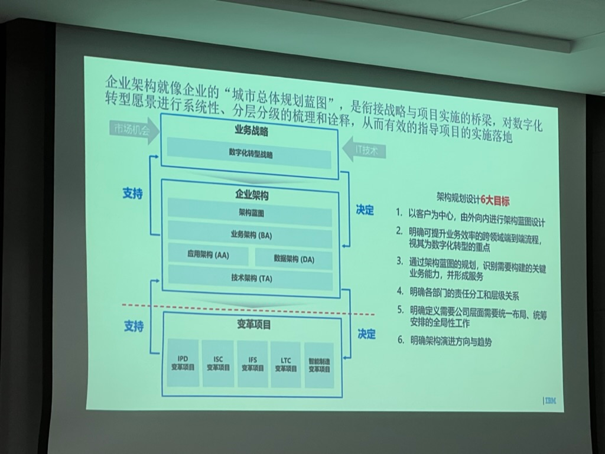
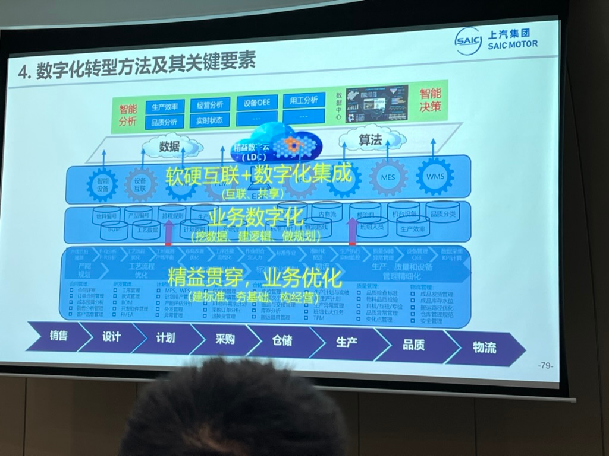
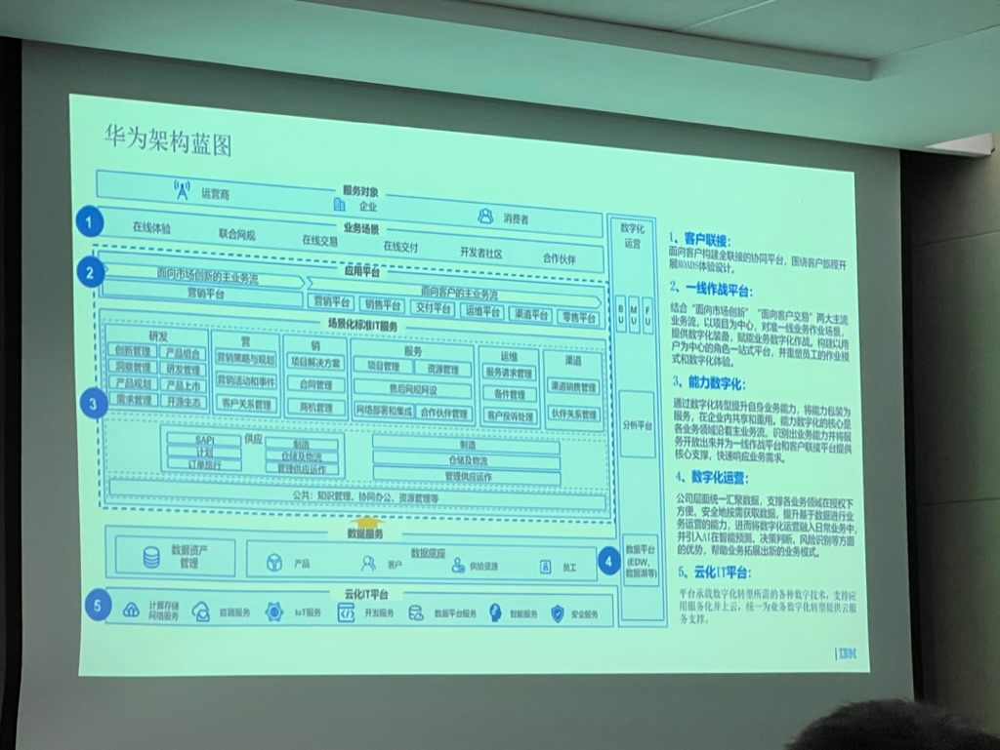
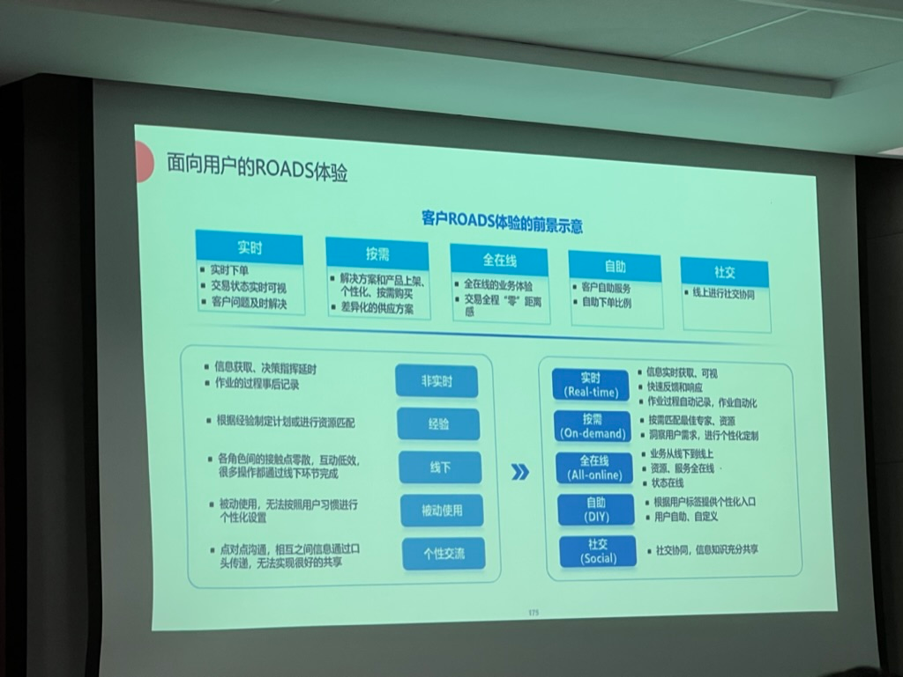
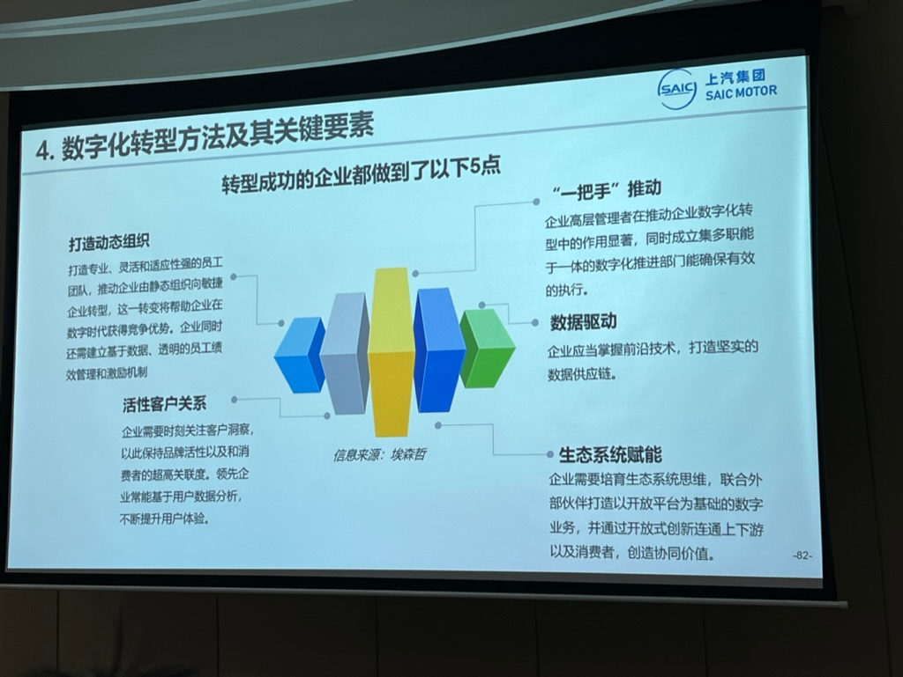
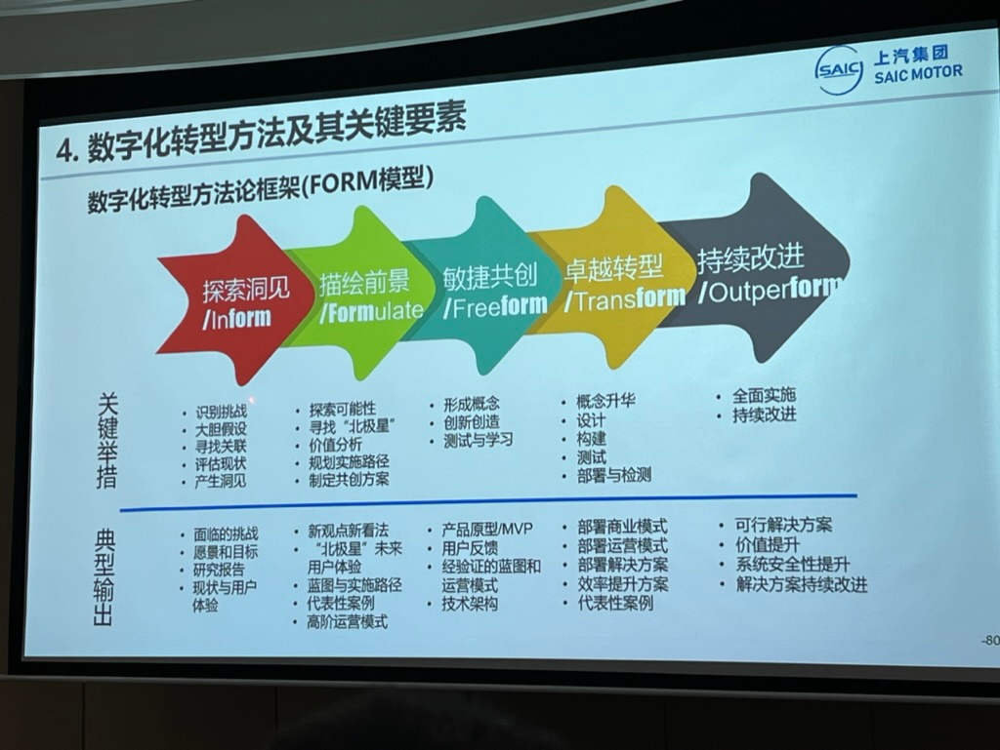
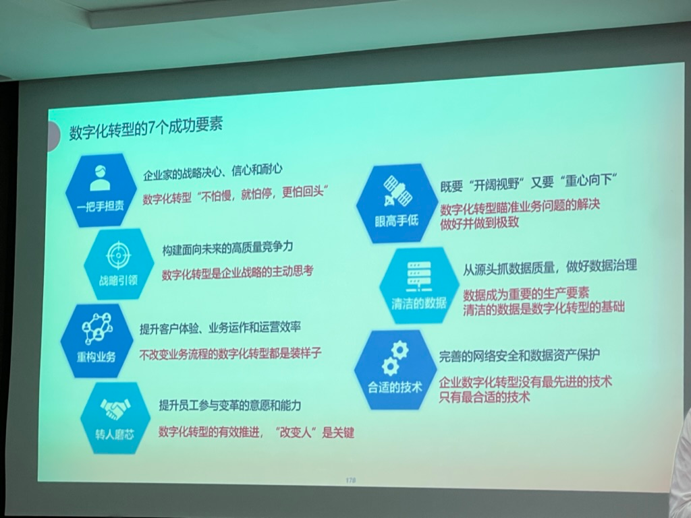

# 09 数据线上化规划方案

> pageId: 248144274 | 导出时间: 2026-07-07T14:50:04.391326

原则：

    1.数据有效性

           数据实时性需要参考数据属性，有些数据是需要实时更新例如jira数据，有些数据是需要通过项目释放或者以季度为单位来更新，需要做好区分。

    2.相关业务需要线上化（将数据产生，采集，存储融入到日常项目的开发过程）

           将业务模块进行分类，一些数据需要通过平台进行录入和管理，需要专业模块owner负责数据导入，发布。目前将数据分为3部分。即：项目能效数据，SOC能效数据，产品SE能效数据。

    3.数据的治理

         3.1：数据产生

         3.2：数据如何采集

         3.3：数据加工

         3.4 ：数据存储

         3.5：如何展示看板

4.每项数据需要有数据owner，需要保证数据口径统一

5.规划数据线上化平台：

**TCL数据中台→泛智屏解决方案中心看板  [https://dmp.tcl.com/webroot/decision#/?activeTab=559bfcf3-eaad-49c8-9904-d05a3c7f302c](https://dmp.tcl.com/webroot/decision#/?activeTab=559bfcf3-eaad-49c8-9904-d05a3c7f302c)

类型

**开发owner：**

礼丰/曾红/肖许

| 数据维度 | 数据维度子项 | 数据更新频率 | 数据来源 | 数据存储 | 数据责任人 | 设计详情 | 优先级 | 开发owner | 完成时间 | 进展： | 备注 |
| --- | --- | --- | --- | --- | --- | --- | --- | --- | --- | --- | --- |
| 项目能效数据线上化 | **UXI总分以及报告链接** | UXI软件提报测试频率为更新频率，若系统有更新可以实时获取 | 当项目进行UXI提测后，体验人员测试完后，将UXI测试报告进行上传Jira OA系统，UXI报告的修改，改动都需要体验人员操作，操作完成后在jira系统上面进行更新。体验作为唯一数据责任人 | jira平台 | 体验 | [https://docs.qq.com/doc/DVndmZGZRUWRhVEd3](https://docs.qq.com/doc/DVndmZGZRUWRhVEd3)   ·· | 高 |  |  | 03/09： UXI设计进行重新设计  02/28：从conf里解析字段，这块问了开发说不行，conf里的信息不规整 | 数据参考：[https://uqk8qj6x1z8.feishu.cn/base/UZkBbP2kSaTww2sP7Pfci1hfnyb?table=tblabQVqct1GdnFW&view=vewLHzjmTy](https://uqk8qj6x1z8.feishu.cn/base/UZkBbP2kSaTww2sP7Pfci1hfnyb?table=tblabQVqct1GdnFW&view=vewLHzjmTy) |
| **软件释放ID值** | 以软件释放节点频率 | 可以直接从OA系统上面获取，当项目释放时SPM会发起上线释放流程，通过获取线上释放单里面”DI值“，数据来源准确可靠。例如：[V8-R51MT08-LF1V049软件版本释放申请单](https://oateh.tcl.com/ekp/km/review/km_review_main/kmReviewMain.do?method=view&fdId=18857650dc60b2501afadb148f7be1b3&fdTaskInstanceId=1885774fab8b301b57675c2451bb03b8&language=zh_CN&j_lang=zh-CN) | OA系统 | SPM | [https://confluence.tclking.com/pages/viewpage.action?pageId=327078589](https://confluence.tclking.com/pages/viewpage.action?pageId=327078589) | 高 |  |  |  |  |  |
| **稳定性得分及报告链接** | 不固定频率，每次查看都是获取新数据，SQA测试完成后既可以获取 | 项目提测稳定性测试专项，稳定性SQA测试完成后，会整理稳定性报告，并将报告通过jira系统上传。更新频率以项目提测稳定性专项测试频率一致，每次稳定性测试后报告提交 | jira平台 | 稳定性SQA |  | 高 |  |  | 03/16：提供单号：   03/09： UXI设计进行重新设计 |  |  |
| **性能得分及报告链接** | 不固定频率，每次查看都是获取新数据（关注过程） | 项目提测稳定性测试专项，性能SQA测试完成后，会整理稳定性报告，并将报告通过jira系统上传。更新频率以项目提测性能专项测试频率一致，每次性能测试后报告提交 | jira平台 | 性能SQA |  | 高 |  |  | 03/16：提供单号： |  |  |
| 在线质量崩溃率 | 实时更新（关注过程） | 直接从线上平台捞取数据 | 在线质量平台 | DFS组 | 可以通过fp去过滤信息，展现形式跟在线质量保持一致 | 高 |  |  |  |  |  |
| 售后问题闭环率 | 实时更新（关注过程） | 从jira上面获取。对与重点售后问题需要及时提单跟进。[https://dmp.tcl.com/webroot/decision#/?activeTab=559bfcf3-eaad-49c8-9904-d05a3c7f302c](https://dmp.tcl.com/webroot/decision#/?activeTab=559bfcf3-eaad-49c8-9904-d05a3c7f302c) 里面有相关功能，只需要进行改造既可以实现 | jira系统 | 售后 | 能够过滤出问题版本，模块，责任人 | 高 |  |  |  |  |  |
| SOC能效数据线上化 | BUG Fail率 | 实时更新（关注过程） | 从jira上面获取。直接获取SQA提单问题[https://dmp.tcl.com/webroot/decision#/?activeTab=559bfcf3-eaad-49c8-9904-d05a3c7f302c](https://dmp.tcl.com/webroot/decision#/?activeTab=559bfcf3-eaad-49c8-9904-d05a3c7f302c) 里面有相关功能，只需要进行改造既可以实现 | jira系统 | VPM | 能够过滤出问题版本，模块，责任人 | 高 |  |  |  | 数据参考：[https://docs.qq.com/slide/DWWtXSXBia1h5REdO?newPad=1&newPadType=clone](https://docs.qq.com/slide/DWWtXSXBia1h5REdO?newPad=1&newPadType=clone) |
| V版本未通过数 | 实时更新（关注过程） | 需要产品SE确认V版本未通过的最终责任方，才可以统计出SOC方V版本未通过数。目前V版本发布都是在jira平台里面，SQA确认版本fail后，需要流转给产品SE，对版本最终责任人进行定责。 | jira系统 | 产品SE | V版本fail个数并且给出对应的版本号，机型模块。 | 高 |  |  |  |  |  |
| 关键问题按时解决率 | 实时更新（关注过程） | jira平台，直接获取SQA提单问题。[https://dmp.tcl.com/webroot/decision#/?activeTab=559bfcf3-eaad-49c8-9904-d05a3c7f302c](https://dmp.tcl.com/webroot/decision#/?activeTab=559bfcf3-eaad-49c8-9904-d05a3c7f302c) 里面有相关功能，只需要进行改造既可以实现 | jira系统 | 产品SE | p0以及标注 block问题列表，最近更新时间以及每天总数。 | 高 |  |  |  | 产品SE需要标准SOC block问题 |  |
| SR5过点DI值达成率 | NA | 需要SPM进行整理，目前没有特定平台可以直接获取到数据 |  |  |  | 低 |  |  |  |  |  |
| BUG解决周期(P0+P1) | 实时更新（关注过程） | jira平台，直接获取SQA提单问题。[https://dmp.tcl.com/webroot/decision#/?activeTab=559bfcf3-eaad-49c8-9904-d05a3c7f302c](https://dmp.tcl.com/webroot/decision#/?activeTab=559bfcf3-eaad-49c8-9904-d05a3c7f302c) 里面有相关功能，只需要进行改造既可以实现 | jira系统 | VPM | P0+p1问题解决周期，可以通过epic，项目来过滤 | 高 |  |  |  |  |  |
| BUG流转周期 | 实时更新（关注过程） | jira平台，直接获取SQA提单问题。[https://dmp.tcl.com/webroot/decision#/?activeTab=559bfcf3-eaad-49c8-9904-d05a3c7f302c](https://dmp.tcl.com/webroot/decision#/?activeTab=559bfcf3-eaad-49c8-9904-d05a3c7f302c) 里面有相关功能，只需要进行改造既可以实现 | jira系统 | VPM | P0+p1问题解决周期，可以通过epic，项目来过滤 | 高 |  |  |  |  |  |
| **SOC DI值** | 实时更新（关注过程） | ira平台，直接获取SQA提单问题。[https://dmp.tcl.com/webroot/decision#/?activeTab=559bfcf3-eaad-49c8-9904-d05a3c7f302c](https://dmp.tcl.com/webroot/decision#/?activeTab=559bfcf3-eaad-49c8-9904-d05a3c7f302c) 里面有相关功能，只需要进行改造既可以实现 | jira系统 | VPM | SOC DI值 | 高 |  |  |  |  |  |
| 产品SE能效数据线上化 | 技术设计方案 | 实时更新（关注过程） | 需要建立知识库，产品SE分享都统一到知识库里面，然后解析知识库路径。 | conference | 产品SE | 需要展现：设计方案名称，作者，创作月份。可以通过owner 名字进行过滤 | 中 |  |  |  | 数据参考：[https://docs.qq.com/sheet/DV21tSWVUclROVER3?newPad=1&newPadType=clone&tab=BB08J5](https://docs.qq.com/sheet/DV21tSWVUclROVER3?newPad=1&newPadType=clone&tab=BB08J5) |
| 知识分享 | 实时更新（关注过程） | 通过我们签到平台获取每次分享签到数据 | 签到平台 | 培训组织者 | 培训主题，讲师，参入学习的人数 | 中 |  |  |  |  |  |
| 质量策略 | 实时更新（结果） | 可以直接从项目管理平台获取。项目管理平台里面SR4-1有一项"开发策略评审通过" | 项目管理平台 | 产品SE |  | 低 |  |  |  |  |  |
| 流程规范 | 实时更新（关注过程） | 从jira平台上面获取，过滤问题类型”流程优化“ | jira系统 | 产品SE | 获取到规范名称，创建时间，状态 | 中 |  |  |  |  |  |
| 方案评审 | 实时更新（关注过程） | 从jira平台上面获取，过滤问题类型”通用评审“+ owner，可以确认出数据 | jira系统 | 产品SE | 获取到规范名称，创建时间，状态 | 高 |  |  |  |  |  |
| 技术沉淀 | 实时更新（关注过程） | 需要建立知识库，产品SE分享都统一到知识库里面，然后解析知识库路径。 | conference | 产品SE | 需要展现：知识分享名称，作者，创作月份。可以通过owner 名字进行过滤 | 高 |  |  |  |  |  |
| 技术攻关 | 实时更新（关注过程） | 从jira平台上面获取，过滤问题类型”SEG攻关流程“+ owner，可以确认出数据 | jira系统 | 产品SE | 攻关主题，时间，问题状态，owner  可以通过名称进行过滤，统计 | 高 |  |  |  |  |  |
| 释放版本DI值达标率 | 以软件释放节点频率（关注结果） | 可以直接从OA系统上面获取，当项目释放时SPM会发起上线释放流程，通过获取线上释放单里面”DI值“，数据来源准确可靠。例如：[V8-R51MT08-LF1V049软件版本释放申请单](https://oateh.tcl.com/ekp/km/review/km_review_main/kmReviewMain.do?method=view&fdId=18857650dc60b2501afadb148f7be1b3&fdTaskInstanceId=1885774fab8b301b57675c2451bb03b8&language=zh_CN&j_lang=zh-CN) | OA | 产品SE | 可以获取DI值，以及产品SE姓名，版本号，机型 |  |  |  |  | 与”软件释放ID值“重复 |  |
| 行业洞察 | 实时更新（关注过程） | 需要建立知识库，产品SE分享都统一到知识库里面，然后解析知识库路径。 | conference | 产品SE | 需要展现：洞察名称，作者，创作月份。可以通过owner 名字进行过滤 | 高 |  |  |  |  |  |

指南：

