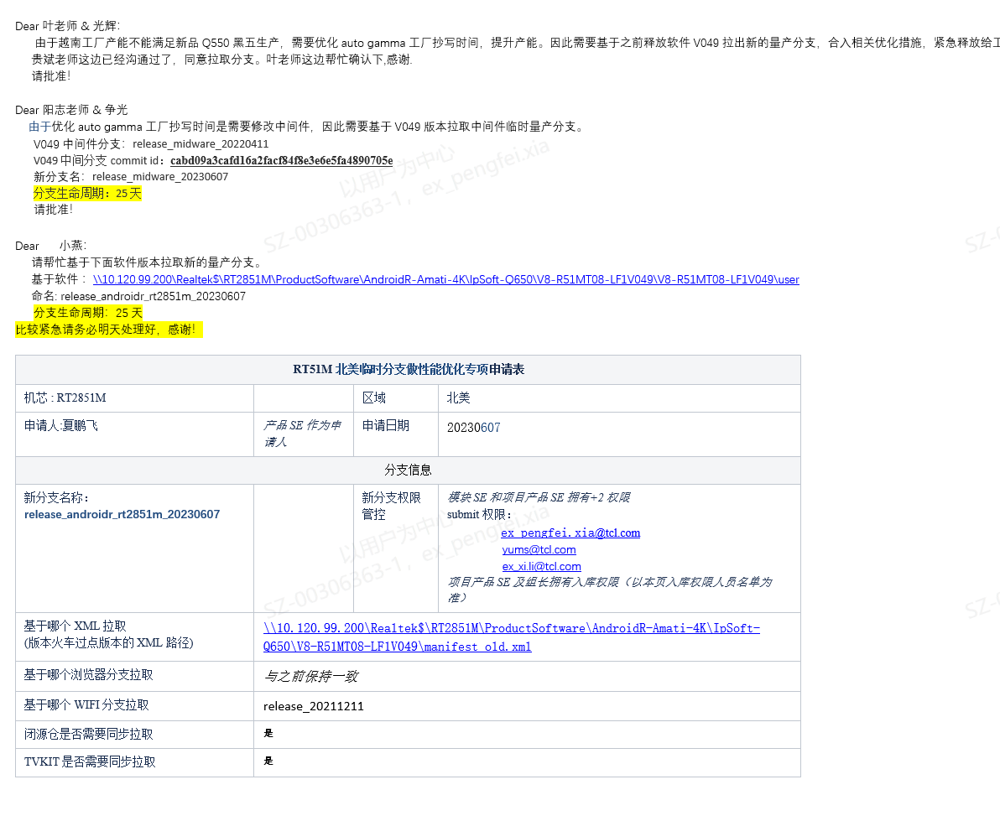

# 11.分支管控风险

> pageId: 246760831 | 导出时间: 2026-07-07T14:53:00.611138

| 标题 | # [分支管控风险](https://confluence.tclking.com/pages/viewpage.action?pageId=246760831) |
| --- | --- |
| 状态 | 待评审 |
| 角色 | A |
| 更新时间 |   |
| 沟通对象 | #### 部门长，SPM，产品SE，CIE |
| 具体内容 | ### 在我们软件开发过程中量产分支一定是唯一，但是如果特殊情况例如紧急派生，处理售后问题，需要拉临时分支。一定要注意相关流程，做好分支管控。 |
| 操作方法 | 1.需要发邮件发申请，说明背景，临时分支用途，生命周期，分支名等信息。  2.分支申请完后一定要把控分支修改合入，保持最小化修改原则。产品SE一定要做好风险看护。  3.临时分支版本释放后一定要发起关闭流程，也是通过邮件申请。 |
| 标准与原则 | 按软件中心项目管理模板输出 |
| 适用项目阶段 | SR5 |
| 适用项目范围 | S、A、B、C |
|  |  |
| 备注 |  |
| [返回目录](https://confluence.tclking.com/pages/viewpage.action?pageId=9052451) |  |
