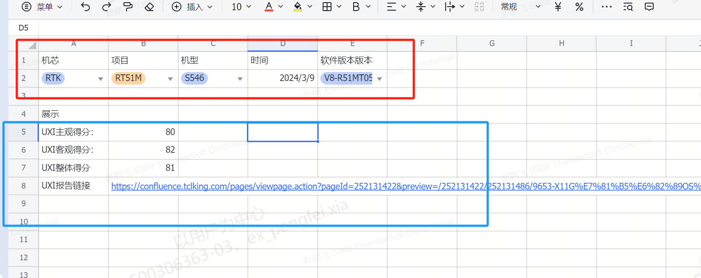

# 9.1 UXI数据线上化方案设计

> pageId: 327073204 | 导出时间: 2026-07-07T14:50:17.969961

# 背景：

           为了响应集团数字化转型要求，我们梳理出泛智屏解决中心重要项目质量指标实现数据线上化。

# 要求：

          泛智屏解决方案中心看板  [https://dmp.tcl.com/webroot/decision#/?activeTab=559bfcf3-eaad-49c8-9904-d05a3c7f302c](https://dmp.tcl.com/webroot/decision#/?activeTab=559bfcf3-eaad-49c8-9904-d05a3c7f302c)，可以进行实时查询。

OA平台查询详细步骤如下：

查询条件可以进行如下配置:

1.选择对应机芯  例如：MTK /RTK/AML

2.基于机芯选择对应项目 例如：MT9653 /RT51M/MT9331/TC8000

3.基于平台和对应项目，选择机型，例如：RT51M 546， RT51M 446

4.可以进行月份选择

5..选择对应软件版本软件版本 例如：V8-R51MT02-LF1V350

6.是否是释放版本：是/否

以上五项可以进行过滤配置：

查询内容展示：

1.UIX客观得分

2. UIX 主观得分

4.UIX整体得分

5.UIX报告链接

示意图如下：

# **UXI数据存储**

**    **   由于UXI报告之前都是通过conference存储，体验测试完成后将报告上传到conference，但是conference字段不固定，而且没有办法从conference里面解析出UXI里面的关键信息。同开发沟通后可以将此信息放入jira里面，通过jira流程来管理。

##  **jira设计如下：**

**项目选项需要新建  "报告上传"**

**问题类型新增 “UXI报告上传”**

**软件下面选项依次是：**

**机芯:**

**项目：**

**机型：**

**时间可以从jira单创建时间为准**

**软件版本号：可以关联带出**

**是否是释放版本：是/否**

**UXI主观得分：**

**UXI客观得分：**

**UXI整体得分：**

**UXI报告链接：**

**描述：对报告内容进行简单描述**
