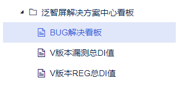
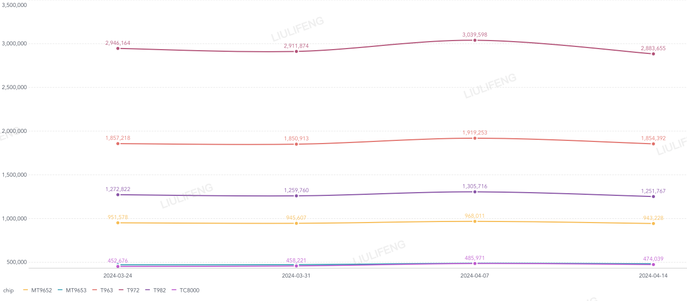
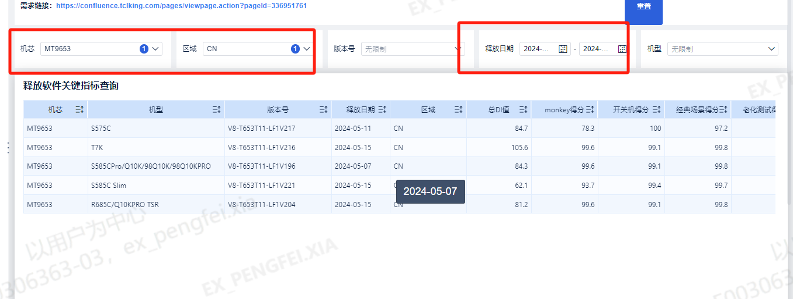

# 9.4数据线上化看板方案设计----释放软件关键指标查询

> pageId: 336951761 | 导出时间: 2026-07-07T14:50:21.453905

# 背景：

           为了响应集团数字化转型要求，我们梳理出泛智屏解决中心重要项目质量指标实现数据线上化。

# 要求：

          泛智屏解决方案中心看板  [https://dmp.tcl.com/webroot/decision#/?activeTab=559bfcf3-eaad-49c8-9904-d05a3c7f302c](https://dmp.tcl.com/webroot/decision#/?activeTab=559bfcf3-eaad-49c8-9904-d05a3c7f302c)，可以进行实时查询。

在泛智屏解决方案中心看板里面添加一项 “释放软件关键指标查询”

# 数据展示方式：

  1.当选择“释放软件关键指标查询”后通过去抓取OA释放单数据，展现出所有释放软件的基本信息，具体包括如下字段：

示例如下：

| 机芯 | 机型 | 版本号 | 释放日期（即OA单的申请日期） | 区域 | 稳定性得分 | 性能得分 | UXI得分 | SOC DI | 释放总ID |  |  |  |
| --- | --- | --- | --- | --- | --- | --- | --- | --- | --- | --- | --- | --- |
| monkey 得分 | 开关机得分 | 经典场景得分 | 老化得分 |  |  |  |  |  |  |  |  |  |
| RT2851M | 550G&S470G&Q650G&S450G | V8-R51MT08-LF1V049 | 2023-08-28 | 美国/加拿大 | 90 | 95 | 80 | 100 | 80 | 80 | 18 | 140 |

2.可以通过以下字段进行查询：

通过机芯查询  展示方式如示例。

通过版本号进行模糊查询  展示方式如示例。

可以通过机型进行模糊查询  展示方式如示例。

可以通过日期查询，即通过设置开始时间，结束时间来进行查询，凡是释放日期满足我们设置的查询时间的都可以进行展示出来。展示方式如示例。

# **图表展示需求：**

**需求：**

**过滤条件1：需要通过过滤释放时间，例如2024/01/01-2024/04/22来展现各个项目关键指标的平均情况，时间维度的统计单元可以是按照月/星期/天，用户可以选择。另外需要展现的内容也可以选择例如：可以勾选monkey得分/开关机得分/经典场景得分/老话得分/性能得分/UXI得分/SOC ID/释放总DI**

**过滤条件2：机型选择可以进行勾选可以呈现出单个机型情况**

**图标展现内容：按照每个月来展现我们勾选的维度平均值。**

**即：**这里展示的各个维度数据是各个机型这一个月/一个星期/当天 的平均值得来的

****

# 不达标版本过滤需求

需求：需要我们在过滤版本的同时筛选出释放指标不达标的版本，例如：

 

在释放软件关键指标趋势下面添加一项“**关键指标不达标版本**”

各个项目过滤指标如下：

备注：若各指标内容为0或者为空则不计入不达标版本内，因为之前释放单没有统计这么多项，内容可能为空，另外UXI部分不是每个版本都进行测试，因此内容可能为0，这些情况需要排除在外。另外凡是满足不达标指标定义的不管是一项不满足还是多项不满足，则将此版本纳入不达标版本内，**需要将不达标那项得分用红色字体标记出来，**方便统计者可以很直观的识别到不达标项。若不在不达标指标定义的机型或区域内的版本就不予统计。（因为区域和版本较多，有些特殊版本指标不一样，不进行统计）

不达标指标定义如下：

| 机型 | 区域 | 总DI目标值 | monkey目标值 | 开关机目标值  | 经典场景目标值 | 老化测试目标值 | 性能目标值  | UXI目标值  | SOCDI目标值 |  |  |
| --- | --- | --- | --- | --- | --- | --- | --- | --- | --- | --- | --- |
| MT9653以及凡是机型包含MT9653字样都按照此标准 | CN | 85 | 90 | 90 | 90 | 90 | 80 | 80 | 18 |  |  |
| 非CN | 130 | 90 | 90 | 90 | 90 | 80 | 80 | 30 |  |  |  |
| MT9221以及凡是机型包含MT9221字样都按照此标准 | CN | 85 | 85 | 85 | 85 | 85 | 72 | 80 | 18 |  |  |
| 非CN | 130 | 85 | 85 | 85 | 85 | 72 | 80 | 30 |  |  |  |
| MT9615以及凡是机型包含MT9615字样都按照此标准 | CN | 85 | 85 | 85 | 85 | 85 | 80 | 80 | 18 |  |  |
| 非CN | 130 | 85 | 85 | 85 | 85 | 80 | 80 | 30 |  |  |  |
| RT2875P以及凡是机型包含RT2875P字样都按照此标准 | CN | 85 | 85 | 85 | 85 | 85 | 75 | 80 | 18 |  |  |
| 非CN | 130 | 85 | 85 | 85 | 85 | 80 | 80 | 30 |  |  |  |
| RT51M以及凡是机型包含RT51M字样都按照此标准 | CN | 85 | 80 | 80 | 80 | 80 | 71 | 71 | 18 |  |  |
| 非CN | 130 | 80 | 80 | 80 | 80 | 71 | 71 | 30 |  |  |  |
| RT51A以及凡是机型包含RT51A字样都按照此标准 | CN | 85 | 85 | 85 | 85 | 85 | 75 | 80 | 18 |  |  |
| 非CN | 130 | 85 | 85 | 85 | 85 | 75 | 80 | 30 |  |  |  |
| TC8000以及凡是机型包含TC8000字样都按照此标准 | CN | 85 | 80 | 80 | 80 | 80 | 68 | 70 | 18 |  |  |
| 非CN | 130 | 80 | 80 | 80 | 80 | 68 | 70 | 30 |  |  |  |

**      **
