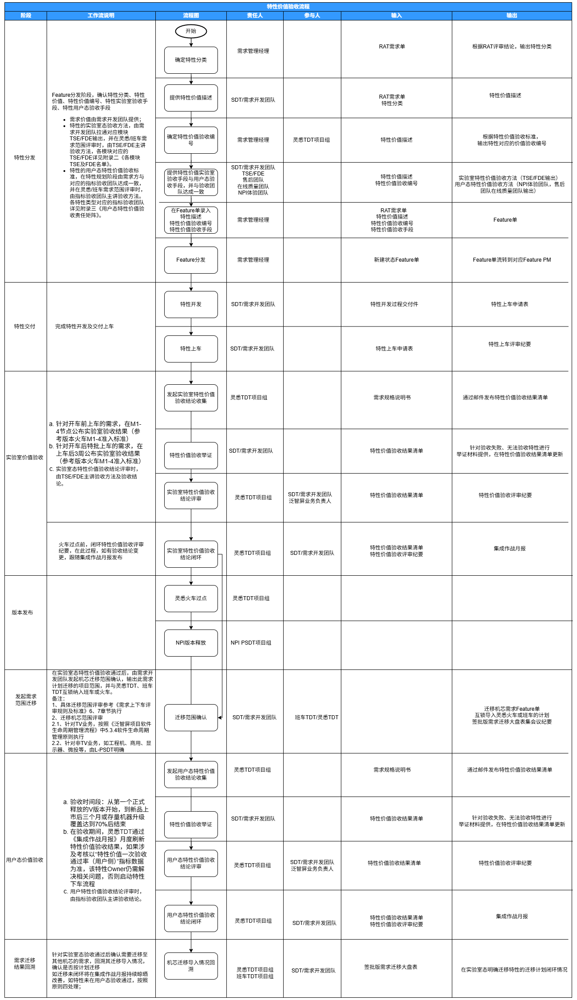

# 1.1.1 参与特性价值验收 SOP

> pageId: 622206527 | 导出时间: 2026-07-07T14:51:05.266446

# **SOP简介：**

**文档主要内容：**软件特性的分类、特性价值验收流程、特性价值验收原则、特性价值验收标准介绍，并指引产品SE如何参与价值验收

**文档适用角色：**产品SE，质量SE，VPM，BA

**适用项目阶段：**需求上车

**环境依赖：**无

**相关链接：**

---

# **参与特性价值验收 SOP**

## 一、产品特性分类

| **特性分类** | **描述** |
| --- | --- |
| 卖点特性 | 通过独特的设计、创新的功能，提供直观易用、高效稳定、内容丰富的产品使用体验， 满足用户个性化需求，使得产品或服务在市场中提供增值，且被纳入《软件卖点清单》 的特性 |
| 体验改善 | 通过修改用户交互方式和交互路径，或美化视觉，加快服务响应时间， 或增加过程动画改 善等待感，使得功能使用更便捷和享受的软件特性，这些特性或直接，或间接支撑 NPS  与 UXI 指标的改善 |
| 质量提升 | 通过重构软件设计或代码实现，从而提升软件系统服务的稳定性，改善在线质量， 降低 售后投诉率 |
| 工程提效 | 改善软件工程效率（需求分析、设计、开发、测试、运维等）的软件特性 |
| 安全合规 | 确保软件和服务在设计、开发、运营过程中遵循相关法律法规、行业标准和安全准则，  以保障用户数据、系统安全和业务合规， 包括不限于通用法规、Google   要求、当地政策性指导意见等的软件特性 |
| 运营服务 | 专指雷鸟和小T相关运营服务类需求，以雷鸟和小T的业务产品经理验收策略为准， 软工不 再评估和验收该特性价值，但是该特性仍需遵循“特性价值验收原则” |
| 基础必备 | 无法划入其他六类但又必须开发的基础特性， 属于产品软件系统必备功能， 如针对区域扩  展、语言扩展类需求，以及因业务产品竞争力改善、二资源降本、产业协同等诉求，产品相关器件迭代更新带来的软件开发需求，包括不限于eMMC、DDR、Speaker、Wi-Fi/BT 模组、 LD 模组、PMIC、ROM基线等 |

## **二、**特性价值验收流程

2.1 特性价值验收流程

# 

参照需求价值验收流程，产品SE主要在三个阶段参与需求价值验收：**特性上车、实验室特性价值验收评审、用户态特性价值验收评审**

# 2.2 产品SE主要工作及指引

| 阶段 | 产品SE工作 | 指引 |
| --- | --- | --- |
| 特性上车 | - 参与需求上车评审，检查特性验收结论 | - 交付件完整性检查：上车要素表中，是否完整填写**需求分类、需求价值描述、实验室需求验收方法、实验室需求价值验收结论** - 需求分类、需求价值描述是否与火车/班车签批档一致 - 按照需求价值描述，评估实验室需求验收方法是否合理 - 参照第四章节《特性价值验收标准》中的实验室验收方法，确认验收结论 |
| 实验室价值验收 | - 参与验收方法评审 - 参与实验室价值验收 | - VPM会提前发起验收方法评审，按照需求价值描述，评估是否合理 - 按照需求价值描述和项目实际运作情况，评估验收结果是否合理 |
| 用户态价值验收 | - 参与用户态价值验收 | - 验收主导团队主讲验收结论，产品SE参照第四章节《特性价值验收标准》中的用户态验收方法，结合项目实际情况，评估验收结论是否合理 |

# 三 特性价值验收原则

## **3.1   原则一**** （工时投入与验收方法规范）**

### **3.1.1 工时投入**

    针对特性开发和测试的工时投入，符合特性投资决策时（RMT决策/Charter决策/软投决策）评估的工作量，保证预算与投入准确。所有特性（包含第4节定义的七类特性），都需明确工时投入，包含开发工时和测试工时，在实验室验收节点进行数据记录与准确性审核，不作为特性价值验收失败的评估依据。工时投入来源参考附录。

### **3.1.2 验收方法规范**

    TSE与FDE需确保实验室态特性价值验收方法具备通用性和可复用性。验收方法应能够沉淀至标准测试用例集（如全功能测试用例集、QT测试用例集等），不得针对单一需求设计临时性或特殊性的验收方式。**凡无法沉淀至标准测试用例集的验收方法，视为无效验收，不予通过**。实验室态特性价值验收的方法设计与结论判定，原则上由TSE承担，特殊情况下TSE可授权FDE承接验收职责，但需在验收评审纪要中明确授权关系，且验收结论的最终责任仍由TSE承担；

## **3.2   原则二 （用户态验收失败判断）**

  所有特性（包含第4节定义的七类特性），在用户态验收时，出现以下任一情形，则直接评定为用户态验收失败：

### **3.2.1焦点售后问题**

- 
在用户态带来被售后团队判定为一级响应的问题或二级响应风险问题的问题，具体参考《软件售后问题运作级别协议(OLA)》；

- 
针对已释放的软件版本，虽还未到达用户态，但因某特性**导致重发版本**，同样评定为验收失败。

### **3.2.2系统性能或资源劣化**

- 
直接或间接导致**在线质量**基线某一项指标劣化 ≥ 5%，在线质量基线指标范围参考《泛智屏用户态软件质量基线》描述；

- 
直接或间接导致**售后质量**基线某一项指标劣化 ≥ 5%，售后质量基线指标范围参考《泛智屏用户态软件质量基线》描述；

- 
针对系统资源管理（包含但不限于内存、CPU、DSP算力等），参考《机芯资源管控规范》评定验收结果。

### **3.2.3价值证明失败**

- 
**无法提供价值证明数据**：因缺乏埋点、数据缺失、指标未定义、观测手段不足等原因，导致无法形成验收结论；

- 
**数据无法归因**：虽有数据，但无法将观测结果明确归因于该特性的作用，与其他特性或外部因素耦合过强，无法独立判断价值贡献；

- 
**价值目标未达成**：有完整数据支撑，但实际达成情况未达到特性规划时设定的价值目标（包含目标未达成或目标未覆盖核心场景）。

- 
**验收时间窗超期：**用户态验收时间窗到期后，不得存在“验收中”状态。届时若仍无法形成明确验收结论（包括数据缺失、归因不清、价值目标未达成等），直接评定为用户态验收失败。

## **3.3   原则三 （让步决策）**

    如果某个特性导致产品质量、用户体验、系统性能或资源劣化但仍需导入产品，需量化劣化数据，并按照NPI释放机制上升评审决策，决策通过后方可导入，导入后如果在用户态实际监控劣化数据超过了决策时量化的劣化数据，则评定用户态验收失败，否则验收通过。

## **3.4   原则四 （验收失败处置）**

针对特性价值验收失败的特性，除了常态化复盘，后续具体应对措施如下：

- 如果该特性所规划的特性价值点达成预期，但因前述原则（导致产品质量、用户体验、系统性能或资源劣化等问题）导致验收失败，**在问题解决的前提下，该特性保留不下车**；
- 如果该特性所规划的特性价值点未达预期，但对于产品质量、体验、竞争力、开发效率等判定具有**显著价值**，则该特性持续保留；
- 如果该特性所规划的特性价值点未达预期，且下车**成本和质量影响较大**，则该特性当前已导入平台保留，后续不再开发和维护；
- 如果该特性所规划的特性价值点未达预期，且评估下车**影响和风险可控**，则该特性走下车流程。

# 四 特性价值验收标准

| **分类** | **编号** | **验收维度** | **实验室验收** | **用户态验收** |
| --- | --- | --- | --- | --- |
| **卖点特性** | **A001** | 1，软件贡献产品卖点，支撑**软件竞争力**  2，规模性指标（包括新增、日活、月活、累计激活等）  3，健康度指标（日月活比**）** | 1，在产品战略与体验管理部同BU产品规划互锁的《软件卖点清单》中体现，【备注：针对迁移导入类特性（即该特性已在其他项目完成用户态价值验收并通过），本次仅做机芯适配迁移的，不强制要求在导入机芯的推广资料中体现卖点】  2，埋点功能，支撑统计业务日活数据， SQA根据埋点设计日活统计测试用例，并根据测试用例验收通过（辅助验收，不强制作为验收考核）  3，SQA质量维度验收通过  4，业务埋点数据有效上报  5，工时投入准确 | 1，在BU整机产品卖点推广资料中体现【备注：针对迁移导入类特性（即该特性已在其他项目完成用户态价值验收并通过），本次仅做机芯适配迁移的，不强制要求在导入机芯的推广资料中体现卖点】  2，（可选项）第一用户认可，如公测用户、大V极客等公开渠道认可，包含但不限于公测报告结论、大V推文等）  3，针对新开发特性，规模性指标持续增长，达到预设目标（新特性必须增加规模性指标埋点）；针对已有特性，健康度指标提升达到预设目标 |
| **体验改善** | **B001** | **直接支撑NPS或者UXI改善**：属于NPS或UXI的八大维度：系统速度、系统稳定性、系统流畅性、画质、界面设计、操作便捷度、音质、语音  备注：后续如扩展典型场景等，则跟随产品体验刷新定义即可 | 1，UXI主观体验通过  2，SQA质量维度验收通过  3，工时投入准确 | 1，用户态的改善效果达到预设的客观改善值，且有客观的验收手段（如任务完成时长缩短、操作步骤减少、错误率下降、功能入口点击率提升等）  2，（可选项）NPS调研，对应改善维度达到预设提升目标值； |
| **B002** | **间接支撑**NPS或UXI改善，该特性不属于八大维度，但是可以做**功能性验收**（如相关UI 视觉或交互改善设计） | 1， UXI主观体验通过  2， SQA质量维度验收通过  3， 工时投入准确 | 1，（可选项） 如需要可协同UXM 设计在线调研问卷  2，（可选项）NPS调研，对应维度无劣化  3，用户态的改善效果达到预设的客观改善值，且有客观的验收手段（如任务完成时长缩短、操作步骤减少、错误率下降、功能入口点击率提升等） |  |
| **B003** | **间接支撑**NPS或UXI改善，该特性不属于八大维度，且**不可以**做功能性验收（如Reducedraw、延迟断线方案） | 1， 量化改善效果，提供实验室验收办法，并设计埋点及其用例，通过在线质量平台统计到数据  2， 工时投入准确 | 1，根据埋点信息，通过在线质量验收通过  2，（可选项） 如需要可协同UXM 设计在线调研问卷  3，举证没有造成此需求涉及模块的劣化（例如售后无劣化、模块在线质量无劣化） |  |
| **质量提升** | **C001** | 直接支撑**售后投诉率**降低，具体指标参考《泛智屏用户态软件质量基线》 | 1， 量化改善目标，提供实验室验收办法，SQA质量维度验收通过  2， 工时投入准确 | 1，升级覆盖率达70%后投诉率指标改善趋势达到预设目标 |
| **C002** | 直接支撑**在线质量指标**改善，具体指标参考《泛智屏用户态软件质量基线》 | 1， 量化改善目标，提供实验室验收办法， SQA质量维度验收通过  2， 工时投入准确 | 1，对应软件版本在线质量指标数据改善趋势达到预设目标 |  |
| **C003** | **间接支撑类**，导入产品的优先级相对较低 | 1， 提供实验室验收办法，SQA 质量维度验收通过  2， 工时投入准确 | / |  |
| **工程提效** | **D001** | 提效岗位和提效效果（软工岗位优先） | 1， SQA质量维度验收通过  2， 提效岗位所属部门长、以及所属业务负责人确认验收通过  3， 工时投入准确 | 1，用户态提效的效果达到预设目标或提效方实际使用的认可 |
| **安全合规** | **E001** | 包含不限于Google强制要求、建议性需求、当地法规要求 | 1， 软件安全合规部门验收通过  2， TQC 验收通过（如需）  3， 工时投入准确 | / |
| **基础必备** | **F001** | 属系统基础必备特性 | 1， SQA质量维度验收通过  2， 如果该特性属于器件适配，应设计器件质量埋点及其用例，通过在线质量平台统计到数据  3， 工时投入准确 | 1， 根据埋点信息，通过在线质平台能够获取到器件的质量趋势  2， 器件导入产品 |

| 备注：      特性埋点设计和开发，需在现有的埋点框架下实现；      特性价值验收主体：灵悉TDT；      SQA质量维度验收包含：功能需求指标、内存检测指标、稳定性验收指标、性能验收指标、IO指标等该特性所涉及的维度；      《泛智屏用户态软件质量基线》月度刷新：[https://confluence.tclking.com/pages/viewpage.action?pageId=403815529；](https://confluence.tclking.com/pages/viewpage.action?pageId=403815529)      《机芯资源管控规范》链接：[https://confluence.tclking.com/pages/viewpage.action?pageId=359044391；](https://confluence.tclking.com/pages/viewpage.action?pageId=359044391)      标准发布即执行。 |
| --- |

## **附录：用户态****特性价值验收责任矩阵**

| **特性分类** | **编号** | **用户态特性价值验收指标验收团队** | **说明** |
| --- | --- | --- | --- |
| 卖点特性 | A001 | PSDT用户体验代表、售后团队、质量SE | 针对用户态特性价值验收标准第一条：在卖点推广资料体现，由PSDT用户体验代表验收； 针对用户态特性价值验收标准第二条：获得第一用户认可，由PSDT用户体验代表、质量SE验收； 针对用户态特性价值验收标准第三条：健康度指标由需求承接方提供举证； |
| 体验改善 | B001 | PSDT用户体验代表、质量SE | 需求评估阶段用户态特性价值验收标准与PSDT用户体验代表达成一致，用户态特性价值验收时，数据和达成情况由PSDT用户体验代表及质量SE输出 |
| B002 | PSDT用户体验代表、质量SE | 需求评估阶段用户态特性价值验收标准与PSDT用户体验代表达成一致，用户态特性价值验收时，数据和达成情况由PSDT用户体验代表及质量SE输出 |  |
| B003 | PSDT用户体验代表、质量SE | 需求评估阶段用户态特性价值验收标准与PSDT用户体验代表达成一致，用户态特性价值验收时，数据和达成情况由PSDT用户体验代表及质量SE输出 |  |
| 质量提升 | C001 | 售后团队、质量SE | 需求评估阶段用户态特性价值验收标准与售后团队达成一致，用户态特性价值验收时，数据和达成情况由售后团队及质量SE输出 |
| C002 | 在线质量团队、质量SE | 需求评估阶段用户态特性价值验收标准与在线质量团队达成一致，用户态特性价值验收时，数据和达成情况由在线质量团队及质量SE输出 |  |
| C003 | 售后团队 、在线质量团队、质量SE | 需求评估阶段用户态特性价值验收标准与售后团队、在线质量团队达成一致，用户态特性价值验收时，数据和达成情况由售后团队、在线质量团队及质量SE输出 |  |
| 工程提效 | D001 | 提效受益方 | 需求评估阶段用户态特性价值验收标准与提效收益方达成一致，用户态特性价值验收时，数据和达成情况由提效收益方输出 |
| 基础必备 | F001 | 在线质量团队、质量SE | 需求评估阶段用户态特性价值验收标准与在线质量团队达成一致，用户态特性价值验收时，数据和达成情况由售后团队及质量SE输出 |

备注：如需求导入机芯涉及多个PSDT，由灵悉/班车体验代表和灵悉/班车质量SE代表主责。
