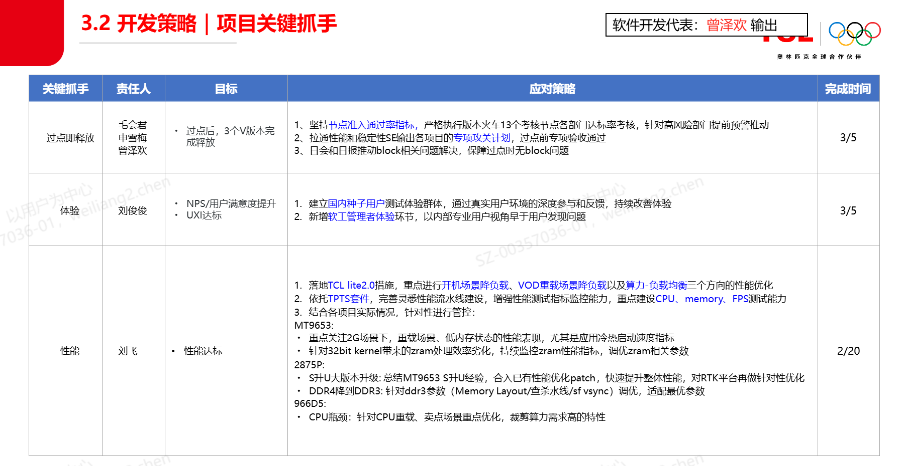
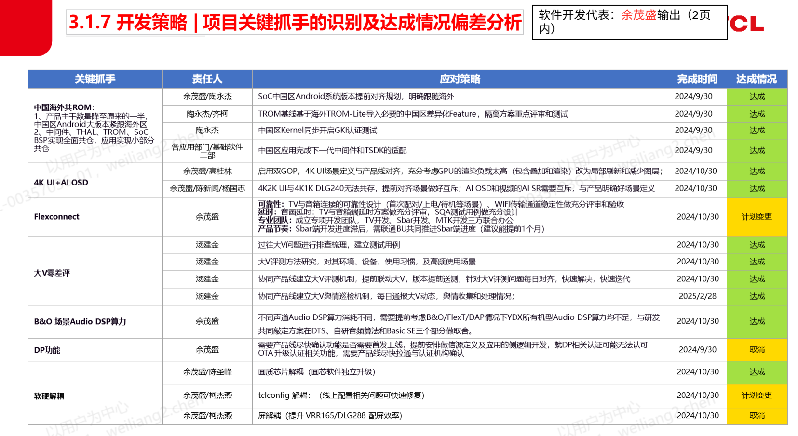

# 1.2.10 关键抓手落地闭环SOP

> pageId: 583202298 | 导出时间: 2026-07-07T14:51:07.241377

# **SOP简介：**

**文档主要内容：关键抓手落地闭环**

**文档适用角色：**产品SE ，SPM

**适用项目阶段： SR4 SR5**

**环境依赖：**

**相关内容链接：**

# **关键抓手落地闭环SOP**

## **一、关键抓手定义与来源**

**1.1 关键抓手定义**

**关键抓手**是指在项目推进过程中，为**解决关键问题或实现重要功能**，所制定的一组**具有明确目标和行动路径的策略与行动项组合**，用于推动问题逐步收敛并最终闭环。

**1.2 关键抓手来源**

在泛智屏业务中，关键抓手通常来源于**项目立项报告或整机技术方案**，包括不限于以下场景：

- 
项目立项初期识别的**关键 质量 / 进度 / 技术风险**

- 存在明确交付期限但实现难度大的**新功能开发**
- 
**长期攻关未果**、短期内难以直接解决的问题

关键抓手示例：

## **二、关键抓手跟进**

**2.1 跟进角色与责任**

**产品SE** 通常作为 **技术类关键抓手 **及其行动项的主要跟进角色，负责：

- 识别并持续评估技术风险
- 制定并维护关键抓手及行动项
- 拉通相关模块与资源，推进行动项开展、形成明确结论或解决方案

**SPM** 通常作为 **进度类关键抓手 **及其行动项的主要跟进角色，负责：

- 组织例会，推进行动项处理进度
- 出现风险时及时highlight、呼唤炮火

**2.2 跟进方式**

关键抓手需作为 **项目固定管理项** 进行跟进

- 
在**项目例会**（晨会 / 晚会 / 周会 / 专项会议）中作为固定议题跟进，定期检查：

- 行动项是否按期完成
- 是否形成预期结论或阶段性成果
- 当前抓手是否仍有效，是否需要调整方向

- SPM 在**项目日报 / 周报**需体现关键抓手的进展和主要风险

**2.3 风险管控**

对多轮推进仍无明显进展的关键抓手，必要时需：

- 上升相关部门长highlight
- 根据项目阶段，经相关部门长认可，关键抓手可做适当调整

## **三、关键抓手闭环**

在指定日期前，达成关键抓手目标，即完成闭环，比如新功能通过了体验验收、性能/稳定性得分达标。对于未按期达成的关键抓手需要说明原因，必要时进行复盘

闭环结论需在**项目结项报告或整机技术方案**留痕，关键抓手闭环结论示例：

