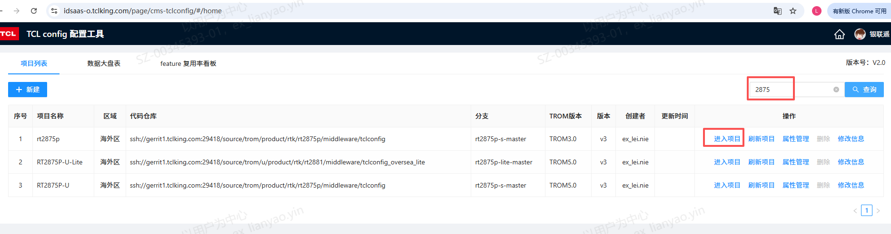
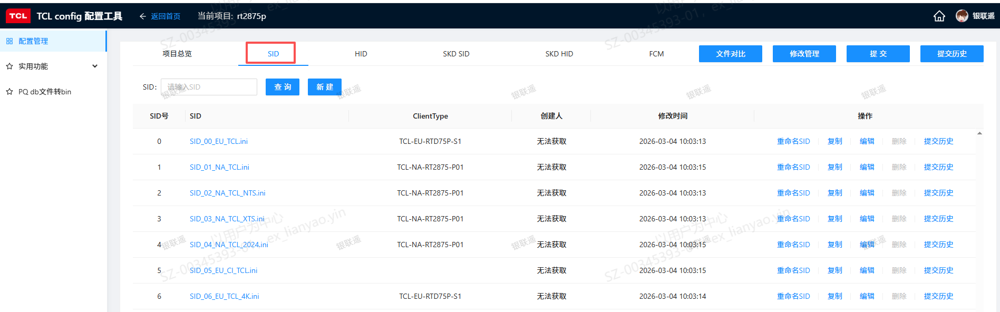
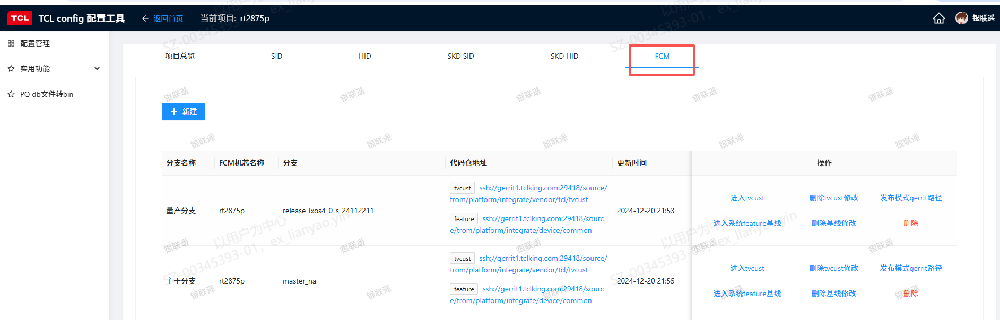
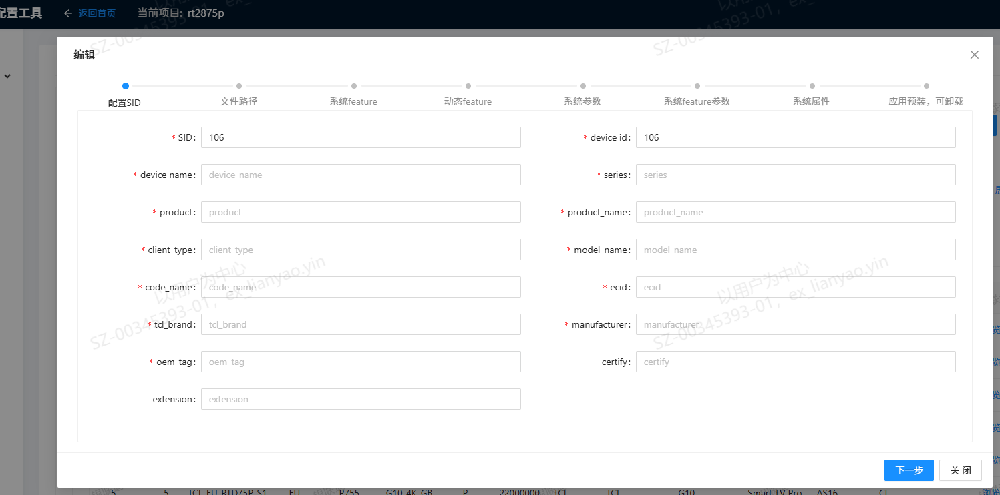
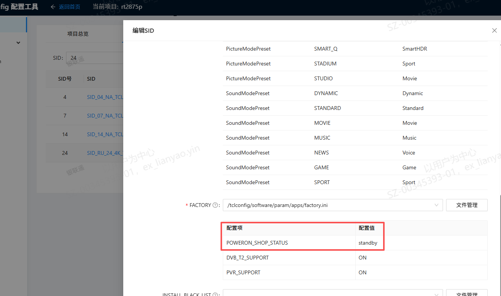
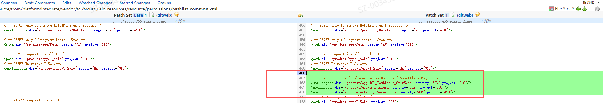
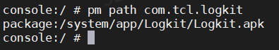
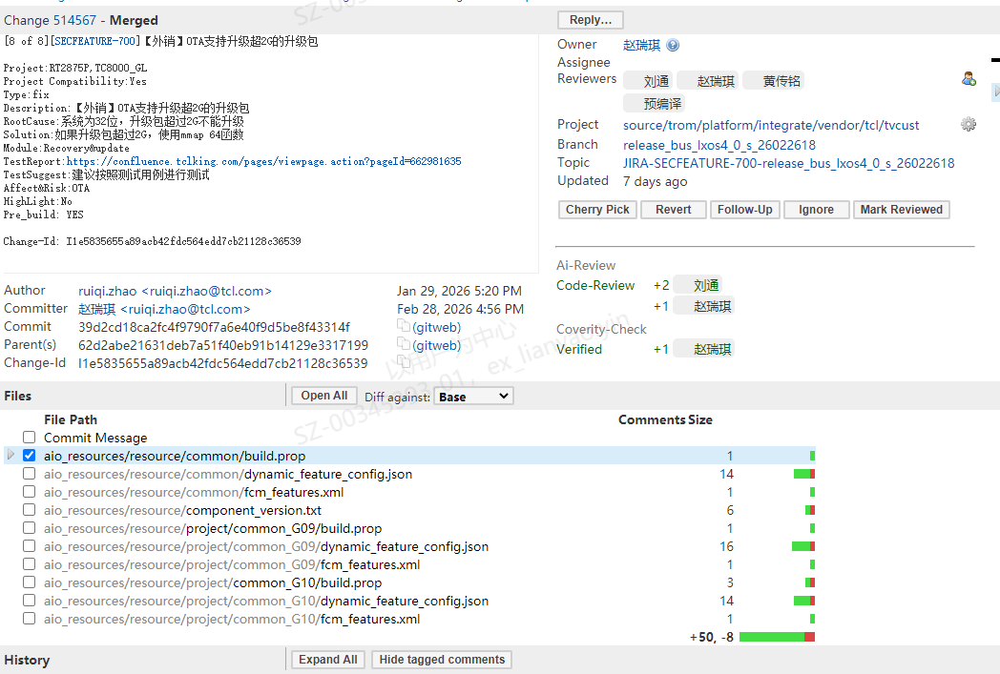

# 1.2.11 软件相关配置项维护SOP

> pageId: 583202306 | 导出时间: 2026-07-07T14:51:12.791456

# **SOP简介：**

**文档主要内容：如何通过tclconfig工具配置和维护软件相关配置项**

**文档适用角色：**产品SE、模块owner、BA

**适用项目阶段： 所有阶段**

**环境依赖：tclconfig配置平台 [https://idsaas-o.tclking.com/page/cms-tclconfig/#/home](https://idsaas-o.tclking.com/page/cms-tclconfig/#/home)**

**相关内容链接：**

****

****

# **软件相关配置项维护SOP**

## **1、什么是软件相关配置项**

软件相关配置项，即SID相关的配置项。

灵悉3.0之前的项目，配置项对应代码在整机的vendor/tcl/sita/tclconfig路径的software目录；在灵悉3.0火车导入FCM框架，基础ROM部同事导入SID解耦需求（
 ，2023年10月31日完成导入）后，software目录下的配置，除了SID文件引用的factory.ini文件，还会被FactorySettings 应用使用，其他配置均已迁移到整机代码的vendor/tcl/tvcust目录，tvcust目录下的配置又称为FCM配置。所以在灵悉3.0及之后的机芯上，维护SID相关配置项，必须同时维护vendor/tcl/sita/tclconfig和vendor/tcl/tvcust两个路径的代码。

示例：rt2875p 在android S版本上，主干分支的manifest.xml中，SID相关配置项所对应的两个代码仓名称和代码路径。

<project dest-branch="rt2875p-s-master" revision="rt2875p-s-master" name="source/trom/product/rtk/rt2875p/middleware/tclconfig" path="vendor/tcl/sita/tclconfig" />

<project dest-branch="master_na" revision="master_na" name="source/trom/platform/integrate/vendor/tcl/tvcust" path="vendor/tcl/tvcust" />

## **2、维护软件配置项流程涉及的人员及职责**

#### 2.1、tclconfig平台管理员：定制开发部，大SE：柯杰燕(kjy)，小SE：聂磊(ex_lei.nie)。

流程涉及场景：

1、产品SE需访问tclconfig平台，访问对应机芯的tclconfig配置，在fcm工具入口新建分支， 但无权限时，可T信找管理员开通相关权限

2、产品使用tclconfig配置平台遇到问题，参考文档****无法解决时，可T信咨询管理员。

示例：

如下截图依次为： rt2875p 在android s版本的tclconfig配置入口，SID 配置tab页和FCM配置tab页，若无权限访问，可找以上管理员开通。

[https://idsaas-o.tclking.com/page/cms-tclconfig/#/home](https://idsaas-o.tclking.com/page/cms-tclconfig/#/home)

[https://idsaas-o.tclking.com/page/cms-tclconfig/#/config/mgr?tab=sid](https://idsaas-o.tclking.com/page/cms-tclconfig/#/config/mgr?tab=sid)

[https://idsaas-o.tclking.com/page/cms-tclconfig/#/fcm/list?tab=FCM](https://idsaas-o.tclking.com/page/cms-tclconfig/#/fcm/list?tab=FCM)

#### 2.2、系统feature隔离SE：基础ROM部，大SE： 李琴琴(qinqin2.li) ，小SE：张雨龙(yulong8.zhang)、王帆(fan17.wang)

流程涉及场景：系统feature隔离SE负责把关隔离方案的正确性，项目预研/灵悉火车/月度班车期间，当开发需求要做机芯隔离时，可找系统feature隔离SE咨询、审核隔离方案；审核通过后，提交的gerrit，必须有大SE review+2或小SE review +1的记录。

#### 2.3、机芯负责人：截至2026年3月份，各机芯的负责人名单，见产品SE职责分工confluence()。

流程涉及场景：负责审核SID配置方案，审核通过后review+2 ，submit合入。

## **3、使用FCM可视化配置工具的注意事项**

灵悉火车/月度班车上，通常是多个机芯一起运作，共用一套TROM代码，所以修改FCM配置时，需要注意以下事项：

1、FCM可视化配置工具2025年已上线tclconfig配置平台，Android U及之后的机芯，已强制要求通过tclconfig平台来配置；Android S的机芯可选择使用该平台来配置（推荐使用，非强制），也可以继续使用mobaxterm工具访问代码服务器来提交。

2、必须按照指导文档的规则来修改，保证只对目标机芯生效，不能影响其他机芯。

3、可阅读**** 进行操作，但下文内容中的“指导文档”指的是。

## **4、产品SE涉及的软件配置项维护场景**

### 4.1、新建SID配置场景

#### 4.1.1、SID文件位置

在整机代码的vendor/tcl/sita/tclconfig和vendor/tcl/tvcust两个路径下。

#### 4.1.2、操作步骤

##### 4.1.2.1、修改tclconfig仓，即vendor/tcl/sita/tclconfig

在tclconfig配置平台，对应项目的SID tab页，点“新建”按钮，根据立项信息(区域、品牌、demod支持制式等)，依次选择必选项，选择完成后，点tclconfig页面的右上交“提交”按钮，填写提交信息，生成gerrit 链接，给机芯负责人审核。

##### 4.1.2.2、修改tvcust仓，即vendor/tcl/tvcust

根据FDS以及和开发代表、BA核对的立项信息来填写必选字段的值

a、当使用fcm可视化配置工具提交时，在tclconfig工具 FCM tab页，进入对应整机代码分支的tvcust仓，点“新建”按钮，依次填写各配置项的值，点“提交”按钮，填写提交信息，生成gerrit链接，给机芯负责人审核。

b、当通过mobaxterm工具访问代码服务器来提交时，需注意SID的配置分为两部分：基础数据和定制数据，都配置齐全后，通过patch_delivery 命令提交，生成gerrit链接，给机芯负责人审核。

**基础数据**：在vendor/tcl/tvcust/aio_resources/project/项目名称/devices.xml中，每个SID的配置对应一个<device />标签对的内容。内容包含了多个基础数据字段，各字段具体含义见指导文档1.2.2章节介绍；

基础数据示例：rt2875P Android S版本的devices.xml在vendor/tcl/tvcust/aio_resources/project/rt2875p 目录，欧洲区域使用的SID 6 配置如下，

<device id="6" sid = "6" device_name="G10" series="P" product="C655" product_name="G10_4K_GB" client_type="TCL-EU-RTD75P-S1" model_name="Smart TV Pro" code_name="AS16" ecid="22000000" tcl_brand="TCL" manufacturer ="TCL" oem_tag="EU"/>

**定制数据**：在vendor/tcl/tvcust/aio_resources/resource目录下，定制数据的配置规则见指导文档1.2.3章节；

#### 4.1.3、注意事项：

1、判断新建SID的必要性，主要考虑基础数据中关键字段的值，能否满足新项目要求，关键字段：product、product_name、client_type、model_name、ecid、tcl_brand。

当无法满足新项目诉求时，才新建SID，否则直接复用现有SID；因为SID越多，PID就越多，涉及的维护工作量（处理FQA释放流程、OTA升级部署流程）就越多。

2、tvcust仓，关于基础数据的字段赋值，需注意以下几点：

a、必填字段(code_name字段除外)必须符合开发代表提供的FDS要求；

b、code_name字段是XTS认证中fingerprint的一部分，根据XTS认证要求赋值即可。

c、需要和BA核对，是否有特殊定制需求；若有定制需求，需考虑当前必选字段是否满足定制，满足则直接新建，若不满足，则需考虑加上可选字段certify和extension。

d、若配置了可选字段certify和extension，赋值时，若需要新建字段，则必须拉通BA、系统feature 隔离SE评审。

如下图，通过FCM可视化工具新建SID时，标红的必填字段(除了code_name)的赋值，必须满足FDS和立项要求；非必选的certify和extension，用于配合新建定制数据，根据项目立项要求来决定是否配置。

3、tvcust仓，新建定制数据时，除了依据FDS，还要和BA对齐立项信息，是否有特殊需求；根据FDS和立项需求，选择新建build.prop、database目录及db文件、fcm_features.xml和system_config.xml文件，以及是否修改permissions/pathlist_common.xml配置应用预置规则。

4、tvcust仓，项目涉及特殊需求，要配置定制数据的规则时，必须请系统feature 隔离SE 帮忙review +1。

5、修改后必须编译柯基版本自验证，保证满足FDS要求和立项需求。

6、tclconfig和tvcust的新建SID数字必须一样（举例：不能出现tclconfig仓新建的SID是1，tvcust仓新建的SID 是2的情况），才可请机芯负责人review +2，合入整机代码。

7、tclconfig仓，factory.ini文件必须选择正确，因为FactorySettings 应用在使用；factory.ini中POWERON_SHOP_STATUS的值，在不同区域，取值不同，EU和JP是last，其他区域是standby；其他配置项因已迁移到tvcust仓，无其他模块引用，正确性无强制要求。

示例：西北亚区域的同一个机型，因法规要求，某个时间点之后出货的新批次，需要裁剪掉部分应用，但该时间点之前已出货的旧批次需保留，所以评估需新建SID，并配置应用预置规则。

修改链接：tclconfig仓：[http://gerrit1.tclking.com/#/c/source/trom/product/rtk/rt2875p/middleware/tclconfig/+/281633/](http://gerrit1.tclking.com/#/c/source/trom/product/rtk/rt2875p/middleware/tclconfig/+/281633/)

tvcust仓：[http://gerrit1.tclking.com/#/c/source/trom/platform/integrate/vendor/tcl/tvcust/+/281630/](http://gerrit1.tclking.com/#/c/source/trom/platform/integrate/vendor/tcl/tvcust/+/281630/)

修改tclconfig仓时，西北亚属于非EU/JP区域，factory.ini需选择POWERON_SHOP_STATUS的值为standby的。

修改tvcust仓时，因出货区域、机型无变化，只有预置应用有变化；故考虑在原SID上，新增一个可选的基础数据字段certify，经评审赋值为SCM；通过可选字段verify的值SCM，在定制数据的pathlist_common.xml，配置应用预置规则。

### 4.2、更新PQ Tree默认值

#### 4.2.1、PQ Tree文件位置

PQ Tree默认值在main_pq_def.db文件中配置，db文件在SID的定制数据目录下，即vendor/tcl/tvcust/aio_resources/resource目录下，具体目录名称与SID配置的定制规则对应。

示例：2875P Android S版本，全球区域使用的main_pq_def.db，放置在以下目录（因西亚区域有特殊定制需求，需在全球区域的基础上更新db，区分配置）：

西亚：aio_resources/resource/ecid/common_21432000/database/main_pq_def.db 
全球区域除西亚外的区域：aio_resources/resource/common_EU_C655_G10/database/main_pq_def.db

北美区域使用的main_pq_def.db，放置在以下目录（实际上两个db的MD5值一样，可以做归一化配置，修改QM51L机型定制数据的common_NA_QM51L_G10/build.prop，配置ro.odm.tcl.tvos_main_pq_def_db_path为common_NA_JX32B_G10目录下main_pq_def.db的路径）：

除QM51L外的机型：aio_resources/resource/common_NA_JX32B_G10/database/main_pq_def.db
QM51L机型：aio_resources/resource/common_NA_QM51L_G10/database/main_pq_def.db

#### 4.2.2、操作步骤

##### 4.2.2.1、产品SE修改时：

1、当有修改PQ Tree默认值的需求时（通常在项目初期和灵悉火车允许期间），研发PQ同事发送邮件给各项目组成员，知会修改点，并新建PQ Tree更新的JIRA单给BA。

2、BA审核通过（确认审核导入必要性、排期）后，JIRA单流转给产品SE。

3、产品SE基于研发PQ同事提供的修改点，拉通中间件PQ同事，拼写SQL命令。

因PQ数据库的字段都是基础软件二部的中间件PQ同事定义的（见文档），更新db的SQL语句联系PQ同事(如yongqiang2.tan ，liudecai)提供；若中间件PQ同事未及时响应，为满足版本交付计划，产品SE可自行写SQL语句，但SQL命令必须给中间件PQ同事审核通过。

4、产品SE使用SQLite Expert 工具，使用SQL命令更新项目对应目录的db文件，然后提交生成gerrit链接。

5、产品SE构建柯基版本，给研发PQ同事验证。

6、研发PQ同事确认符合预期后，产品SE请机芯负责人review+2，合入整机代码。

示例：灵悉4.0 班车分支运行期间，研发PQ同事王琪邮件通知，Android S版本的rt2875P机芯，全球区域，需按
 备注的修改点更新PQ tree默认值，更新db的SQL命令在jira上已提供，产品SE按步骤更新即可。

修改链接：[https://gerrit1.tclking.com/#/c/source/trom/platform/integrate/vendor/tcl/tvcust/+/423207/](https://gerrit1.tclking.com/#/c/source/trom/platform/integrate/vendor/tcl/tvcust/+/423207/)

##### 4.2.2.2、研发PQ同事修改时：

1、研发PQ同事发送邮件给各项目组成员，知会修改点，并新建PQ Tree更新的JIRA单给BA。

2、BA审核通过（确认审核导入必要性、排期）后，JIRA单流转给产品SE

3、产品SE基于最新代码，导出main_pq_def.db，记录MD5值，邮件描述清楚db和MD5值的对应关系，提供db和MD5值给研发PQ同事。

4、研发PQ同事收到邮件后，本地核查main_pq_def.db的MD5值，符合邮件预期后，更新main_pq_def.db。

5、研发PQ同事邮件提供更新后的main_pq_def.db 和MD5值，描述清楚db和MD5值的对应关系，提供给产品SE。

6、产品SE核查更新后的db的MD5值，符合研发PQ同事提供的，则提交到整机代码仓，并柯基构建版本，提供给研发PQ同事。

7、研发PQ同事验证，确认符合预期后，产品SE请机芯负责人review+2，合入整机代码。

#### 4.2.3、注意事项：

1、Android U的新机芯，更新main_pq_def.db的责任人是研发PQ同事（如王琪，qi28.wang），Android S的机芯，更新main_pq_def.db的责任人是产品SE。

2、一个大区域（GL、NA、JP）原则上只维护一个main_pq_def.db；无特殊需求时，不要新增main_pq_def.db，否则增加代码维护工作量，浪费人力。

3、产品SE必须根据研发PQ同事提供的PQ 默认值SPEC文档 来修改，SPEC文档示例：  

4、机芯不同，对应的PQ SPEC文档不同；同一个机芯，出货区域不同，对应的SPEC文档也不同，下载文档时，必须按研发PQ同事邮件说明，下载项目对应的。

### 4.3、配置应用预置规则

#### 4.3.1、应用预置规则文件位置

应用预置规则属于SID的定制数据，在vendor/tcl/tvcust/aio_resources/resource/permissions/pathlist_common.xml中配置。

#### 4.3.2、操作步骤

1、产品SE确认要预置/不预置的APK文件路径，可通过咨询应用SE获取，也可在整机或开发板上，通过串口命令<pm path 应用包> 查询。

示例：logkit 应用的文件路径是system/app/Logkit

2、产品SE根据FDS，并与BA核对项目预置应用需求，根据指导文档2.6章节的规则，来配置path或excludepath规则，提交生成gerrit。

3、产品SE构建柯基版本，自验证确保符合预期。

4、产品SE找系统feature隔离SE帮忙review+2/review+1，再找机芯负责人review+2和merge 。

#### 4.3.3、注意事项：

1、项目立项时，BA提供的预置应用的清单，必须逐个和BA、应用SE确认清楚，APK文件路径、gitlab10路径，预置要求。

2、需求上车时，涉及新增预置或卸载应用，但功能模块owner无权限时，需产品SE协助配置应用预置规则。

3、新增预置/应用，除了要配置fcm规则，如果appinfo.xml和[app.mk](http://app.mk)未配置过，则需要CIE同事配合修改appinfo.xml加上应用的gitlab10路径、以及修改[app.mk](http://app.mk)文件给宏PRODUCT_PACKAGES加上新增应用的模块名。

示例：Android S版本，rt2875p机芯，新增预置TCL_ALL_Browser应用，除了配置FCM应用预置规则，还需CIE配合提交如下修改。

修改链接：[https://gerrit1.tclking.com/#/c/source/google/s/manifest/+/208213/](https://gerrit1.tclking.com/#/c/source/google/s/manifest/+/208213/)
[https://gerrit1.tclking.com/#/c/source/trom/platform/integrate/device/common/+/208176/](https://gerrit1.tclking.com/#/c/source/trom/platform/integrate/device/common/+/208176/)

示例：Android S的rt2875p机芯，Wuaki应用变更为只有EU区域预置，TCL_ALL_Browser变更为全区域取消预置，故需修改

修改链接：[https://gerrit1.tclking.com/#/c/source/trom/platform/integrate/vendor/tcl/tvcust/+/245591/](https://gerrit1.tclking.com/#/c/source/trom/platform/integrate/vendor/tcl/tvcust/+/245591/)

### 4.4、配置系统feature

#### 4.4.1、系统feature配置文件位置

系统feature属于定制数据，在vendor/tcl/tvcust/aio_resources/resource目录下。

#### 4.4.2、操作步骤

##### 产品SE修改的场景：

1、产品SE和BA针对新立项机型的需求完成解读，确认必须新建SID且需要配置定制数据。

2、根据新建SID的需求，参考指导文档的2.4和2.5章节，按需针对build.prop、fcm_features.xml和system_config.xml进行配置，提交生成gerrit。

3、构建柯基版本，自验证通过，请系统feature隔离SE帮忙+1(非必须) ，请机芯负责人review+2和submit合入

##### 功能owner修改的场景：

1、功能owner完成班车需求或火车需求上车评审。

2、功能owner根据需求导入的机芯范围，参考指导文档的2.4和2.5章节，进行配置，保证feature只对目标机芯生效，提交生成gerrit。

3、找系统feature隔离SE帮忙review+1/review+2，找模块SE帮忙review+2，找机芯负责人submit合入。

#### 4.4.3、注意事项

1、由产品SE配置系统feature的场景为：新建SID，涉及特殊需求，需要配置系统feature来满足时。

示例：Android S rt2875p机芯，要新建支持远场语音功能的SID，除了修改devices.xml文件加上基础数据，还需要在基础数据对应的定制数据的目录，新增fcm_features.xml，加上远场语音功能需要的两个permissions。

<permissions>
    <feature name="com.google.android.feature.HOTWORD" />
    <feature name="com.google.android.feature.ECHO_REFERENCE" />
</permissions>

修改链接：[https://gerrit1.tclking.com/#/c/source/trom/platform/integrate/vendor/tcl/tvcust/+/499657/](https://gerrit1.tclking.com/#/c/source/trom/platform/integrate/vendor/tcl/tvcust/+/499657/)

2、非全机芯导入的需求，功能owner在配置feature时，必须在全机芯维度目录(vendor/tcl/tvcust/aio_resources/resource/common)配置feature默认值为false，再在对应机芯要生效的目录，配置feature的值为true。

3、灵悉火车/月度班车期间上车的需求，feature由功能owner负责配置，由系统feature隔离SE review+1/review+2，模块SE负责+2，机芯负责人submit 合入。

示例：2026年3月班车需求【OTA支持升级超2G的升级包】，在android S上仅在外销2875P和TC8000机芯生效，需在common目录下配置默认值为false，在要生效的2个机芯的定制目录，默认值要配置为true。

修改链接：[https://gerrit1.tclking.com/#/c/source/trom/platform/integrate/vendor/tcl/tvcust/+/514567/](https://gerrit1.tclking.com/#/c/source/trom/platform/integrate/vendor/tcl/tvcust/+/514567/)

### 4.5、配置开机logo和动画

#### 4.5.1、开机logo和动画文件位置

属于定制数据，在vendor/tcl/tvcust/aio_resources/resource目录下。开机logo文件在/logo目录下，开机动画文件在/bootanim目录下。

#### 4.5.2、文件格式

开机logo文件通常是logo.jpg/logo.bmp/logo.raw，因soc支持能力而已；开机动画通常是customized_bootanimation.zip。

#### 4.5.3、操作步骤

1、BA邮件提供项目对应的logo和动画文件给产品SE。

2、产品SE参考指导文档2.3章节，在对应要定制的目录层级下（如不存在，则要新建logo和bootanim目录），放入BA提供的对应logo和动画文件，提交生成gerrit链接，

3、因显示效果受资源文件的分辨率、帧数影响，产品SE需柯基构建临时版本，使用对应机型刷机，录制开机效果视频，通过邮件或T信发给BA确认。

4、BA与规划同事确认是否满足业务要求；若涉及修改开机动画，还需请认证经理和谷歌确认，是否满足谷歌认证要求，因为不能影响google原生开机动画效果。

5、BA确认符合预期后，产品SE请机芯负责人review+2，合入整机代码。

#### 4.5.4、注意事项

1、新导入的开机logo和动画文件的大小，最好不超过现有资源文件的大小，文件过大容易导致无法显示或显示异常，如因soc无法解析或分区爆掉而异常。

2、新导入的开机logo文件的格式（如 png、raw）、分辨率（如2K、4K），必须是soc支持的格式，否则可能显示异常或无法显示。

3、开机logo或动画文件显示异常时，可找基础ROM部-系统图形与动效组的开发同事(如雷升，sheng2.lei)，帮忙分析原因和制定解决方案。

示例：Android S版本的所有机芯，2026年雷鸟品牌的机型，需要使用新的开机logo和动画，故在各机芯的公共目录，brand/common_IFFALCON目录下，在对应目录放入BA提供的新资源文件。

修改链接：[https://gerrit1.tclking.com/#/c/source/trom/platform/integrate/vendor/tcl/tvcust/+/461809/](https://gerrit1.tclking.com/#/c/source/trom/platform/integrate/vendor/tcl/tvcust/+/461809/)
