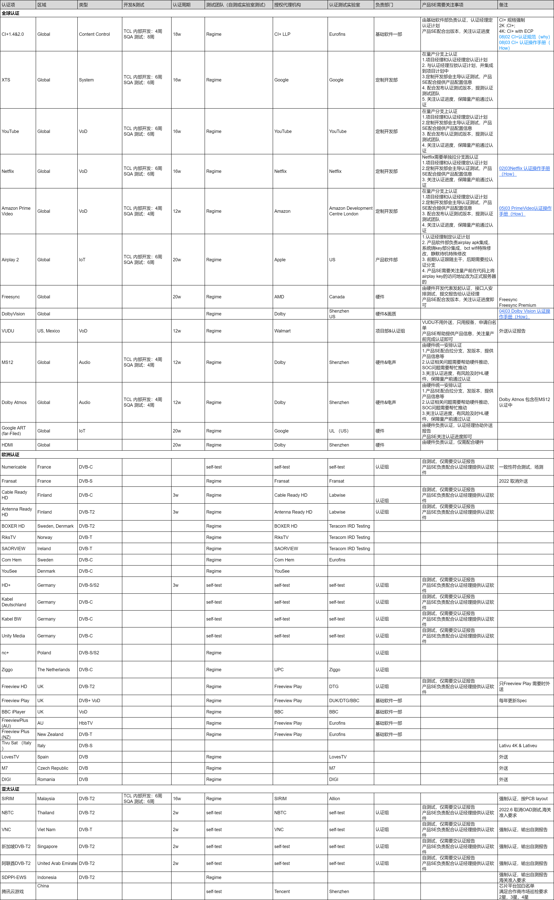

# 1.2.5 认证进度风险管控SOP

> pageId: 583202182 | 导出时间: 2026-07-07T14:51:42.152321

# **SOP简介：**

**文档主要内容：Google TV认证一览表及重要认证说明**

**文档适用角色：**SPM，产品SE，认证经理，VPM

**适用项目阶段：**SR4 SR5

# **认证进度风险管控SOP**

### **1. 什么是认证**

        电视产品出口海外，需要通过当地的认证，不同国家和地区有不同的认证要求。软件认证是指TV软件（含系统固件，预装应用，嵌入式软件等）出口海外市场时，依据目标市场的认证标准、法规要求，通过指定认证机构/实验室的测试、审核，确认软件在功能合规、数据安全、隐私安全等方面符合当地要求，最终获得认证证书，确保软件合法进入目标市场的合规性流程。其核心是验证软件与目标市场法规、认证标准的适配性，涵盖软件功能测试、数据处理合规性、权限管控、版本一致性等内容，是 TV 产品海外认证的重要组成部分。

### 2. 认证项目确认

        项目立项时，项目经理和产品SE需要与认证经理紧密对齐。由认证经理根据“目标销售国家 + 硬件规格 + 软件生态需求”选出必过的认证项，制定详细的认证计划。主要依据以下几个方面：

1. 根据目标市场（出口区域）确定

这是决定需要哪些认证的最核心因素。不同国家和地区有不同的强制性或市场准入要求：

- 
全球范围 (Global)：

- 
系统与内容控制： CI+ 1.4 & 2.0 (内容控制), Google XTS (系统/GMS授权)。

- 
流媒体/生态： YouTube, Netflix, Amazon Prime Video (VoD需求)。

- 
音视频/硬件技术： Freesync, DolbyVision, MS12, Dolby Atmos, HDMI。

- 
IoT： Airplay 2, Google ART (远场语音等)。

- 
欧洲市场：

- 
主要取决于具体国家和当地的广播电视标准（如 DVB-C, DVB-S, DVB-T2）及运营商。

- 
例如：法国 (Numericable, Fransat)、德国 (HD+, Kabel Deutschland 等)、英国 (Freeview HD/Play, BBC iPlayer)、北欧国家 (BOXER HD, RiksTV 等)。

- 
亚太及其他市场：

- 
马来西亚 (SIRIM)、泰国 (NBTC)、越南 (VNC)、新加坡、阿联酋、印尼 (SDPPI-EWS) 等地的 DVB-T/T2 强制准入认证。

- 
中国市场可能有特定的要求，如腾讯云游戏认证。

2. 根据产品硬件规格和技术特性确定

- 
分辨率/解码能力： 例如 CI+ 认证中，2K 电视只需基础 CI+，而 4K 电视需要 "CI+ with ECP"。

- 
音画质技术授权： 如果产品支持杜比全景声或杜比视界，则必须过 Dolby Atmos / DolbyVision 认证；如果支持 AMD 游戏特性，则需要 Freesync 认证。

- 
IoT功能： 如果产品规划支持苹果 Airplay 2，则必须过苹果认证。

### 3. 认证管控

在项目的 SR4、SR5 阶段，按照以下流程确定和管控认证：

1. **认证经理主导规划：** 项目初期（或立项时），由**认证经理**根据目标市场和产品规格，制定详细的“认证计划”。
2. **跨部门协作：**

- **定制开发部** 负责主导 Google 生态及流媒体（XTS, YouTube, Netflix, Prime Video）的认证。
3. **基础软件部** 负责 CI+ 及部分欧洲 HbbTV/VoD（如 Freeview Play, BBC iPlayer）认证。
4. **硬件部门** 负责音视频（Dolby, HDMI, Freesync）及部分 IoT（Google ART）认证。
5. **项目部/测试部-认证组** 负责大部分欧洲和亚太的区域性标准（如 DVB 相关的当地认证）。
6. **产品 SE 的职责：**

- 配合提供产品配置信息。
7. 根据认证经理的计划，安排拉取代码分支、发布认证测试版本。
8. 协调样机资源，提前与认证经理确认好是否寄送样机，以及样机寄送时间，提前安排。
9. 关注认证进度，推动 Bug（尤其是 XTS、Netflix 等耗时长的认证 Bug）的闭环，确保在量产前所有认证通过并获得 TQC 认可。

### 4. 常见市场准入认证

软件认证一览表如下

### 5. 认证结果确认

**1. 软件生态类认证（Google、Netflix等）**

这类认证由第三方科技巨头严格把控，确认方式最为标准化：

**Google XTS 认证：**

**确认方式：** Google 官方会通过其系统（如 Android Partner Android portal 或特定提审后台）下发**正式的 Approval（批准）邮件**。

- 
**标志：** 提交的 CTS/GTS/VTS 等测试报告被 Google 或其指定的第三方实验室 (3PL) 审核通过，且该机型/软件版本被录入 Google 的已认证设备库中。

- 
**Netflix 认证：**

- 
**确认方式：** 在 Netflix Partner Portal (NPP) 后台中，该项目的状态变更为 **“Approved”**。

- 
**标志：** Netflix 实验室出具最终的 Pass 报告，并正式释放生产环境的 ESN（电子序列号）权限。

- 
**YouTube / Prime Video：**

- 
**确认方式：** 收到由 YouTube/Amazon 官方或其授权的外部实验室出具的最终测试通过报告（Test Report Pass）。

**2. 本地化准入与运营商认证（欧洲、亚太等DVB认证）**

这类认证多涉及各国的广电标准或特定的运营商机构：

- 
**外部实验室报告：** 比如由 Eurofins、DTG 等指定的第三方认证测试机构出具的**官方 Test Report**，结论明确为 **Pass**。

- 
**官网列名 (Listing)：** 许多认证（如 CI+、Freeview Play、HD+等）在通过后，相关机构会将通过认证的电视型号公布在其**官方网站的合格产品目录**中。SE 或认证经理可通过官网查询型号是否上榜。

- 
**证书颁发：** 比如 CI+ 认证，通过后会获得正式的认证证书，并获取生产所需的授权 Key（Credentials）。

**3. 硬件及音视频技术认证（Dolby、HDMI等）**

- 
**官方授权书/报告：** 由 Dolby 实验室、HDMI 协会等机构颁发的正式 Test Pass 报告及证书。

**产品SE应注意认证状态跟踪与归档**

1. 所有认证的最终状态，不可仅凭开发人员口头说明“测试没问题了”，**必须以认证经理或测试接口人提供的官方凭证（如：Approval邮件、Pass报告、官方列名截图、TQC Sign-off邮件）为准。**
2. 产品 SE 在量产释放前，需核对《项目认证计划表》，确保所有规划的必过认证均已收集到上述书面凭证，并统一归档至项目管理系统中，方可放行量产。

### 6. 产品SE需要关注的重要认证

#### **6.1 Google XTS认证**

**XTS认证核心目的：**确保设备兼容Android生态系统，获得GMS授权，可预装Play Store、YouTube等Google应用。

**关键测试项：**CTS, GTS, VTS, STS, CTS Verifier, TVTS等8-9个套件。

**核心套件说明**

- 
**CTS（兼容性测试套件）**：验证设备是否符合Android API接口，单次运行约72小时 。

- 
**GTS（谷歌移动服务测试套件）**：验证GMS应用（Play Store, YouTube等）集成是否正确，单次约7小时 。

- 
**VTS（供应商测试套件）**：验证HAL层、驱动和内核的Treble兼容性 。

- 
**CTS-on-GSI**：在通用系统映像上运行CTS，验证系统分区兼容性 。

- 
**CTS Verifier**：需要手动操作和判断的半自动化测试 。

**认证周期及注意事项**

1. XTS认证大约需要4-5月，初期认证经理会指定认证计划，产品SE提供user版软件提测XTS，认证测试组会开始跑XTS报告，一轮XTS报告大约需要跑1周时间，同步解bug。XTS测试由定制开发部负责，XTS一共跑3-4轮左右，最终输出XTS pass测试报告。XTS报告需要提交Google approve。

2. 如果是北美软件，一般会提交量产软件给Google QA/DF测试后，Google才会approve XTS报告，一般量产前3周释放给Google测试

1）给Google QA软件一般需要上传到Google driver，QA可以用U盘强制升级，如果QA想要测试OTA流程，则需要国内安排给QA的机器部署OTA

2）Google QA测试一般持续一周，进QA测试前，该版本需要经过国内SQA功能测试和性能测试，给出一版比较稳定的版本给Google，由Google TAM Daniel安排开始Google QA测试。Google QA测试包括：Fast test（1天），功能测试（3-4天），TVTS测试（1天）。

3）Google QA测试完成后，一般需要进行Google DogFood测试，测试周期一般为14天。TCL可以respin一个版本给DF，需要包含DF提的issue问题修改，经过两次respin后，DF反馈测试结果，Google review测试结果，并approve XTS报告，此时完成FSI版本。

3. 全球软件给量产分支上的软件提测哈曼实验室，实验室主观检测pass后提交Google approve。

**风险把控**

1）北美软件一般需要经过Google测试后才会approve XTS，Google测试至少需要预留2周的时间，中间最多可以respin 1个版本，所以在提测给Google时，软件就需要达到释放状态。在提供软件给Google后，需要安排测试团队立刻跑XTS套件，一般XTS套件需要跑一周时间。产品SE需要保证在给Google软件之前，XTS问题已全部解完并本地测试全部pass。

2）全球软件需要提前提交给哈曼实验室进行主观检测，主观检测通过后，Google才会approve全球软件。产品SE需要根据量产计划提前和认证经理互锁时间。

3）需要根据认证经理安排的认证计划发布软件，并关注XTS问题闭环。

4）测试样机和主板需要提前准备，在XTS测试开始前要准备好，否则会delay测试安排。

5）关注security patch过期时间并及时更新。

#### **6.2 Netflix认证**

**Netflix认证核心目的：**确保设备提供良好的Netflix观影体验，支持高清/4K HDR播放及配套功能。

**关键测试项：**超过900项测试，涵盖音视频质量、性能、用户体验、压力老化、DRM等。

**认证流程**

1. 
**项目申请与ESN生成**：提交设备信息，生成唯一的电子序列号（ESN）。

2. 
**测试项目设定**：Netflix根据设备类型定制测试计划。

3. 
**初步自测试**：厂商使用Netflix测试系统（NTS）进行内部摸底，涵盖900+项测试。

4. 
**预认证提交**：将设备提交给Netflix进行预审。

5. 
**Netflix审核与测试**：Netflix实验室（如"The Shu"）进行独立验证 。

6. 
**问题修复与重新测试**：针对反馈的问题进行修复并再次提交。

7. 
**最终评估与认证决定**：通过后获得授权，可使用Netflix认证标识

**认证周期及注意事项**

1. NTS认证大约需要4月左右，NTS认证由定制开发部负责，产品SE配合提供产品配置信息，一般会在量产分支上拉认证分支专门用NTS认证。

2.TCL内部进行2轮测试，问题收敛完，达到送测标准后，将软件送测Netflix实验室。

**风险把控**

1）与认证经理互锁好认证周期及安排，及时提供认证经理需要的产品信息。

2）配合定制开发部的owner，关注问题解决情况。

#### **6.3 YouTube/PrimeVideo认证**

YouTube与Google XTS认证有强依赖，是Google生态的组成部分，但YouTube有独立的测试套件。PrimeVideo认证是亚马逊独立的硬件认证体系

**YouTube认证核心目的：**确保YouTube应用在TV设备上的完整功能和用户体验。

**PrimeVideo认证核心目的**：确保Prime Video应用的流畅播放、DRM保护和用户体验。

1. YouTube/PrimeVideo由定制开发部认证组负责，进行2轮测试，认证周期一般为TCL开发6周，测试6周，送测4周。

2. TCL内部测试达标后，提测给YouTube、PrimeVideo实验室测试

**风险把控**

1）关注认证计划，按照认证经理的计划及时发布软件提测SQA。

2）关注问题解决情况，及时和开发owner对齐。

#### **6.4 Airplay2认证**

Airplay2认证是指设备要按照 Apple 的技术规范、兼容性要求、交互要求、安全要求完成开发，并通过 Apple 认可的认证/测试流程，最终获得官方支持资格。

**风险把控**

1）需要和认证经理对齐认证计划，配合认证经理和认证大A提供产品信息等。

2）认证通过后，产品SE需要在量产前在代码上将airplay key的访问地址改为正式服务器的地址。

#### **6.5 CI+认证**

CI 全称 Common Interface。它是一种标准接口，用来让电视机接入 CAM（Conditional Access Module，条件接收模块）。

**CI+认证核心目的：**1. 确保电视/机顶盒插入 CAM 后，能正确识别、鉴权、解密并播放节目。2. 防止高清内容、付费内容被非法复制或绕过授权播放。

**风险把控**

1）与认证经理互锁认证计划

2）产品SE需要和开发owner确认认证PASS拿到key前是否可以用其他机芯key生产。

### 7. TQC测试

**1. 团队分布**
    TQC 主要是针对目标销售区域进行的本地化质量控制和测试。根据目标市场的不同，TQC 团队分布在全球各地：

- 北美市场： TQC 团队位于美国西雅图。
- 欧洲/英国市场： TQC 团队位于法国。
- 澳洲市场： TQC 团队位于堪培拉。
- 日本市场： TQC 团队位于东京。
- 拉美市场**：** TQC 团队位于巴西和阿根廷，主要负责南美国家本地化测试。

**2. 测试流程与时机**

- 提测时机： TQC 测试并不是在项目刚开始就进行的，而是在全功能结束（通常指核心功能开发完毕，内部 SQA 测试达到一定稳定度）后，项目组内部评估完，由VPM正式向目标市场的当地 TQC 团队发起提测。
- 持续时间： 这是一个持续的验收过程，会一直持续到量产释放之前。

**3. 产品SE的核心关注点与要求**

- 问题闭环： 在量产释放前，必须将 TQC 团队提出的所有必解问题全部闭环修复。
- 认可关单： 仅仅修复问题还不够，最终需要得到当地 TQC 团队的认可并正式关单。没有 TQC 的认可关单，产品将面临无法顺利量产释放的风险，因为这代表着产品尚未达到当地市场的最低质量验收标准。
