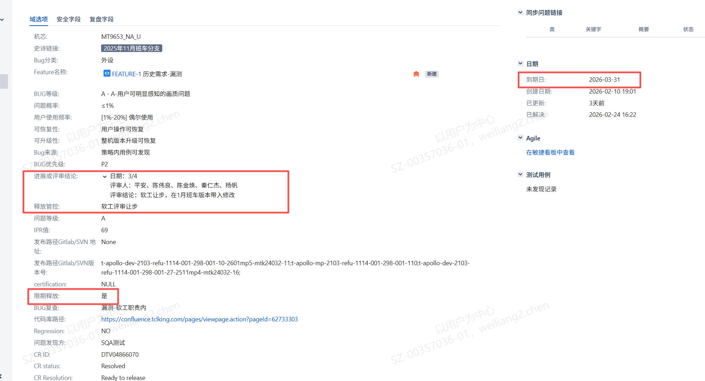
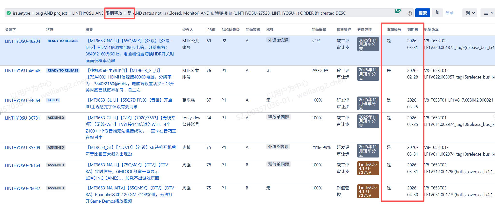

# 1.2.7 限期问题风险管控SOP

> pageId: 583202207 | 导出时间: 2026-07-07T14:51:44.041145

# **SOP简介：**

**文档主要内容：**限期问题风险管控

**文档适用角色：**问题OWNER ，产品SE ，VPM，质量SE ，领域SE，质量SE

**适用项目阶段： SR5**

**环境依赖：**

**相关内容链接：****软件缺陷及节点评审指南 （泛智屏）**

# **限期问题风险管控SOP**

## **一、 什么是限期问题**

**限期问题**是指在软件释放评审环节中，经质量SE、产品SE、VPM、问题OWNER、SPM联合评审确认：

- 该问题 **存在一定质量或业务风险**
- 在当前版本发布前 **无法彻底解决**
- 经评估后认为风险在短期内 **可控**
- 明确要求在 **约定的最晚期限前完成修复并闭环**

并最终形成“**限期释放**”评审结论的问题。针对限期释放的问题，SPM需要在对应JIRA单上将“限期释放”字段选为“是”，并将“到期日”字段改为会议评审决策的最晚问题解决日期。比如以下示例，代表此问题经过评审确认为限期释放问题，需要在2026-03-31前解决

## **二、限期问题跟踪和管理**

**2.1 限期问题持续跟踪要求**

当软件版本携带限期问题释放后，产品SE 需关注：

- **后续所有版本发布过程中**，必须持续跟踪限期问题状态
- 确保问题在到期日前完成修复并随版本带入
- 问题修复后需按流程验证并闭环

**2.2 日常会议跟踪机制**

- 在 **项目晨会 / 晚会** 中，作为固定检查项跟进，确认当前问题进展、是否存在延期风险

**2.3 JIRA过滤器管理**

- 制定限期问题JIRA过滤器，防止跟漏。JIRA过滤器示例：issuetype = bug AND project = LINTHYOSU AND 限期释放 = 是 AND status not in (Closed, Monitor) AND 史诗链接 in (LINTHYOSU-27523, LINTHYOSU-1) ORDER BY created DESC

****

## **三、延期与风险升级**

**3.1 延期评审触发条件**

当出现问题解决存在技术或资源困难、按当前进展判断 **无法在到期日前完成修复**，必须在 **到期日前，**由SPM组织发起二次评审，质量SE、产品SE、VPM、问题OWNER参与

**3.2 延期评审结论**

**3.2.1 同意延期**

- 
确认问题风险在延期周期内仍可控

- 
在 JIRA 中 **更新到期日**

- 
明确新的解决计划与风险说明

**3.2.2 不同意延期**

- 
评审确认问题风险不可接受

- 
问题需 **上升至相关部门长或更高层级决策**

- 
在决策明确前，不允许继续以限期问题方式释放
