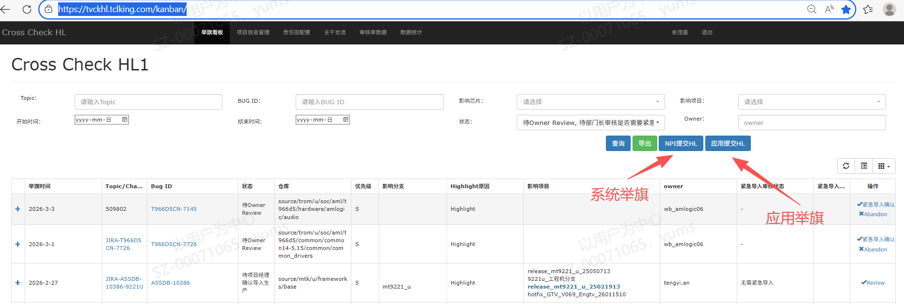
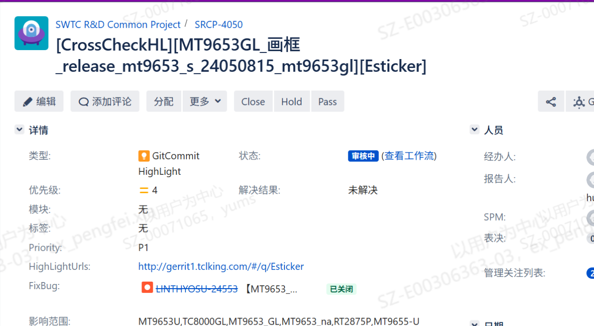

# 1.2.8 举旗问题风险管控SOP

> pageId: 583202215 | 导出时间: 2026-07-07T14:51:46.513841

# **SOP简介：**

**文档主要内容：举起问题解决措施 如何快速的同步到各个项目，并有节奏的发起版本迭代**

**文档适用角色：产品SE，SPM，质量SE ，VPM，举旗问题owner**

**适用项目阶段： SR4 SR5**

**环境依赖：**

**相关内容链接：**

举旗平台链接**：[Cross Check HL](https://tvckhl.tclking.com/kanban/)**

# **举旗问题风险管控SOP**

**1.什么是举旗**

项目开发或者维护过程中，有一些通用性的严重问题（包括自测发现、售后反馈、工厂反馈等多个渠道），这些问题可能会代码阻塞生产、用户投诉，owner 或者产品se 把这些问题highlight 出来通知到涉及到的各个项目组，这就叫举旗；

**2.举旗涉及到的模块方及职责**

举旗涉及到：产品SE ，软件PM，软件VPM，软件质量SE，举旗问题Owner

举旗问题owner：举旗问题owner 在crosscheck 平台发起举旗

产品SE：收到举旗通知后，确认什么时候存在的问题（是一直存在，还是新改出 ，还是随着某个功能增加带入），影响的分支，版本

软件PM：收到举旗问题后在项目组内组织会议（会议参与人员:软件产品SE ，VPM ，质量SE，举旗owner，SPM）评估问题的严重性 和 结果，并根据问题的的严重性 和 评估结果 来确定是否跟 产品线或者工厂，确定影响 的数量，批次（了解这些基本信息是为了制定版本节奏 和 确定是否返工 、是否立即导入工厂）；

软件VPM：跟举旗方对齐并模拟举旗问题出现的场景，操作方式，概率，恢复手法

软件质量SE：参与软件PM 组织会议（包括产品SE ，软件PM，软件VPM，软件质量SE，举旗问题维护方）问题你的严重性，共同制定举旗问题导入节奏。

**3. 各模块举旗问题发起方式**

    （1）、软工内部能找到负责领域色，举起流程由各个负责领域的owner (或者问题owner )发起举旗，具体举旗链接：[https://tvckhl.tclking.com/kanban/](https://tvckhl.tclking.com/kanban/)，例如：

                

    （2）、举起方式 ：在举旗平台上举旗，具体平台发起后，系统发邮件到具体举旗项目的产品SE，举旗owner 也可以通过增加邮件再次知会到各个项目产品SE，具体平台上分应用举旗和系统举旗，可以选择各自的分支；

               

    （4）、owner 发起举旗后， 各个项目产品se ，可以根据问题的严重程度在项目产品线周例会上同步具体问题进展，包括问题解决方案、分支同步情况，版本迭代计划

**4. 举旗问题跟踪**

   （1）、各项目收到举旗问题后，判断问题对自己项目的影响并放入到项目晨会事项跟踪

     (2)、对于高概率比较严重的问题，SPM 需要组织会议评估此举旗问题对于自己项目的影响（会议参与人员:软件产品SE ，VPM ，质量SE，举旗owner，SPM），共同制定应对方案

   （3）、项目可以根据举旗问题的影响范围评估版本的迭代计划和节奏， 如对上市产品会产生大量的投诉，需要立即迭代版本，如影响可控制 可根据项目计划迭代版本，具体操作节奏 需要跟产品线软件代表对齐

   （4）、如对上市产品影响较大，需要制定工厂迭代策略 和 OTA 部署计划， 尽快的把工厂生产软件迭代上来并对市场上存量机器发起OTA 升级

**5.产品SE 在举旗问题中的作用**

  （1）、根据出现的场景，概率，恢复方式，以及是否历史存在等基本信息，判断举旗问题的严重性

  （2）、确定具体问题影响到的分支，出货软件版本，出货批次，数量

  （3）、确定举旗问题措施导入自己维护的项目的分支的情况（包括开发分支、量产分支、班车分支、hotflix 分支），合入各个分支的时间需要产品SE结合项目的实际情况来确定。（例如：影响版本释放需要立马合入，其他举旗问题可以产品线周例会上对齐）

  （4）、参与会议 制定应对策略（包括版本迭代发布策略，NPI 导入策略，工厂迭代策略， 后续监控和维护）
