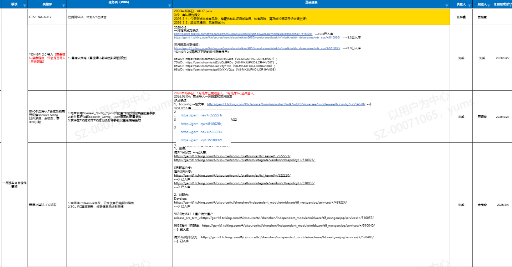
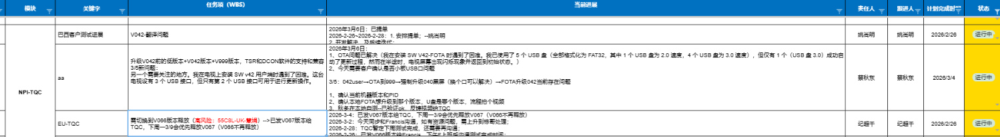

# 1.2.9 开发策略和行动项落地闭环SOP

> pageId: 583202282 | 导出时间: 2026-07-07T14:51:48.023410

# **SOP简介：**

**文档主要内容：**如何制定开发策略和行动项  以及快速、有效的落地闭环

**文档适用角色：**VPM，SPM，产品SE，领域owner

**适用项目阶段： SR4 SR5**

**环境依赖：**

**相关内容链接：**

# **开发策略和行动项落地闭环SOP**

**    项目实际运作过程中经常存在一些事项或者问题需要完成，为了达成目标经常需要会议对齐制定一下项目开发策略和具体的行动项目**

****1. 开发策略和行动项解释：****

（1）、实际项目运作过程中存在一些重点的事项 或者 问题，针对这些重点的事项或者问题 需要有一些任务闭环，在这个闭环的过程中 ，梳理出具体的闭环事项 ， 就形成开发策略 和 具体的行动项

**2. 开发策略和行动项范围 ：**

**    **（1）、开发策略和行动项 不局限于具体的某个事项和问题，只要是识别到较难、较慢 闭环 或者 较难收敛的事项 都可以针对性的制定对应的策略和行动项来高效的闭环此事项或者问题

    （2）、如果事项或者问题涉及到多方，在项目实际运作过程中如果识别到较难、较慢的闭环或者较难收敛，也可以组织会议跟具体的owner对齐 后 记录对应的开发策略和具体行动项目

    （3）、特殊的、紧急的、重要的事项，在项目实际运作过程中需要制定对应的开发策略或者行动项，便于在实际项目进行的过程中能不遗漏的、高效的跟踪闭环，举例：

                

   

              

**3. 开发策略和行动项制定过程中需要注意的事项 ****：**

**     **（1）、开发策略和行动项 的描述一定清晰，从描述上就能读懂、清晰的知道需要具体做的内容，避免二次对齐或者不理解耽误事项的进行，

     （2）、开发策略和行动项制定的过程中一定要细分，细分到每一步上，这样便于跟踪和闭环，较高的有效的方式，以9655 三月班车HBBTV 认证事项迁移为举例：

               a、中间件张震 汇总和梳理HBBTV 迁移涉及到的模块    owner:张震，完成时间：2026-XX-XX

               b、如果涉及到MTK 的代码，需要知会到MTK 上code   owner：张震，完成时间：2026-XX-XX

               c、张震梳理完成后，各个模块需要在XX 时间前完成代码的迁移、keji 编译、验证

                     1、live tv代码的迁移 并发布APK 路径  owner：王XX，完成时间：2026-XX-XX

                     2、开机向导代码的迁移 并发布APK 路径 owner：聂XX，完成时间：2026-XX-XX

               ........

      (3)、开发策略和行动项 的制定一定要有清晰的描述，具体owner ，完成时间，跟踪责任人

**4. 开发策略和行动项落地闭环：**** **

 （1）、制定开发策略和行动项后，需要有一个闭环的过程，可以在制定过程注明清楚跟进人

 （2）、跟进的方式不局限于会议上，也可以是私下跟进，但是需要有一个统一汇总和同步的地方，例会晨会、晚会上 项目组内同步进展

   (3)、策略制定后，需要有一个有效的、合理的落地闭环的检查规则和检查机制，例如bug 需要验证通过；
