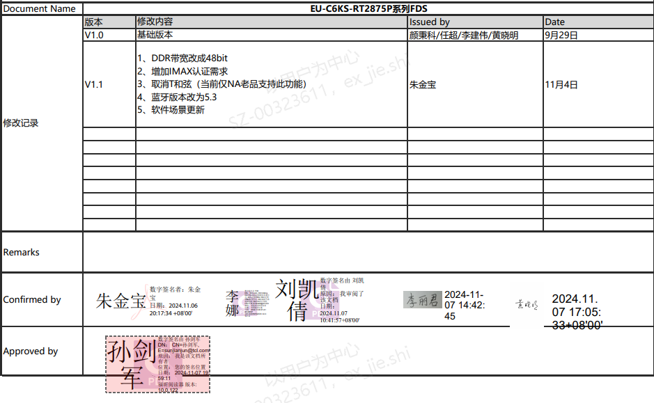
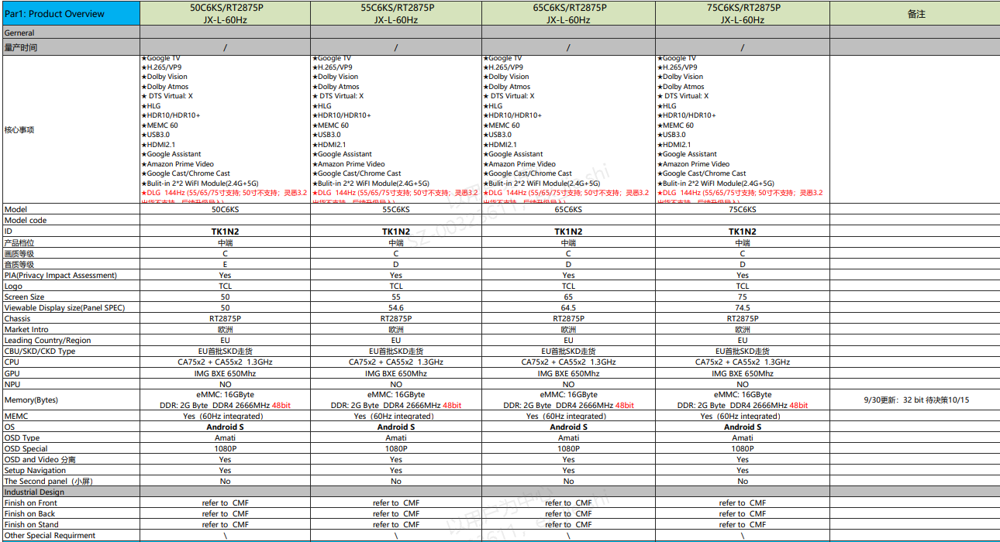
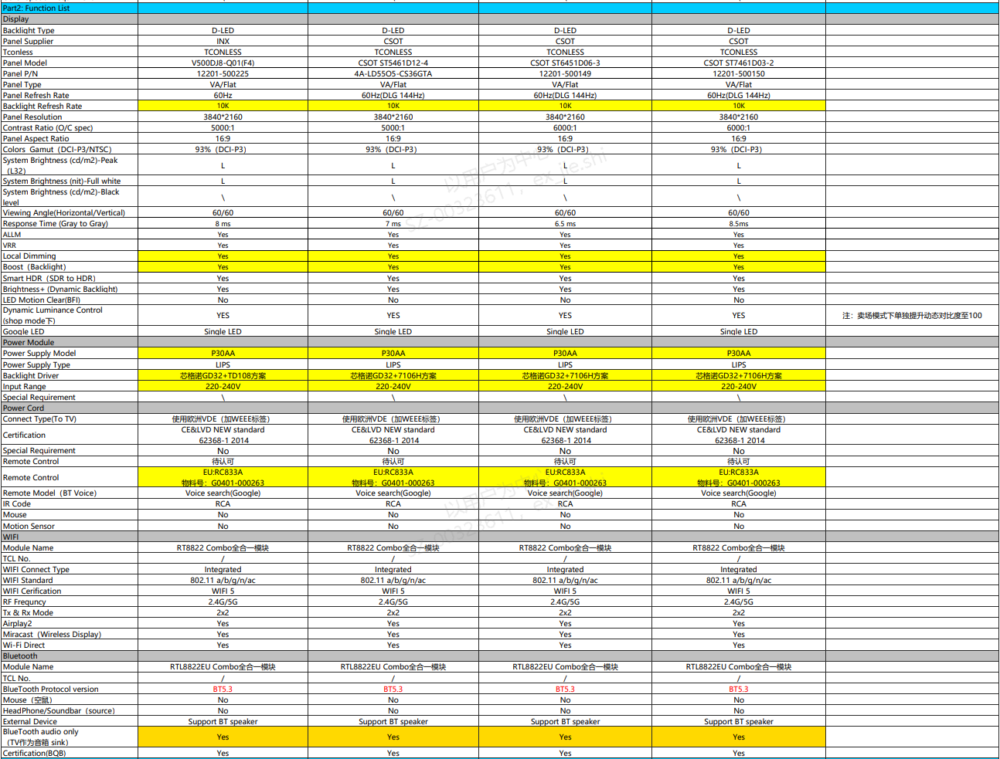
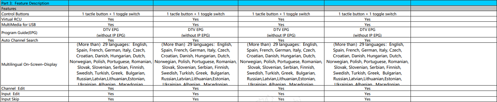
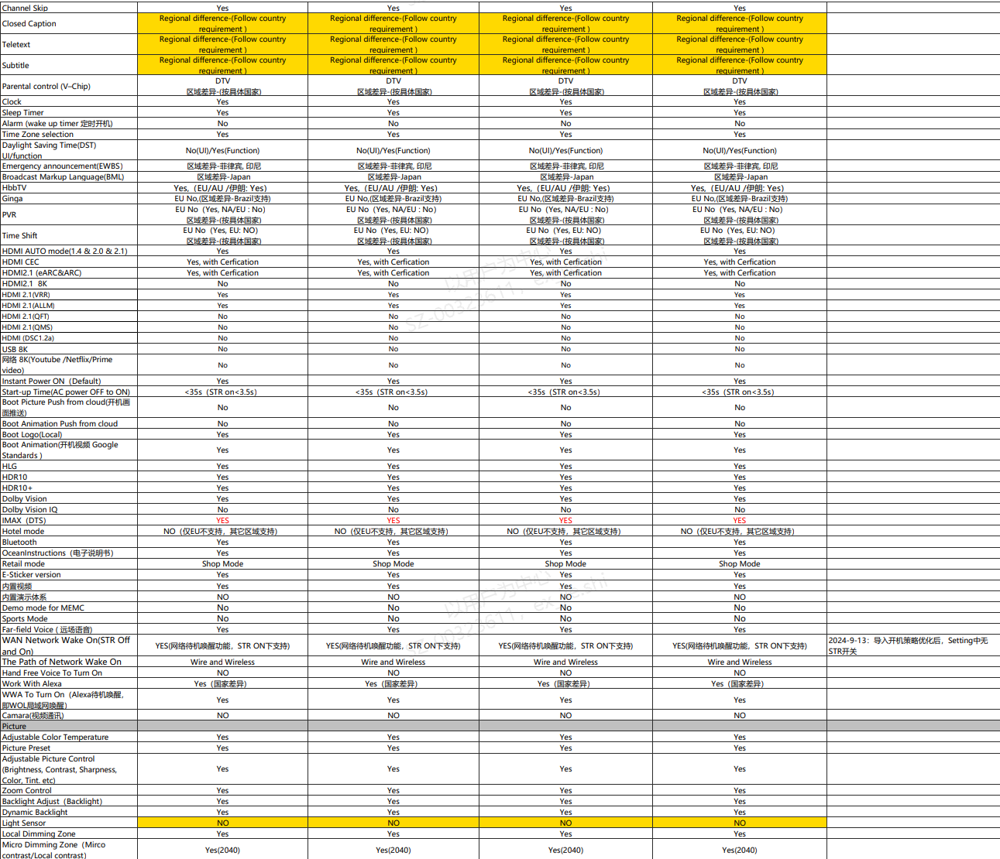
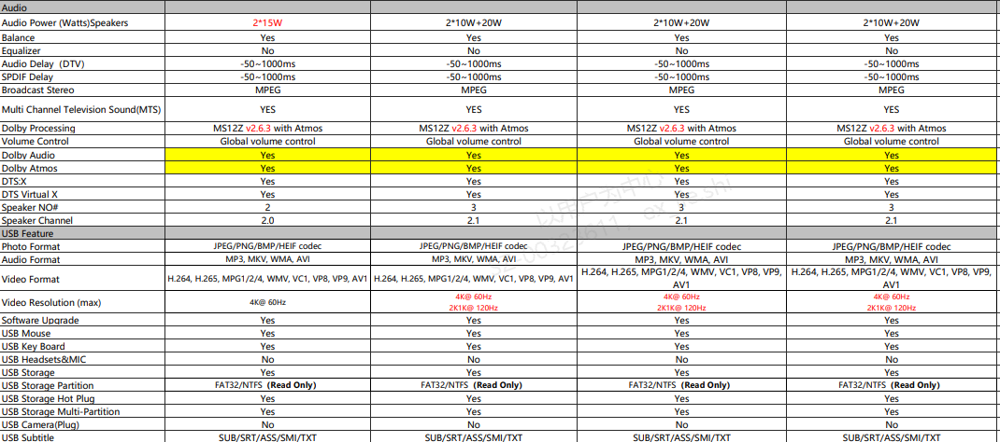
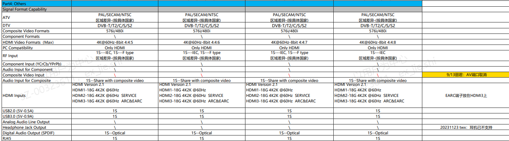
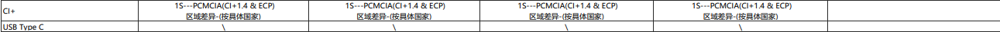

# 1.3.1 FDS确认SOP

> pageId: 597561041 | 导出时间: 2026-07-07T14:52:22.022404

# **SOP简介：**

**文档主要内容：FDS各项功能确认，识别区域、版本、新功能差异等。**

**文档适用角色：整机产品开发代表、软件BA、软件产品SE、软件项目经理、测试VPM、测试相关FDE&对应模块开发Owner**

**适用项目阶段：**Design、LR、TR

**环境依赖：**

**相关内容链接：[EU-C6KS_RT2875P_FDS_V1.1 .pdf](https://confluence.tclking.com/download/attachments/444639234/EU-C6KS_RT2875P_FDS_V1.1%20.pdf?version=1&modificationDate=1731207668000&api=v2)**

# **FDS确认SOP**

## **1. FDS 的定义与应用场景**

###      1.1 FDS 定义

           FDS（Feature Definition Specification，功能定义规格书）是从**整机产品和最终用户视角**出发，对产品功能进行**统一、清晰、可验证定义**的规格文档。
           FDS 主要回答以下问题： 

- 

- 产品**包含哪些功能**
- 各功能**如何表现**
- 功能的**边界与限制条件**
- **判定功能是否达标**的标准是什么

          对软件而言，FDS 是功能实现、配置策略及测试判定的唯一基准文档。

###       **1.2 FDS的来源**

**           ** FDS 由产品需求、硬件规格、平台能力及区域法规等多方面输入形成，用于统一定义产品功能及能力范围，并作为研发与测试的重要依据。由开发代表起草，与BA初步确认FDS的准确性后形成初版。

###       1.3 FDS 的应用场景

          FDS 在产品全生命周期中起到**统一标准与裁判依据**的作用，具体包括：

- 

- 作为产品、研发、测试、工厂及客户之间的**统一功能认知标准**
- 指导软件开发与测试用例设计
- 避免需求理解偏差，降低项目风险
- 作为功能验收与最终交付的重要依据

## **2.FDS确认的原则**

**   为确保 FDS 能够有效指导产品开发，FDS 确认需遵循以下原则：**

- FDS 中应完整描述产品功能、能力及限制条件，避免功能定义缺失或描述不清。
- FDS 中涉及的产品参数、区域信息、功能支持情况等，应与产品规划、硬件规格及软件配置保持一致。
- 对于当前软件并不支持的功能，例如正在开发的功能，必须写清楚 完成的时间 或者 需求的不同时期；
- FDS上对于涉及到软件的，不允许出现空白误导后续查看，对于FDS 中的TBD 项，原则上不允许出现，既然是TBD ，那么可以在确认好后 再更新FDS 的版本带入；
- 在check FDS时，需要逐一尺寸确认，切不可只确认一个尺寸

## **3.FDS的确认流程**

**    整体流程：确认FDS中各个功能项->输出正式FDS版本号->FDS 中各个代表签字→归档FDS**

      3.1 由BA主导，与开发代表，产品SE，VPM等逐项确认 FDS 中的功能定义、能力边界、区域差异及配置项

      3.2 开发代表修订并输出正式 FDS 版本

      3.3相关责任角色（PDT / 音画 / 开发代表 / BA）完成 FDS 签字确认

      3.4 最终归档 FDS 文档，作为后续开发与测试的依据

### **4. FDS 变更管理及落地**

   4.1 变更原则
       在 FDS 冻结后，如因产品需求调整、硬件规格变化、区域法规要求或平台能力限制等原因需要修改 FDS，应按照变更管理流程执行。未经确认的 FDS 变更不得直接在开发或测试阶段执行。

   4.2 变更确认流程
       FDS 变更需按照以下流程执行：
     （1）变更提出
           由需求提出方（如产品、BA 或相关团队）提出变更需求，并说明变更原因及影响范围。

    （2）影响评估
           相关团队（产品 SE、软件开发、测试等）对变更进行影响评估，包括开发工作量、测试范围及项目风险。

    （3）变更确认
          在相关团队达成一致后，对 FDS 进行更新并记录变更内容。

    （4）文档更新
         更新后的 FDS 需同步发布，并明确版本号及变更记录。

    4.3 变更落地要求
       在 FDS 变更确认后，应同步落实以下内容：

- 

- 软件配置（如 SID、系统参数等）同步更新
- 相关功能实现方案同步调整
- 测试用例及测试范围同步更新
- 项目相关团队同步知晓变更内容

    4.4 变更记录
        所有 FDS 变更应在文档中保留变更记录，包括变更时间、变更内容及确认人，以确保变更过程可追溯。

## **5.产品SE需要重点关注的项**

- 区域
- Memory
- 远场语音
- 光感
- 背光方案（LD和非LD）
- DTV制式：NA是否支持A3，DVB是否支持T2/S2
- CI+
- 遥控器
- 开机logo/开机动画
- 屏型号
- t-con方案
- earc 端口: earc端子在哪一路HDMI上
- T和弦
- flex-connect：MTK机芯支持
- DLG & HDMI分辨率规格
- 走货方式
- IAMX
- VRR
- ALLM
- Boost
- Smart HDR
- LED motion
- google led：远场语音谷歌等数量
- Airplay2
- Mircast
- wifi/BT型号/BT 协议版本
- 语言列表
- 卖点视频是否预装

## **6.FDS内容确认**

### **    6.1 ****产品基础信息**

**         **记录机型、平台、区域、系统版本及硬件参数等产品基础信息。

- 

-  

###  ** 6.2 ****系统与硬件能力**

                    Function List 用于定义产品在硬件与系统层面所具备的功能能力（Capability），包括显示、音频、电源、WiFi、蓝牙等基础能力。

### **6.3 ****用户侧功能特性**

       Feature Description(功能特性)用于描述产品功能在用户侧的呈现形式、交互逻辑与体验特性，明确卖点定义、UI 表现及体验一致性。这一栏主要是对用户侧功能的定义和规格。

###       ** 6.4 Others****   **

### **            ** 确认输入信号规格、接口能力及相关制式支持情况。** **

##
