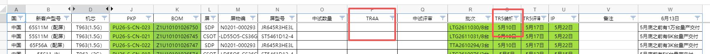

# 1.3.2 项目计划评审SOP

> pageId: 597584349 | 导出时间: 2026-07-07T14:52:26.903591

# **SOP简介：**

**文档主要内容：**根据项目需求、关键抓手等制定项目计划

**文档适用角色：**软件BA、软件产品SE、软件项目经理、测试VPM、测试相关FDE&对应模块开发Owner

**适用项目阶段：**Design、LR、TR

**环境依赖：**

**相关内容链接：**

# **项目计划评审SOP**

**1、什么是项目计划评审？**

**      **项目计划评审，是指在项目开始或关键阶段，由相关人员一起审查和确认项目计划是否合理、可执行的一种会议或流程。

**2、项目类型分类**

**1）班车/火车/机芯leading项目**

**      一般由软件SPM主导各专业输出立项报告，立项报告示例：[https://teamwork.getech.cn/shimo-h5/shimo-edit/d5f2b0c2ac754a5d837d8817e7700444](https://teamwork.getech.cn/shimo-h5/shimo-edit/d5f2b0c2ac754a5d837d8817e7700444)**

**      项目计划示例：**

    **

**      **那么产品SE须重点关注以下相关方面事宜：

- 新立项项目是基于哪个机型派生？差异点是什么？画质/电声等参数是否需要重调？
- 需与VPM确认SQA测试是否申请整机？是否需要主板？各多少台/块？一般情况下，在全新配置的情况下，需整机一台，主板2块。
- 需要与BA确认是否需要新建clienttype？或者可共用哪个clienttype？
- 需要与BA确认是否有新增加软件功能配置项？比如开机LOGO、默认数据库、预置节目、IMAX图效、预装应用、电子卡牌等等。
- 需要明确确定TR4A/TR5的装机时间，这里涉及到试产软件预抄写的提供，常规情况下，预抄写时间至少需要预留2-3天时间。
- 仔细阅读FDS文档，避免软件配置错误，FDS确认指导见：
- 一般NPI派生项目时间为在研发终版参数提交完成后2周内完成项目释放，在2周内需完成SQA测试释放、主观释放，所以在研发终版参数提交完成之后，要及时安排版本发布提测
- 根据项目的修改提交，确认是发大版本还是屏参分离版本(无人无码版本)，若涉及系统的修改，那就得发大版本，若只是研发参数修改，则优先发屏参分离版本(无人无码版本)

**3）硬件二资源器件导入项目**

**      硬件二资源器件导入项目立项会一般由PMO拉起，开发代表描述项目的基本信息，软件是参与方。涉及软件适配的二资源项目一般包括导入新屏、PMIC、功放、EMMC、DDR等**

**      **那么产品SE须重点关注以下相关方面事宜：

- 导入的二资源是否是成熟方案？即是否在其它机芯已批量量产过了。
- 若涉及软件适配的情况下，那就需由预研组团队承接适配，并且由预研团队提测、BUG跟进以及评审释放，只有预研释放后，才可导入NPI。导入NPI规则：在能满足项目释放时间节点的情况下，优先选择跟随班车/火车导入；无法满足项目释放要求的情况下，才可直接导入量产分支。
- 是否需要迭代已量产的机器？若需要的话，那么迭代范围(具体BOM)需明确清楚，以及主观检测策略，还是只是从新品开始导入？
- 需清楚小PP试产计划节点以及对应的机型BOM，以便优先提测相应的机型，保证小PP试产时软件已处于释放状态并PDM上已迭代完成。

**4）LMT机芯维护项目**

**      **LMT机芯维护项目是指项目生命周期处于后期维护阶段的所有机芯项目。****

****      LMT机芯维护项目特点：1）成熟稳定；2）大批量出货；3）导入新需求/功能少等****

****      ****那么产品SE须重点关注以下相关方面事宜：

- 每周review一次在线质量指标，看板：[https://taijibi.tcl.com/webroot/decision#/?activeTab=bf2a4e93-7ef7-40b4-aa73-06a45a645fd0](https://taijibi.tcl.com/webroot/decision#/?activeTab=bf2a4e93-7ef7-40b4-aa73-06a45a645fd0)
- 每周review一次在线质量是否有焦点问题发生，问题筛选平台：[https://tm.tclking.com/logAnalysis/exceptionStack](https://tm.tclking.com/logAnalysis/exceptionStack)
- 每周关注售后问题，若有新建，及时响应，拉通开发排查，避免批量问题
- 若存在安全漏洞/安全合规/售后严重问题/NPS改善/新需求等需对市场机器进行OTA时，那么在进行OTA时需特别注意以下事项：

        --在发版本前，需先review市场上量最大的版本或最近期量大的版本的在线质量指标，确定指标无异常；

        --确定上一步梳理的版本后到现在的所有修改内容，评估是否存在影响在线质量的修改；

        --在版本发布提测时，应优先选择量大的PID，且首批提测时，PID数量少些；在进行OTA推送升级时，每天需监控在线质量、售后问题以及版本覆盖率

**     **

**      **
