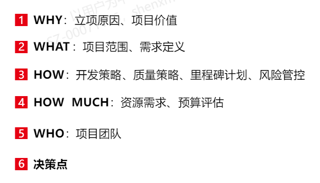
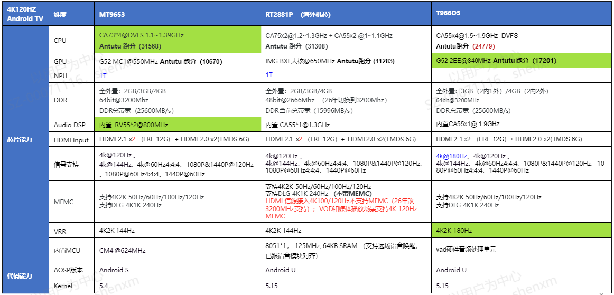
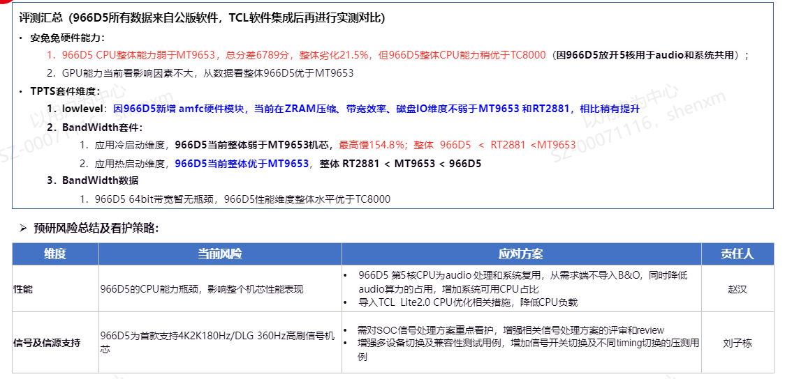
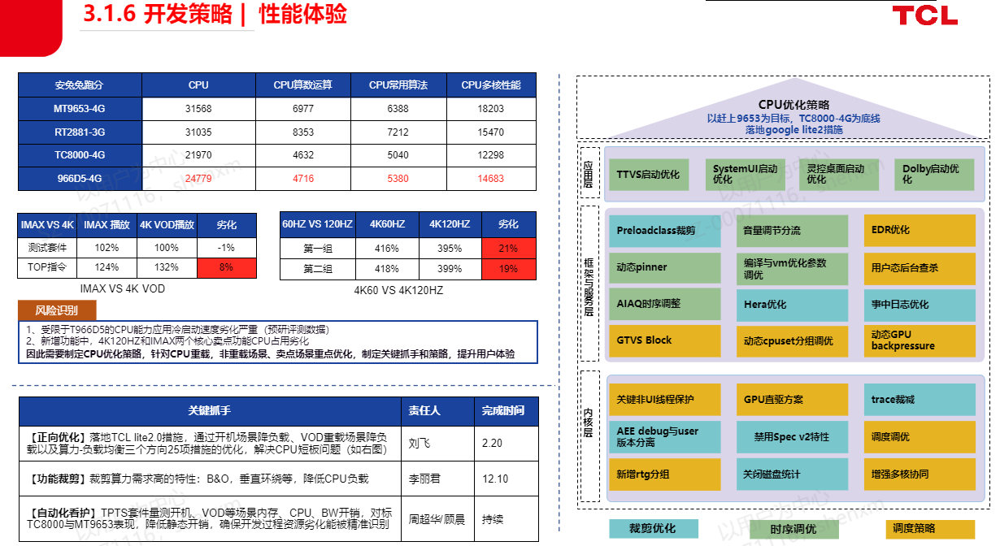

# 1.3.3 开发策略及立项报告SOP

> pageId: 591318610 | 导出时间: 2026-07-07T14:52:29.868523

# **SOP简介：**

**文档主要内容：**从整机的维度输出整机软件的整体技术设计方案

**文档适用角色：**整机开发代表、预研SE、软件经理、软件BA、软件项目经理、软件产品SE、软件认证经理、各模块开发Owner

**适用项目阶段：**Design、LR、TR

**环境依赖：**

**相关内容链接：**

**T966D5立项报告：[https://teamwork.getech.cn/shimo-h5/shimo-edit/077dece5548440fe952b23acd1f0bff2](https://teamwork.getech.cn/shimo-h5/shimo-edit/077dece5548440fe952b23acd1f0bff2)**

# **一、撰写思路**

****

## **1、立项原因和项目价值**

立项原因一般是由软件运作代表来写，新机芯立项由产品线决策，决策原因从竞争力或成本角度等出发；

写清楚由哪条产品线和区域leading，以上信息产品SE了解即可，对于产品SE来说最关注的点就是**量产时间。**

## **2、机芯能力评估分析**

新SOC方案的规格和架构（如CPU能力、GPU能力、APU算力、内存架构方案等）及跟上一代产品的对标差异，由预研SE会输出能力评估分析，一般包含以下几个类型：（以T966D5为例）

**整体芯片硬件能力汇总，CPU能力、Audio DSP算力，GPU等硬件维度对比上一代产品机芯，突出新机芯优势以及瓶颈部分**

****

1、安兔兔跑分计算CPU，GPU等维度客观跑分情况辅助评估能力

2、通过TPTS测试套件，重点测试重载场景的启动速度等指标进一步评估机芯能力

最终输出机芯的整体能力评估，风险点，以及NPI应对措施

**对于产品SE来说，机芯能力参数非常重要，制定项目的关键抓手主要围绕着机芯能力缺陷来考虑，需要通过项目后期的优化来解决或者追平差距，交付有竞争力的产品。**

## **2、项目范围和需求定义**

项目范围与需求定义这部分由BA输出，产品SE需要重点关注两个点：

1、同一家SOC厂商，此次新项目对于这家SOC厂商新增了哪些需求来制定关键抓手。

2、该SOC厂商其他的机芯之前适配过的功能，结合上一章节机芯预研评估的瓶颈，识别出关键抓手和高风险事项。

注：针对超出机芯能力范围之外的需求，在项目立项之初需要与BA一起讨论，跟外部谈能否去掉功能。

## **3、开发策略**

### 开发策略—总览

1、呈现仓库策略示意图，目的是能够清晰的知道项目的基础是什么

2、呈现所包含的安卓版本、TROM版本、灵悉版本、中间件版本、kernel版本、DFM等关键版本信息

2、汇总后续页面的关键抓手

### 开发策略—分支策略

项目分支策略示意图画出来，从什么时候拉出预研分支，再到预研结束的时间，再到回归主干的时间，最后拉出量产分支。

### **开发策略---关键抓手（挑核心功能重点方案写，一般写4~6个比较合适）**

产品SE 需要熟练掌握本项目SOC方案的规格和架构（如CPU能力、GPU能力、APU算力、内存架构方案等）及跟上一代产品的对标差异，评估SOC方案是否能满足关键功能需求和技术方案的需求；

呈现出本项目跟上一代产品（项目）差异的需求/功能的设计方案、核心功能的设计方案，以及实现这些功能/需求 所使用的方法/思路

呈现内容包含：核心功能的设计框架，使用的方法和思路，高风险事项的应对策略，如：

后面就是里程碑计划和项目风险，主要有项目经理来写，产品SE可参与撰写，针对高风险事项提供应对措施

### 其他关键事项

1、S类项目的整体方案设计需要部门长和总监评审；
2、评审结论要包含责任人的具体工作和时间节点，软件项目经理跟进闭环；
3、功能比较复杂的可组织与BA评估是否分阶段实现和交付；
4、设计方案要考虑兼容性、异常处理、稳定性、性能和用户体验等
