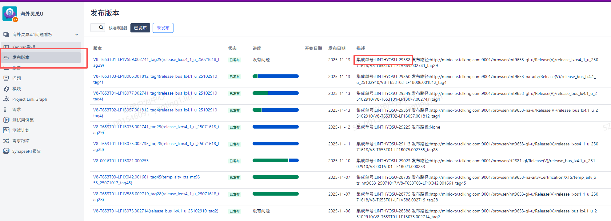
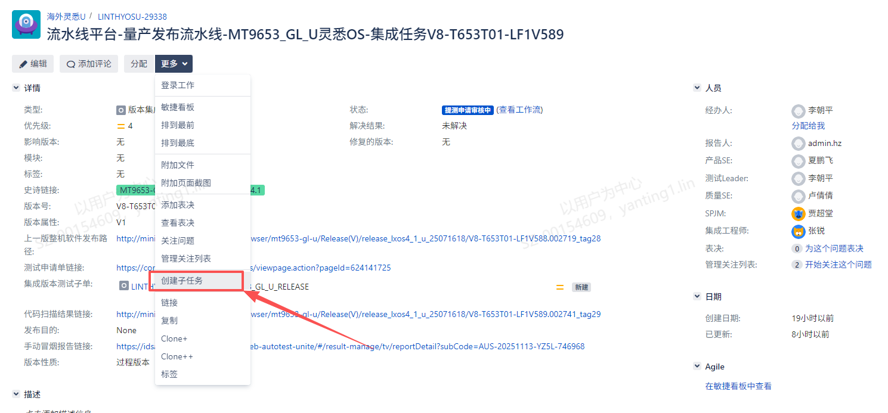
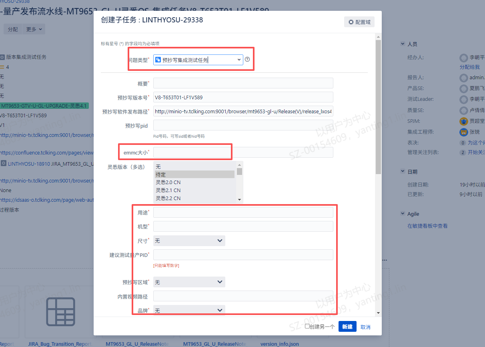
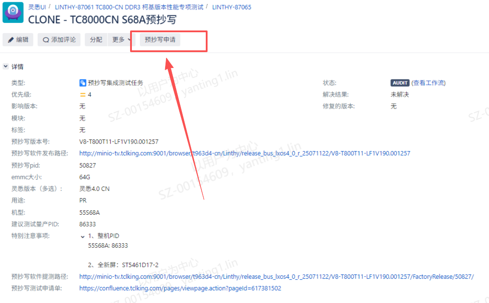

# 1.4.2 预抄写方案设计SOP

> pageId: 604427741 | 导出时间: 2026-07-07T14:52:57.338363

# **SOP简介：**

**文档主要内容：制定预抄写软件配置方案，指导软件产品SE、集成工程师CIE制作预抄写软件。**

**文档适用角色：软件产品SE、集成工程师CIE**

**适用项目阶段：所有**

**相关内容链接：**

# **一、预抄写软件**

## **1.1 预抄写软件**

预抄写软件是面向工厂生产的软件，主要用于**试产**与**量产 **EMMC抄写。预抄写软件制作要根据不同的机芯、机型、区域等维度的要求， 给出满足基本量产要求的**默认PID配置**，再以工序最少、最高效的原则， 按需完成抄写KEY、调试DEMURA等工序，满足试产、量产。为满足预抄写软件以上要求， 需要给出预抄写软件最优解决方案。

## **1.2 预抄写方案如何设计**

预抄写方案设计在不同阶段， 需要输出不同的内容。 在项目**预研阶段**，需要**预研SE**与**系统工程师 **完成预抄写制作方案设计、实现与验证， 输出预抄写方案设计文档， **预研SE**需要主导预抄写流水线搭建。

在**NPI阶段**，** 产品SE**需要根据产品规划、项目规划、FDS产品配置差异表， 对不同制式、机型、区域等维度的要求，完成**预抄写软件PID配置**的制定， 输出预抄写软件配置的说明文档。

由于海外MT9653 Global项目覆盖**全产品线、全品牌、几乎海外全区域（NA/JP除外）**，下面以MT9653 Global项目为例， 分两部分介绍：预抄写软件制作，预抄写软件配置制定。

# **二、预抄写软件制作**

在**项目预研阶段**， **系统工程师**需要根据预抄写预制状态的详细要求， 如**预制PID**、**预制工厂频道**、**默认开关机模式**、**内置视频要求**等维度， 完成方案设计、实现与验证， **预研SE**需要主导预抄写流水线搭建。**产品SE**需要了解预抄写预制状态的要求， 根据项目实际需求检查， 或发起变更， 同时要熟悉预抄写流水线流程，** 熟悉预抄写的制作与提测**。

## **2.1  预抄写预置状态要求**

| 序号 | 预制需求 | 说明 | MT9653是否需要 |
| --- | --- | --- | --- |
| 1 | 根据项目需求预置PID |  | 是 |
| 2 | Power on mode为ON | 上电模式存储位置 | 是 |
| 3 | 预置P模式 | 打开P模式 | 是 |
| 4 | P模式 判断条件 | 0&空为非p模式  1为p模式 | 是 |
| 5 | 预置工厂频道 |  | 是 |
| 6 | 开机信源为TV | 工厂接入信号测试图像声音相关 | 是 |
| 7 | auto format为OFF | 生产中默认全屏显示 | 是 |
| 8 | 自动音量为OFF | 不对生产测试音频端口电平造成影响 | 是 |
| 9 | 夜间模式为OFF |  |  |
| 10 | 音频输出格式默认PCM | 默认走功放解码 | 是 |
| 11 | 远场语音打开 | 远场麦克风测试 | 是 |
| 12 | T-Link为ON | 默认打开CEC | 否 |
| 13 | WiFi为OFF | 默认关闭WIFI | 是 |
| 14 |  |  | 否 |
| 15 |  | 串口打开,工厂生产调试命令发送 | 是 |
| 16 | 例如：T653.cer |  | 否 |

## **2.2  预抄写软件制作**

详细参考见： 

### 2.2.1 查询主版本集成单号

****

### **2.2.2 创建子任务**

****

### **2.2.3 选择"预抄写集成测试任务"子任务**

- 

- 预抄写pid（必填）：数字框，

1. MT9653_GL：项目可不填写，会自动根据参数匹配，[预抄写pid数据对照表](https://teamwork.getech.cn/shimo-h5/shimo-edit/0472fa5c5e774a2b8f6478ed20d8f289?accessToken=ut_6vbKyXwG7nx7hKDDJuiZfzS280o97l4mZMV)
2. 除MT9653_GL必填
- emmc大小（必填）：文本框，8GB\16GB\32GB\64GB\128GB
- 用途（必填）：文本框，试产/量产等
- 机型（必填）：文本框
- 尺寸（必填）：下拉框，50/55/65/75/85/98等
- 建议测试量产PID（必填）：数字框，实际需要量产的PID
- 预抄写区域（必填）：下拉框，EU/ NA/ AP/ AU/ CA/ LA/ HK/ CN等
- 内置视频路径（非必填）：文本框，强制Ftp路径
- 品牌（必填）：TCL/iFFALON/ROWA

### **2.2.4 点击”预抄写申请“，启动流水线**

流水线启动后会备注流水线链接，点击查看进度

# **三、预抄写软件PID配置**

产品SE做预抄写软件PID配置，需**遵循"兼容性、最少最全"原则**，以FDS产品配置信息为准， 根据不同机型软件、硬件差异， 配置不同的预抄写软件**SID（与制式等软件配置绑定）**、**HID（与机型等硬件配置绑定）**， 根据**PID计算公式**， 完成预抄写软件PID配置。同样， 以MT9653 Global为例介绍。

## **3.1 预抄写配置考虑维度**

| 维度 | 差异影响 |
| --- | --- |
| **制式** | ATSC/DVB/ISDB/DTMB 决定频点数据库，影响工厂搜台测试 |
| **品牌** | TCL/iFFALCON/ROWA 内置视频路径与素材不同 |
| **EMMC 大小** | 32G/64G 决定 userdata 分区大小；支持 EMMC 自适应的项目统一为一个配置 |
| **内置视频** | 卖场演示与工厂测试素材按机型/国家区分（如 RU/西北亚需 NO_Olympic） |
| **光感** | 预抄写统一关闭（lightsensor=0），新项目不再因光感差异新增配置 |
| **LDM** | LD/NOLD 背光驱动方案不同，影响画质参数 |
| **功放** | 型号/个数影响音频参数，预抄写 HID 一般配置六路/八路以覆盖全部 |
| **DAK KEY** | Fire TV 区域绑定，影响 SID 选取 |

## **3.2 预抄写软件PID配置**

预抄写软件PID的配置， 根据**项目不同阶段**分两种情况：对于新项目（机芯）还**未进入量产**阶段、无历史配置，新机型的配置需求；对于项目（机芯）**已进入量产**阶段、有历史配置，新机型的配置需求。我们定义为：**新项目新机型，同项目新机型。 完成配置， 输出预抄写软件PID配置说明文档。**

### **3.2.1 新项目新机型**
根据产品规划、项目规划、FDS产品配置差异，统一做预抄写软件配置，以制式不同分组配置（非唯一分组依据， 如Fire TV 以DAK KEY分组 ），制定预抄写软件PID配置方案。

### 分组说明：

**1、预抄写配置分组：**一般分5个组， EU（欧洲）DVB**制式配置最全**，将EU/AP/RU/AU/CO/ME/TW/IN分为一组， 其他同理， CA组CA/NA/KR/MZ/MX， LA组LA/BR/PH， 香港HK， 日本JP

**2、特殊情况说明：**菲律宾（PH）划为LA，韩国（KR）划归为CA， 哥伦比亚ClientType为LA， 西北亚（如俄罗斯）要求不能有**奥运素材**要注意内置视频选择

3、**三合一制式：**支持三合一制式的项目，根据对应项目实际需求定义为准（如MT9653 GL是以**中美CA**做）， 将巴拿马，委内瑞拉划入

| 地区 | 制式 |
| --- | --- |
| EU/AP/RU/AU/CO/ME/TW/IN** **  **欧洲/亚太/俄罗斯/澳洲/哥伦比亚/中东非/台湾/印度** | DVB-T, DVB-C, DVB-T2, DVB-S, DVB-S2 |
| CA/NA/KR/MX**中美/北美/韩国/墨西哥** | ATSC-T, ATSC-C |
| LA/BR/AR/PH**泛拉美/巴西/阿根廷/菲律宾** | ISDB-T, ISDB-C |
| HK  **香港** | DTMB |
| JP  **日本** | ISDB-T |

### 3.2.2 同项目新机型
项目已量产，新机型的配置需求， 可根据下表做不同的策略选择

| 场景 | 策略 |
| --- | --- |
| 复用历史配置 | 根据FDS产品配置差异表， 对照 **3.1 预抄写软件配置考虑维度，**对比历史配置， 直接复用配置，DFM/试产阶段修正 |
| 复制量产配置 | 选择最全功能配置的量产PID复制，新增PID配置，DFM/试产阶段修正 |

## **3.3 预抄写软件PID配置评审**
