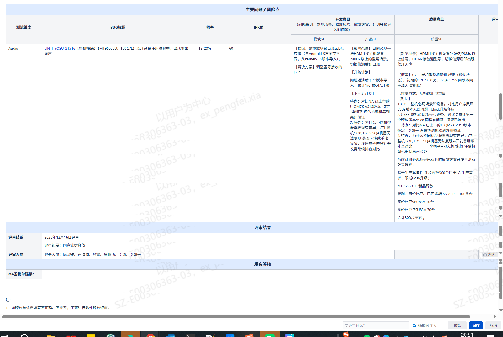
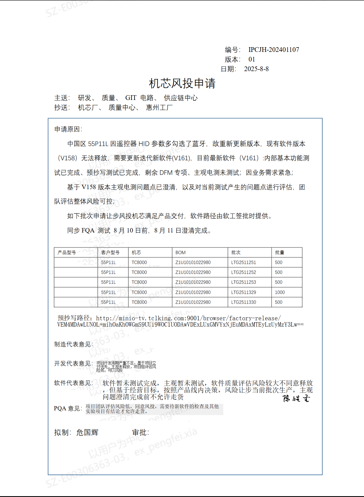
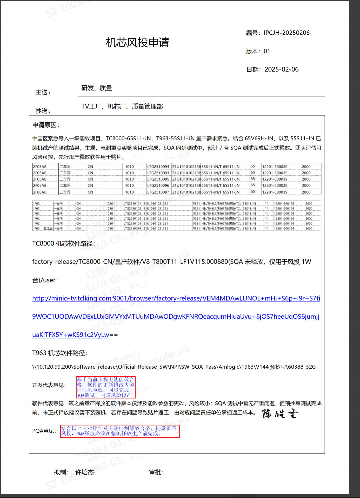

# 1.5.1 风险释放管理 SOP

> pageId: 599937821 | 导出时间: 2026-07-07T14:53:19.790094

# 1.5.1 风险释放管理 SOP

**适用角色：** 大产品SE（机芯软件负责人）、小产品SE（派生软件负责人）
**适用项目阶段：** SR3，SR4，SR5，SR6

**环境依赖：**

**1.需要OA释放单签批权限**

**2.jira访问权限**

**相关内容链接：**

---

## 一、什么是风险释放，哪些场景需要风险释放

### 1. 什么是风险释放

        风险释放可以分为两种情况：

        第一种情况就是我们软件在释放过程中，当遇到可能影响项目进度、质量或交付的潜在问题时，通过全面的风险识别、评估和决策，在充分了解并可控风险影响的前提下，有条件地允许软件进入下一阶段（如测试、试产或量产）的一种管理行为。**针对jira问题**

        第二种情况是指由于时间原因，软件需要紧急生产，但是一些测试项（不阻塞量产的认证项目， xts），一些依赖外部的结论没有确定（内置视频，esitcker是否更新等）以及一些功能没有按时达成的情况，需要组织评审，**进行风投**。

**备注：风投的定义：1.测试时间短，测试没有完成相关测试   2.软件内部已经ready，依赖外部的结论没有及时给出  3.一些规划的功能在规定时间内没有完成**

风险释放并不是对问题的“忽略”，而是基于当前业务节奏、项目目标和资源约束，在“可控、可追溯、可兜底”的前提下，通过风险评估与管理策略进行的理性取舍。

### 2. 哪些场景需要风险释放

典型需要进行风险释放的场景包括但不限于：

问题风险释放场景：

1. 
**SQA 遗留问题无法在当前节点完全关闭**
- SQA 提出的部分缺陷/问题在当前里程碑之前无法全部修复；
- 经评估不影响核心功能、安全和关键体验，且有规避措施或替代方案；
- 需通过风险释放形式，允许继续后续阶段（测试/试产/量产等）。包含这些问题：

 风投场景：

1. 
**生产计划紧急但软件未完成正式释放**
- 软件尚未完成正式“试产释放”或“量产释放”；
- 工厂生产计划紧急，为保证排产和供货，需要基于当前软件版本进行生产；
- 需对当前软件成熟度进行评估，识别风险点并采取必要监控与兜底方案。

2. 
**生产/现场局部调试问题，短期无法出包修复**
- 软件已释放并用于生产或现场，但在特定环境或特定 SKDID 上出现局部问题；
- 问题只影响局部流程、特定批次或特定配置，不影响整体可用性；
- 软件团队短期内无法迭代新版本修复，只能通过工艺规避、操作规程优化等方式暂时绕过。

3. 
**需求或方案变更导致的阶段性不一致**
- 需求临时变更或新增，导致部分功能与原计划不一致；
- 变更为满足市场/客户/竞品需要，具有时效性；
- 允许在部分功能体验不完全达标的前提下进行阶段性释放。

在以上所有场景下，均需要通过“风险识别—评估—决策—记录—跟踪”的规范流程执行风险释放，而不是口头约定或个人判断。

---

## 二、风险释放需要注意哪些方面

风险释放属于“高风险管理活动”，在执行过程中需重点关注以下方面，确保风险可控且全程可追溯：

### 1. 风险识别和影响评估的全面性

1. 
从多维度识别风险： - 功能影响：是否影响主流程、关键功能、合规性要求； - 质量影响：是否可能引入明显缺陷、崩溃、数据错误等； - 用户体验：是否会带来明显体验下降或客户投诉风险； - 生产影响：是否影响测试通过率、返工率、产能及交付进度； - 售后与维护：是否增加维修成本、换机风险、OTA 风险等。

2. 
量化评估风险等级： - 评估问题发生概率（高/中/低）； - 评估问题影响范围（单型号/部分型号/全型号/全区域）； - 评估影响严重度（致命/高/中/低）。

对于“高概率 + 高影响”的风险，一般不建议通过风险释放方式直接放行，如确有必要须报更高层级（如部门长、VPM、质量负责人）集体决策并留痕。

### 2. 数据与历史案例的支撑

尤其在生产风投类场景，必须做到“有据可依”：

- 对比以往量产/试产数据，评估当前问题在历史项目中的表现；
- 分析该项测试/问题在生产过程中的实际出问题概率；
- 引用同类问题的经验案例，明确历史上采取过哪些措施及效果如何；
- 在缺乏数据支撑时，应采取更保守的策略，宁可延后也避免不可控风险。

### 3. 多方拉通与共识决策

风险释放禁止“单点拍板”。至少需确保以下角色参与或知情：

- 产品 SE（大产品/小产品）：发起与主导评估；
- 质量相关角色：PQA / SQA / 质量 SE；
- 项目管理：SPM / VPM；
- 软件负责人：产品软件负责人、软件部门长（视风险级别）；
- 工厂相关：计划、生产、工艺、测试（生产风投场景）。

核心要求： - 明确每方的意见及主要顾虑； - 对争议点进行充分讨论； - 最终形成清晰结论，并通过邮件、Confluence 或会议纪要留存。

### 4. 责任与边界的明确

风险释放前，必须明确：

- 风险点及成因：问题来源、触发条件、影响模块；
- 风险适用范围：涉及的机型、批次、阶段；
- 风险规避措施：临时规避方案、操作注意事项；
- 责任主体：由哪个部门/角色负责最终收敛及问题关闭；
- 责任边界：若风险导致后续问题，如何判责及处理路径。

### 5. 应急预案与回滚方案

任何风险释放都必须有“兜底方案”和“回滚路径”：

- 发现问题恶化时的应急处理流程（停线、停发、回退版本等）；
- 现场支持和资源保障安排；
- 必要时的版本回滚策略和数据恢复方案；
- 客户侧问题暴露时的沟通口径和处理流程。

没有应急预案的风险释放，一律视为不合规。

---

## 三、风险释放处理流程

### 1. 风险释放发起

####       1.1 软件问题的风险释放

            涉及到软件问题的风险释放（包括中心内部和外部），由SPM发起。风险问题需要备注在释放单上，组织质量SE，PQA，产品SE，问题owner，问题所在部门部门长，若还未有结论，需要上升到总监和王老师。

#### 1.2 风投

        风投需要看问题归属，如果问题是软件造成，则由软件SPM发起，若是研发操作则由PMO发起。

### 2. 多方拉通与决策

根据风险等级选择决策机制：

- 
**一般风险释放**（中低风险，影响范围有限）：
由产品 SE、质量 SE、工厂代表和项目管理共同评估后，由产品线负责人或项目负责人批准；

- 
**重大风险释放**（高风险、影响全型号/关键客户/大规模生产）：
必须拉通 SPM、VPM、质量负责人、软件部门长等召开专题评审会，评审通过后方可执行。

决策结论需在 Confluence 或邮件中固化，内容包括： - 是否同意风险释放； - 适用范围和期限（如：仅限某一批次/某一时间段）； - 必须执行的前置条件和监控要求； - 明确的责任人和后续检查节点。

### 3. 执行与在线监控

风险释放执行过程中，应做到“放得出、盯得住”：

- 明确执行开始和结束时间（或条件）；
- 在工厂/现场设置必要的监控点，如抽检频率提高、专线专人盯产等；
- 使用在线质量监控平台或手工记录关键指标（不良率、返工率、投诉等）；
- 一旦指标异常或风险超出预期，及时启动应急预案，必要时中止风险释放。

---

## 四、风险释放后的闭环措施

风险释放必须形成闭环管理，不能长期依赖“风投”维持交付。

### 1. 软件问题根因分析与问题修复

- 产品 SE 组织研发、测试、质量等进行根因分析；
- 明确从技术方案、实现方式、流程机制等层面的真正原因；
- 形成修复方案和迭代计划，纳入正常需求/缺陷管理系统；
- 对承诺时间节点进行跟踪，确保承诺的问题按时关闭。

### 2. 风险释放效果评估

在风险释放结束后，需要评估：

- 实际是否发生预估范围内的问题；
- 临时规避措施是否有效、是否给生产/现场带来额外负担；
- 线上监控数据是否在可接受范围；
- 是否出现预期之外的连带问题。

根据评估结果，判断： - 当前风险是否已经通过正式版本/正式方案完全消除； - 是否还存在残余风险，需要继续采取其他措施； - 后续类似场景是否仍可采用同类风险释放模式。

### 3. 经验沉淀与流程优化（风险释放软件问题）

- 将本次风险释放的背景、过程、决策点、结果在 Confluence 形成记录；
- 若为高价值经验，可沉淀为模板或纳入团队培训内容；
- 若暴露出流程、机制上的问题（如评估不充分、监控缺失），需推动优化相关 SOP 或检查表。

### 4. 对外沟通与记录归档

- 如风险释放过程中对客户/业务侧产生了影响，需要形成统一的对外沟通口径；
- 对所有批准记录、监控数据、复盘结论进行归档，确保后续可追溯；
- 在项目总结时，对多次风险释放的情况进行整体回顾，防止形成“常态化风投”。

---

通过以上规范流程和要求，确保风险释放在“可控、透明、可追溯”的前提下进行，在保障交付节奏的同时，将质量和客户风险降到可接受范围。
