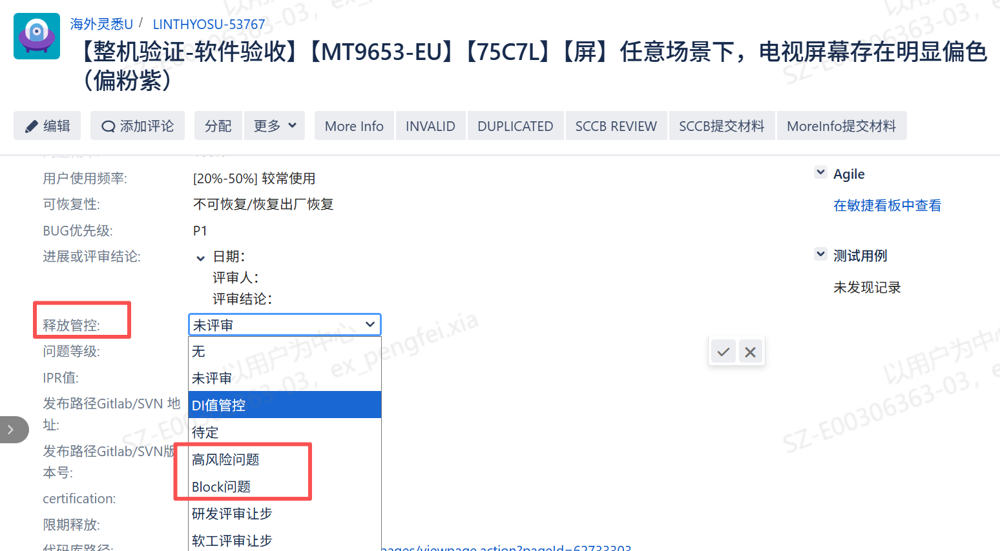
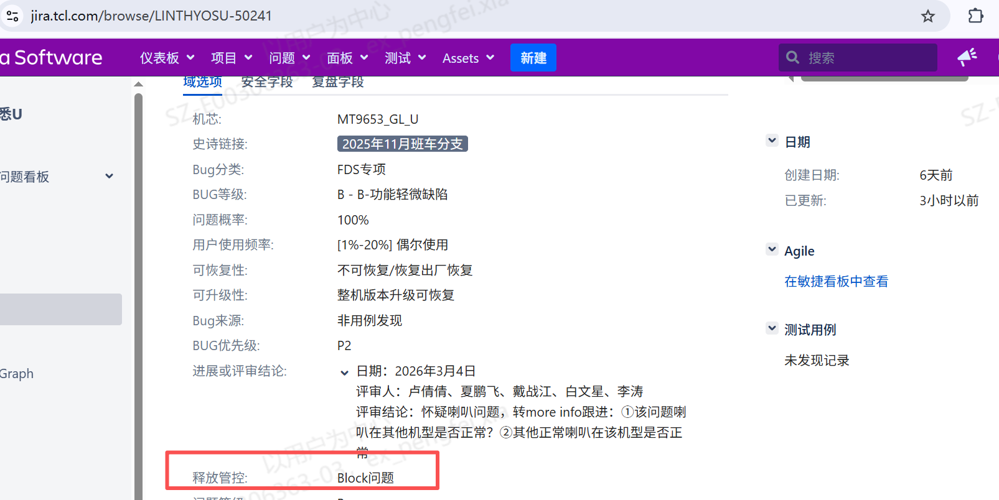

# 1.5.2 必解问题梳理SOP

> pageId: 599937784 | 导出时间: 2026-07-07T14:53:21.361480

# **SOP简介：**

**文档主要内容：在 SR3–SR6 各阶段，统一 Block/必解问题识别口径、处理流程与闭环标准，确保过点/Release 风险可控、可追溯。**

**文档适用角色：**大产品SE（机芯软件负责人）& 小产品SE（派生软件负责人）

**适用项目阶段：**SR3，SR4，SR5，SR6

**环境依赖：具备 Jira 访问权限；项目已建立统一缺陷看板/过滤器（建议按版本、阶段、标签聚合）**

**相关内容链接：**

****

# **必解问题梳理SOP**

# **1. 必解问题定义**

    满足以下任一条，可判定为 **Block（必解）**：

- 阻塞关键测试/验证（全功能、认证、TQC、量产验证等无法开展或无法通过）
- 导致用户“不可用/不可恢复/高风险”体验（崩溃、死机、黑屏、卡死、持续弹窗等）
- 影响量产/售后/合规/品牌/资金权益等高风险场景
- 明显性能/稳定性劣化超阈值且可复现、影响范围明确

建议：Jira 中统一使用标签：mustfix（必解）+ blocker_stage_SR4（阶段标识）+ risk_high（风险等级）等，避免仅靠口头共识。

例如：

**特别说明：一般情况下jira单IPR值大于68时需要产品SE重点确认，是否会成为block。 IPR小于或等于68默认为低风险问题，可以减少投入，默认可以ID管控。质量SE会对IPR小于68的问题进行梳理，确认出哪些需要开发澄清的。（产品SE或者SPM可以在释放前提醒质量SE对这类问题进行筛选）**

# **2.各阶段block问题识别**

##     **2.1 SR3 阶段（能力导入 & 试产准备风险）**

**     识别目标**：避免“功能不齐导致全功能测试/试产无法推进”。
**     Block 判定项（满足即入必解池）**：

1. **阻塞全功能测试**

- 功能未实现/关键需求未导入/依赖版本不具备
- 关键链路用例无法跑通（开机、输入源、网络、UI主路径等）

**      2.影响工厂试产/生产适应性**

- PID 切换、Key 烧写、SKDID、产测工具链、升级烧录流程异常
- 影响产线节拍/误判/无法下线的缺陷

**       SR3 必出产物**

- 《SR3 必解问题列表》：问题ID、模块、影响点、是否阻塞测试/试产、Owner、计划、风险说明

## **2.2 SR4 / SR5 阶段（稳定性、体验与准入要求）**

**识别目标**：保证“可用、可卖、可认证、可量产”。
**Block 判定项（建议归类管理，便于评审）**：

A. **系统/关键应用不可用**

- 系统/模块无法启动、异常退出、功能完全失效
- 例：无法搜台、CA无效、Launcher不显示、VOD无法播放、关键应用不可运行

B. **严重影响用户使用（主路径不可操作）**

- 崩溃/卡死/黑屏/花屏/重启/死机/持续卡顿/不响应遥控
- 用户不可终止的错误状态（持续弹窗等）

C. **严重画质问题**

- 水印、花屏、严重拖尾、闪屏等影响观感且可复现

D. **用户数据/资金权益风险**

- 数据丢失、扣费异常、会员失效、权益受损

E. **重要参数/配置损坏且不可恢复**

F. **强制认证/准入问题**

- 认证 Owner 认定的必解项（Google/TQC/运营商/地区认证等）

G. **安全/合规/隐私/法规风险**

- 安全合规、数据隐私、政治/文化/宗教/暴力色情等违法内容

H. **硬件风险（软件导致硬件损坏或需软件规避）**

I. **品牌与卖场**

- 品牌信息错误、影响卖场演示

J. **量产/生产适应性问题**

- 影响工厂生产、产测、升级、治具、良率

K. **性能/稳定性阈值**

- 性能较上一版本劣化 **>5%**（需量化证据）
- 可复现死机/重启，高概率 Crash/ANR（需统计口径）

# **3.必解问题处理流程**

## **       3.1 必解问题标注**

                  产品SE遍历jira单所有问题，熟悉各问题的基本情况及进展，重点问题打上必解标签；质量SE，TQC也会对jira问题添加必解标签。这些为block问题主要来源。

##        **3.2必解问题跟进**

                  项目PM跟进必解问题，整理出必解问题列表，以在线表格方式呈现。通知到各模块接口人。在项目早晚会上对齐进展，进行问题正常跟进。

            例如：

[https://teamwork.getech.cn/shimo-h5/shimo-edit/709c3b5a4f5e44609feb3e79d46ab36f?smParams=4FoVLeYo5O5SalH0KYzArqAbAj](https://teamwork.getech.cn/shimo-h5/shimo-edit/709c3b5a4f5e44609feb3e79d46ab36f?smParams=4FoVLeYo5O5SalH0KYzArqAbAj)

##        **3.3必解问题闭环策略**

                   在项目进入过点或者释放阶段需要对这些疑难问题进行闭环，这里就会几种情况，产品SE需要注意风险，及时闭环疑难问题：

1. 

- **Release问题：**这类型问题需要评估owner的解决措施释放是否存在风险。包括是否带来Side effect，是否引起性能，稳定性劣化，修改规模是否过大，如果修改点过大是否内部有组织专家评审。通盘考虑后才可导入
2. **SCCB问题：**
开发owner走SCCB流程。产品SE需要评估owner SCCB理由是否充分，是否有组长确认。
3. 如果是More info走SCCB，需要关注sqa测试环节是否与提报问题一致，是否需要进行压测，是否对平台有要求即pid。特别是对于一些100%概率问题走More info到SCCB流程，一定要让SQA在之前平台上面进行验证确认。
4. 对于一些由于技术方案限制走SCCB问题，需要SEG给出评审意见（质量要求）。先同SEG达成一致，然后才能上会评审。
5. 对于专业领域的SCCB问题，例如，PQ，声学，硬件。需要owner 拉通PQA进行评审。 另外对于PQ，硬件，声学问题需要owner自己组织评审闭环。
6. 对于开发认为是新需求或需求变更、涉及功能性的SCCB问题，需要确认该问题是否会影响用户体验、产生客诉等，需要由BA决定是否可以转需求。

- **Assigned****问题**：这类问题主要是指开发没有分析结果，但可能会block项目释放问题。此类问题需要做好充足的评审准备。

1. 问题概率需要确认，备注问题的真实概率。
2. 确认是新改出还是历史遗留问题。
3. 确认影响范围，售后是否出现，TQC是否出现，用户使用场景等。对于红屏断言问题，不能只关注红屏断言的Crash，还需确认该Crash发生后对于用户场景造成的影响。
4. 明确恢复方式，恢复方式是否易操作。
5. 需要开发提供五维分析，问题根因，影响范围，释放风险解决计划等。
6. 做好以上准备工作可以邀请质量SE进行评审。

- **三方问题：**需要给出对比机信息，给出分析结论，确认是三方问题，需要坐实。及时给google或者合作应用提单跟进。  这里第三方问题可以分为两类：    一类是有合作关系的第三方对接人（李玉林），这类问题可以找接口人进行沟通，拿到结果。 另一类是google问题，接口人是三方团队。我们通过以google issue的方式来跟进。如果是重大的google issue问题（比如直接影响软件释放）可以直接找到北美团队（直接负责人是闫洋洋）来帮忙push google。
- **稳定性，性能问题**：需要稳定性、性能SE给出能否释放结论，产品SE和质量SE需要基于此结论进行评审。
