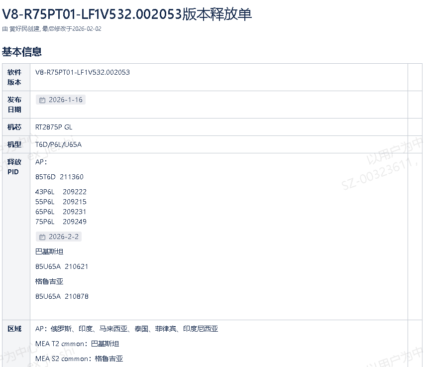
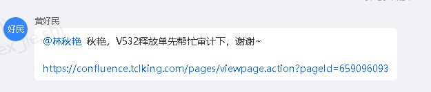
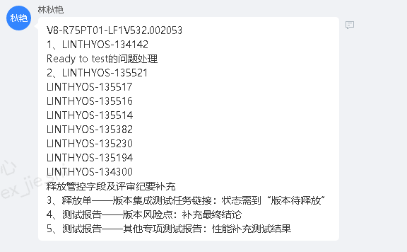
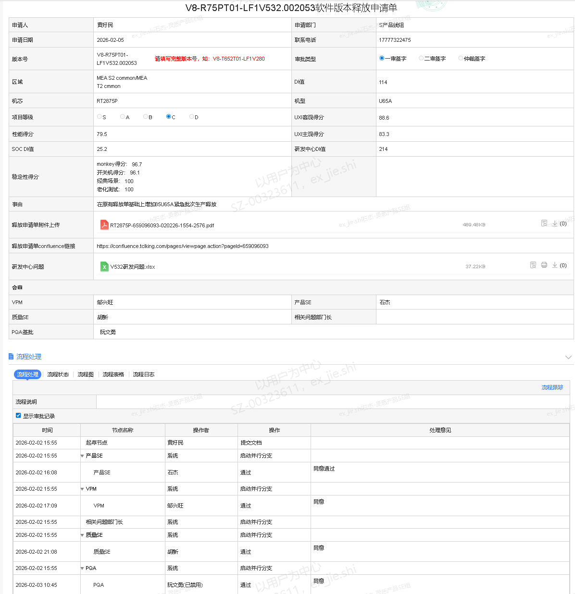

# 1.5.4 OA释放单签批SOP

> pageId: 588365284 | 导出时间: 2026-07-07T14:53:28.283398

# **SOP简介：**

**文档主要内容：OA释放单发起的流程和必要条件**

**文档适用角色：SPM、VPM、质量SE、产品SE**

**适用项目阶段：所有**

**环境依赖：**OA系统权限

**相关内容链接：  **

**项目管理平台申请单：[https://idsaas-o.tclking.com/page/cms-pdm/#/project/testOperation/completeMachine?projectId=2646&appId=1745](https://idsaas-o.tclking.com/page/cms-pdm/#/project/testOperation/completeMachine?projectId=2646&appId=1745)  **

**释放申请单： **

**OA释放单：[https://oateh.tcl.com/ekp/km/review/km_review_main/kmReviewMain.do?method=view&fdId=19c1d55ef4058bf498ebef84b99a040c&fdTaskInstanceId=19c1d59e56ffb4832d819a64302a9679&fromTwork=true&accessToken=ut_STwa5K0CYHoZVm0N8zYYALODzsGbiN0UcIh](https://oateh.tcl.com/ekp/km/review/km_review_main/kmReviewMain.do?method=view&fdId=19c1d55ef4058bf498ebef84b99a040c&fdTaskInstanceId=19c1d59e56ffb4832d819a64302a9679&fromTwork=true&accessToken=ut_STwa5K0CYHoZVm0N8zYYALODzsGbiN0UcIh)**

# **OA释放单签批SOP**

## **         1.什么是软件释放单**

### **         1.1 定义说明**

****             **** 软件释放单是指在软件版本开发完成并通过必要验证后，由SPM通过 OA 系统发起的正式释放申请单据，用于对软件版本的发布、交付或上线行为进行流程化管控与审批。

###          **1.2发布目的    **          

通过软件释放单流程，实现以下目标：

- 

- 

规范软件版本释放流程
- 明确版本释放责任人
- 确保释放版本具备完整性、可追溯性
- 降低未经审批私自发布的风险

###                     ** 1.3发布流程**

## **         2.****OA释放单发起前置条件  ** 

- 

- 释放版本SQA完成测试，遗留待解决问题均有评审结论
- TQC测试通过，主要涉及北美、欧洲、澳洲、日本、阿根廷、巴西等区域的软件释放
- 认证通过，主要涉及认证包含XTS、NTS、Primevideo、Airplay、远场以及DTV相关区域认证
- 质量门禁达标（2025年标准：）
a.释放版本中国区项目 DI 值小于 85、海外区项目 DI 值小于 150；
b.无必解问题（IRP≥86），无Block标签问题；
c.无 S（P0）类问题；
d.性能、稳定性得分达到目标要求；
e.如项目有体验目标要求，需体验部门输出体验合格报告；
f.对于海外有 TQC 团队验收的项目必须要收到对应 TQC 团队验收通过的正式邮件通知。(此项可以推迟到释放单签批前）

## **   3.释放单发起**

### **       3.1释放申请单**

**          **在释放单发起的前置条件都满足之后,首先由SPM在confluence上发起释放申请单, 产品SE和VPM需要对申请单进行补充和核对，产品SE需要核对软件版本/机型/释放pid/区域/释放事由。相关的信息需要跟项目管理平台上对应的整机申请单(**[https://idsaas-o.tclking.com/page/cms-pdm/#/project/testOperation/completeMachine?projectId=2646&appId=1745](https://idsaas-o.tclking.com/page/cms-pdm/#/project/testOperation/completeMachine?projectId=2646&appId=1745))保持一致。**

    

          

## **    3.2释放申请单审计  **

**                     **释放申请单完成后，由SPM向审计人员发起审计，如果审计有问题需要产品SE和VPM配合SPM进行整改，直到审计通过。

## **    3.3OA释放单**

**                    释放申请单审计通过之后，SPM会发起OA释放单，释放单需要VPM/产品SE/质量SE/PQA签批。产品SE签批的时候需要核对版本号/区域/机芯/事由/释放申请单，如果信息准确就可以签批。**

   

                 
   
