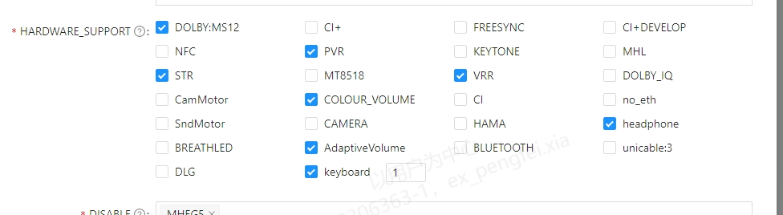

# 2.1.2 外专业修改合入风险2.0

> pageId: 586443631 | 导出时间: 2026-07-07T14:53:29.267006

| 标题 | 外专业修改合入风险 |
| --- | --- |
| 状态 | 待评审 |
| 角色 | A |
| 更新日期 |    |
| 沟通对象 | PQ工程师、硬件工程师、SQA测试工程师、产品SE，开发 |
| 具体内容 | 外专业修改合入往往可能涉及到几个模块需要确认是否都已经合入需要产品SE把控 |
| 操作方法 | 一，PQ/AQ导入风险:  1.PQ/AQ输出FDS。  2.产品SE按照PQ/AQ spec进行数据库修改。在进行数据库修改时一定要注意DB路径是否正确，是否与pid绑定。  3.PQ/AQ工程师修改PQ/AQ参数后及时推送到tclconfig，并提供上code链接，产品SE入库。这里有存在一定风险      3.1>代码漏合入风险。 PQ/AQ在配置一款新品的时候往往需SOC配合修改代码或者bin，例如tcon bin等，而PQ/AQ工程师往往只负责上传自己的pq bin，没有去care soc部分代码是否有上传。由于这部分是PQ/AQ与soc联调，产品SE不了解整个过程，会导致只merge了部分修改。这部分一定要注意，在merge PQ/AQ的修改时，一定要他们提供jira单，通过jira单我们可以排查到是否有soc修改内容。      3.2>PQ/AQ修改需要产品SE关注是否影响到其他pid，若有需要确认其他pid是否也存在。（一般情况下pq bin会多个项目共用）     3.3>pq/AQ在做新老品兼容时，一定要pq提供新老屏测试报告以及测试用例场景，全部符合后才能入库。  二，HID修改：       我们现在进行了软硬分离，hid是由硬件上code。hid里面包含内容比较多，但是我们需要关注重要几点：         1>feature 属性是否配置正确    2> EDID路径是否配置正确，DLG 、Dolby version 、DTS 等在EDID配置，上层动态识别，通过不同文件隔离。  3>tuner类型是否配置正确  4>功放是否配置正确  5>EXPATH 配置是否正确。根据机型FDS 是否带远场语音以及远场语音灯数量。  6>SOURCE_SUPPORT 机器外设配置是否正确。根据机型FDS 确认是否配置错误。  7>Tcon型号是否配置正确  8> 屏参修改，  三，应用集成：       开发owner提供apk 集成路径，CIE进行集成，这里面往往会存在一些风险，产品SE需要重点检查版本号和app路径以及提供的commit里面是否包含很多需求或者进版，需要产品SE深入了解应用修改范围以及影响，APP需要遵循三分支原则，量产分支和主干分支隔离，量产应用分支变更需要owner邮件通知。  四，esticker 资源漏合入风险          主要是指一个新项目或者派生往往产品SE未通知CIE提交新的esticker资源，或者新配置Esticker资源还在测试状态，未流转到发布状态，CIE无法拉取最新资源，导致版本重新发布。  五，闭源仓漏合入风险          在有闭源仓修改的时候，一定要记得触发编译，然后后入产物。现在是自动触发编译和自动合入，所以这类风险还好。  六. SOC 闭源KO (例如dolby ko)         当kernel 涉及到头文件，新增函数修改或者config 打开关闭时，对应的dobly ko需要重新依赖新改动的代码进行编译生产，否则会出现ko和kernel不匹配问题。  七、tvcust 修改         当前涉及到产品配置、featrue配置、默认开关配置等，产品SE需要特别关注新功能是否在fcm进行配置、新pid产品配置是否正确、新SPL 版本号配置是否正确等 |
| 标准与原则 |  |
| 适用项目阶段 | SR3,SR4 |
| 适用项目范围 | S、A、B、C、D |
| 交付件 |  |
| 备注 |  |
| [返回目录](https://confluence.tclking.com/pages/viewpage.action?pageId=9052451) |  |
