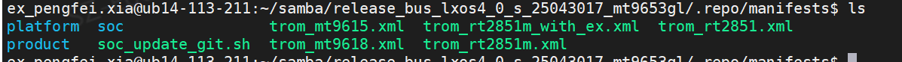
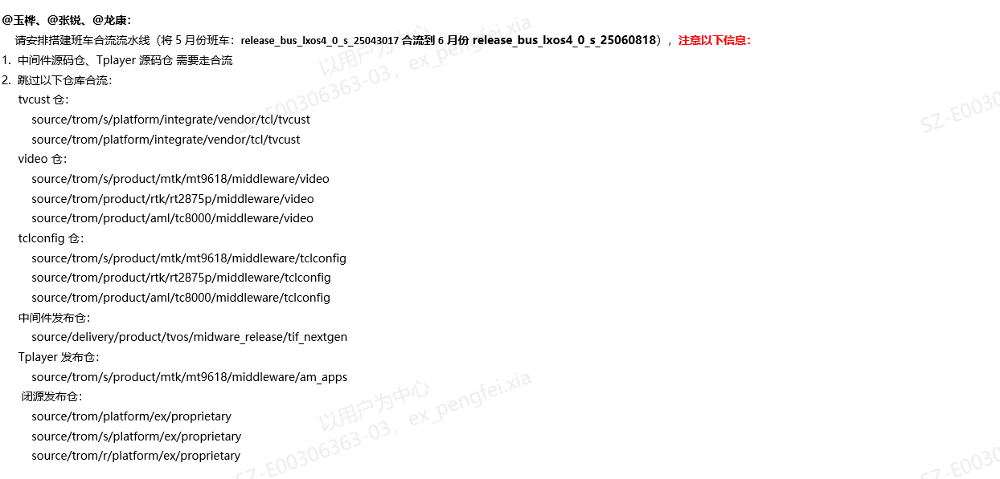
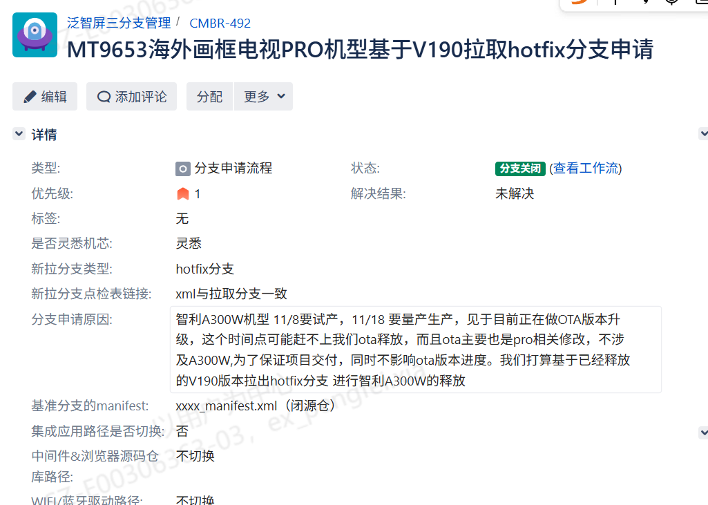
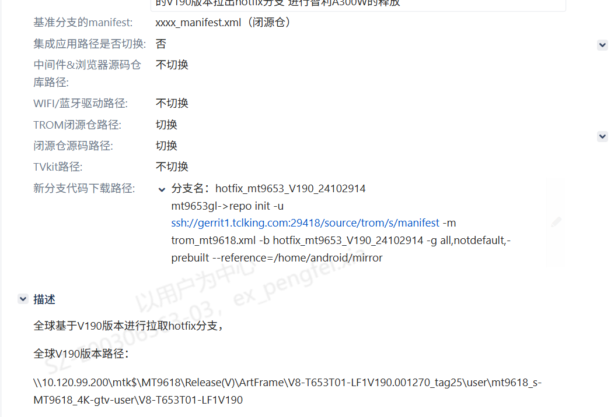
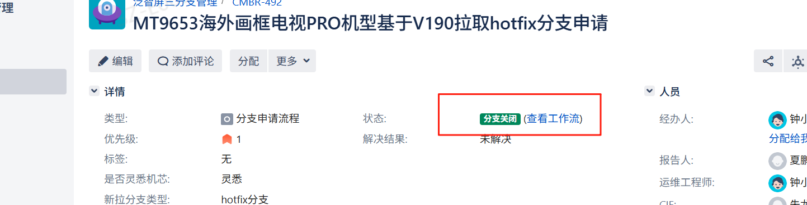

# 2.2.1 分支质量看护SOP

> pageId: 579377501 | 导出时间: 2026-07-07T14:53:30.763970

# **SOP简介：**

**文档主要内容：**分支质量包括分支策略制定，分支拉取，分支代码管控以及分支的关闭。

**文档适用角色：**大产品SE（机芯软件负责人）& 小产品SE（派生软件负责人）

**适用项目阶段：**SR3，SR4，SR5，SR6

**环境依赖：**gerrit 代码下载权限， 分支OA申请权限

**相关内容链接：**

# **分支质量看护SOP**

## **1.分支策略制定：**

###     **1.1量产分支策略：**

            量产分支策略一般针对新项目，特别是leading项目，新机型（非简单派生机型）启动时，需要考虑使用哪个量产分支。一般在拉量产分支前需要跑版本火车或者灵悉火车，火车过点后则开始拉取量产分支。往往是多个机型例如MT9655，TC8000等不同soc 拉取一条量产分支。用不同的manifest来管理。如果有代码差异，会通过不同的project来区分。总之 会尽可能的进行共code。

### **1.2.班车分支策略：**

               什么是班车分支即基于某个量产分支，将每个月规划的需求（一般一个机芯大约3-5个需求，不会太多）合入到量产分支上。其目的是为了快速响应市场，BU等需求，让产品能够在市场上面快速迭代更新，因此产生班车机制。

              班车分支的运行机制，一般情况下每个月都会有需求导入，这些需求会直接在量产分支上面进行验收。例如 8月份的需求，会基于最新的量产版本进行导入，为了不影响现有项目释放会基于最新的量产分支，拉取一个班车分支为8月份的需求。此时产品SE会选择量产分支一个释放版本或者基于最新的软件在OA上面进行申请。例如：
。 OA里面需要备注相关分支信息。（参考之前的OA流程即可）。特别要注意在新的班车拉取成功后，之前老的量产分支或者班车分支还在继续使用，此时需要保证两个班车分支代码提交一直。需要要求CIE进行合流。例如：

当然也不是每个月的需求合入都需要拉取班车分支，如果该月需求较少或者需求改动量不多，同时有feature进行隔离这样就没有必要拉取班车分支。毕竟多拉一个班车分支会多一份维护成本。

          怎么选择班车分支呢，其实主要看你负责的机型对于这个班车需求诉求是怎么样，这一点可以找BA（需求经理）确认，如果是强诉求那么就必须切到所对应的班车分支，如果不是可以按照项目节奏进行切换。（建议可以等班车分支稳定后再切换，不做第一个吃螃蟹）。

###     **1.3.hotfix分支策略**：

            什么是hotfix分支，hotfix分支是基于某个已经量产的版本，按照次版本的mantifest拉取一个分支，导入少量修改，用于快速释放的分支。也是需要提OA流程申请。

           一般情况下有如下几种情况需要拉取hotfix分支：

          1>.量产分支在进行基础版本的释放，突然有一个派生项目比较紧急需要尽快释放，一般情况下拉去hotfix，单独释放派生机型。

          2>.基于某个冲刺释放的版本，由于1-2个block问题需要重新发版本，为了不带入其他修改，确保能够快速释放，建议拉取hotfix分支。

          3>.基于某个已经释放的版本，因为要解决售后问题或者bu提出个别需求需要满足，往往会基于这个已经释放的版本拉hotfix，合入问题修改，快速释放。

          总之拉hotfix就是为了防止带入不必要的修改，软件能够快速释放。正常周期大概是两周

###    ** 1.4 temp分支策略：**

            顾名思义 temp分支只是临时的一个分支，可以从master分支拉取，主要是用于导入新需求，提供一个验收的分支场景。需求在temp上面验收通过后会导入开发，master，量产分支。

## **2.分支拉取：**

         凡是所有分支拉取都需要提OA流程：例如：

这里需要注意的是，中间件分支，tclconfig，以及闭源仓分支是不是需要单独拉取这个根据项目实际情况决定。如果你的修改不涉及这些模块可以不拉分支。

## **3.分支代码管控**

        所有代码分支的merge都是由产品SE执行，产品SE在merge代码的时候一定要注意一下几点：

1.所有修改必须要有领域owner +2,凡是没有+2的修改一律不merge。

2.修改的问题是否是包含需求，需要跟owner确认（需求上车需要有上车评审通过的结论方可merge）。

3.SOC超车patch合入一定需要领域SE+2

4.若紧急出版产品SE+2 merge后，一定要通知到领域SE补+2，邮件通知

5.产品SE评估对于那些影响较大的修改，需要owner解释说明或组织评审，备注详细的测试建议。

## **4.分支关闭**

      分支使用完成后，需要由分支申请人在OA上面走流程进行关闭（在原先申请的OA上面进行操作即可）。我们分支原则是减少量产分支数量，把控品质。

## **5.软工中心分支策略**
