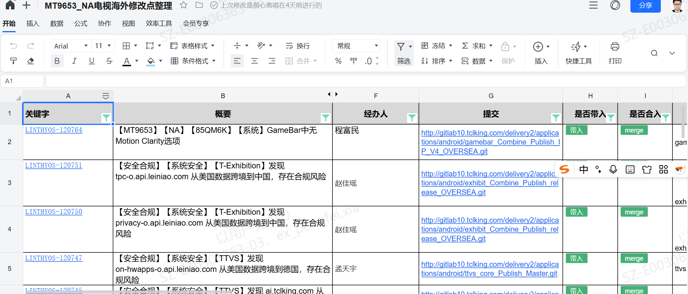
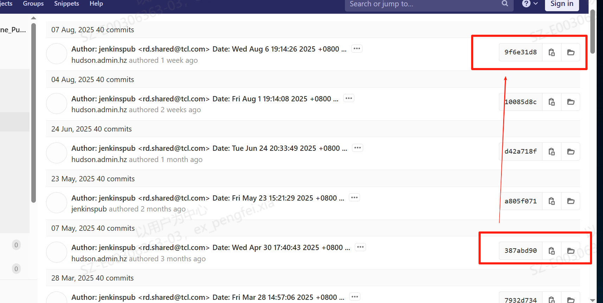

# 2.2.2 版本质量管控SOP

> pageId: 585445461 | 导出时间: 2026-07-07T14:53:32.299888

# **SOP简介：**

**文档主要内容：**主要从合规（三分支原则，领域SE+2， 需求需要上车平台通过报告），影响可控

**文档适用角色：**大产品SE（机芯软件负责人）& 小产品SE（派生软件负责人）

**适用项目阶段：**SR3，SR4，SR5，SR6

**环境依赖：**gerrit 代码下载权限，

**相关内容链接：**

# **版本质量管控SOP**

一个好的结果，需要有一个好的过程，其中合规是我们坚守质量红线的基本底线：

## **1.合规**

### **1.1.代码合入的合规：**

**  **    目前我们所有代码合入都是讲究三分支原则，即开发分支->主干->量产分支。由于我们开发分支->主干采取的是自动合流方式，因此我们只需要将代码上到开发分支即可，会自动同步到主干分支。然后就是量产分支 。特别是量产分支一定注意合入。因为我们有开启班车分支也就是我们量产分支，可能存在在某一时间段有多个班车分支例如 5月份班车，6月份班车。一般情况下6月份班车会自动合流5月份班车，但是有些project是不参与合流，因此在合入这些代码的时候一定要注意，提醒开发要上到对应的班车分支上面，不要漏合。另外还有一些hotfix分支，也是量产的一部分，也需要考虑代码合入情况。

### **1.2.加分合规**

**          **作为产品SE除了一些二进制文件修改，FCM的配置修改，其他原则上面我们不允许+2，一定要领域模块owner+2后我们才能合入。领域owner才能够准确的判断修改的风险，保证代码质量。如果产品SE在紧急情况下进行+2一定要邮件通知到领域owner 进行补+2。

### **1.3.需求上车合规**

         产品SE在代码合入的时候一定要确认清楚该笔代码是普通的问题解决还是需求上车，如果是需求上车一定要有上车评审通过的邮件。（大家可以通过开发提交Jira 编码看出是问题修改还是需求上车）。凡是没有评审通过报告就拒绝合入。

## **2.质量**

**      **做到上面的合规之后，就是对质量的要求。

### **2.1版本修复范围可控**

        一个版本带了哪些修改作为产品SE一定要做到心中有数，建议大家可以将每个版本修改带入哪些问题用一个表格记录。例如：

这样我们在排查问题，评估版本风险，策略的时候都有据可依。特别是针对一些重要版本，例如要冲刺释放就建议不要带入过多修改，对于哪些已经评审通过，ID管控的问题，如果修改较大，影响不可控建议不要带入。特别是SOC修改不可控因素太大，需要慎重考虑。

### **2.2应用的合入**

      由于应用我们是集成二进制文件，我们更新应用的时候不能直接按照开发提供的commit合入到最新，需要做一个基本判断，比如开发提供的解决问题的commit id与我们现在版本的commit id相隔时间比较久，中间有很多笔修改，这时候就需要找开发确认中间件是否有导入需求，如果有导入需求需要要求开发针对目前的commit id拉取hotfix分支。

### **2.3进行代码review**

        产品SE不是代码merge的机器，我们作为一个项交付的技术负责人，需要有代码review的能力，特别是针对改动较大的修改一定要找开发问清楚修改原因，影响范围，测试建议等。技术的成长之路也是在review一个个提交的过程中成长起来。
