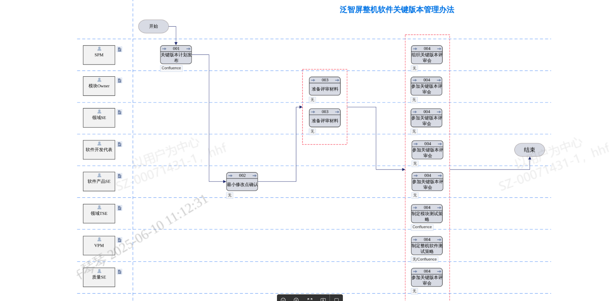

# 2.2.4 关键版本运作SOP

> pageId: 585445460 | 导出时间: 2026-07-07T14:53:37.604554

# **SOP简介：**

**文档主要内容：确保关键版本的质量可靠与问题可控，通过优化流程、加强评审、明晰分工，规范“关键版本”修改管理，提升版本成功率和软件稳定性。**

**文档适用角色：软件开发代表，产品SE，领域SE，领域TSE，VPM，质量SE，SPM，模块owner**

**适用项目阶段：适用于TCL实业软件工程中心泛智屏业务**

**相关内容链接：**

**
**

## **关键版本定义与基本原则**

关键版本定义：由泛智屏产品项目部根据项目的重要程度（如当年新品、重要升级、新品类产品等）提议，由软件代表确认，最终由泛智屏业务负责人决策的版本(班车释放后的V版本，项目NPI 所有V版本)。

基本原则：

1）最小化修改原则：由产品SE严控修改范围，仅纳入关键功能缺陷必要修改，排除非必要修改项

2）精益代码 Review 质量：开发/测试团队选定Qualify专家对关键版本代码修改实施分层代码审查

3）系统性质量保障：由模块Owner（含SOC开发）说明修改影响域及测试建议，由产品SE与FDE联合完善测试策略；建立标准化流程以系统性规避个体工作质量的波动

4）软工中心管控机制：对关键版本一次性通过率指标纳入中心管控，并结合问题逃逸追踪如必须重发版本进行补救，则回溯之前版本fail并触发复盘

## **关键版本评审策略**

1）领域SE和模块owner，常态化代码走读，填写代码走读纪要

2）由SPM每周五输出下周的版本计划，在发版本当天版本编译前，由软件产品SE导出修改点，按照责任田，安排固定时间点拉起相关领域SE参加评审

3）领域SE提前将修改点代码走读，输出走读纪要（纪要直接在gerrit上做备注）

4）版本编译前，SPM拉起相关方组织评审会议，由开发Owner介绍修改点，说明修改影响范围，并给出合理的测试建议，产品SE、领域TSE对测试策略进行完善

5)  产品SE在整个评审中，需要意识到可能的风险，从客户角度提出有可能遇到的问题，领域SE需要解答，未考虑到的需要继续完善修改

6)  在满足DI值释放达标的前提下，最终修改应带入哪些关键修改，优先采纳质量SE的意见

7)  已经入库的修改，评审当前版本不需要带入，由模块owner负责回退，产品SE负责合入（版本发布后，产品SE通知模块owner重新提交并合入；若评审该分支都不需要带入的修改，不需要通知模块owner重新提交）

8)  多项目共仓代码提交，评审当前版本不需要带入的(A项目需求，B项目不需要)，SPM根据项目发布先后，模块owner/产品SE根据各项目需求提交或回退相关修改，版本发布后，涉及回退的修改，产品SE通知模块owner后续版本再带入

9)  应用代码需要回退的，需要应用拉hotfix导入

## **关键版本参会角色**

| **执行角色** | **活动名称** | **活动说明** | **输入** | **输出** | **IT****信息系统** |
| --- | --- | --- | --- | --- | --- |
| SPM | 关键版本计划发布 | 由SPM每周五输出下周的V版本发版计划 | 项目需求 | 版本计划 | Confluence |
| 软件产品SE | 最小修改点确认 | 按照《量产分支代码管理规范》，做最小化修改入库，确保非必要修改不入库 | 所有的代码提交 | 最小化修改点范围 | 无 |
| 模块Owner | 准备评审材料 | 1、根据软件产品SE入库的修改点，提前拉通领域SE完成关键版本的代码走读 2、提前准备好关键版本评审材料 | 修改点 | 走读记录、评审材料 | 无 |
| 领域SE | 准备评审材料 | 1、根据软件产品SE入库的修改点，提前完成关键版本的代码走读 2、提前准备好关键版本评审材料 | 修改点 | 走读记录、评审材料 | 无 |
| SPM | 组织关键版本评审会 | 由SPM拉通修改点对应的开发Owner、软件开发代表、软件产品SE、责任田涉及到的领域SE和领域TSE、VPM、质量SE，共同参与关键版本评审 | 最小化修改点 | 会议纪要 | 无 |
| 模块Owner | 参加关键版本评审会 | 讲解修改点，修改后的影响范围，给出建议的测试策略 | 修改点 | 影响范围 | 无 |
| 领域SE | 参加关键版本评审会 | 1、 对模块代码质量负责，在关键版本评审前完成走读代码并记录 2、 结合影响范围输出模块测试建议 | 开发Owner的讲解内容 | 对代码的评审意见和对测试策略的建议 | 无 |
| 软件开发代表 | 参加关键版本评审会 | 结合影响范围提出产品侧测试策略建议 | 各方讲解和意见 | 评审结论 | 无 |
| 软件产品SE | 参加关键版本评审会 | 结合影响范围提出产品侧测试策略建议 | 各方意见 | 评审意见 | 无 |
| 领域TSE | 制定模块测试策略 | 基于代码变更，结合建议制定/完善模块级测试策略 | 各方讲解和建议 | 测试策略 | Confluence |
| VPM | 制定整机软件测试策略 | 汇总各领域TSE测试建议，制定整机级软件测试策略 | 开发讲解内容及建议、领域TES制定的模块测试策略 | 整机测试策略 | Confluence |
| 质量SE | 参加关键版本评审会 | 根据开发测试各方评审意见，确认整体软件测试策略准确、充分 | 开发和测试各方评审意见 | 评审结论：确认软件测试策略是否准确、充分 | 无 |

## **关键版本流程**

****

# **关键版本运作方法**

****
