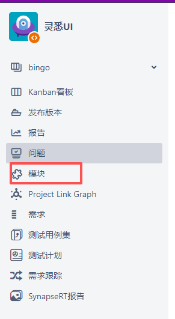
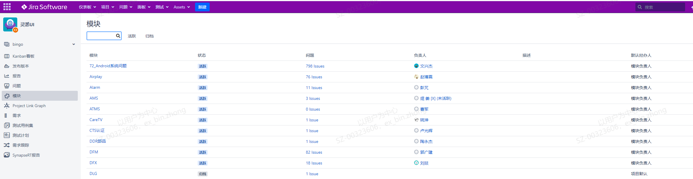
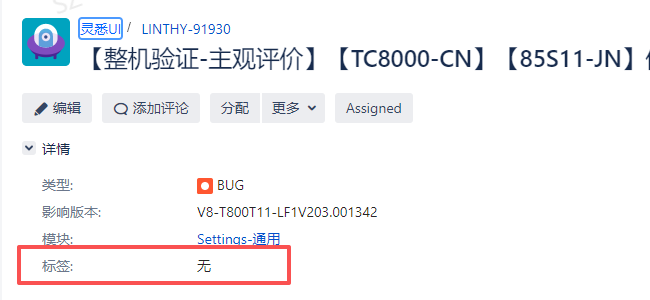

# 3.3 跨软件模块/专业协同2.0 SOP

> pageId: 583197676 | 导出时间: 2026-07-07T14:50:53.672202

# **SOP简介：**

**文档主要内容：**明确在项目过程中所遇到BUG的处理方法

**文档适用角色：**各软件模块Owner、模块SE、SEG、产品SE、SPM、SQA，AOE,、硬件、SOC、TQC、BA

**适用项目阶段：**所有阶段

**环境依赖：**

**相关内容链接：**

# **跨软件模块/专业协同2.0 SOP**

**1、什么是跨部门/专业沟通？**
     跨部门/专业沟通，是指不同部门或不同专业背景的人之间，为了完成某个共同目标而进行的信息交流和协作。

**2、跨部门/专业沟通技巧**
   1）简要清晰地讲清楚事情背景
   2）需明确需要相关方处理具体事情点
   3）沟通对齐清楚处理完成的时间节点
   4）在对事情有比较全面认识的情况下，可以进行更深入的探讨或提出建议

**3、跨部门/专业沟通方法**

（1）沟通人选择，统一出口入口
         在资源评审阶段选择好资源的负责人，统筹资源协调及执行过程中的一切事情，解决遇到的问题。每个项目都会定义各部门/专业的接口人，复现问题/资源瓶颈问题都可以找对应的接口人协调安排，不同项目接口人不一样，具体的可以咨询SPM。
（2）尽量当面交流，节省交流成本
         大家有问题在T信群里里面同步，不过如果是具体的问题，或是比较复杂的问题，还是建议当面沟通。当面三方两语就能说清楚的事情，就不要长篇大论地打字交流了，并且当面沟通是最有效的，也是成本最低的沟通模式。
         沟通效率：邮件沟通<IM沟通<周会沟通<面对面+白板沟通
（3）当面沟通，文字留底，明确权责
         在当面沟通解决问题后，根据问题的大小，在工作群中同步一下沟通的结果，或是发邮件给大家分享一下沟通的成果及解决方案等。
   

- **示例一：软件JIRA问题**

           （1）SE初步需要确认问题是需求还是BUG，如果是需求，走模块OWNER需求开发流程，项目BA跟进，SPM需跟进进展，不能影响项目进度。

           （2）如果是常规BUG，操作步骤如下：

                     1)  SQA初步识别模块OWNER，将问题转交给模块OWNER。

                     2）SQA不能识别的模块OWNER，由产品SE主导定位模块OWNER，确定模块OWNER方式如下：

                           方式一：模块owner列表：[https://teamwork.getech.cn/shimo-h5/shimo-edit/8ccf129fdbe549389a34bc82d849a6e6?accessToken=ut_nrq3lo40tSwp9lPDuuZrRldAUJgg1vfreAD](https://teamwork.getech.cn/shimo-h5/shimo-edit/8ccf129fdbe549389a34bc82d849a6e6?accessToken=ut_nrq3lo40tSwp9lPDuuZrRldAUJgg1vfreAD)

                           方式二：通过JIRA上模块：随便打开个JIRA单，点击左边的模块即可查找到对应的模块OWNER。

                                         

                           方式三：在conf/jira等平台搜索相关关键字，然后再找对应的人沟通确认。

                              

                       3）模块OWNER，给出问题的分析和解决时间。

                       4）针对疑难BUG，产品SE主导进入问题攻关。

                       5）SE主导梳理BUG的优先级，若严重需优先处理的问题，可以JIRA单上的“标签”处打上一些关键字，如重点问题、block问题等等，项目组内达成一致什么字段即可。SPM跟进BUG的解决进度。

                             

                       6）针对研发类问题，需初步判断是否会block版本释放，比如闪背光、花屏、PQ版本不对、功能失效等都是block问题，需及时反馈给SPM推动开发代表处理澄清。

                       7）针对SOC问题，每天需晚会过进展，针对TCL OWNER名下的严重问题，需重点跟进各OWNER的处理进展，也需进行初步进行判断JIRA单最终是否由SOC解决。

                       8）针对BUG优先不合理的问题，可以拉开发一起找VPL沟通，调整不准确的字段，以达到降BUG优先级的目的。BUG优先级定义说明：

           （3）如果是疑难BUG，操作步骤如下：

                             1）根据问题模块分类，产品SE主导，SPM拉通参会人员，包含模块OWNER, 模块SE，系统SE, SOC等讨论解决方案及评估风险影响范围。

                             2）如不能理清解决方案，则上升SEG拉会议[（](https://confluence.tclking.com/pages/viewpage.action?pageId=234111361)[SEG攻关流程](https://confluence.tclking.com/pages/viewpage.action?pageId=234111361)[）](https://confluence.tclking.com/pages/viewpage.action?pageId=234111361)，辅助理清技术方向。

                             3）技术方向达成一致意见后，由模块OWNER主导实现修改。

- **示例二：工厂生产问题**
问题来源：

           1）工厂QT抽检发现问题，2、架构调试问题 , 3、工厂老化问题

初步分析：

           1）工厂AOE收集基本的问题信息。

           2）工厂AOE会初步排查是软件问题，还是硬件问题，如果AOE排除是硬件问题，则不走软件问题流直，直接联系硬件处理。

                     3）工厂AOE进行软件/硬件问题初步排查方法为：非硬件主板本身的问题都判断为软件问题，所以产品SE需根据问题现象进行初步判断是软件BUG还是研发参数问题，若无法判断，可以请DFM组相关开发做一手分析LOG来确定模块。

                     4）若是研发参数导致的问题，需及时反馈给开发代表及研发工程师进行处理。

                     5）如果是软件问题，AOE会发起问题邀请，一般是邮件跟进，影响走货的紧急问题会拉微信群及时响应。

                     6）AOE部门提供问题的LOG

       问题解决：

                  1）快速建立问题微信群，拉通AOE、硬件，产品SE，软件项目管理、由产品SE快速初步梳理问题，确认问题模块责任人。

                  2）拉通模块责任人，分析对应的LOG，快速定位问题点。

                  3）若遇到复杂问题时，可请DFM组相关开发人员帮忙看现场。                

                 4）确定解决问题的方法，模块SE review修改。

     问题验证：

                 1）编译升级包提供给AOE验证，验证通过后发布量产正式版本，

      小结：

               1）工厂是打粮食的部门，生产的问题需要第一时间响应，如果存在人力资源上面的冲突，需要向项止管理，部门长第一时间申请资源，避免影响出货或生产效率。

- **工作流指引**

**   
**
