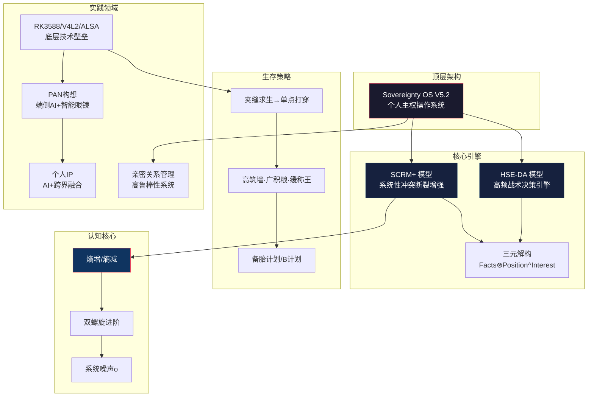

---
level: L1
title: "个人知识图谱 · 总索引（细目版）"
subtitle: "一个以Sovereignty OS为内核，跨越技术、策略与哲学的个人主权操作系统"
version: "5.2"
status: "active"
last_updated: "2026-06-13"
tags:
  - MOC # Map of Contents
  - Index
  - KnowledgeGraph
  - SovereigntyOS
domain: [认知体系, 核心模型, 策略计划, 关系沟通, 科技技术, 历史典籍, 实践IP, 杂想人物]
coverage:
  notes_count: 65
  last_count_update: "2026-06-13"
related:
  - "[[知识图谱可视化.md]]"
  - "[[Sovereignty-OS-V5.0-架构梳理.md]]"
  - "[[[精华++][认知][建模][推理过程]多维分权事实验证体系、“SCRM+”系统性冲突与断裂增加模型和HSE-DA-决策行动模型.md]]"
purpose: "作为整个知识图谱的根入口，提供全局概览、导航和核心概念索引，是系统的'bootloader'。"
---

# 📑 个人知识图谱 · 总索引（细目版）

> **生成日期**：2026-06-13（更新）  
> **覆盖范围**：`records` 工作区全部 65+ 篇 Markdown 笔记（含 27 篇新增）  
> **配套资源**：[知识图谱可视化](../知识图谱可视化.md) — 9 张 Mermaid 图表  
> **📂 本文件位置**：`知识图谱/L1-README-知识图谱索引.md`（根索引副本·源文件在 `../README-知识图谱索引.md`）  
> **标签体系统一说明**：`[精华++]`（跨域顶级综合） > `[精华+]`（深度扩展分析） > `[精华]`（高价值洞察） > `[杂想]`（原始思考）。领域标签：`[认知]` `[建模]` `[策略]` `[职场]` `[亲密关系]` `[科技]` `[历史]` `[典籍]` `[阅读]` `[IP]` `[驱动开发]` `[社会]` `[哲学]` `[地缘]`。特殊标记：`[全局总结]` `[锁定]` `[PAN]`
> 
> **📂 L2 详细索引（分域深度展开）**：
> 
> | 一·[认知体系与思维模型](./L2-一-认知体系与思维模型.md) | 二·[核心模型与框架](./L2-二-核心模型与框架.md) | 三·[策略与计划](./L2-三-策略与计划.md) | 四·[关系与沟通](./L2-四-关系与沟通.md) |
> |---|---|----|---|
> | 五·[科技与技术](./L2-五-科技与技术.md) | 六·[历史与典籍](./L2-六-历史与典籍.md) | 七·[实践与IP](./L2-七-实践与IP.md) | 八·[杂想与人物](./L2-八-杂想与人物.md) |

---

## 🧠 一、认知体系与思维模型（20 篇） [▸ L2详细索引](./L2-一-认知体系与思维模型.md)

> 这是整个知识图谱的"操作系统层"——定义了如何看待世界、如何思考、如何进化。新增 8 篇认知系列深度笔记。

### 1.1 顶层架构 · 全局总结（3 篇）

#### 📄 认知体系的终极盘 `[精华+][全局总结]`

| 维度 | 内容 |
|------|------|
| **核心命题** | 生意人 vs 企业家的"杠杆化转型"模型：从"生存驱动"到"价值驱动" |
| **关键框架** | ① 夹缝求生（获取原始数据）→ ② 单点打穿（数据→算法）→ ③ 个人IP（算法→品牌传播） |
| **核心洞察** | 技术壁垒必须产品化/工具化而非只存在于脑子里；IP 的本质是"行业定价权"而非粉丝数；每个夹缝背后都是未被满足的效率缺口 |
| **关键方法论** | 建立"现金流-资产"防火墙（利润 30% 强制投入壁垒研发+内容杠杆）；设定明确的"退出夹缝时间点"；让数字资产 24 小时为信用背书 |
| **风险警示** | "在夹缝中待久了，会失去单点打穿的锐气"——最大的风险不是没赚到钱，而是用极度勤奋掩盖战略懒惰 |
| **关联** | [极客人文思维](#-极客人文思维的深度梳理) · [高筑墙策略](#-生存突围与高筑墙) · [2026生存策略](#-2026生存策略与边缘ai) |
| **文件** | [./[精华+][全局总结]认知体系的终极盘.md](../[精华+][全局总结]认知体系的终极盘.md) |

#### 📄 极客人文思维的深度梳理 `[精华+][认知演进][策略总结]`

| 维度 | 内容 |
|------|------|
| **核心命题** | 全量梳理六大领域讨论内容，识别"极客精神与人文思辨高度融合"特质 |
| **六大领域** | ① 嵌入式底层技术（RK3588/V4L2/ALSA/DRM）② 认知方法论（第一性原理/因果建模/批判性思维）③ 职场战略与PMP ④ 历史人文与哲学（资治通鉴/王阳明心学）⑤ 生活经营与社会关系 ⑥ AI工具与方法论 |
| **核心结论** | 已从"问题解决者"进化为"系统构建者"——不仅关心代码怎么写，更关心系统怎么运行、社会怎么运作、人应当如何自处 |
| **关联** | [认知体系终极盘](#-认知体系的终极盘) · [思维进阶](#-思维进阶从执行到架构) · [Sovereignty OS](#-sovereignty-os-v50-体系) |
| **文件** | [./[精华+][认知演进][策略总结]极客人文思维的深度梳理--高筑墙，广积粮，缓称王.md](../[精华+][认知演进][策略总结]极客人文思维的深度梳理--高筑墙，广积粮，缓称王.md) |

#### 📄 思维进阶：从执行到架构 `[认知总结]`

| 维度 | 内容 |
|------|------|
| **核心命题** | 深度分析从最初到现在的思维进阶全过程 |
| **四维进阶** | ① 广度→深度：从"点状突破"到"底层深挖" ② 零散→系统：从碎片信息到"知识熵减" ③ 局部→整体：从执行到"全局建模" ④ 模糊→具体：从愿景到"灰度认知" |
| **成长定位** | 从 Level 3（优秀执行者）→ Level 4-5（具备战略定力的架构师） |
| **最终结论** | 已建立"技术壁垒为核，哲学修养为盾，系统思维为矛"的个人生存系统 |
| **关联** | [认知体系终极盘](#-认知体系的终极盘) · [个人画像分析](#-顺势与借势个人画像) |
| **文件** | [./[认知总结]思维进阶：从执行到架构.md](../[认知总结]思维进阶：从执行到架构.md) |

#### 📄 认知层次与思考深度解析 `[无标签]`

| 维度 | 内容 |
|------|------|
| **四层金字塔** | L1（感性表象·70-80%二元思维）→ L2（逻辑经验·15-20%因果链）→ L3（系统结构·3-5%反馈回路）→ L4（哲学本质·<1%第一性原理） |
| **自我定位** | 处于 L3-L4 边界——系统建模+哲学深度，稀有组合但社会孤立 |
| **关联** | [思维进阶](#-思维进阶从执行到架构) · [Sovereignty OS](#-sovereignty-os-v50-体系) |
| **文件** | [./认知层次与思考深度解析.md](../认知层次与思考深度解析.md) |

#### 📄 双模型驱动的系统演进 `[无标签]`

| 维度 | 内容 |
|------|------|
| **核心贡献** | 将 SCRM+（静态映射）与 HSE-DA（动态执行）统一为决策-进化双引擎，含 Mermaid 流程图可视化 |
| **执行信条** | 拒绝过度分析（"逻辑自旋"）→ 拥抱快速低成本物理探测 → 从真实摩擦中提取信号 |
| **关联** | [SCRM+](#-多维分权验证scrms) · [HSE-DA公式](#-个人主权系统模型解析) |
| **文件** | [./双模型驱动的系统演进.md](../双模型驱动的系统演进.md) |

#### 📄 从"工业组件"到"觉醒操盘手" `[认知]`

| 维度 | 内容 |
|------|------|
| **"组件陷阱"** | 高可靠性 → 被分配"地基"任务 → 无人替代 → 因"太有价值而无法移动" |
| **突围路径** | 公开战略思考（非执行细节）→ C-level 可见 → 身份从"资源"升级为"决策者" |
| **关联** | [职业思考系列](#-职业思考系列) · [备胎计划](#-备胎计划与护城河) |
| **文件** | [./认知6："工业组件"到"觉醒操盘手".md](../认知6：%22工业组件%22到%22觉醒操盘手%22.md) |

### 1.2 核心理念 · 熵与双螺旋（5 篇）

#### 📄 系统噪声与双螺旋进阶 `[精华+][认知总结]`

| 维度 | 内容 |
|------|------|
| **核心概念** | 系统噪声 $\sigma$ = 外部环境随机扰动（非对称信息/非理性分配/不透明规则）；双螺旋 = 认知迭代（理论）+ 物理执行（实践）交替上升 |
| **核心结论** | 不试图"修复"公司的逻辑，而是将公司视为环境 API——返回 403 时执行本地缓存的 Plan B |
| **关键引用** | "下雨了（被边缘化），我只需打伞（做完琐事）并回房间读书（钻研底层技术），而不会质问天空为什么不放晴" |
| **关联** | [能量秩序](#-能量秩序与进化) · [Sovereignty OS](#-sovereignty-os-v50-体系) · [告别内耗](#-告别内耗重拾自主权) |
| **文件** | [./[精华+][认知总结]系统噪声的讨论...md](../[精华+][认知总结]%22系统噪声%22的讨论，双螺旋进阶，结论：在熵增夹缝中，实现个人熵减.md) |

#### 📄 能量、秩序与进化 `[无标签]`

| 维度 | 内容 |
|------|------|
| **三层链条** | 个人原始动力（基因延续+逃避虚无）→ 国家竞争动力（资源控制+秩序维护）→ 人类终极追求（神格化——摆脱一切母体束缚） |
| **核心洞察** | "文明冲突"只是国家动员底层参与资源争夺的意识形态外衣 |
| **关联** | [系统噪声](#-系统噪声与双螺旋进阶) · [大明1566](#-大明1566权力矩阵) · [货殖列传](#-货殖列传深度解析) |
| **文件** | [./能量、秩序与人类进化终极追求.md](../能量、秩序与人类进化终极追求.md) |

#### 📄 生存突围：高熵环境主权实现 `[认知]`

| 维度 | 内容 |
|------|------|
| **熵悖论** | 系统越混乱（AI冲击/裁员/监管波动）= 个体可穿越的"裂缝"越多——利好灵活者 |
| **三大支柱** | 技术护城河（RK3588不可替代）+ 个人品牌（IP=谈判筹码）+ 财务缓冲（3-6月跑道=决策选择权） |
| **关联** | [2026生存策略](#-2026生存策略与边缘ai) · [高筑墙](#-生存突围与高筑墙) |
| **文件** | [./认知8：生存--2026-年高熵环境下实现主权突围.md](../认知8：生存--2026-年高熵环境下实现主权突围.md) |

#### 📄 认知与现实的矛盾：知→行→成 `[认知]`

| 维度 | 内容 |
|------|------|
| **三层断裂** | 知（认知框架完备）→ 行（物理执行脱节）→ 成（现实反馈缺失=模型未校准） |
| **反馈闭环** | "成"是唯一真值指标——如果"知"预测 X 但"行"产出 Y，则"知"不完整/有偏见 |
| **关联** | [HSE-DA](#-个人主权系统模型解析) · [双螺旋](#-系统噪声与双螺旋进阶) |
| **文件** | [./认知10：认知与现实的矛盾分析...md](../认知10：认知与现实的矛盾分析--%22知%22与%22行%22、%22行%22与%22成%22.md) |

#### 📄 《反脆弱》核心概念与章节解析 `[阅读]`

| 维度 | 内容 |
|------|------|
| **三元重定义** | 脆弱（负不对称）vs 强韧（不变）vs 反脆弱（正凸性：上行>>下行风险） |
| **杠铃策略** | 90%极度安全（现金/债券）+ 10%极度杠杆（无限上行）= 捕获黑天鹅而不爆仓 |
| **关联** | [系统噪声](#-系统噪声与双螺旋进阶) · [Sovereignty OS](#-sovereignty-os-v50-体系) |
| **文件** | [./[阅读]《反脆弱》核心概念与章节解析.md](../[阅读]《反脆弱》核心概念与章节解析.md) |

### 1.3 历史宏观视角（2 篇）

#### 📄 功德林战犯改造史 `[精华+][认知]`

| 维度 | 内容 |
|------|------|
| **历史案例** | 杜聿明/王耀武/宋希濂/黄维/沈醉的改造全过程 |
| **四层逻辑** | 改造 = 体力劳动（打破特权意识）+ 思想学习（马列/毛著）+ 自我批评（逻辑重构）+ 统战宣传（政治象征） |
| **深层洞察** | 张铁石在香港自杀事件——台湾当局对"被洗脑"将领的心理战恐惧；"潜伏"与"待时"的历史逻辑映射到个人职业策略 |
| **关联** | [大明1566](#-大明1566权力矩阵) · [职场实战](#-个人主权系统迭代与实战) |
| **文件** | [./[精华+][认知]历史宏观角度看待个人生存与发展.md](../[精华+][认知]历史宏观角度看待个人生存与发展.md) |

#### 📄 个人突围类比中国发展 `[精华][认知演进]`

| 维度 | 内容 |
|------|------|
| **四大板块** | 沪深主板（蓝筹稳定）→ 科创板（硬科技/半导体）→ 创业板（高成长）→ 北交所（专精特新） |
| **前5行业** | 电子（领涨龙头）→ 银行（高分红防御）→ 食品饮料（现金流护城河）→ 电力设备（全球70%光储份额）→ 计算机（SaaS→MaaS） |
| **个人映射** | 个人突围类比中国产业升级——从"低端加工"到"核心技术自主可控" |
| **关联** | [股市博弈](#-股市波动预期与现实博弈) · [备胎计划](#-备胎计划与护城河) |
| **文件** | [./[精华][认知演进]将个人生存突围类比中国的发展突围.md](../[精华][认知演进]将个人生存突围类比中国的发展突围.md) |

### 1.4 个人画像与批判性分析（2 篇）

#### 📄 顺势与借势·个人画像 `[精华+]`

| 维度 | 内容 |
|------|------|
| **画像五维** | 认知建模（公理化系统思维）/ 职业战略（技术掘金者）/ 哲学倾向（知行合一者）/ 审美偏好（权力运行真相）/ 情感觉察（原子化个体） |
| **四大局限** | ① "逻辑的囚徒"——屏蔽非理性要素 ② "战术勤奋战略孤立"——忽视协作势能 ③ "文化属性自我暗示"——《天道》式宿命论 ④ "理想化与现实丛林冲突"——士大夫式技术情怀 |
| **核心冲突** | 对"真相"的渴求与现实社会"混沌属性"之间的不可调和 |
| **关联** | [思维进阶](#-思维进阶从执行到架构) · [许家印分析](#-许家印与pan构想) · [2026生存策略](#-2026生存策略与边缘ai) |
| **文件** | [./[精华+]顺势与借势...md](../[精华+]%22顺势%22与%22借势%22--机会往往存在于%22制度缝隙%22.md) |

#### 📄 许家印与PAN构想 `[精华+][认知][PAN]`

| 维度 | 内容 |
|------|------|
| **8大罪名** | 非法吸收公众存款 / 集资诈骗（最高无期） / 违法发放贷款 / 违法运用资金 / 欺诈发行证券 / 违规披露 / 职务侵占 / 单位行贿 |
| **深层博弈** | 认罪 ≠ 低头——系统崩溃时核心节点为让家族/资产在其他维度存续而进行的自我牺牲式关闭；财务造假超5600亿收入+900亿利润 |
| **心理演化** | 从"英雄主义"到"历史宿命"——当"术"无法覆盖"势"的崩溃，认罪是最后的"止损" |
| **关联** | [PAN技术方案](#-pan构想与架构) · [个人画像](#-顺势与借势个人画像) |
| **文件** | [./[精华+][认知][PAN]许家印分析...md](../[精华+][认知][PAN]许家印等%22脱颖而出%22的人物分析，去看个人与世界，再到PAN的构想.md) |

#### 📄 自我认知与审视：兴趣与审美 `[认知]`

| 维度 | 内容 |
|------|------|
| **品味即氧气** | 审美选择（书籍品味/话题选择/交友圈层）揭示真实价值观，比目标宣言更可靠 |
| **真伪兴趣鉴别** | 真兴趣触发能量释放（即使困难），伪兴趣=应然"应该喜欢"→消耗感 |
| **关联** | [个人画像](#-顺势与借势个人画像) · [技能包](#-个人技能包) |
| **文件** | [./认知5：自我认知与审视--兴趣与审美.md](../认知5：自我认知与审视--兴趣与审美.md) |

#### 📄 个人画像与生存突围策略 `[无标签]`

| 维度 | 内容 |
|------|------|
| **核心悖论** | "理性的高手 trapped in a role too small"——被认可为高度可靠但长期低配 |
| **三阶段路线** | 技术筑墙（V4L2闭环）→ 内容积粮（500+种子粉丝）→ 生态突围（IP品牌+退出选择权） |
| **关联** | [高筑墙](#-生存突围与高筑墙) · [职业思考](#-职业思考系列) |
| **文件** | [./个人画像与生存突围策略.md](../个人画像与生存突围策略.md) |

### 1.5 AI时代的阅读与认知（2 篇）

> **子域定位**：AI 能力爆炸背景下，人类的阅读、认知与自我进化如何重新定义

#### 📄 从认知提升到生存突围 `[认知]`

| 维度 | 内容 |
|------|------|
| **精英捕获结构** | 古代"驭民五术"（军事/刑罚/经济/社会/信息控制）→ 现代隐式制度（金融/HR/媒体/算法） |
| **AI不对称** | LLM 擅长综合（输入空间复杂度），但缺乏具身基准校准；人类用 AI 作"全知参考手册"保持判断自主 |
| **关联** | [认知8](#-生存突围高熵环境) · [大明1566](#-大明1566权力矩阵) |
| **文件** | [./认知2：从对认知提升到生存突围相关探讨.md](../认知2：从对认知提升到生存突围相关探讨.md) |

#### 📄 AI时代下的阅读与认知困境 `[认知]`

| 维度 | 内容 |
|------|------|
| **深度阅读不可替代** | 训练注意力耐力 / 保留原始逻辑链（LLM综合可能丢失证明结构）/ 提供摩擦（文本抗拒解读，强制成长） |
| **信息折叠** | 多数人无法处理密集文本→偏好网红中介→依赖守门人框架偏见→丧失质疑原始来源的能力 |
| **关联** | [认知2](#-从认知提升到生存突围) · [AI模型选型](#-ai模型选型) |
| **文件** | [./认知4：AI-时代下的阅读与认知困境.md](../认知4：AI-时代下的阅读与认知困境.md) |

---

## 🏗️ 二、核心模型与框架（4 篇） [▸ L2详细索引](./L2-二-核心模型与框架.md)

> 从哲学思辨到数学公式化的认知工具。Sovereignty OS 是操作系统，SCRM+ 是认知 CPU，HSE-DA 是决策引擎，三元解构是编译原理。

### 2.1 Sovereignty OS V5.2 体系（4 篇）

#### 📄 Sovereignty OS V5.2 架构 `[无标签]`

| 维度 | 内容 |
|------|------|
| **核心哲学** | **全面夺回生存的定义权**。核心主导思想升级为：**“向红尘还俗，向不完美兼容，允许肉身的笨拙，在物理层打赢胜仗”**。 |
| **三大运行准则** | ① **高内聚（内核独立）**：技术壁垒（RK3588/V4L2/ALSA/DRM 开发）+ 认知模型（SCRM+/HSE-DA）+ 哲学修养不可剥离。<br>② **低耦合（环境兼容）**：公司只是 API，**“妥协、补位、陪俗人演戏”是保护核心 Plan B 能量而向组织交纳的“低能耗物业费”**。<br>③ **强兼容（社会接口）**：降级人际接口，使用低能耗语言适配不同环境，不在非正式社交中试图树立认知权威。 |
| **五层架构** | ① **TS-MDCV 传感器层**（$Conclusion = Fact \otimes Position^{Interest}$ 差分对冲，剥离立场利益提取高保真 $F_{truth}$）→<br>② **DP 诊断引擎**（$\Delta B = \|B - B'\|$ 透析三棱镜法，偏差形变纯理性诊断，**彻底告别情绪内耗与自我道德审判**）→<br>③ **主权内核**（Kegan 4→5 阶段演进 + RK3588 物理支点双重锚定）→<br>④ **SCRM+ 认知引擎**（S→C→R→M 静态系统诊断与非线性断裂应力破局 $O = M \cdot \sqrt{\sum (S_i + C_j)^R}$）→<br>⑤ **HSE-DA 决策引擎**（从被动熔断全面进化为**主动状态跃迁控制器**：$\text{Evolution\_Trigger} \iff \int \frac{H(t) + E(t)}{C(t) \cdot \eta} dt \geq \Theta$） |
| **三大物理协议** | ① **【灰度协同 API】**：面对琐碎指令（SID），温和接下一键搞定，子弹送组长换政治护犊红利。<br>② **【3秒静音 + 废话垫片协议】**：拦截代偿冲动。废话聊天静音 3s，输出情绪垫片。对讨论限制流量（憋算力）。<br>③ **【二楼烟友 Bug 物理修复】**：揣糖走回二楼，笑迎烟友真诚坦白，递糖，脑眼肉身硬件级对齐，物理重塑神经回路。 |
| **【系统允许报错】** | 允许自己眼神躲闪/紧绷，僵硬得很体面；允许把天聊死，不对抗不迎合，高维猪脚饭专心吃完。 |
| **核心价值** | "自我存在性"是内核（决定主权上限），"社会认同"是接口（决定杠杆效率 $\eta$）。有边界的随和，才是最高阶的主权。 |
| **关联** | [模型公式](#-个人主权系统模型解析) · [SCRM+详细](#-多维分权验证scrms) · [三元解构](#-三元解构与贝叶斯) |
| **文件** | [./Sovereignty-OS-V5.0-架构梳理.md](../Sovereignty-OS-V5.0-架构梳理.md) （物理内核演进至最新 V5.2 阶段，并由 `[方法论][建模][画图]我的个人“技能包”梳理` 及 `[杂想杂问]沟通的层级与策略 (1)` 进行深度硬化与落地审计） |

#### 📄 个人主权系统模型解析 `[精华][模型][锁定]`

| 维度 | 内容 |
|------|------|
| **SCRM+ 公式** | $K = \frac{Reff \cdot Cstr}{1 + \ln(1 + Esys)} \cdot \int Mvel \, dt$ — Reff（资源效率）、Cstr（因果强度）、Esys（系统熵·分母项对数级压制）、Mvel（迭代速度积分）。V5.2 引入破局破关动能公式 $O = M \cdot \sqrt{\sum (S_i + C_j)^R}$ |
| **HSE-DA 公式** | $DQ = \frac{P(H) \cdot \ln(Sd + 1)}{\Delta E} + \sum (\Delta Ri \cdot \eta^i)$ — 左半：性价比指标；右半：连续博弈复利。V5.2 引入主动状态跃迁积分不等式 $\text{Evolution\_Trigger} \iff \int \frac{H(t) + E(t)}{C(t) \cdot \eta} dt \geq \Theta$ |
| **核心洞见** | 不要试图在高熵混乱系统中建立完美理论——去寻找因果结构最清晰的杠杆点。对于社交，“妥协、补位、陪俗人演戏”不是丧失主权，而是交纳的“低能耗物业费”。 |
| **关联** | [Sovereignty OS](#-sovereignty-os-v52-架构) · [三元解构](#-三元解构与贝叶斯) |
| **文件** | [./[精华][模型][锁定]个人主权系统模型解析.md](../[精华][模型][锁定]个人主权系统模型解析.md) |

#### 📄 多维分权验证+SCRM+ `[精华++][认知][建模][推理过程]`

| 维度 | 内容 |
|------|------|
| **SCRM+ 四维** | S（Structure 结构层：静态骨架/边界条件）→ C（Causality 因果层：驱动逻辑/根因网络）→ R（Reality 现实层：能量损耗/冷事实）→ M（Modeling 建模层：可量化可预测的系统动力学路径） |
| **递进关系** | 宏观底座（Sovereignty OS）→ 静态解构（SCRM+ 认知观测层）→ 动态执行（HSE-DA 行动穿透层） |
| **定位** | **整个知识图谱中等级最高的文件**（`[精华++]`），是所有策略输出和认知判断的底层公理系统 |
| **关联** | [Sovereignty OS](#-sovereignty-os-v50-架构) · [模型公式](#-个人主权系统模型解析) |
| **文件** | [./[精华++][认知][建模][推理过程]多维分权事实验证...md](../[精华++][认知][建模][推理过程]多维分权事实验证体系、%22SCRM+%22系统性冲突与断裂增加模型和HSE-DA-决策行动模型.md) |

### 2.2 三元解构与贝叶斯（1 篇）

#### 📄 三元解构与贝叶斯 `[精华][建模]`

| 维度 | 内容 |
|------|------|
| **核心公式** | $Conclusion = Fact \otimes Position^{Interest}$ — 结论 = 事实 ⊗ 立场^利益 |
| **三元定义** | $F_t$（可交叉验证的客观事实）、$C_l$（被立场所扭曲的叙述）、$P$（观察者的意识形态与利益锚点） |
| **应用** | 任何外部信息先用三元解构剥离立场与利益，再提取高保真事实——这是 TS-MDCV 传感器层的底层算法 |
| **关联** | [Sovereignty OS](#-sovereignty-os-v50-架构) · [SCRM+](#-多维分权验证scrms) · [职场沟通](#-沟通心理与行为分析) |
| **文件** | [./[精华][建模]事实、结论与立场...md](../[精华][建模]事实、结论与立场的三元解构方法，贝叶斯多权决策方法，系统性冲突与断裂模型.md) |

---

## 📋 三、策略与计划（13 篇） [▸ L2详细索引](./L2-三-策略与计划.md)

> 从思想到行动的执行层——护城河怎么建、备胎怎么养、AI怎么用、2026怎么突围。新增 8 篇职业策略与职场博弈深度笔记。

### 3.1 核心策略（4 篇）

#### 📄 备胎计划与护城河 `[精华][策略]`

| 维度 | 内容 |
|------|------|
| **核心公式** | 技术护城河 = 技术深度 × 不可替代性 = 博弈筹码 |
| **战略逻辑** | "备胎计划"不是逃跑方案，而是对抗职场边缘化的主动防御——在公司旧领地做减法，在个人新领地做乘法 |
| **关键行动** | 确定核心技术方向→设定里程碑→利用公司"公费研发期"积累个人资产 |
| **关联** | [高筑墙策略](#-生存突围与高筑墙) · [2026生存](#-2026生存策略与边缘ai) · [职场实战](#-个人主权系统迭代与实战) |
| **文件** | [./[精华][策略]备胎计划...md](../[精华][策略]职业规划：%22备胎计划%22%22B计划%22--技术%22护城河%22的建立.md) |

#### 📄 生存突围与高筑墙 `[计划][策略]`

| 维度 | 内容 |
|------|------|
| **九字方针** | 高筑墙（技术壁垒）+ 广积粮（财务缓冲+知识资产）+ 缓称王（不急于头衔，蛰伏蓄势） |
| **进程** | 4月底、5月底分阶段里程碑，3个月驱动开发计划 |
| **关联** | [备胎计划](#-备胎计划与护城河) · [2026生存](#-2026生存策略与边缘ai) · [认知终极盘](#-认知体系的终极盘) |
| **文件** | [./[计划][策略]高筑墙策略...md](../[计划][策略]生存突围与%22高筑墙%22策略与计划.md) |

#### 📄 个人主权系统迭代与实战 `[沟通][职场]`

| 维度 | 内容 |
|------|------|
| **AI Agent四要素** | 大脑（LLM推理）/ 规划（子任务拆解+反思）/ 记忆（短期Context+长期向量库）/ 工具（API/Python/SMTP） |
| **L3→L4代偿** | L3人际亏空时L4技术层超频漏电——必须通过"流量管制"切断 |
| **实战战术** | "教父协议"（别人不问我不说，问我说一半）；BOM签批的"边界切割+风险仪表盘汇报"；"反向确认/默认值攻击" |
| **核心洞察** | 把横向冲突转换为纵向压力——让领导的领导去施压 |
| **关联** | [沟通心理分析](#-沟通心理与行为分析) · [备胎计划](#-备胎计划与护城河) · [告别内耗](#-告别内耗重拾自主权) |
| **文件** | [./[沟通][职场]个人主权系统迭代与实战应用.md](../[沟通][职场]个人主权系统迭代与实战应用.md) |

#### 📄 2026生存策略与边缘AI `[无标签]`

| 维度 | 内容 |
|------|------|
| **社会定位** | 收入（全国前3-5%，深圳前20-30%）/ 学历（全国前5%）/ 35岁节点（职业生命周期转型期） |
| **联姻结构** | "技术精英 + 建制内专业人士（法官助理）"——极强的社会抗风险能力 |
| **暴力度执行** | 从温和改良转向坚决行动——普通程序员在边缘AI领域的机会窗口 |
| **关联** | [备胎计划](#-备胎计划与护城河) · [高筑墙](#-生存突围与高筑墙) · [PAN构想](#-pan构想与架构) |
| **文件** | [./暴力执行：2026生存策略...md](../暴力执行：2026生存策略、普通程序员在边缘AI的机会.md) |

### 3.2 职业思考系列（5 篇）

> **子域定位**：从大明权力逻辑到理性离职，将历史政治智慧转化为职场生存的微观操作

#### 📄 嘉靖用严嵩的政治逻辑到职场 `[职业思考]`

| 维度 | 内容 |
|------|------|
| **核心类比** | 嘉靖-严嵩-徐阶三角 → 现代企业领导-"白手套"-"救火队"：领导用边缘人执行不受欢迎的活，保留道德清白 |
| **突围策略** | ① 在领导生态系统外建立替代合法性 ② 让不可替代性对上一级权威可见 ③ 制造撤换成本（IP捕获、制度知识） |
| **关联** | [大明1566](#-大明1566权力矩阵) · [职场实战](#-个人主权系统迭代与实战) |
| **文件** | [./职业思考：嘉靖用严嵩的政治逻辑到职场.md](../职业思考：嘉靖用严嵩的政治逻辑到职场.md) |

#### 📄 职业思考2：现状分析与突围策略 `[职业思考]`

| 维度 | 内容 |
|------|------|
| **"组件陷阱"逻辑** | "太可靠"→无动力提拔/投入（成本思维 vs 投资思维）→被安排紧急但不光鲜的工作→绩效透明化缺失 |
| **三大突围机制** | ① 关键节点单点主导（成为不可或缺）② IP品牌外部化（降低组织依赖）③ 校准曝光度（让高层直接见证价值） |
| **关联** | [备胎计划](#-备胎计划与护城河) · [工业组件到操盘手](#-从工业组件到觉醒操盘手) |
| **文件** | [./职业思考2：现状分析与突围策略.md](../职业思考2：现状分析与突围策略.md) |

#### 📄 职业思考3：商业与人生战略视角 `[职业思考]`

| 维度 | 内容 |
|------|------|
| **价值交换透镜** | 雇佣=交易（劳动↔报酬），非情感（公司不"欠"幸福，你不欠忠诚超越合同） |
| **沉没成本谬误** | "为既得利益而留"= 如果机会成本 > 保留价值，则在扔好钱追坏钱 |
| **关联** | [职场生存](#-职场生存理性离职) · [2026生存](#-2026生存策略与边缘ai) |
| **文件** | [./职业思考3：商业与人生战略视角.md](../职业思考3：商业与人生战略视角.md) |

#### 📄 职场生存：理性离职与价值交换 `[职场]`

| 维度 | 内容 |
|------|------|
| **劳动即合同** | 雇主支付产出（KPI/薪资），不支付情绪福祉；反向同理 |
| **最优退出条件** | ① 新角色提供实质性升级 ② 积累的技能已转化为外部品牌 ③ 竞争性offer展示市场价值重置 |
| **关联** | [职业思考3](#-职业思考3商业与人生战略视角) · [告别内耗](#-告别内耗重拾自主权) |
| **文件** | [./职场生存：理性离职与价值交换.md](../职场生存：理性离职与价值交换.md) |

#### 📄 职场博弈与心理驱动解析 `[职场]`

| 维度 | 内容 |
|------|------|
| **公共排名现象** | 排行榜效应触发基因级地位焦虑——超越逻辑不解除杏仁核 |
| **延迟升级策略** | 扣留曝光度直到高层关注被捕获→廉价信号努力呈现为危机救援（更高感知价值） |
| **关联** | [沟通心理](#-沟通心理与行为分析) · [职场实战](#-个人主权系统迭代与实战) |
| **文件** | [./职场博弈与心理驱动解析.md](../职场博弈与心理驱动解析.md) |

#### 📄 深度剖析高熵环境下的极客战略家 `[新增][认知][策略]`

| 维度 | 内容 |
|------|------|
| **核心命题** | 基于全量知识图谱（L1-L5），Gemini 对个人画像的系统性客观剖析 + 职业规划（技术管理 vs 纯驱动） + 面试实战准备 |
| **关键洞察** | "宏观架构主权与微观执行焦虑之间的张力"·"认知代偿"——高阶思维模型对冲技术细节焦虑·"技术审判力>代码生产力" |
| **职业结论** | 绝不能纯驱动→必须转型技术管理/技术PM/高级系统SE·用底层理解做底裤·用战略认知做战袍 |
| **关联** | [个人画像](#-顺势与借势个人画像) · [备胎计划](#-备胎计划与护城河) · [2026生存](#-2026生存策略与边缘ai) |
| **文件** | [./深度剖析高熵环境下的极客战略家 (1).md](../深度剖析高熵环境下的极客战略家%20(1).md) |

---

## 👥 四、关系与沟通（6 篇） [▸ L2详细索引](./L2-四-关系与沟通.md)

> SCRM+ 和三元解构在人际场的实战落地。新增 1 篇职场博弈心理分析。

### 4.1 亲密关系（3 篇）

#### 📄 伴侣裸辞风险分析 `[精华][亲密关系]`

| 维度 | 内容 |
|------|------|
| **四大风险** | ① 行业冷启动成本（33岁大龄新人+实习期收入断崖）② 双重不确定性（你Plan B + 她裸辞 = 容错率骤降）③ 避让期限制（2年不得代理原法院案件）④ 情绪负反馈（裸辞爽感→1-2月后焦虑） |
| **核心建议** | "不要在情绪最高点做决定，不要在防线最薄弱时撤退"；错峰变动——先定"码头"再跳船 |
| **关联** | [高鲁棒性](#-聊得来处得来高鲁棒性) · [情绪管理](#-情绪波动与冲突管理) |
| **文件** | [./[精华][亲密关系]伴侣裸辞转律师的风险分析.md](../[精华][亲密关系]伴侣裸辞转律师的风险分析.md) |

#### 📄 聊得来、处得来、高鲁棒性 `[精华][亲密关系]`

| 维度 | 内容 |
|------|------|
| **三重锚点** | 聊得来（信息层）→ 处得来（行为层）→ 共同目标（战略层） |
| **鲁棒性定义** | 系统在外部扰动（职业变动/经济压力/家庭干涉）下维持核心功能的能力——允许阶段性失调，只要恢复力够强 |
| **关联** | [伴侣裸辞](#-伴侣裸辞风险分析) · [情绪管理](#-情绪波动与冲突管理) · [系统噪声](#-系统噪声与双螺旋进阶) |
| **文件** | [./[精华][亲密关系]聊得来处得来...md](../[精华][亲密关系]聊得来、处得来与共同目标，以及在动态平衡中建立高%22鲁棒性%22的系统.md) |

#### 📄 情绪波动与冲突管理 `[精华]`

| 维度 | 内容 |
|------|------|
| **女性生理期** | 雌激素→血清素"断崖式离场"；PMS（70-90%）→ PMDD（DSM-5收录） |
| **男性IMS** | 睾酮日周期（晨高夜低）+ 年周期 + 压力（皮质醇↑抑制睾酮） |
| **心理学原理** | 认知评价理论（生理不适→外部归因→情绪爆发）；自我耗竭（Ego Depletion）；躯体化 |
| **关联** | [高鲁棒性](#-聊得来处得来高鲁棒性) · [系统噪声](#-系统噪声与双螺旋进阶) |
| **文件** | [./[精华]亲密关系-情绪波动与冲突管理.md](../[精华]亲密关系-亲密关系中的情绪波动与冲突管理.md) |

### 4.2 沟通博弈（2 篇）

#### 📄 沟通的层级与策略 `[杂想杂问]`

| 维度 | 内容 |
|------|------|
| **四层级** | 以理服之（逻辑）→ 以情动之（道德）→ 以利诱之（底层逻辑：得失）→ 以力逼之（规则/武力） |
| **实战案例** | 老赖"切香肠战术"——通过不断微小违约测试底线，让受害者因疲惫放弃权利 |
| **关联** | [沟通心理](#-沟通心理与行为分析) · [职场实战](#-个人主权系统迭代与实战) |
| **文件** | [./[杂想杂问]沟通的层级与策略.md](../[杂想杂问]沟通的层级与策略.md) |

#### 📄 沟通心理与行为分析 `[关系博弈]`

| 维度 | 内容 |
|------|------|
| **四维拆解** | ① 管理逻辑（权力单点对接+责任闭环）② 认知效率（结果导向型领导的信息过载主动防御）③ 组织政治（信任红利缺失→"空气化"处理）④ 沟通错位（技术思维 vs 决策思维） |
| **实战策略** | 功夫下在会前；将"细节"转化为"风险/成本"语言；放弃技术叙事改用管理叙事 |
| **关联** | [沟通层级](#-沟通的层级与策略) · [职场实战](#-个人主权系统迭代与实战) · [三元解构](#-三元解构与贝叶斯) |
| **文件** | [./[关系博弈]沟通心理、行为分析与改善.md](../[关系博弈]沟通心理、行为分析与改善.md) |

---

## 🔬 五、科技与技术（10 篇） [▸ L2详细索引](./L2-五-科技与技术.md)

> 技术护城河的物理层——从 Linux 内核到端侧 AI 到 PAN 全栈。新增 4 篇：智能穿戴生态、驱动开发时序、AI-agent 落地、新兴硬件。

### 5.1 底层技术（4 篇）

#### 📄 Linux V4L2 架构 `[精华]`

| 维度 | 内容 |
|------|------|
| **四层架构** | 用户空间（libv4l/FFmpeg）→ V4L2核心层（ioctl调度/VB2缓冲区）→ 驱动层（v4l2_device+v4l2_subdev）→ 硬件层（Sensor/ISP/CSI） |
| **关键子部件** | VB2（Queue/Buffer/Plane三维抽象）；Media Controller（Entity/Pad/Link拓扑——用户动态配置数据流向） |
| **工程价值** | RK3588 底层驱动开发的核心知识锚点 |
| **关联** | [PAN构想](#-pan构想与架构) · [TinyBERT](#-tinybert端侧npu) |
| **文件** | [./[精华]Linux-V4L2-架构解析与图示.md](../[精华]Linux-V4L2-架构解析与图示.md) |

#### 📄 TinyBERT端侧NPU `[无标签]`

| 维度 | 内容 |
|------|------|
| **三维预算** | 算力（NPU 0.5-2 TFLOPS → INT8量化延迟10-30ms）/ 内存（量化后15-30MB）/ 功耗（多级唤醒：VAD→NPU→TinyBERT→执行，避免1-2小时耗尽） |
| **架构替代** | 2026节点：TinyBERT（判别式）已受限 → MobileLLM 125M/350M（生成式+多模态）更优 |
| **关联** | [PAN构想](#-pan构想与架构) · [V4L2](#-linux-v4l2-架构) |
| **文件** | [./极致端侧本土化架构智能穿戴眼镜.md](../极致端侧本土化架构智能穿戴眼镜.md) |

#### 📄 PAN构想与架构 `[科技][PAN]`

| 维度 | 内容 |
|------|------|
| **技术底座** | 芯片（GPU→ASIC/HBM瓶颈）/ 光模块（400G→1.6T/CPO）/ PCB（高频高速板）/ 交换机（InfiniBand无损网络） |
| **泡沫辩证** | 对标1990s互联网泡沫——估值短期过热但基础为真；关注技术迭代而非单纯扩产 |
| **PAN定位** | 断网可用、隐私保护、低延迟——不依赖云端的本地智能 |
| **关联** | [TinyBERT](#-tinybert端侧npu) · [许家印→PAN](#-许家印与pan构想) · [AI跨界IP](#-ai跨界融合ip) |
| **文件** | [./[科技][PAN]梳理我的PAN构想...md](../[科技][PAN]梳理我的PAN构想，软硬件实现逻辑，整体架构，技术与实施详细设计.md) |

#### 📄 V4L2/DRM/ALSA 驱动开发与双螺旋计划 `[驱动开发]`

| 维度 | 内容 |
|------|------|
| **技术栈** | V4L2 buffer pipeline → DMA-BUF 零拷贝 → DRM atomic updates → ALSA ring buffers = 延迟关键型多媒体底层 |
| **泳道流程图** | 跨职能流程图澄清责任、识别瓶颈、可视化系统交接——HSE-DA 在驱动开发中的实战应用 |
| **关联** | [V4L2架构](#-linux-v4l2-架构) · [双螺旋](#-系统噪声与双螺旋进阶) |
| **文件** | [./[驱动开发][整体认识]V4l2DRMALSA与内存管理时序图，双螺旋进阶计划，HSE+DA决策算法.md](../[驱动开发][整体认识]V4l2DRMALSA与内存管理时序图，双螺旋进阶计划，HSE+DA决策算法.md) |

#### 📄 智能穿戴：现状、趋势与前景 `[科技]`

| 维度 | 内容 |
|------|------|
| **生态格局** | Apple Watch（ECG/AFib检测）+ HarmonyOS WATCH（卫星通讯/血压测量/7-14天续航）vs 小米（性价比复苏） |
| **品类颠覆** | 智能戒指（Oura/Samsung Galaxy Ring）="零屏睡眠优先"；AR眼镜（Meta×Ray-Ban/Rokid）=轻形态AI助手+记录 |
| **未来向量** | 从"数据采集器"→"医疗级健康监测"+"始终在线的AI副驾驶" |
| **关联** | [PAN构想](#-pan构想与架构) · [TinyBERT](#-tinybert端侧npu) |
| **文件** | [./智能穿戴：现状、趋势与前景.md](../智能穿戴：现状、趋势与前景.md) |

### 5.3 AI选型与工具（3 篇）

#### 📄 AI模型选型 `[技巧]`

| 维度 | 内容 |
|------|------|
| **四大家族** | Gemini（原生多模态+1-2M上下文/Google生态）/ ChatGPT（MoE+RL推理o1/万能接口）/ Claude（宪法AI/代码质量最高/人文理解最真）/ DeepSeek（MLA+高效MoE/极致性价比/中文深度优化） |
| **场景选型** | 长文档全量分析→Gemini；高难度算法→ChatGPT o1；高质量代码→Claude；中文硬核技术→DeepSeek |
| **关联** | [Gemini vs DeepSeek](#-gemini-vs-deepseek) |
| **文件** | [./[技巧]AI-模型选型与场景应用.md](../[技巧]AI-模型选型与场景应用.md) |

#### 📄 Gemini vs DeepSeek `[无标签]`

| 维度 | 内容 |
|------|------|
| **核心命题** | Gemini 超长上下文（1-2M+ tokens）的"断层式"优势：从 RAG（断章取义）→"全量加载"（整座图书馆装进大脑） |
| **个人化价值** | 跨周期"思维影子"——全量对话输入后 AI 能基于认知轨迹给出定制化决策 |
| **PAN关联** | 超长上下文技术是"个人化数字孪生"的使能条件 |
| **关联** | [AI模型选型](#-ai模型选型) · [Sovereignty OS](#-sovereignty-os-v50-架构) |
| **文件** | [./Gemini-vs-DeepSeek-Context-and-Capability.md](../Gemini-vs-DeepSeek-Context-and-Capability.md) |

#### 📄 AI-agent 认知觉醒账号可行性 `[精华][IP]`

| 维度 | 内容 |
|------|------|
| **技术方案** | Gemini 1.5 集成 Google TV（GTV/Android U）——AIDL 服务定义 + Privileged App 权限 + MediaProjection API 屏幕捕获 |
| **多模态数据流** | Firebase Vertex AI SDK + Live WebSocket API 低延迟音频流 + Function Calling 控制 TV 硬件 |
| **关联** | [AI跨界IP](#-ai跨界融合ip) · [Gemini vs DeepSeek](#-gemini-vs-deepseek-1) |
| **文件** | [./[精华][IP]职场思考3：利用AI-agent做认知觉醒账号可行性.md](../[精华][IP]职场思考3：利用AI-agent做认知觉醒账号可行性.md) |

---

## 📜 六、历史典籍与社会分析（11 篇） [▸ L2详细索引](./L2-六-历史与典籍.md)

> 两千年中国政治哲学 + 近现代地缘政治 + 社会现象深层分析——为 SCRM+ 的 S/C/R 各层提供多维度验证数据。新增 9 篇。

### 6.1 中国古典智慧（4 篇）

#### 📄 大明1566权力矩阵 `[精华++][历史]`

| 维度 | 内容 |
|------|------|
| **外儒内法** | 儒家（UI界面：合法性/伦理/忠孝） + 法家（核心内核：法/术/势控制官僚体系） |
| **竞争真相** | "过江之鲫"=竞争者基数巨大；"举步维艰"=你不是和一个人竞争，而是和一整个利益共同体博弈 |
| **成功公式** | $成功 = 天时 \times 地利 \times 人和$——任一为零整体归零 |
| **利益与力量** | "利益"是动能（所有行为终点），"力量"是杠杆（分配资源+制定规则的能力）——当力量不足以保护利益时，你就是"改稻为桑"中的灾民 |
| **关联** | [货殖列传](#-货殖列传深度解析) · [SCRM+](#-多维分权验证scrms) · [功德林](#-功德林战犯改造史) |
| **文件** | [./[精华++][历史]从《大明1566》权力矩阵...md](../[精华++][历史]从《大明1566》权力矩阵、个体主权协议化全栈架构.md) |

#### 📄 货殖列传深度解析 `[典籍]`

| 维度 | 内容 |
|------|------|
| **五层管理论** | "善者因之（最优）> 利导之 > 教诲之 > 整齐之 > 与之争（最劣）" |
| **核心思想** | 物质决定论——"仓廪实而知礼节"；素封思想——无爵位但通过经营获财富 = 无冕之王 |
| **名句** | "天下熙熙，皆为利来；天下攘攘，皆为利往"——人类行为根本驱动力，不用虚伪道德说教掩盖现实 |
| **现代映射** | 自由放任经济思想 → 个人主权"内核独立"；"善者因之" → 不对抗系统，顺势而为 |
| **关联** | [大明1566](#-大明1566权力矩阵) · [高筑墙](#-生存突围与高筑墙) |
| **文件** | [./[典籍]司马迁《货殖列传》深度解析.md](../[典籍]司马迁《货殖列传》深度解析.md) |

#### 📄 资治通鉴：治国兴衰的鉴戒 `[典籍]`

| 维度 | 内容 |
|------|------|
| **核心原则** | 礼不可不明——制度清晰（役制/人事/财政）是稳定前提；模糊权威=系统衰变 |
| **人才哲学** | 德胜才——品德>才能；无德之才最危险（"小人有才最危险"） |
| **因果引擎** | 不同于史记的传记焦点，资治通鉴追踪政策→10-20年后果链 |
| **关联** | [大明1566](#-大明1566权力矩阵) · [货殖列传](#-货殖列传深度解析) |
| **文件** | [./资治通鉴：治国兴衰的鉴戒.md](../资治通鉴：治国兴衰的鉴戒.md) |

#### 📄 金刚经：来历、内容与境界 `[哲学]`

| 维度 | 内容 |
|------|------|
| **对话起源** | 非著作经文而是佛陀对话实录（如苏格拉底法）；口传后由阿难完美记忆形式化 |
| **否定法** | "应无所住而生其心"——条件性行动，不固化为意识形态；每个教义被否定三次 |
| **实践意义** | 对战略家/操作者有用：逃脱"信念陷阱"（将临时模型当作本体论真理），保持认知谦逊 |
| **关联** | [三元解构](#-三元解构与贝叶斯) · [SCRM+](#-多维分权验证scrms) |
| **文件** | [./金刚经：来历、内容与境界.md](../金刚经：来历、内容与境界.md) |

### 6.2 民族与地缘政治（3 篇）

#### 📄 中国历史民族融合深度分析 `[历史]`

| 维度 | 内容 |
|------|------|
| **三条消亡路径** | ① 血缘/文化融合（鲜卑）② 西迁（突厥/匈奴）③ 现代民族地位维持（蒙古/满族/壮族） |
| **"胡化"互惠** | 汉人采用"胡服骑射"（赵武灵王）+ 唐朝尚武文化 = 非单向汉化而是共同进化 |
| **关联** | [大明1566](#-大明1566权力矩阵) · [资治通鉴](#-资治通鉴治国兴衰的鉴戒) |
| **文件** | [./[历史]中国历史民族融合深度分析.md](../[历史]中国历史民族融合深度分析.md) |

#### 📄 萨达姆：争议与遗产 `[地缘]`

| 维度 | 内容 |
|------|------|
| **发展成就** | 建立中东最先进医疗/教育基础设施；世俗化执法（相对海湾标准提升女性地位） |
| **悖论** | 独裁维持社会稳定（对比2003后伊拉克混乱）；现代化需铁腕资源提取+消灭竞争权力中心 |
| **关联** | [大明1566](#-大明1566权力矩阵) · [功德林](#-功德林战犯改造史) |
| **文件** | [./萨达姆：争议与遗产.md](../萨达姆：争议与遗产.md) |

#### 📄 1989六四运动多角度解析 `[历史]`

| 维度 | 内容 |
|------|------|
| **多视角** | 中国政府（"政治风波"）/ 西方（"民主运动"）/ 学生（"爱国改革斗争"）/ 党内各派 |
| **经济背景** | 1988年价格闯关冲击（18.5%通胀）+ 官倒腐败 = 群众不满土壤 |
| **关联** | [功德林](#-功德林战犯改造史) · [大明1566](#-大明1566权力矩阵) |
| **文件** | [./1989六四运动多角度解析.md](../1989六四运动多角度解析.md) |

### 6.3 社会现象与权力分析（4 篇）

#### 📄 明星涉毒现象的社会学分析 `[社会]`

| 维度 | 内容 |
|------|------|
| **财富放大悖论** | 暴富消除生存压力→精英地位寻求者诉诸极端刺激（毒品）对抗享乐适应 |
| **监管转折（2014）** | 劣迹艺人永久封禁+公众监督（朝阳群众）→成本收益翻转 |
| **关联** | [许家印](#-许家印与pan构想) · [爱博斯坦](#-爱博斯坦事件权贵动机解析) |
| **文件** | [./明星涉毒现象的社会学分析.md](../明星涉毒现象的社会学分析.md) |

#### 📄 欧美富豪行业分布差异分析 `[社会]`

| 维度 | 内容 |
|------|------|
| **结构瓶颈** | 金融/VC/科技领域"非正式守门"（校友网络/家族办公室）偏爱既有资本→黑人被转向透明选拔领域 |
| **路径依赖** | 白人财富=继承→复利（资本收益/股息）；黑人财富=自创→IP依赖（不可继承/流动性风险） |
| **关联** | [货殖列传](#-货殖列传深度解析) · [许家印](#-许家印与pan构想) |
| **文件** | [./欧美富豪行业分布差异分析.md](../欧美富豪行业分布差异分析.md) |

#### 📄 爱博斯坦事件：权贵动机解析 `[社会]`

| 维度 | 内容 |
|------|------|
| **激励架构** | ① 上帝情结（超越法律/道德规范=终极权力展示）② 互黑保险（共享犯罪=不可破的信任）③ 保险库（视频档案=对对手的杠杆）④ 享乐升级 |
| **结构性使能** | 离岸司法管辖+私人设施+情报联系+财富不透明=零问责直到外部压力 |
| **关联** | [许家印](#-许家印与pan构想) · [大明1566](#-大明1566权力矩阵) |
| **文件** | [./爱博斯坦事件：权贵动机解析.md](../爱博斯坦事件：权贵动机解析.md) |

#### 📄 SpaceX上市：太空经济的里程碑 `[科技][经济]`

| 维度 | 内容 |
|------|------|
| **商业模式转型** | Starlink 9500+卫星+1000万+订户=75%营收来自订阅（高利润阶段） |
| **系统护城河** | 低轨频率分配+可复用Starship（90%成本削减）=全球70%商业发射能力垄断 |
| **关联** | [PAN构想](#-pan构想与架构) · [智能穿戴](#-智能穿戴现状趋势与前景) |
| **文件** | [./SpaceX-上市：太空经济的里程碑.md](../SpaceX-上市：太空经济的里程碑.md) |

---

## 🎯 七、实践与 IP（4 篇） [▸ L2详细索引](./L2-七-实践与IP.md)

> 知识体系的"输出层"——如何把认知和模型转化为个人IP、行动力和投资判断。新增 1 篇。

#### 📄 AI+跨界融合IP `[实践策略][IP]`

| 维度 | 内容 |
|------|------|
| **非对称优势** | 技术深度（系统论/算法思维）× 政史哲背景（宏大叙事×深度洞察）× 认知模型（降维打击工具） |
| **生产流水线** | AI选题（热点+认知模型拆解）→ 人工升维（核心环节：独特洞察）→ AI脚本生成 → 渠道分发（B站硬核/小红书美学/抖音唤醒） |
| **IP定位** | "数字时代的跨界清流" / "技术底座的思想解构者" |
| **关联** | [认知终极盘](#-认知体系的终极盘) · [PAN](#-pan构想与架构) · [AI选型](#-ai模型选型) |
| **文件** | [./[实践策略][IP]AI+跨界融合.md](../[实践策略][IP]AI+跨界融合.md) |

#### 📄 告别内耗，重拾自主权 `[无标签]`

| 维度 | 内容 |
|------|------|
| **内耗闭环** | 白天失去自主权 → 夜晚报复性熬夜 → 极度疲劳→更低效→更深虚无 |
| **四步破解** | ① 流程黑盒自动化 ② 剥离自我价值与岗位职能 ③ 强行截断补偿循环（接受"今天已烂掉"→提前1小时睡）④ 维持Plan B微光（每天15分钟深度思考） |
| **核心洞察** | "生长感是对抗流水线虚无感最有效的解药" |
| **关联** | [系统噪声](#-系统噪声与双螺旋进阶) · [职场实战](#-个人主权系统迭代与实战) |
| **文件** | [./告别内耗，重拾自主权.md](../告别内耗，重拾自主权.md) |

#### 📄 股市波动：预期与现实博弈 `[无标签]`

| 维度 | 内容 |
|------|------|
| **事件逻辑** | 特朗普携马斯克/黄仁勋访华 → A股4200点（10年最高）→ 次日转绿（利好兑现/确定性观察期） |
| **深层原理** | "买预期卖事实"+ 4200心理关口 + 资金面抽水 + 中盘股领跌（主力净流出1200亿+） |
| **进阶规律** | 索罗斯"反身性"原理——不要寻找绝对真相，寻找"偏见" |
| **关联** | [中国股市分析](#-个人突围类比中国发展) · [认知终极盘](#-认知体系的终极盘) |
| **文件** | [./股市波动：预期与现实博弈.md](../股市波动：预期与现实博弈.md) |

---

## 📝 八、杂想与人物（5 篇） [▸ L2详细索引](./L2-八-杂想与人物.md)

> 原始思考与外部人物分析——为系统化认知提供"原材料"和"参照系"。新增 2 篇。

#### 📄 汪滔访谈：大疆进化 `[杂想]`

| 维度 | 内容 |
|------|------|
| **五大主题** | ① 自我进化（"我字是毒药"）② 组织哲学（草本→木本植物）③ 影像超越索尼十年野心 ④ "红孩儿论"竞争博弈 ⑤ "不做文化和产品二等公民" |
| **辩证观察** | "权力的禅修"——一边追求去个人化，一边展现极强个人统领力 |
| **关联** | [许家印](#-许家印与pan构想) · [认知终极盘](#-认知体系的终极盘) |
| **文件** | [./[杂想]汪滔访谈：大疆的进化与野心.md](../[杂想]汪滔访谈：大疆的进化与野心.md) |

#### 📄 关于"秩序"与"存在"的哲学实验 `[兴趣话题]` 🆕

| 维度 | 内容 |
|------|------|
| **核心命题** | 以 BDSM 亚文化、身体改造、爱博斯坦事件、中世纪梅毒贵族化为棱镜，进行一场关于权力、秩序与存在主义的跨学科哲学实验 |
| **关键框架** | ① 亚文化符号学（皮革·乳胶·束腰）→"身份转换仪式" ② 身体改造→"痛觉=存在证明"·可控创伤的心理免疫 ③ 进化心理学→"障碍原则"·昂贵信号 ④ 权力黑箱对照→部落烙印（公开荣耀）vs 爱博斯坦（隐秘勒索） |
| **核心洞察** | 用户对抗虚无感的路径="理性建模+技术实践+事上练"——与身体改造者"物理刻痕"同构但不同路径：改造思维结构而非肉体外表；潜在危机=过度理性压抑 |
| **个人实践** | 10年+胶衣/乳胶衣爱好者·曾经深度——将亚文化体验内化为对"秩序与存在"的哲学追问 |
| **关联** | [许家印→爱博斯坦](#-许家印与pan构想) · [Sovereignty OS](#-个人主权系统模型) · [大明1566权力矩阵](#-大明1566权力矩阵) |
| **文件** | [./[兴趣话题]关于"秩序"与"存在"的哲学实验.md](../[兴趣话题]关于"秩序"与"存在"的哲学实验.md) |

#### 📄 个人技能包 `[方法论][建模][画图]`

| 维度 | 内容 |
|------|------|
| **内容** | 方法论、建模与可视化技能体系系统性梳理 |
| **关联** | [思维进阶](#-思维进阶从执行到架构) · [AI跨界IP](#-ai跨界融合ip) |
| **文件** | [./[方法论][建模][画图]我的个人技能包梳理.md](../[方法论][建模][画图]我的个人%22技能包%22梳理.md) |

#### 📄 resume `[无标签]`

| 维度 | 内容 |
|------|------|
| **核心信息** | 10年嵌入式经验 / RK/Amlogic/MTK/Hisilicon多平台 / Linux/Android底层驱动 / 求职深圳35-40K / 5段工作经历 |
| **文件** | [./resume.md](../resume.md) |

---

## 🔗 九、概念交叉索引（Mermaid 图）



---

## 📖 十、推荐阅读路线

### 🅰️ 认知筑基路线（理解底层逻辑）
```
1. [精华++][建模] SCRM+与HSE-DA ← 核心公理
2. [精华][建模] 三元解构与贝叶斯  ← 编译原理
3. [精华][锁定] 模型公式全量解析   ← 数学公式化
4. Sovereignty OS V5.2            ← 全栈架构
5. [精华+] 系统噪声与双螺旋       ← 核心哲学
```

### 🅱️ 实战应用路线（解决真实问题）
```
1. [精华++][历史] 大明1566权力矩阵 ← 历史验证
2. [精华+] 认知体系终极盘          ← 战略框架
3. [精华][策略] 备胎计划           ← 职业战术
4. [沟通][职场] 主权系统实战       ← 职场落地
5. [精华][亲密关系] 伴侣裸辞分析   ← 关系实战
```

### 🅲 技术纵深路线（硬核工程）
```
1. [精华] Linux V4L2 架构     ← 技术锚点
2. TinyBERT NPU部署            ← 端侧AI
3. [科技][PAN] PAN技术方案     ← 全栈设计
4. [技巧] AI模型四家对比       ← 工具选型
5. Gemini vs DeepSeek          ← 生产力工具
```

### 🅳 自我认知路线（理解自己）
```
1. [精华+] 个人画像分析    ← 批判性自画像
2. [认知总结] 思维进阶     ← 成长轨迹
3. [精华+] 极客人文思维    ← 全量回顾
4. 告别内耗               ← 内耗破解
5. [精华++][历史] 大明1566 ← 以史为镜
```

---

## 📚 十一、概念术语速查词典

| 术语 | 定义 | 出处 |
|------|------|------|
| **Sovereignty OS V5.2** | 个人主权操作系统：内核独立、接口兼容、红尘还俗与神经级物理对齐的五层全栈架构 | [架构梳理](../Sovereignty-OS-V5.0-架构梳理.md) |
| **SCRM+** | 系统性冲突与断裂增强模型：S（结构）/C（因果）/R（现实）/M（建模）四维解构 | [精华++][建模] |
| **HSE-DA** | 高频战术决策引擎：低成本物理探测 + 快速迭代，反对过度心智模拟 | [精华++][建模] |
| **三元解构** | $C = F \otimes P^{Interest}$：结论=事实⊗立场^利益 | [精华][建模] |
| **TS-MDCV** | 传感器层：多维分权交叉验证，拒绝接受未经审计的外部结论 | [Sovereignty OS](../Sovereignty-OS-V5.0-架构梳理.md) |
| **DP诊断引擎** | $\Delta B = \|B - B'\|$，将挫败感转化为可调试的摩擦力数据 | [Sovereignty OS](../Sovereignty-OS-V5.0-架构梳理.md) |
| **认知掌控度 K** | $K = \frac{Reff \cdot Cstr}{1 + \ln(1 + Esys)} \cdot \int Mvel \, dt$ | [模型解析](../[精华][模型][锁定]个人主权系统模型解析.md) |
| **决策质量 DQ** | $DQ = \frac{P(H) \cdot \ln(Sd + 1)}{\Delta E} + \sum (\Delta Ri \cdot \eta^i)$ | [模型解析](../[精华][模型][锁定]个人主权系统模型解析.md) |
| **双螺旋进阶** | 认知迭代（理论）+ 物理执行（实践）交替上升 | [系统噪声] |
| **系统噪声 σ** | 外部环境随机扰动（非对称信息/非理性分配/不透明规则） | [系统噪声] |
| **熵增/熵减** | 系统混乱度增加/减少——人生是抵抗熵增的战斗 | [系统噪声]/[能量秩序] |
| **高筑墙·广积粮·缓称王** | 技术壁垒/资源积累/蛰伏待机 | [高筑墙策略] |
| **夹缝求生→单点打穿** | 在狭窄空间中观察→找到效率缺口→集中力量突破 | [认知终极盘] |
| **备胎计划/B计划** | 在职场边缘化中建立备用出路——利用在职时间积累个人资产 | [备胎计划] |
| **PAN** | Personal Area Network：极致端侧本土化 AI 架构 | [PAN构想] |
| **教父协议** | 职场沟通原则：别人不问我不说，别人问我说一半 | [职场实战] |
| **素封** | 无封地无爵位但通过经营获得财富的人——司马迁对商业的最高肯定 | [货殖列传] |
| **外儒内法** | 儒家=UI界面（合法性），法家=核心内核（执行力） | [大明1566] |

---

## 📊 十二、统计概览

| 维度 | 数据 | 说明 |
|------|------|------|
| 总笔记数 | 65 篇 | 覆盖 8 大领域（含 2 篇 2026-06-13 新增） |
| `[精华++]` 顶级 | 2 篇 | 跨域综合最高认知密度 |
| `[精华+]` 深度 | 6 篇 | 多维度批判性展开 |
| `[精华]` 高价值 | 8 篇 | 逻辑闭环优质洞察 |
| `[杂想]` 原始 | 3 篇 | 思考起点 |
| 认知/建模类 | 20 篇 | 最大领域（+8篇） |
| 策略/职场类 | 16 篇 | 行动指南（+4篇：极客战略家+3篇战略产出） |
| 关系/沟通类 | 6 篇 | 人际博弈（+1篇） |
| 科技/技术类 | 10 篇 | 工程护城河（+4篇） |
| 历史/典籍/社会分析 | 11 篇 | 文明底蕴+社会观察（+9篇） |
| 实践/IP类 | 4 篇 | 落地与变现（+1篇） |
| 杂想/人物类 | 5 篇 | 原始观察（+2篇） |
| 来源AI对话 | ~90%+ | 以 Gemini 为主要工具 |
| 时间跨度 | 2026.03—06 | 约 4 个月密集沉淀 |
| 总字数估算 | ~60-80 万字 | 含全量对话记录 |

---

## 📦 十三、战略产出文档（从图谱到行动）

> 基于全量知识图谱生成的三大实战交付物，可直接用于求职、面试、薪资谈判。

| 产出 | 文件 | 核心内容 |
|------|------|---------|
| **产出①** | [个人市场价值评估报告](./产出①-个人市场价值评估报告.md) | 资产盘点·深圳薪资带宽·竞品差距矩阵·风险矩阵 |
| **产出②** | [1-3-5年职业规划路线图](./产出②-1-3-5年职业规划路线图.md) | 季度里程碑·3年IP+3年PAN商业化·5年自主超级个体 |
| **产出③** | [简历与面试武器库](./产出③-简历与面试武器库.md) | 简历模板·3个STAR标杆故事·面试话术·薪资谈判策略 |

---

> **标签速查**：`[精华++]` 顶级 · `[精华+]` 深度 · `[精华]` 高价值 · `[认知]` 认知 · `[建模]` 模型 · `[策略]` 策略 · `[职场]` 职场 · `[亲密关系]` 关系 · `[科技]` 科技 · `[PAN]` 端侧AI · `[IP]` 品牌 · `[历史]` 历史 · `[典籍]` 经典 · `[社会]` 社会分析 · `[哲学]` 哲学 · `[地缘]` 地缘政治 · `[阅读]` 阅读 · `[驱动开发]` 驱动 · `[全局总结]` 综合 · `[锁定]` 定稿 · `[杂想]` 初探
