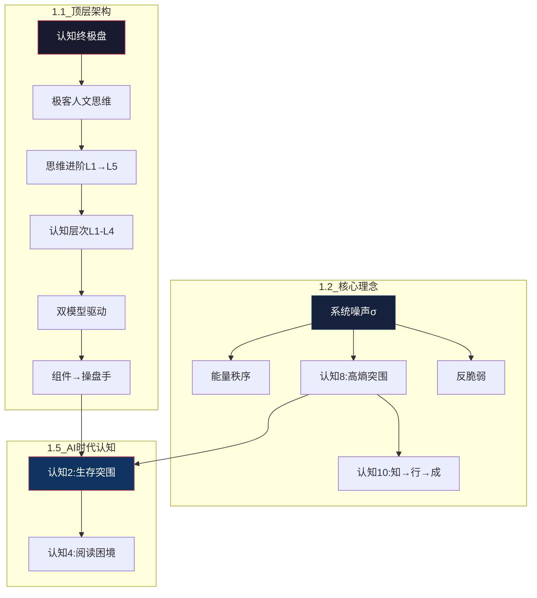

---
level: L2
title: "认知体系与思维模型"
subtitle: "知识图谱的'操作系统层'——定义如何看待世界、如何思考、如何进化"
status: "active"
last_updated: "2026-06-13" # Assuming update date from L1 index
tags:
  - MOC
  - DomainIndex
  - Cognition
  - MentalModel
domain: [认知体系]
parent: "[[L1-README-知识图谱索引.md]]"
children_count: 20
subdomains:
  - "顶层架构·全局总结"
  - "核心理念·熵与双螺旋"
  - "历史宏观视角"
  - "个人画像与批判性分析"
  - "AI时代的阅读与认知"
purpose: "作为'认知'领域的根节点，导航至所有关于思维方式、进化路径和核心哲学的深度笔记。"
---

# 🌳 L2 · 认知体系与思维模型（20 篇）

> **层级**：L2 父树根 ← [L1 根索引](../README-知识图谱索引.md)  
> **定位**：整个知识图谱的「操作系统层」——定义如何看待世界、如何思考、如何进化  
> **覆盖**：5 个子域 · 20 篇笔记（+8 篇新增）  
> **下级**：→ L3 子域索引（1.1 顶层架构 / 1.2 核心理念 / 1.3 历史宏观 / 1.4 个人画像 / 1.5 AI时代认知）

---

## 📂 目录结构

```
L1 ROOT: README-知识图谱索引.md
  └── L2 一、认知体系与思维模型  ← 当前文件
        ├── L3 1.1 顶层架构·全局总结 (6篇，+3)
        │     ├── [精华+][全局总结] 认知体系的终极盘
        │     ├── [精华+][认知演进][策略总结] 极客人文思维的深度梳理
        │     ├── [认知总结] 思维进阶：从执行到架构
        │     ├── [新增] 认知层次与思考深度解析
        │     ├── [新增] 双模型驱动的系统演进
        │     └── [新增] 认知6："工业组件"到"觉醒操盘手"
        │
        ├── L3 1.2 核心理念·熵与双螺旋 (5篇，+3)
        │     ├── [精华+][认知总结] 系统噪声与双螺旋进阶
        │     ├── [无标签] 能量、秩序与进化
        │     ├── [新增] 认知8：高熵环境主权突围
        │     ├── [新增] 认知10：知→行→成三层断裂
        │     └── [新增][阅读] 《反脆弱》核心概念
        │
        ├── L3 1.3 历史宏观视角 (2篇)
        │     ├── [精华+][认知] 功德林战犯改造史
        │     └── [精华][认知演进] 个人突围类比中国发展
        │
        ├── L3 1.4 个人画像与批判性分析 (4篇，+2)
        │     ├── [精华+] 顺势与借势·个人画像
        │     ├── [精华+][认知][PAN] 许家印与PAN构想
        │     ├── [新增] 认知5：自我认知与审视·兴趣与审美
        │     └── [新增] 个人画像与生存突围策略
        │
        └── L3 1.5 AI时代的阅读与认知 (2篇，新增子域)
              ├── [新增] 认知2：从认知提升到生存突围
              └── [新增] 认知4：AI时代下的阅读与认知困境
```

---

## 🔷 1.1 顶层架构 · 全局总结（6 篇）

> **子域定位**：认知体系的"总纲"——从全局视角定义个人进化路径与思维层级的跃迁

### 1.1.1 认知体系的终极盘 `[精华+][全局总结]`

| 维度 | 细化内容 |
|------|----------|
| **文件** | `./[精华+][全局总结]认知体系的终极盘.md` |
| **核心命题** | 生意人 vs 企业家的"杠杆化转型"模型：从"生存驱动"到"价值驱动" |
| **三阶段进化链** | ① **夹缝求生**（获取原始数据：行业痛点/技术瓶颈/人脉网络）→ ② **单点打穿**（数据→算法→可复用工具，技术壁垒产品化而非只存在于脑中）→ ③ **个人IP**（算法→品牌传播，IP本质="行业定价权"而非粉丝数） |
| **防火墙机制** | 建立"现金流-资产"防火墙：利润 30% 强制投入壁垒研发 + 内容杠杆；设定"退出夹缝时间点" |
| **核心公式** | $个人进化 = \frac{技术深度 \times 认知高度}{环境依赖}$ |
| **跨域关联** | → [极客人文思维](#112) · → [高筑墙策略](../知识图谱/L2-三-策略与计划.md) · → [2026生存](../知识图谱/L2-三-策略与计划.md) |

### 1.1.2 极客人文思维的深度梳理 `[精华+][认知演进][策略总结]`

| 维度 | 细化内容 |
|------|----------|
| **文件** | `./[精华+][认知演进][策略总结]极客人文思维的深度梳理--高筑墙，广积粮，缓称王.md` |
| **六大领域** | ① 嵌入式底层技术（RK3588/V4L2/ALSA/DRM）② 认知方法论（第一性原理/因果建模/批判性思维）③ 职场战略与PMP ④ 历史人文与哲学（资治通鉴/王阳明心学）⑤ 生活经营与社会关系 ⑥ AI工具与方法论 |
| **核心结论** | 已从"问题解决者"进化为"系统构建者"——九字方针"高筑墙·广积粮·缓称王"首次在此文中系统化提出 |
| **跨域关联** | → [认知终极盘](#111) · → [思维进阶](#113) · → [Sovereignty OS](../知识图谱/L2-二-核心模型与框架.md) |

### 1.1.3 思维进阶：从执行到架构 `[认知总结]`

| 维度 | 细化内容 |
|------|----------|
| **文件** | `./[认知总结]思维进阶：从执行到架构.md` |
| **四维进阶** | ① 广度→深度（点状突破→底层深挖）② 零散→系统（碎片信息→知识熵减）③ 局部→整体（执行→全局建模）④ 模糊→具体（愿景→灰度认知） |
| **成长定位** | Level 1（模仿者）→ 2（熟练工）→ 3（优秀执行者）→ **Level 4-5（具备战略定力的架构师）** |
| **最终结论** | "技术壁垒为核，哲学修养为盾，系统思维为矛"的个人生存系统 |

### 1.1.4 认知层次与思考深度解析 `[新增]`

| 维度 | 细化内容 |
|------|----------|
| **文件** | `./认知层次与思考深度解析.md` |
| **四层金字塔** | L1（感性表象·70-80%二元思维）→ L2（逻辑经验·15-20%因果链/模式匹配）→ L3（系统结构·3-5%反馈回路/利益相关者依赖/二阶后果）→ L4（哲学本质·<1%第一性原理/跨域不变/文明尺度模式） |
| **自我定位** | 处于 L3-L4 边界——系统建模能力 + 哲学深度 = 稀有组合，但社会孤立（极少同侪） |
| **竞争优势** | L3-L4 边界意味着能同时做"系统架构"和"本质追问"——这在技术圈极罕见 |
| **跨域关联** | → [思维进阶](#113) · → [Sovereignty OS](../知识图谱/L2-二-核心模型与框架.md) |

### 1.1.5 双模型驱动的系统演进 `[新增]`

| 维度 | 细化内容 |
|------|----------|
| **文件** | `./双模型驱动的系统演进.md` |
| **核心贡献** | 将 SCRM+（静态系统映射·诊断状态）与 HSE-DA（动态决策执行·开出行动处方）统一为决策-进化双引擎，含 Mermaid 流程图可视化 |
| **SCRM+ 公式** | $K = \frac{R_{eff} \cdot C_{str}}{1 + \ln(1 + E_{sys})} \cdot \int M_{vel} \, dt$——现实映射×因果强度÷系统熵管理 |
| **执行信条** | 拒绝"逻辑自旋"（过度心智模拟）→ 拥抱快速低成本物理探测 → 从真实摩擦中提取信号 → 反馈校准模型 |
| **跨域关联** | → [SCRM+](../知识图谱/L2-二-核心模型与框架.md#213) · → [HSE-DA](../知识图谱/L2-二-核心模型与框架.md#212) |

### 1.1.6 从"工业组件"到"觉醒操盘手" `[新增][认知]`

| 维度 | 细化内容 |
|------|----------|
| **文件** | `./认知6："工业组件"到"觉醒操盘手".md` |
| **"组件陷阱"机制** | 高技术可靠性 → 被分配"地基"任务（别人做不了）→ 因"太有价值而无法移动"→ 既不获得功劳也不获得晋升流动性 |
| **突围路径** | ① 公开战略思考（非执行细节）② C-level 可见性 ③ 声誉从"资源"升级为"决策者" |
| **杠杆点** | ① 可见的架构决策（非实现细节）② 跨职能影响力（非仅技术正确性）③ 清晰表达的观点（非仅响应驱动） |
| **时间线** | 6-12 个月完成信誉转型——需技术成就（完成深度工作）+ 外部放大（IP存在感） |
| **跨域关联** | → [职业思考系列](../知识图谱/L2-三-策略与计划.md) · → [备胎计划](../知识图谱/L2-三-策略与计划.md) |

---

## 🔷 1.2 核心理念 · 熵与双螺旋（5 篇）

> **子域定位**：认知体系的"底层物理定律"——熵增是不可抗力，双螺旋是对抗熵增的唯一路径

### 1.2.1 系统噪声与双螺旋进阶 `[精华+][认知总结]`

| 维度 | 细化内容 |
|------|----------|
| **文件** | `./[精华+][认知总结]"系统噪声"的讨论...md` |
| **系统噪声 σ** | $\sigma = f(\text{非对称信息}, \text{非理性分配}, \text{不透明规则})$——外部环境随机扰动，无法预测/消除/只能适应 |
| **双螺旋模型** | 认知迭代（α螺旋·理论层）+ 物理执行（β螺旋·实践层）交替上升——像 DNA 双链，单链无法独立进化 |
| **公司=环境API** | 返回 403 时执行本地缓存 Plan B；返回 200 时加速积累 |
| **熵减三路径** | ① 信息降噪（三元解构过滤）② 能量聚焦（单点打穿）③ 结构简化（Sovereignty OS 高内聚低耦合） |

### 1.2.2 能量、秩序与进化 `[无标签]`

| 维度 | 细化内容 |
|------|----------|
| **文件** | `./能量、秩序与人类进化终极追求.md` |
| **三层动力链** | 个人原始动力（基因延续+逃避虚无）→ 国家竞争动力（资源控制+秩序维护）→ 人类终极追求（神格化·摆脱一切母体束缚） |
| **"文明冲突"解构** | = 国家动员底层参与资源争夺的意识形态外衣——亨廷顿理论的深层解构 |
| **秩序本质** | 秩序 = 能量的有序流动——一切"进步"都是对抗熵增的临时胜利 |

### 1.2.3 生存突围：高熵环境主权实现 `[新增][认知]`

| 维度 | 细化内容 |
|------|----------|
| **文件** | `./认知8：生存--2026-年高熵环境下实现主权突围.md` |
| **熵悖论** | 系统越混乱（AI冲击/裁员/监管波动）= 个体可穿越的"裂缝"越多——利好灵活者，利空僵化者 |
| **三大支柱** | ① 技术护城河（RK3588不可替代）② 个人品牌（IP受众=谈判筹码）③ 财务缓冲（3-6月跑道=决策选择权） |
| **2026窗口判断** | AI 使中等技能劳动力商品化→溢价流向 (a) 不可自动化的专业领域 或 (b) 独特定位（IP/品牌/网络） |
| **行动框架** | Q2-Q3: 技术闭环+内容生产 → Q4: IP专业化（Patreon/Substack）→ 2027: 变现或杠杆进入下一角色 |
| **跨域关联** | → [2026生存策略](../知识图谱/L2-三-策略与计划.md) · → [高筑墙](../知识图谱/L2-三-策略与计划.md) |

### 1.2.4 认知与现实的矛盾：知→行→成 `[新增][认知]`

| 维度 | 细化内容 |
|------|----------|
| **文件** | `./认知10：认知与现实的矛盾分析--"知"与"行"、"行"与"成".md` |
| **三层断裂** | 知（认知框架完备但未压力测试·高IQ者常停滞于此）→ 行（物理执行脱节·努力≠进步如果反馈循环断裂）→ 成（"成"是唯一真值指标——如果"知"预测X但"行"产出Y，则"知"不完整/有偏见） |
| **反馈闭环** | 每次低成本探测（行）应触发现实反馈（成），更新模型（知）和下轮迭代（行）——这是 HSE-DA 的哲学基础 |
| **个人意义** | 你已掌握认知框架（知）；关键阶段=持续物理行动（行）+快速反馈整合（成）以闭合循环 |

### 1.2.5 《反脆弱》核心概念与章节解析 `[新增][阅读]`

| 维度 | 细化内容 |
|------|----------|
| **文件** | `./[阅读]《反脆弱》核心概念与章节解析.md` |
| **三元重定义** | 脆弱（负不对称·凹性·压力下崩解）vs 强韧（不变）vs 反脆弱（正凸性·上行>>下行风险·从混乱中获益） |
| **杠铃策略** | 90%极度安全（现金/债券）+ 10%极度杠杆（无限上行）= 捕获黑天鹅而不爆仓 |
| **可选性至上** | 非对称收益的"看涨期权"胜过预测——不预判未来，保持灵活性 |
| **凸性机制** | 损失加速（凹性）；收益加速（凸性）；系统需在压力下保持正凹性 |
| **过度干预危害** | 防火带抑制→森林大火；经济波动平滑→脆弱的大崩溃——与系统噪声理论高度共鸣 |
| **跨域关联** | → [系统噪声](#121) · → [Sovereignty OS](../知识图谱/L2-二-核心模型与框架.md) |

---

## 🔷 1.3 历史宏观视角（2 篇）

### 1.3.1 功德林战犯改造史 `[精华+][认知]`

| 维度 | 细化内容 |
|------|----------|
| **五人物** | 杜聿明（黄埔一期·"我是抗日名将"→"我确实有罪"）/ 王耀武（最积极配合·最早特赦）/ 宋希濂（最曲折·最终彻底转变）/ 黄维（"花岗岩脑袋"·最后特赦）/ 沈醉（军统→"向人民交代"） |
| **四层改造逻辑** | 体力劳动（打破特权意识）+ 思想学习（替换意识形态OS）+ 自我批评（逻辑重构·用自己的嘴否定自己的过去）+ 统战宣传（政治象征·改造成功者的示范效应） |
| **个人映射** | "潜伏"与"待时"——不利环境中保持核心能力，等待时机——与"高筑墙·缓称王"历史互证 |

### 1.3.2 个人突围类比中国发展 `[精华][认知演进]`

| 维度 | 细化内容 |
|------|----------|
| **四大板块映射** | 沪深主板（稳定收入=基本盘）→ 科创板（技术壁垒=护城河）→ 创业板（AI边缘计算=增长极）→ 北交所（细分领域深度=差异化） |
| **核心类比** | 个人突围 = 中国产业升级——从"低端加工"（CRUD业务代码）到"核心技术自主可控"（底层驱动+端侧AI） |

---

## 🔷 1.4 个人画像与批判性分析（4 篇）

### 1.4.1 顺势与借势·个人画像 `[精华+]`

| 维度 | 细化内容 |
|------|----------|
| **画像五维** | 认知建模（公理化系统思维）/ 职业战略（技术掘金者）/ 哲学倾向（知行合一者）/ 审美偏好（权力运行真相）/ 情感觉察（原子化个体） |
| **四大局限** | ① "逻辑的囚徒"——过度依赖理性，屏蔽非理性要素在决策中的合法地位 ② "战术勤奋·战略孤立"——个人能力极强，忽视协作势能 ③ "文化属性自我暗示"——《天道》式宿命论 ④ "理想化与现实丛林冲突"——士大夫式技术情怀 |
| **核心冲突** | 对"真相"的渴求 vs 现实社会"混沌属性"——不可调和的张力，却是创造力的源泉 |

### 1.4.2 许家印与PAN构想 `[精华+][认知][PAN]`

| 维度 | 细化内容 |
|------|----------|
| **8大罪名** | 非法吸收公众存款 / 集资诈骗（最高无期）/ 违法发放贷款 / 违法运用资金 / 欺诈发行证券 / 违规披露 / 职务侵占 / 单位行贿 |
| **心理演化** | 英雄主义→路径依赖→侥幸心理（"太大而不能倒"）→历史宿命（"认罪是最后的止损"） |
| **→PAN连接** | 从许家印的"系统崩溃"反推 PAN 核心价值——不依赖任何单一中心化系统，个体主权协议化，断网可用 |

### 1.4.3 自我认知与审视：兴趣与审美 `[新增][认知]`

| 维度 | 细化内容 |
|------|----------|
| **文件** | `./认知5：自我认知与审视--兴趣与审美.md` |
| **品味即氧气** | 审美选择（书籍品味/话题选择/交友圈层）揭示真实价值观——比目标宣言更可靠 |
| **真伪兴趣鉴别** | 真兴趣触发能量释放（即使困难）；伪兴趣="应该喜欢"→消耗感——怀疑是身份信号而非真正驱动力 |
| **当前组合判断** | RK3588固件 + 政治哲学 + 系统建模 = 连贯集群——暗示对"权力/系统如何实际运作"的真兴趣，而非对"如何破解个人财务"的投机 |

### 1.4.4 个人画像与生存突围策略 `[新增]`

| 维度 | 细化内容 |
|------|----------|
| **文件** | `./个人画像与生存突围策略.md` |
| **核心悖论** | "理性的高手 trapped in a role too small for their caliber"——被认可为高度可靠但长期低配、晋升不足 |
| **三阶段路线** | ① 技术筑墙（V4L2闭环·成为不可替代）→ ② 内容积粮（500+种子粉丝·建立外部品牌）→ ③ 生态突围（IP品牌+退出选择权·逃脱单一雇主依赖） |
| **个人定位升级** | 从"边缘化工程师"→"主权操作者"——通过 HSE-DA 算法 + SCRM+ 模型综合实现 |

---

## 🔷 1.5 AI时代的阅读与认知（2 篇·新增子域）

> **子域定位**：AI 能力爆炸背景下，人类的阅读、认知与自我进化如何重新定义

### 1.5.1 从认知提升到生存突围 `[新增][认知]`

| 维度 | 细化内容 |
|------|----------|
| **文件** | `./认知2：从对认知提升到生存突围相关探讨.md` |
| **精英捕获结构** | 古代"驭民五术"（军事/刑罚/经济/社会/信息控制）→ 现代隐式制度（金融/HR/媒体/算法）——无可见强制，但效果相同 |
| **现代生存悖论** | 个体原子化（无行会保护）+ 系统理性化（无任意怜悯）= 优化压力史无前例 |
| **AI不对称利用** | LLM 擅长综合（输入空间复杂度），但缺乏具身基准校准；人类用 AI 作"全知参考手册"同时保持判断自主权 |
| **近期行动（Q2 2026）** | 产出 3-5 篇"降维打击"技术拆解（V4L2/DRM/ALSA）；积累种子受众 300-500；发布认知综合文章定位"系统思考者+硬科技实践者" |
| **6个月拐点** | 要么 IP 赞助（Patreon/YouTube）$1k+/月被动收入，要么 TCL 晋升/加薪验证外部杠杆 |

### 1.5.2 AI时代下的阅读与认知困境 `[新增][认知]`

| 维度 | 细化内容 |
|------|----------|
| **文件** | `./认知4：AI-时代下的阅读与认知困境.md` |
| **深度阅读不可替代** | ① 训练注意力耐力（不可替代）② 保留原始逻辑链（LLM综合可能丢失作者的证明结构）③ 提供摩擦（文本抗拒你的解读，强制成长） |
| **AI给结果，书给过程** | Transformer 优化水平覆盖；阅读资治通鉴强制垂直深度的因果链——这是两种完全不同的认知训练 |
| **信息折叠现象** | 多数人无法处理密集文本→偏好网红中介摘要→依赖守门人框架偏见→丧失质疑原始来源的能力 |
| **你的非对称优势** | 读者优势=内化全文分析的意愿和能力；多数竞争者通过 TikTok 中介处理信息→这创造非对称信息优势（如果善加杠杆） |

---

## 🗺️ 域内概念图



---

## 📖 域内推荐阅读路线

```
认知筑基路径（由浅入深）：
1. [认知总结] 思维进阶                  ← 理解自己的思维层级
2. 认知层次与思考深度解析              ← 定位L3-L4边界
3. [精华+][认知总结] 系统噪声与双螺旋   ← 掌握核心哲学
4. [阅读] 反脆弱核心概念               ← 塔勒布框架补充
5. [精华+][全局总结] 认知体系的终极盘   ← 建立全局框架
6. 认知10: 知→行→成                   ← 理解反馈闭环的关键
7. 认知8: 高熵环境主权突围            ← 2026行动框架

自我认知路径：
1. [精华+] 顺势与借势·个人画像         ← 批判性自画像
2. 认知5: 兴趣与审美                  ← 真伪兴趣鉴别
3. 个人画像与生存突围策略              ← 最新画像+三阶段路线图
4. 认知6: 组件→操盘手                 ← 身份升级路径
```

---

## 🔗 跨域链接

| 目标 L2 域 | 关联强度 | 关键连接点 |
|-----------|---------|-----------|
| [L2-二 核心模型与框架](./L2-二-核心模型与框架.md) | ⭐⭐⭐⭐⭐ | Sovereignty OS 是本域认知的工程化实现 |
| [L2-三 策略与计划](./L2-三-策略与计划.md) | ⭐⭐⭐⭐⭐ | 认知→策略的直接转化链（认知8→2026行动） |
| [L2-六 历史典籍与社会分析](./L2-六-历史与典籍.md) | ⭐⭐⭐⭐ | 历史视角为认知提供验证数据 |
| [L2-七 实践与IP](./L2-七-实践与IP.md) | ⭐⭐⭐ | 认知→个人IP的落地路径 |

---

> **下一级**：L3 将对 1.1~1.5 五个子域分别展开，每篇笔记的核心概念进一步细化到 4~5 级颗粒度。
