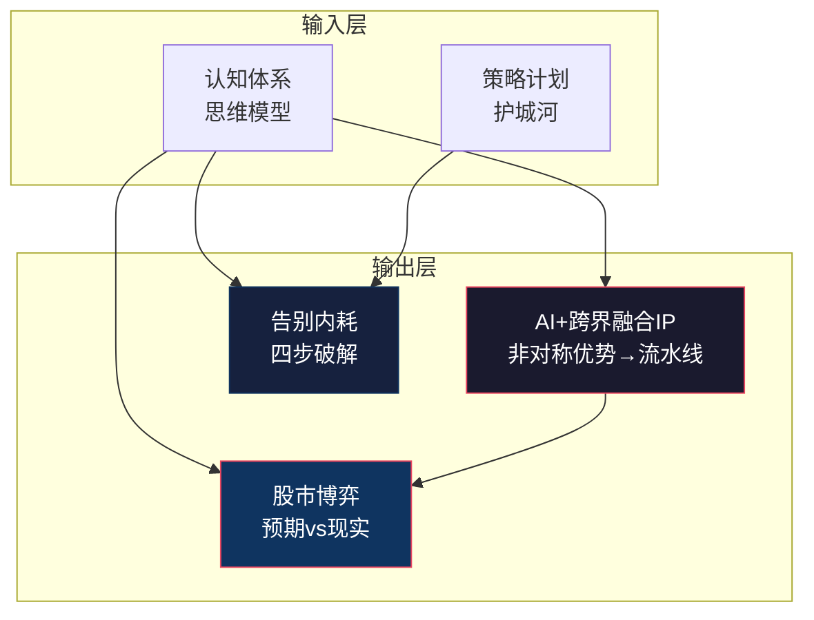

# 🎯 L2 · 实践与 IP（4 篇）

> **层级**：L2 父树根 ← [L1 根索引](../README-知识图谱索引.md)  
> **定位**：知识体系的"输出层"——如何把认知和模型转化为个人IP、行动力和投资判断  
> **覆盖**：4 篇笔记（+1 篇新增）  
> **下级**：→ L3 单篇深度展开

---

## 📂 目录结构

```
L1 ROOT: README-知识图谱索引.md
  └── L2 七、实践与IP  ← 当前文件
        ├── [实践策略][IP] AI+跨界融合IP
        ├── [无标签] 告别内耗，重拾自主权
        ├── [无标签] 股市波动：预期与现实博弈
        └── [新增][精华][IP] AI-agent认知觉醒账号可行性（跨域·参见五）
```

---

## 🔷 7.1 AI+跨界融合IP `[实践策略][IP]`

| 维度 | 细化内容 |
|------|----------|
| **文件** | `./[实践策略][IP]AI+跨界融合.md` |
| **非对称优势** | 技术深度（系统论/算法思维）× 政史哲背景（宏大叙事×深度洞察）× 认知模型（SCRM+/三元解构/HSE-DA=降维打击工具） |
| **IP生产流水线** | ① AI选题（热点×认知模型拆解）→ ② **人工升维**（核心环节·独特洞察·AI无法替代）→ ③ AI脚本生成 → ④ 三渠道分发（B站硬核/小红书美学/抖音唤醒） |
| **IP定位** | "数字时代的跨界清流" / "技术底座的思想解构者"——不是教编程，是教"用程序员思维解构世界" |
| **变现路径** | ① 内容广告分成 ② 技术咨询/企业培训 ③ 知识付费（认知模型课程）④ 与PAN产品联动（硬件+内容生态） |
| **跨域关联** | → [认知终极盘](../知识图谱/L2-一-认知体系与思维模型.md#111) · → [PAN](../知识图谱/L2-五-科技与技术.md#513) |

---

## 🔷 7.2 告别内耗，重拾自主权 `[无标签]`

| 维度 | 细化内容 |
|------|----------|
| **文件** | `./告别内耗，重拾自主权.md` |
| **内耗闭环** | 白天失去自主权（被安排/被流程化）→ 夜晚报复性熬夜（夺回控制感的代偿行为·多巴胺饥渴）→ 极度疲劳（生理+认知双重耗竭）→ 更低效→更深虚无 |
| **四步破解** | ① 流程黑盒自动化（重复性工作封装脚本/模板·消耗最少认知资源）② 剥离自我价值与岗位职能（岗位是公司借你的"壳"）③ 强行截断补偿循环（接受"今天已烂掉"→提前1小时睡）④ 维持Plan B微光（每天15分钟深度思考·关键是连续性） |
| **核心洞察** | "生长感是对抗流水线虚无感最有效的解药"——人不是怕累，是怕累了没有意义 |
| **生理基础** | 报复性熬夜=多巴胺饥渴——白天自主权缺失→多巴胺持续低位→夜晚低成本高回报行为补偿 |
| **跨域关联** | → [系统噪声](../知识图谱/L2-一-认知体系与思维模型.md#121) · → [职场实战](../知识图谱/L2-三-策略与计划.md#313) |

---

## 🔷 7.3 股市波动：预期与现实博弈 `[无标签]`

| 维度 | 细化内容 |
|------|----------|
| **文件** | `./股市波动：预期与现实博弈.md` |
| **事件复盘** | 特朗普携马斯克/黄仁勋访华 → A股4200点（10年最高）→ 次日转绿 |
| **深层原理** | ① "买预期卖事实"（预期阶段定价→事实落地卖出）② 4200心理关口（整数关口技术性阻力）③ 资金面抽水（中盘股领跌·主力净流出1200亿+）④ 确定性观察期 |
| **索罗斯"反身性"** | 不要寻找绝对真相，寻找"偏见"——市场不是对事实的反应，是对"参与者对事实的认知"的反应 |
| **个人映射** | ① 不在"利好"公布后追高 ② 识别"心理关口"（职场/投资/人生都有类似4200点的阻力位）③ 理解"反身性"（你的判断→你的行动→环境影响→验证或否定你的判断） |

---

## 🔷 7.4 AI-agent 认知觉醒账号可行性 `[新增][精华][IP]`（跨域·主条目见五·科技与技术）

| 维度 | 细化内容 |
|------|----------|
| **简要** | Gemini 1.5 集成 Google TV 的多模态 AI-agent 技术方案——AIDL服务+MediaProjection+Function Calling |
| **IP关联** | 此项目的IP维度：利用AI-agent在电视大屏实现"认知觉醒"内容分发——是 AI+跨界融合IP 在硬件端的延伸 |
| **跨域关联** | → [AI跨界IP](#71) · → [Gemini对比](../知识图谱/L2-五-科技与技术.md#532) |
| **详细** | 参见 [L2-五 科技与技术](../知识图谱/L2-五-科技与技术.md#533) |

---

## 🗺️ 域内概念图



---

## 📖 域内推荐阅读路线

```
实践输出路径（从修复到创造）：
1. 告别内耗，重拾自主权               ← 修复底层状态
2. [实践策略][IP] AI+跨界融合IP       ← 建立输出管道
3. 股市波动：预期与现实博弈           ← 拓展认知边界
4. AI-agent认知觉醒账号可行性         ← 技术+IP融合前沿
```

---

## 🔗 跨域链接

| 目标 L2 域 | 关联强度 | 关键连接点 |
|-----------|---------|-----------|
| [L2-一 认知体系与思维模型](./L2-一-认知体系与思维模型.md) | ⭐⭐⭐⭐⭐ | 认知→IP 的直接转化 |
| [L2-三 策略与计划](./L2-三-策略与计划.md) | ⭐⭐⭐⭐ | 内耗破解与职场实战互补 |
| [L2-五 科技与技术](./L2-五-科技与技术.md) | ⭐⭐⭐⭐ | PAN=IP的硬件载体·AI-agent技术方案 |

---

> **下一级**：L3 将对每篇实践笔记展开，细化到具体操作步骤、量化指标、工具链配置、内容日历等 4~5 级颗粒度。
