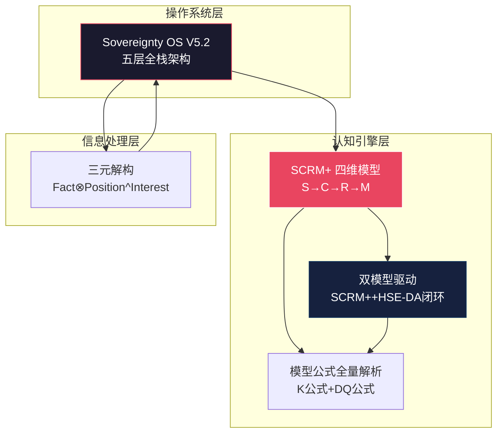

# 🏗️ L2 · 核心模型与框架（5 篇）

> **层级**：L2 父树根 ← [L1 根索引](../README-知识图谱索引.md)  
> **定位**：从哲学思辨到数学公式化的认知工具——Sovereignty OS 是操作系统，SCRM+ 是认知 CPU，HSE-DA 是决策引擎，三元解构是编译原理  
> **覆盖**：2 个子域 · 5 篇笔记（+1 篇新增：双模型驱动）  
> **下级**：→ L3 子域索引（2.1 Sovereignty OS 体系 / 2.2 三元解构与贝叶斯）

---

## 📂 目录结构

```
L1 ROOT: README-知识图谱索引.md
  └── L2 二、核心模型与框架  ← 当前文件
        ├── L3 2.1 Sovereignty OS V5.2 体系 (4篇，+1)
        │     ├── [无标签] Sovereignty OS V5.2 架构
        │     ├── [精华][模型][锁定] 个人主权系统模型解析
        │     ├── [精华++][认知][建模][推理过程] 多维分权验证+SCRM+
        │     └── [新增] 双模型驱动的系统演进
        │
        └── L3 2.2 三元解构与贝叶斯 (1篇)
              └── [精华][建模] 三元解构与贝叶斯多权决策
```

---

## 🔷 2.1 Sovereignty OS V5.2 体系（4 篇）

### 2.1.1 Sovereignty OS V5.2 架构 `[无标签]`

| 维度 | 细化内容 |
|------|----------|
| **文件** | `./Sovereignty-OS-V5.0-架构梳理.md` （注：物理内核演进至最新 V5.2 阶段，并由 `[方法论][建模][画图]我的个人“技能包”梳理` 及 `[杂想杂问]沟通的层级与策略 (1)` 进行深度硬化与落地审计） |
| **核心哲学** | **全面夺回生存的定义权**。核心主导思想升级为：**“向红尘还俗，向不完美兼容，允许肉身的笨拙，在物理层打赢胜仗”**。 |
| **三大运行准则** | ① **高内聚（内核独立）**：技术壁垒（RK3588/V4L2/ALSA/DRM 内核开发）+ 认知模型（SCRM+/HSE-DA）+ 哲学修养（金刚经/存在主义）不可剥离。技术不再是打工的工具，而是系统的**不可替代性本金（$C$）**。<br>② **低耦合（环境兼容）**：公司只是环境的 API，当返回 `403` 时执行本地缓存的 Plan B。在 V5.2 中，**“妥协、补位、陪俗人演戏”是保护核心 Plan B 能量而向组织交纳的“低能耗物业费”**。<br>③ **强兼容（社会接口）**：降级人际接口，使用低能耗语言适配不同环境，不在非正式社交中试图树立认知权威。 |
| **V5.2 逻辑引擎** | ① **TS-MDCV 传感器层**（$Conclusion = Fact \otimes Position^{Interest}$ 差分对冲计算，剥离立场利益提取高保真 $F_{truth}$）→<br>② **DP 诊断引擎**（$\Delta B = |B - B'|$ 透析三棱镜法，将挫败感纯理性色散为偏差形变数据 $\Delta B$，**彻底告别情绪内耗与自我道德审判**）→<br>③ **主权内核**（Kegan 4→5 自主导向心智演进 + RK3588 物理支点双重锚定）→<br>④ **SCRM+ 认知引擎**（S→C→R→M 静态系统诊断与非线性断裂应力破局 $O = M \cdot \sqrt{\sum (S_i + C_j)^R}$）→<br>⑤ **HSE-DA 决策引擎**（从被动熔断全面进化为**主动状态跃迁控制器**：$\text{Evolution\_Trigger} \iff \int \frac{H(t) + E(t)}{C(t) \cdot \eta} dt \geq \Theta$） |
| **三大红尘执行协议** | ① **【灰度协同 API】**：面对琐碎指令（如SID事件），面带温和地接下，快速跑完脚本，将组长（胡宗宪）拉进群协助，用最小的时间消耗把子弹送给组长，获得极深沉的**政治护犊红利**。<br>② **【3秒静音 + 废话垫片协议】**：拦截“用 L4 技术层的超频漏电，来做 L3 创伤的代偿性输血”冲动。聊股票德州时脑子静音 3 秒 Drop 数据包，只输出低能耗废话垫片（“卧槽，真的假的？”）。在微信群讨论技术时实行流量管制（憋算力），强行把表现欲压回后台。<br>③ **【二楼烟友 Bug 物理修复】**：兜里揣上糖走回二楼，大方笑迎烟友，真诚挑明上周的局促，递上薄荷糖。将脑中的“体面、善良”与“肉身动作”完成 **V5.2 硬件级对齐**，在物理层彻底重塑大脑神经回路。 |
| **【系统允许报错】机制** | ① **允许自己眼神躲闪/紧绷**：在心里对自己笑一下：“看，我的杏仁核又在为前年的创伤报时了。没事，我今天就是紧张，但我僵硬得很体面。”<br>② **允许自己在饭桌上把天聊死**：不对抗，不迎合：“这群 Windows 节点果然解码不了老子的 Linux 数据包。今天老子的社交功率调成 0。我只负责专注干完我这碗高维的猪脚饭。” |
| **核心价值** | "自我存在性"是内核（决定主权上限），"社会认同"是接口（决定杠杆效率 $\eta$）。有边界的随和，才是最高阶的主权。 |
| **跨域关联** | → [模型公式](#212) · → [SCRM+详细](#213) · → [三元解构](#221) |

### 2.1.2 个人主权系统模型解析 `[精华][模型][锁定]`

| 维度 | 细化内容 |
|------|----------|
| **文件** | `./[精华][模型][锁定]个人主权系统模型解析.md` |
| **SCRM+ 公式·全量** | $K = \frac{Reff \cdot Cstr}{1 + \ln(1 + Esys)} \cdot \int Mvel \, dt$——Reff（资源效率）/ Cstr（因果强度）/ Esys（系统熵·分母对数级压制）/ Mvel（迭代速度积分） |
| **HSE-DA 公式·全量** | $DQ = \frac{P(H) \cdot \ln(Sd + 1)}{\Delta E} + \sum (\Delta Ri \cdot \eta^i)$——左半：性价比指标；右半：连续博弈复利 |
| **核心洞见** | 不要试图在高熵混乱系统中建立完美理论——去寻找因果结构最清晰的杠杆点 |
| **"锁定"含义** | `[锁定]`=当前认知的"冻结版本"——可迭代，但每次迭代需经过完整 SCRM+ 验证 |
| **跨域关联** | → [Sovereignty OS](#211) · → [三元解构](#221) |

### 2.1.3 多维分权验证+SCRM+ `[精华++][认知][建模][推理过程]`

| 维度 | 细化内容 |
|------|----------|
| **文件** | `./[精华++][认知][建模][推理过程]多维分权事实验证体系...md` |
| **等级说明** | ⭐ `[精华++]` = 整个知识图谱中等级最高的文件——所有策略输出和认知判断的底层公理系统 |
| **SCRM+ 四维** | S（Structure 结构层·静态骨架/边界条件）→ C（Causality 因果层·驱动逻辑/根因网络）→ R（Reality 现实层·能量损耗/冷事实）→ M（Modeling 建模层·可量化可预测的系统动力学路径） |
| **三层递进** | 宏观底座（Sovereignty OS）→ 静态解构（SCRM+ 认知观测层）→ 动态执行（HSE-DA 行动穿透层） |
| **多维分权验证** | 任何结论需经过≥3个独立维度交叉验证：逻辑自洽 + 历史先例 + 实践反馈 |
| **跨域关联** | → [Sovereignty OS](#211) · → [模型公式](#212) |

### 2.1.4 双模型驱动的系统演进 `[新增]`

| 维度 | 细化内容 |
|------|----------|
| **文件** | `./双模型驱动的系统演进.md` |
| **核心贡献** | 将 SCRM+（静态系统映射·诊断状态）与 HSE-DA（动态决策执行·开出行动处方）统一为决策-进化双引擎，含 Mermaid 流程图可视化 |
| **SCRM+ 公式** | $K = \frac{R_{eff} \cdot C_{str}}{1 + \ln(1 + E_{sys})} \cdot \int M_{vel} \, dt$——现实映射×因果强度÷系统熵管理 |
| **HSE-DA 公式** | $DQ = \frac{P(H) \cdot \ln(S_d + 1)}{\Delta E} + \sum (\Delta R_i \cdot \eta^i)$——先验概率×模拟深度÷能量成本 + 连续博弈复利 |
| **模型闭环** | SCRM+ 诊断系统状态 → HSE-DA 开出行动处方 → 现实反馈校准两者 → 迭代 |
| **跨域关联** | → [SCRM+](#213) · → [HSE-DA](#212) |

---

## 🔷 2.2 三元解构与贝叶斯（1 篇）

### 2.2.1 三元解构与贝叶斯 `[精华][建模]`

| 维度 | 细化内容 |
|------|----------|
| **文件** | `./[精华][建模]事实、结论与立场的三元解构方法...md` |
| **核心公式** | $Conclusion = Fact \otimes Position^{Interest}$——结论 = 事实 ⊗ 立场^利益 |
| **三元定义** | $F_t$（可交叉验证的客观事实）/ $C_l$（被立场所扭曲的叙述）/ $P$（观察者的意识形态与利益锚点） |
| **信息解调流程** | 接收外部信息 → 识别叙述者立场 P → 反推利益 Interest → 剥离扭曲层 → 提取高保真事实 $F_t$ |
| **贝叶斯多权决策** | 为每个假设分配先验概率，用新证据持续更新后验——不追求一次绝对正确，追求"比上一次更正确" |
| **TS-MDCV 底层算法** | 三元解构 = Sovereignty OS 传感器层的底层算法——所有外部信息先过三元解构再进入认知引擎 |
| **跨域关联** | → [Sovereignty OS](#211) · → [SCRM+](#213) · → [职场沟通](../知识图谱/L2-四-关系与沟通.md) |

---

## 🗺️ 域内概念图



---

## 📖 域内推荐阅读路线

```
模型筑基路径（从公理到应用）：
1. [精华++][建模] SCRM+与HSE-DA        ← 核心公理系统（最高等级）
2. 双模型驱动的系统演进                ← SCRM++HSE-DA统一框架
3. [精华][建模] 三元解构与贝叶斯        ← 信息编译原理
4. [精华][锁定] 模型公式全量解析        ← 数学公式化
5. Sovereignty OS V5.2                  ← 全栈架构总览
```

---

## 🔗 跨域链接

| 目标 L2 域 | 关联强度 | 关键连接点 |
|-----------|---------|-----------|
| [L2-一 认知体系与思维模型](./L2-一-认知体系与思维模型.md) | ⭐⭐⭐⭐⭐ | 本域是认知体系的工程化实现 |
| [L2-三 策略与计划](./L2-三-策略与计划.md) | ⭐⭐⭐⭐⭐ | HSE-DA 直接驱动策略决策 |
| [L2-四 关系与沟通](./L2-四-关系与沟通.md) | ⭐⭐⭐⭐ | 三元解构在人际场的实战应用 |
| [L2-五 科技与技术](./L2-五-科技与技术.md) | ⭐⭐⭐ | RK3588 是 Sovereignty OS 物理支点 |

---

> **下一级**：L3 将对每篇笔记的公式推导、应用场景、验证案例进一步细化到 4~5 级颗粒度。
