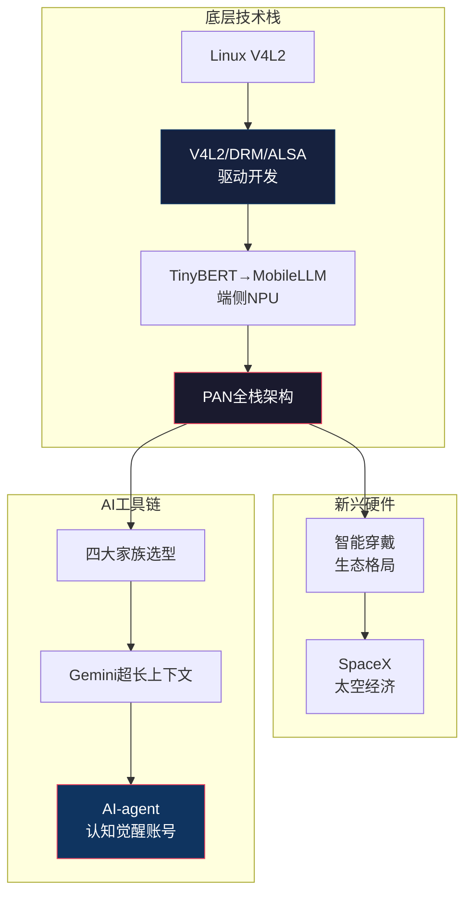

---
level: L2
title: "科技与技术"
date: 2024-07-29
description: "An index for the Science and Technology domain (L2), covering underlying technologies like Linux kernel development (V4L2, DRM), edge AI (TinyBERT, NPU), and Personal Area Network (PAN) architecture, as well as emerging hardware ecosystems and AI model selection."
keywords: [科技, 技术, Linux, V4L2, NPU, Edge AI, PAN, 智能穿戴, SpaceX, Gemini, DeepSeek]
concepts: ["Underlying Technology", "Edge AI", "Personal Area Network (PAN)", "Emerging Hardware", "AI Model Selection", "Technology Stack"]
file_path: "知识图谱/L2-五-科技与技术.md"
---

# 🔬 L2 · 科技与技术（10 篇）

> **层级**：L2 父树根 ← [L1 根索引](../README-知识图谱索引.md)  
> **定位**：技术护城河的物理层——从 Linux 内核到端侧 AI 到 PAN 全栈到新兴硬件生态  
> **覆盖**：3 个子域 · 10 篇笔记（+4 篇新增）  
> **下级**：→ L3 子域索引（5.1 底层技术 / 5.2 新兴硬件与生态 / 5.3 AI选型与工具）

---

## 📂 目录结构

```
L1 ROOT: README-知识图谱索引.md
  └── L2 五、科技与技术  ← 当前文件
        ├── L3 5.1 底层技术 (4篇，+1)
        │     ├── [精华] Linux V4L2 架构解析与图示
        │     ├── [无标签] TinyBERT端侧NPU（智能穿戴眼镜）
        │     ├── [科技][PAN] PAN构想与架构
        │     └── [新增][驱动开发] V4L2/DRM/ALSA与双螺旋计划
        │
        ├── L3 5.2 新兴硬件与生态 (2篇，新增子域)
        │     ├── [新增][科技] 智能穿戴：现状、趋势与前景
        │     └── [新增][科技][经济] SpaceX上市：太空经济的里程碑
        │
        └── L3 5.3 AI选型与工具 (4篇，+2)
              ├── [技巧] AI模型选型与场景应用
              ├── [无标签] Gemini vs DeepSeek
              ├── [新增][精华][IP] AI-agent认知觉醒账号可行性
              └── [新增] （智能穿戴眼镜·端侧AI部分）
```

---

## 🔷 5.1 底层技术（4 篇）

### 5.1.1 Linux V4L2 架构 `[精华]`

| 维度 | 细化内容 |
|------|----------|
| **文件** | `./[精华]Linux-V4L2-架构解析与图示.md` |
| **四层架构** | 用户空间（libv4l/FFmpeg）→ V4L2核心层（ioctl调度/VB2缓冲区管理）→ 驱动层（v4l2_device+v4l2_subdev）→ 硬件层（Sensor/ISP/CSI） |
| **VB2三维抽象** | Queue（队列·管理buffer生命周期QUEUED→DEQUEUED→DONE）/ Buffer（物理内存·一帧图像数据）/ Plane（子划分·YUV中Y平面和UV平面分开存储） |
| **Media Controller** | Entity（实体·Sensor/ISP/DMA）+ Pad（焊盘·输入/输出端口）+ Link（链接·实体间数据流连接）→ 用户态动态配置数据流向 |
| **工程价值** | RK3588 底层驱动开发的核心知识锚点——理解V4L2=理解Linux多媒体子系统的设计哲学 |
| **跨域关联** | → [PAN构想](#513) · → [驱动开发](#514) |

### 5.1.2 TinyBERT端侧NPU `[无标签]`

| 维度 | 细化内容 |
|------|----------|
| **文件** | `./极致端侧本土化架构智能穿戴眼镜.md` |
| **三维预算** | 算力（NPU 0.5-2 TFLOPS→INT8量化延迟10-30ms）/ 内存（量化后15-30MB·需精细管理）/ 功耗（多级唤醒：VAD→NPU→TinyBERT→执行·避免1-2小时耗尽） |
| **架构演变** | 2026节点：TinyBERT（判别式）已受限 → **MobileLLM 125M/350M**（生成式+多模态）更优 |
| **多级唤醒链** | VAD（Always-on·微瓦）→ 关键词检测 → NPU轻量推理 → 确认意图 → 主模型推理 → TTS反馈 |
| **跨域关联** | → [PAN构想](#513) · → [智能穿戴](#521) |

### 5.1.3 PAN构想与架构 `[科技][PAN]`

| 维度 | 细化内容 |
|------|----------|
| **文件** | `./[科技][PAN]梳理我的PAN构想...md` |
| **PAN定义** | Personal Area Network——但概念已超越传统网络：**断网可用、隐私保护、低延迟的本地智能系统** |
| **技术底座** | 芯片（GPU→ASIC/HBM瓶颈）/ 光模块（400G→1.6T/CPO）/ PCB（高频高速板）/ 交换机（InfiniBand无损网络） |
| **五大核心特性** | ① 不依赖云端的本地智能 ② 隐私数据不出设备 ③ 毫秒级响应 ④ 个性化模型持续本地微调 ⑤ 多设备协同（眼镜+手表+手机+PC） |
| **实施路径** | RK3588开发板 → V4L2摄像头驱动 → NPU模型部署 → 多模态交互 → 产品化 |
| **跨域关联** | → [TinyBERT](#512) · → [许家印→PAN](../知识图谱/L2-一-认知体系与思维模型.md#142) |

### 5.1.4 V4L2/DRM/ALSA 驱动开发与双螺旋计划 `[新增][驱动开发]`

| 维度 | 细化内容 |
|------|----------|
| **文件** | `./[驱动开发][整体认识]V4l2DRMALSA与内存管理时序图，双螺旋进阶计划，HSE+DA决策算法.md` |
| **技术栈** | V4L2 buffer pipeline → DMA-BUF 零拷贝 → DRM atomic updates → ALSA ring buffers = 延迟关键型多媒体底层 |
| **泳道流程图** | 跨职能流程图澄清责任、识别瓶颈、可视化系统交接——HSE-DA 在驱动开发中的实战应用 |
| **进化策略** | 阶段1（筑墙）=V4L2掌握+自动诊断；阶段2（积粮）=DRM/DMA-BUF内容生成；阶段3（突围）=平台杠杆IP放大 |
| **个人定位** | 从"搬砖工程师"→"框架重构者"——技术护城河+IP影响力的双重路径 |
| **跨域关联** | → [V4L2架构](#511) · → [双螺旋](../知识图谱/L2-一-认知体系与思维模型.md#121) |

---

## 🔷 5.2 新兴硬件与生态（2 篇·新增子域）

### 5.2.1 智能穿戴：现状、趋势与前景 `[新增][科技]`

| 维度 | 细化内容 |
|------|----------|
| **文件** | `./智能穿戴：现状、趋势与前景.md` |
| **生态格局** | Apple Watch（ECG/AFib检测·生态锁定）+ HarmonyOS WATCH（卫星通讯/血压测量/7-14天续航）+ 小米（性价比复苏·市场份额恢复） |
| **垂直专家** | Garmin GPS多星座+超跑算法——户外/军事垂直无挑战者 |
| **品类颠覆** | 智能戒指（Oura/Samsung Galaxy Ring）="零屏·睡眠优先"互补腕带；AR眼镜（Meta×Ray-Ban/Rokid）=轻形态AI助手+记录 |
| **未来向量** | 从"数据采集器"→"医疗级健康监测"+"始终在线的AI副驾驶"；电池/形态仍是首要约束 |
| **跨域关联** | → [PAN构想](#513) · → [TinyBERT](#512) |

### 5.2.2 SpaceX上市：太空经济的里程碑 `[新增][科技][经济]`

| 维度 | 细化内容 |
|------|----------|
| **文件** | `./SpaceX-上市：太空经济的里程碑.md` |
| **商业模式转型** | Starlink 9500+卫星+1000万+订户=75%营收来自订阅（高利润阶段）——从发射服务商到通信运营商 |
| **系统护城河** | 低轨频率分配（先占优势）+ 可复用 Starship（90%成本削减）= 全球70%商业发射能力垄断 |
| **生态耦合** | X（Twitter）数据 + Starlink 物理空间数据 + xAI 计算 = "数字+物理空间智能垄断" |
| **脆弱性风险** | 马斯克单点故障治理（79%投票控制）；地缘/监管摩擦；被动指数基金强制进入高估IPO |
| **跨域关联** | → [PAN构想](#513) · → [智能穿戴](#521) |

---

## 🔷 5.3 AI选型与工具（4 篇）

### 5.3.1 AI模型选型 `[技巧]`

| 维度 | 细化内容 |
|------|----------|
| **文件** | `./[技巧]AI-模型选型与场景应用.md` |
| **四大家族** | Gemini（原生多模态+1-2M上下文/Google生态）/ ChatGPT（MoE+RL推理o1/万能接口）/ Claude（宪法AI/代码质量最高/人文理解最真）/ DeepSeek（MLA+高效MoE/极致性价比/中文深度优化） |
| **场景选型矩阵** | 长文档全量分析→Gemini；高难度算法→ChatGPT o1；高质量代码→Claude；中文硬核技术→DeepSeek |
| **模型协作** | 不要只用一家——用 Gemini 做全局分析，Claude 写代码，ChatGPT 做算法验证，DeepSeek 做中文优化 |

### 5.3.2 Gemini vs DeepSeek `[无标签]`

| 维度 | 细化内容 |
|------|----------|
| **文件** | `./Gemini-vs-DeepSeek-Context-and-Capability.md` |
| **断层式优势** | Gemini 超长上下文（1-2M+ tokens）：从 RAG（断章取义）→"全量加载"（整座图书馆装进大脑） |
| **个人化价值** | 跨周期"思维影子"——全量对话输入后 AI 能基于认知轨迹给出定制化决策——"个人化数字孪生"的使能条件 |
| **PAN关联** | 超长上下文技术是 PAN 中"个人知识库实时推理"的基础 |
| **DeepSeek优势** | 中文深度优化 / 极致性价比 / 开源生态 / 国内访问稳定 |

### 5.3.3 AI-agent 认知觉醒账号可行性 `[新增][精华][IP]`

| 维度 | 细化内容 |
|------|----------|
| **文件** | `./[精华][IP]职场思考3：利用AI-agent做认知觉醒账号可行性.md` |
| **技术方案** | Gemini 1.5 集成 Google TV（GTV/Android U）——AIDL 服务定义 + Privileged App 权限 + MediaProjection API 屏幕捕获 |
| **多模态数据流** | Firebase Vertex AI SDK + Live WebSocket API 低延迟音频流 + Function Calling 控制 TV 硬件（亮度/输入切换） |
| **硬件加速路径** | Gemini Nano 卸载到 NPU 处理简单命令，云端回退处理复杂生成 |
| **DRM摩擦** | Widevine L1 保护内容（Netflix）不可截屏→需元数据变通方案 |
| **跨域关联** | → [AI跨界IP](../知识图谱/L2-七-实践与IP.md) · → [Gemini vs DeepSeek](#532) |

---

## 🗺️ 域内概念图



---

## 📖 域内推荐阅读路线

```
技术纵深路径：
1. [精华] Linux V4L2 架构              ← 技术锚点
2. [驱动开发] V4L2/DRM/ALSA双螺旋计划   ← 驱动实战+进化路线
3. TinyBERT NPU部署                    ← 端侧AI推理
4. [科技][PAN] PAN技术方案             ← 全栈架构设计
5. 智能穿戴：现状趋势前景              ← 硬件生态理解

AI工具路径：
1. [技巧] AI模型四家对比               ← 工具选型
2. Gemini vs DeepSeek                  ← 生产力工具深度对比
3. AI-agent认知觉醒账号可行性          ← 技术+IP融合落地
```

---

## 🔗 跨域链接

| 目标 L2 域 | 关联强度 | 关键连接点 |
|-----------|---------|-----------|
| [L2-二 核心模型与框架](./L2-二-核心模型与框架.md) | ⭐⭐⭐⭐ | RK3588=Sovereignty OS 物理支点 |
| [L2-三 策略与计划](./L2-三-策略与计划.md) | ⭐⭐⭐⭐ | 边缘AI=技术护城河方向 |
| [L2-一 认知体系与思维模型](./L2-一-认知体系与思维模型.md) | ⭐⭐⭐ | PAN=许家印分析的正面方案 |
| [L2-七 实践与IP](./L2-七-实践与IP.md) | ⭐⭐⭐ | AI-agent→IP生产流水线 |

---

> **下一级**：L3 将对每篇笔记的技术细节、代码示例、架构图进一步细化到 4~5 级颗粒度。
