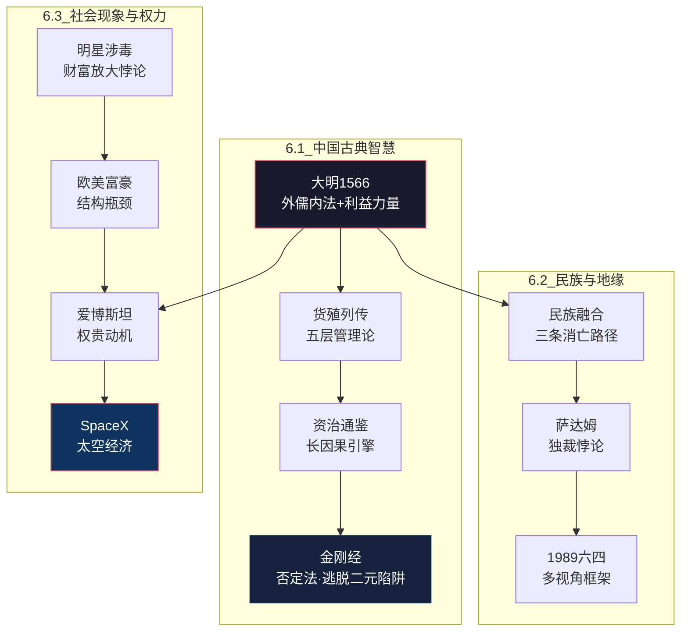

# 📜 L2 · 历史典籍与社会分析（11 篇）

> **层级**：L2 父树根 ← [L1 根索引](../README-知识图谱索引.md)  
> **定位**：两千年中国政治哲学 + 近现代地缘政治 + 社会现象深层分析——为 SCRM+ 的 S/C/R 各层提供多维度验证数据  
> **覆盖**：3 个子域 · 11 篇笔记（+9 篇新增）  
> **下级**：→ L3 子域索引（6.1 中国古典智慧 / 6.2 民族与地缘 / 6.3 社会现象与权力）

---

## 📂 目录结构

```
L1 ROOT: README-知识图谱索引.md
  └── L2 六、历史典籍与社会分析  ← 当前文件
        ├── L3 6.1 中国古典智慧 (4篇，+2)
        │     ├── [精华++][历史] 大明1566权力矩阵
        │     ├── [典籍] 货殖列传深度解析
        │     ├── [新增][典籍] 资治通鉴：治国兴衰的鉴戒
        │     └── [新增][哲学] 金刚经：来历、内容与境界
        │
        ├── L3 6.2 民族与地缘政治 (3篇，新增子域)
        │     ├── [新增][历史] 中国历史民族融合深度分析
        │     ├── [新增][地缘] 萨达姆：争议与遗产
        │     └── [新增][历史] 1989六四运动多角度解析
        │
        └── L3 6.3 社会现象与权力分析 (4篇，新增子域)
              ├── [新增][社会] 明星涉毒现象的社会学分析
              ├── [新增][社会] 欧美富豪行业分布差异分析
              ├── [新增][社会] 爱博斯坦事件：权贵动机解析
              └── [新增][科技][经济] SpaceX上市：太空经济的里程碑
```

---

## 🔷 6.1 中国古典智慧（4 篇）

> **子域定位**：两千年中国政治哲学——大明权力矩阵为 SCRM+ 提供 S/C 层验证，货殖列传和资治通鉴为因果层提供历史数据，金刚经为认知解放提供哲学工具

### 6.1.1 大明1566权力矩阵 `[精华++][历史]`

| 维度 | 细化内容 |
|------|----------|
| **文件** | `./[精华++][历史]从《大明1566》权力矩阵、个体主权协议化全栈架构.md` |
| **等级说明** | ⭐ `[精华++]` = 历史维度的最高等级文件——将古代权力运作逻辑转化为现代个人主权的协议化架构 |
| **外儒内法** | 儒家（UI界面：合法性/伦理/忠孝）+ 法家（核心内核：法/术/势控制官僚体系）——给老百姓看的壳 vs 给官僚体系运行的底层代码 |
| **竞争真相** | "过江之鲫"=竞争者基数巨大；"举步维艰"=你不是和一个人竞争，而是和一整个利益共同体博弈 |
| **成功公式** | $成功 = 天时 \times 地利 \times 人和$——乘法关系，任一为零整体归零 |
| **利益与力量** | "利益"是动能（所有行为的终点），"力量"是杠杆（分配资源+制定规则的能力）——当力量不足以保护利益时，你就是"改稻为桑"中的灾民 |
| **个体主权协议化** | 从大明权力矩阵推导——像国家之间签协议一样，个体与平台/公司/社会之间需要明确的协议边界 |
| **跨域关联** | → [货殖列传](#612) · → [SCRM+](../知识图谱/L2-二-核心模型与框架.md#213) · → [嘉靖职场逻辑](../知识图谱/L2-三-策略与计划.md#321) |

### 6.1.2 货殖列传深度解析 `[典籍]`

| 维度 | 细化内容 |
|------|----------|
| **文件** | `./[典籍]司马迁《货殖列传》深度解析.md` |
| **五层管理论** | "善者因之（最优·顺应规律）> 利导之（利益引导）> 教诲之（教育说服）> 整齐之（规范约束）> 与之争（最劣·直接对抗·系统熵急剧上升）" |
| **物质决定论** | "仓廪实而知礼节"——道德不是空中楼阁，是物质基础溢出后的上层建筑（与马斯洛需求层次异曲同工） |
| **素封思想** | 无爵位但通过经营获财富 = 无冕之王——2000年前就提出"能力>头衔"的价值观 |
| **核心名句** | "天下熙熙，皆为利来；天下攘攘，皆为利往"——人类行为根本驱动力：不回避"自私"底层事实，不用虚伪道德说教掩盖现实 |
| **现代映射** | 自由放任→个人主权"内核独立"；"善者因之"→不对抗系统，顺势而为 |
| **跨域关联** | → [大明1566](#611) · → [高筑墙](../知识图谱/L2-三-策略与计划.md#312) |

### 6.1.3 资治通鉴：治国兴衰的鉴戒 `[新增][典籍]`

| 维度 | 细化内容 |
|------|----------|
| **文件** | `./资治通鉴：治国兴衰的鉴戒.md` |
| **核心原则** | 礼不可不明——制度清晰（役制/人事/财政）是稳定前提；模糊权威=系统衰变 |
| **人才哲学** | 德胜才——品德>才能；无德之才最危险（"小人有才最危险"）——与现代企业"价值观>绩效"异曲同工 |
| **因果引擎** | 不同于史记的传记焦点，资治通鉴追踪政策→10-20年后果链——揭示延迟效应，训练"长因果"思维 |
| **治理张力** | 忧劳兴国，逸豫亡身——警惕 vs 疲劳：过度谨慎=机会损失；自满=危机 |
| **现代应用** | 对组织治理的元模型：清晰>英雄主义；系统>个体；长期后果>季度光学 |
| **跨域关联** | → [大明1566](#611) · → [货殖列传](#612) |

### 6.1.4 金刚经：来历、内容与境界 `[新增][哲学]`

| 维度 | 细化内容 |
|------|----------|
| **文件** | `./金刚经：来历、内容与境界.md` |
| **对话起源** | 非著作经文而是佛陀对话实录（如苏格拉底法）；公元前5世纪口传→鸠摩罗什汉译——解决"意识如何不依附而锚定"的终极认识论问题 |
| **否定法** | "应无所住而生其心"——条件性行动，不固化为意识形态；每个教义（佛/法/僧）被否定三次（X是真实的/X不是真实的/X既不是也不是）——训练心智逃脱二元陷阱 |
| **实践意义** | 对战略家/操作者：逃脱"信念陷阱"（将临时模型当作本体论真理），保持认知谦逊；迭代而不钙化 |
| **跨域关联** | → [三元解构](../知识图谱/L2-二-核心模型与框架.md#221) · → [SCRM+](../知识图谱/L2-二-核心模型与框架.md#213) |

---

## 🔷 6.2 民族与地缘政治（3 篇·新增子域）

> **子域定位**：从中国民族融合到中东地缘到近代政治事件——为 SCRM+ 的 R 层（现实层）提供"能量损耗"的历史案例

### 6.2.1 中国历史民族融合深度分析 `[新增][历史]`

| 维度 | 细化内容 |
|------|----------|
| **文件** | `./[历史]中国历史民族融合深度分析.md` |
| **三条消亡路径** | ① 血缘/文化融合（鲜卑·北魏汉化）② 西迁（突厥/匈奴·远离汉文明核心）③ 现代民族地位维持（蒙古/满族/壮族·政治边界保护） |
| **"胡化"互惠** | 汉人采用"胡服骑射"（赵武灵王）+ 唐朝尚武文化 = 非单向汉化而是双向共同进化——拉莫尔"长城张力"理论 |
| **征服王朝** | 元/清建模"双重治理"：儒家官僚治汉，草原逻辑治边疆——体系化的"接口兼容" |
| **跨域关联** | → [大明1566](#611) · → [资治通鉴](#613) |

### 6.2.2 萨达姆：争议与遗产 `[新增][地缘]`

| 维度 | 细化内容 |
|------|----------|
| **文件** | `./萨达姆：争议与遗产.md` |
| **发展成就** | 建立中东最先进医疗/教育基础设施；世俗化执法（相对海湾标准提升女性地位）；石油资金驱动的现代化 |
| **强制机器** | 无情清洗内部异见（Anfal运动·对库尔德人化学武器）；逊尼少数（20%）统治什叶多数（60%）=永久宗派压力 |
| **战争螺旋** | 两伊战争（1980-88）耗尽国家财政→入侵科威特（1990）→海湾战争+制裁→13年经济围困 |
| **悖论** | 独裁维持社会稳定（对比2003后伊拉克混乱·100万+死亡）；现代化需铁腕资源提取+消灭竞争权力中心 |
| **跨域关联** | → [大明1566](#611) · → [功德林](../知识图谱/L2-一-认知体系与思维模型.md#131) |

### 6.2.3 1989六四运动多角度解析 `[新增][历史]`

| 维度 | 细化内容 |
|------|----------|
| **文件** | `./1989六四运动多角度解析.md` |
| **多视角框架** | 中国政府（"政治风波"·稳定压倒一切）/ 西方（"民主运动"·意识形态滤镜）/ 学生（"爱国改革斗争"·反腐+民主）/ 党内各派（改革派vs保守派路线斗争） |
| **经济背景** | 1988年价格闯关冲击（18.5%通胀）+ 官倒腐败（"官倒"）= 群众不满土壤 |
| **意识形态催化** | 胡耀邦去世+1980年代文化自由化+西方民主思想接触 |
| **跨域关联** | → [功德林](../知识图谱/L2-一-认知体系与思维模型.md#131) · → [大明1566](#611) |

---

## 🔷 6.3 社会现象与权力分析（4 篇·新增子域）

> **子域定位**：从明星涉毒到权贵性侵到富豪分布到太空经济——将 SCRM+ 分析框架应用于当代社会现象

### 6.3.1 明星涉毒现象的社会学分析 `[新增][社会]`

| 维度 | 细化内容 |
|------|----------|
| **文件** | `./明星涉毒现象的社会学分析.md` |
| **财富放大悖论** | 暴富消除生存压力→精英地位寻求者诉诸极端刺激（毒品）对抗享乐适应——常规快乐已耗尽，极端性成为必需 |
| **亚文化机制** | 毒品被重新框定为"顶级圈层社交入场券"+ 伪智识神话（"增强创造力"） |
| **监管转折（2014）** | 劣迹艺人永久封禁+公众监督（朝阳群众）→成本收益翻转：涉毒=职业擦除，不再是声誉丑闻 |
| **权力侵蚀效应** | 名人在泡沫环境中产生虚假豁免感（"PR 能搞定"）+ 法外心态 |
| **跨域关联** | → [许家印](../知识图谱/L2-一-认知体系与思维模型.md#142) · → [爱博斯坦](#633) |

### 6.3.2 欧美富豪行业分布差异分析 `[新增][社会]`

| 维度 | 细化内容 |
|------|----------|
| **文件** | `./欧美富豪行业分布差异分析.md` |
| **结构瓶颈** | 金融/VC/科技领域存在"非正式守门"（校友网络/家族办公室）偏爱既有资本→黑人被转向透明选拔领域（体育/音乐/娱乐） |
| **路径依赖** | 白人财富=继承→复利（资本收益/股息/信托二代三代）；黑人财富=自创→IP依赖（不可继承/流动性风险/清算风险） |
| **代际传递** | 白人富豪家族通过信托维持财富2-3代；黑人自创财富在没有制度捕获的情况下面临消散 |
| **核心洞察** | 准入差距反映的不是能力而是守门机制中的**结构摩擦** |
| **跨域关联** | → [货殖列传](#612) · → [许家印](../知识图谱/L2-一-认知体系与思维模型.md#142) |

### 6.3.3 爱博斯坦事件：权贵动机解析 `[新增][社会]`

| 维度 | 细化内容 |
|------|----------|
| **文件** | `./爱博斯坦事件：权贵动机解析.md` |
| **四层激励架构** | ① **上帝情结**：超越法律/道德规范=终极权力展示 ② **互黑保险**：共享犯罪=不可破的信任纽带 ③ **保险库**：视频档案=对对手的杠杆 ④ **享乐升级**：常规快乐耗尽→极端性成为必需 |
| **结构性使能** | 离岸司法管辖+私人设施+情报联系+财富不透明=零问责直到外部压力（金融家竞争/贝索斯敲诈曝光） |
| **沉默机制** | 受害者地理隔离；证人通过参与被妥协；检察官面临外交/国家安全障碍 |
| **解体模式** | 网络靠爱博斯坦积极角色维系；被捕/自杀后无法人连续性→犯罪状态崩溃 |
| **跨域关联** | → [许家印](../知识图谱/L2-一-认知体系与思维模型.md#142) · → [大明1566](#611) |

### 6.3.4 SpaceX上市：太空经济的里程碑 `[新增][科技][经济]`

| 维度 | 细化内容 |
|------|----------|
| **文件** | `./SpaceX-上市：太空经济的里程碑.md` |
| **商业模式转型** | Starlink 9500+卫星+1000万+订户=75%营收来自订阅（高利润阶段）——从发射服务商到通信运营商 |
| **系统护城河** | 低轨频率分配（先占优势）+ 可复用 Starship（90%成本削减）= 全球70%商业发射能力垄断 |
| **生态耦合** | X（Twitter）数据 + Starlink 物理空间数据 + xAI 计算 = "数字+物理空间智能垄断" |
| **脆弱性风险** | "Fast Entry"规则强制被动指数基金进入高估IPO；马斯克单点故障治理（79%投票控制）；地缘/监管摩擦 |
| **跨域关联** | → [PAN构想](../知识图谱/L2-五-科技与技术.md) · → [智能穿戴](../知识图谱/L2-五-科技与技术.md) |

---

## 🗺️ 域内概念图



---

## 📖 域内推荐阅读路线

```
中国古典智慧路径：
1. [精华++][历史] 大明1566权力矩阵  ← 权力运作底层逻辑
2. [典籍] 货殖列传深度解析         ← 经济行为根本驱动力
3. [典籍] 资治通鉴治国兴衰         ← 治理智慧的"长因果"训练
4. [哲学] 金刚经境界               ← 认知解放的哲学工具

地缘与社会分析路径：
1. [历史] 民族融合深度分析         ← 理解"中国性"的多元构成
2. [地缘] 萨达姆争议与遗产         ← 独裁+现代化的悖论
3. [社会] 爱博斯坦权贵动机         ← 权力腐败的极限案例
4. [社会] 欧美富豪分布差异         ← 结构性不平等的微观机制
5. SpaceX太空经济                  ← 科技垄断的未来形态
```

---

## 🔗 跨域链接

| 目标 L2 域 | 关联强度 | 关键连接点 |
|-----------|---------|-----------|
| [L2-二 核心模型与框架](./L2-二-核心模型与框架.md) | ⭐⭐⭐⭐⭐ | 历史为 SCRM+ 提供验证数据 |
| [L2-一 认知体系与思维模型](./L2-一-认知体系与思维模型.md) | ⭐⭐⭐⭐ | 功德林改造史与权力矩阵互证 |
| [L2-三 策略与计划](./L2-三-策略与计划.md) | ⭐⭐⭐⭐ | 大明1566→嘉靖职场逻辑 |
| [L2-五 科技与技术](./L2-五-科技与技术.md) | ⭐⭐⭐ | SpaceX→PAN 技术路径对标 |

---

> **下一级**：L3 将对每篇历史/典籍/社会分析笔记展开，细化到具体历史事件、人物关系图、权力运作流程图、现代映射对照表等 4~5 级颗粒度。
