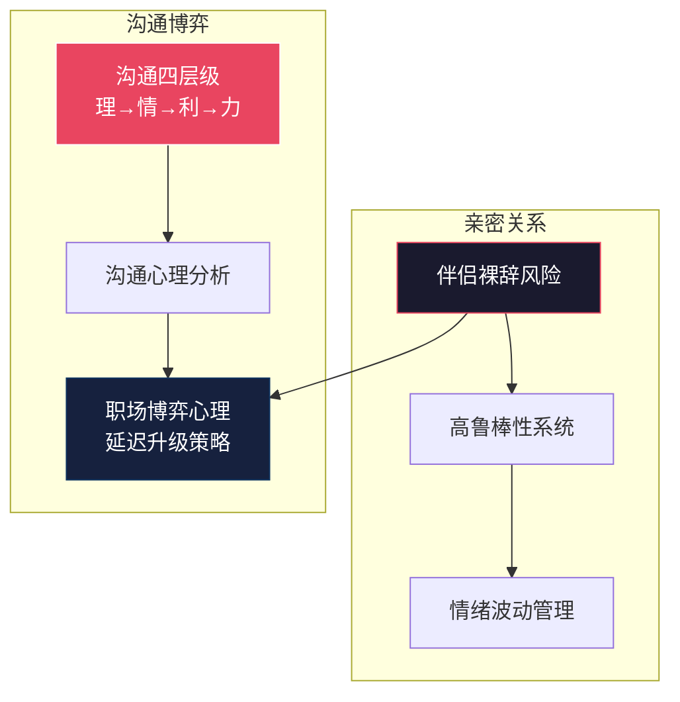

---
level: L2
title: "关系与沟通"
subtitle: "将核心模型应用于人际场——定义亲密关系的高鲁棒性架构，以及职场沟通的博弈策略。"
status: "active"
last_updated: "2026-06-13"
tags:
  - MOC
  - DomainIndex
  - Relationship
  - Communication
  - GameTheory
domain: [关系与沟通]
parent: "[[L1-README-知识图谱索引.md]]"
children_count: 6
subdomains:
  - "亲密关系"
  - "沟通博弈"
  - "风险分析"
  - "情绪管理"
purpose: "作为所有人际交互模型的根节点，导航至亲密关系维护、职场沟通策略、谈判技巧和心理博弈的深度分析。"
---

# 👥 L2 · 关系与沟通（6 篇）

> **层级**：L2 父树根 ← [L1 根索引](../README-知识图谱索引.md)  
> **定位**：SCRM+ 和三元解构在人际场的实战落地——亲密关系是软系统的硬架构，沟通博弈是职场生存的微操作  
> **覆盖**：2 个子域 · 6 篇笔记（+1 篇新增）  
> **下级**：→ L3 子域索引（4.1 亲密关系 / 4.2 沟通博弈）

---

## 📂 目录结构

```
L1 ROOT: README-知识图谱索引.md
  └── L2 四、关系与沟通  ← 当前文件
        ├── L3 4.1 亲密关系 (3篇)
        │     ├── [精华][亲密关系] 伴侣裸辞转律师的风险分析
        │     ├── [精华][亲密关系] 聊得来、处得来与高鲁棒性
        │     └── [精华] 亲密关系中的情绪波动与冲突管理
        │
        └── L3 4.2 沟通博弈 (2篇，+1)
              ├── [杂想杂问] 沟通的层级与策略
              ├── [关系博弈] 沟通心理与行为分析
              └── [新增][职场] 职场博弈与心理驱动解析
```

---

## 🔷 4.1 亲密关系（3 篇）

### 4.1.1 伴侣裸辞转律师的风险分析 `[精华][亲密关系]`

| 维度 | 细化内容 |
|------|----------|
| **文件** | `./[精华][亲密关系]伴侣裸辞转律师的风险分析.md` |
| **四大风险** | ① 行业冷启动成本（33岁大龄新人+实习期收入断崖·律师前3年收入极低）② 双重不确定性（你PlanB+她裸辞=容错率骤降至危险水平）③ 避让期限制（2年不得代理原法院案件）④ 情绪负反馈链（裸辞爽感→2周后焦虑→自我怀疑→关系张力） |
| **错峰策略** | 你先完成 Plan B 切换（技术壁垒建成+收入稳定），她再启动转型——任何时候只有一个人在"高风险区" |
| **跨域关联** | → [高鲁棒性](#412) · → [情绪管理](#413) |

### 4.1.2 聊得来、处得来与高鲁棒性 `[精华][亲密关系]`

| 维度 | 细化内容 |
|------|----------|
| **文件** | `./[精华][亲密关系]聊得来、处得来与共同目标...md` |
| **三重锚点** | ① 聊得来（信息层·认知带宽匹配="数据链路层"）→ ② 处得来（行为层·生活习惯/消费观念/冲突模式兼容="传输层"）→ ③ 共同目标（战略层·方向性共识="应用层"） |
| **鲁棒性形式化** | $R_{system} = f(\text{核心功能维持}, \text{恢复速度}, \text{适应性调整})$——允许阶段性失调，只要恢复力够强 |
| **动态平衡** | 不追求"永远不吵架"，追求"吵完能恢复"——鲁棒性≠刚性，鲁棒性=弹性+恢复力 |

### 4.1.3 情绪波动与冲突管理 `[精华]`

| 维度 | 细化内容 |
|------|----------|
| **文件** | `./[精华]亲密关系-亲密关系中的情绪波动与冲突管理.md` |
| **女性生理周期** | 雌激素→血清素"断崖式离场"（黄体期后期）；PMS（70-90%）→ PMDD（DSM-5收录·5-8%临床级别） |
| **男性IMS** | 睾酮日周期（晨高夜低）+ 年周期（秋高春低）+ 压力效应（皮质醇↑抑制睾酮→易怒/疲惫） |
| **三大心理学原理** | ① 认知评价理论（生理不适→外部归因→情绪爆发）② 自我耗竭（白天消耗自控力→晚上对伴侣失控）③ 躯体化（心理痛苦→身体症状） |
| **实战应用** | 识别生理周期节奏→"高危窗口"降低冲突期望；区分"激素驱动"vs"真实矛盾"；建立"情绪缓冲区"（物理隔离15分钟） |

---

## 🔷 4.2 沟通博弈（3 篇）

### 4.2.1 沟通的层级与策略 `[杂想杂问]`

| 维度 | 细化内容 |
|------|----------|
| **文件** | `./[杂想杂问]沟通的层级与策略.md` |
| **四层级** | 以理服之（逻辑·对工程师最有效）→ 以情动之（道德·适合长期信任但易被利用）→ **以利诱之（底层逻辑·最核心——"天下熙熙皆为利来"）** → 以力逼之（规则/武力·最后手段，一旦使用关系只剩交易） |
| **"切香肠战术"** | 老赖通过不断微小违约测试底线，让你因"为这点小事不值得闹"不断后退——温水煮青蛙 |
| **反切香肠** | 第一次微小违约就用最大力度回应——让对方知道底线不可测试 |
| **层级选择策略** | 优先"以利诱之"（最有效且不伤关系），次选"以理服之"，避免直接"以力逼之" |

### 4.2.2 沟通心理与行为分析 `[关系博弈]`

| 维度 | 细化内容 |
|------|----------|
| **文件** | `./[关系博弈]沟通心理、行为分析与改善.md` |
| **四维拆解** | ① 管理逻辑（权力单点对接+责任闭环）② 认知效率（结果导向型领导的信息过载主动防御）③ 组织政治（信任红利缺失→"空气化"处理）④ 沟通错位（技术思维vs决策思维） |
| **三大实战策略** | ① 功夫下在会前（会议前单独向决策者汇报）② 将"细节"转化为"风险/成本"语言 ③ 放弃技术叙事改用管理叙事 |
| **跨域关联** | → [沟通层级](#421) · → [三元解构](../知识图谱/L2-二-核心模型与框架.md#221) |

### 4.2.3 职场博弈与心理驱动解析 `[新增][职场]`

| 维度 | 细化内容 |
|------|----------|
| **文件** | `./职场博弈与心理驱动解析.md` |
| **公共排名现象** | 排行榜效应触发基因级地位焦虑——来自跨部门任务数据的同侪压力，超越逻辑不解除杏仁核 |
| **控制恢复冲动** | 将被动压力反应重构为"通过超预期表现回收代理权"——将羞辱转化为自我导向的掌控 |
| **延迟升级策略** | 扣留曝光度直到高层关注被捕获→廉价信号努力呈现为危机救援（更高感知价值） |
| **隐藏风险** | 频繁使用→中层管理者察觉被当作"传输媒介"→硬化行政约束→缩小未来谈判空间 |
| **最优形式** | 保留用于高赌注时刻；维护善意层；确保跟进执行的声誉 |
| **跨域关联** | → [沟通心理](#422) · → [职场实战](../知识图谱/L2-三-策略与计划.md) |

---

## 🗺️ 域内概念图



---

## 📖 域内推荐阅读路线

```
关系筑基路径：
1. [精华][亲密关系] 聊得来、处得来、高鲁棒性  ← 关系系统理论
2. [精华] 情绪波动与冲突管理                   ← 生理心理基础
3. [精华][亲密关系] 伴侣裸辞风险分析           ← 重大决策实战
4. [关系博弈] 沟通心理与行为分析               ← 职场沟通核心
5. [杂想杂问] 沟通的层级与策略                 ← 沟通框架补充
6. 职场博弈与心理驱动解析                      ← 微观心理战
```

---

## 🔗 跨域链接

| 目标 L2 域 | 关联强度 | 关键连接点 |
|-----------|---------|-----------|
| [L2-二 核心模型与框架](./L2-二-核心模型与框架.md) | ⭐⭐⭐⭐ | 三元解构=沟通信息过滤算法 |
| [L2-三 策略与计划](./L2-三-策略与计划.md) | ⭐⭐⭐⭐ | 职场实战与沟通博弈互补 |
| [L2-一 认知体系与思维模型](./L2-一-认知体系与思维模型.md) | ⭐⭐⭐ | 系统噪声理论→关系鲁棒性 |

---

> **下一级**：L3 将对每篇笔记的具体策略、对话模板、场景案例进一步细化到 4~5 级颗粒度。
