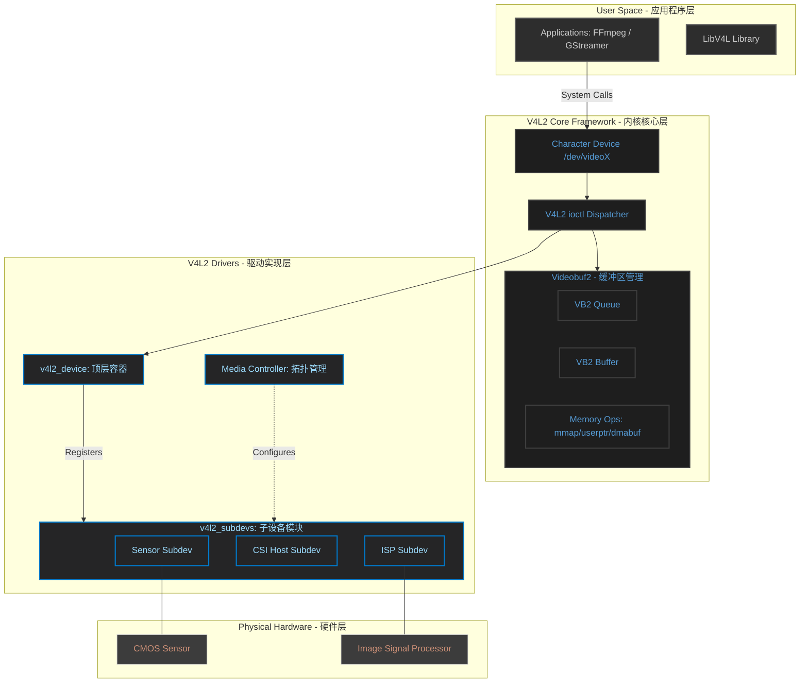
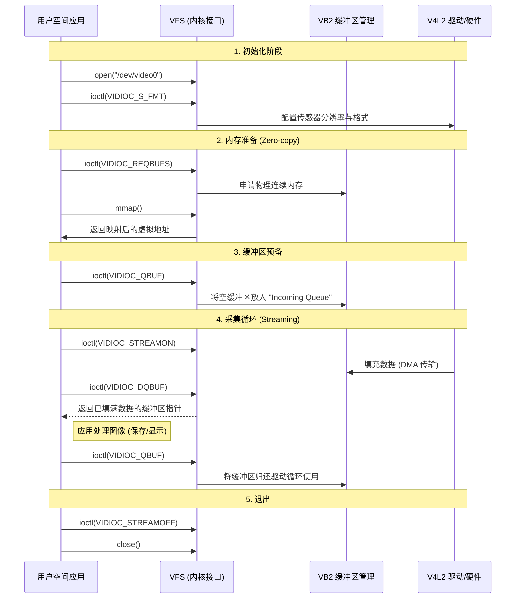
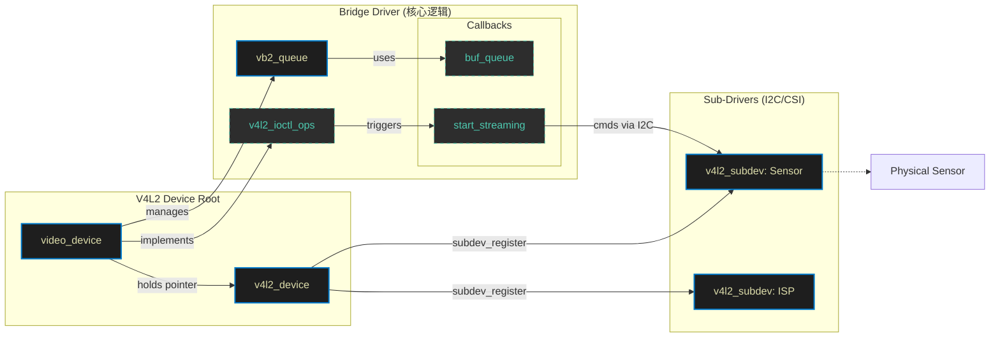
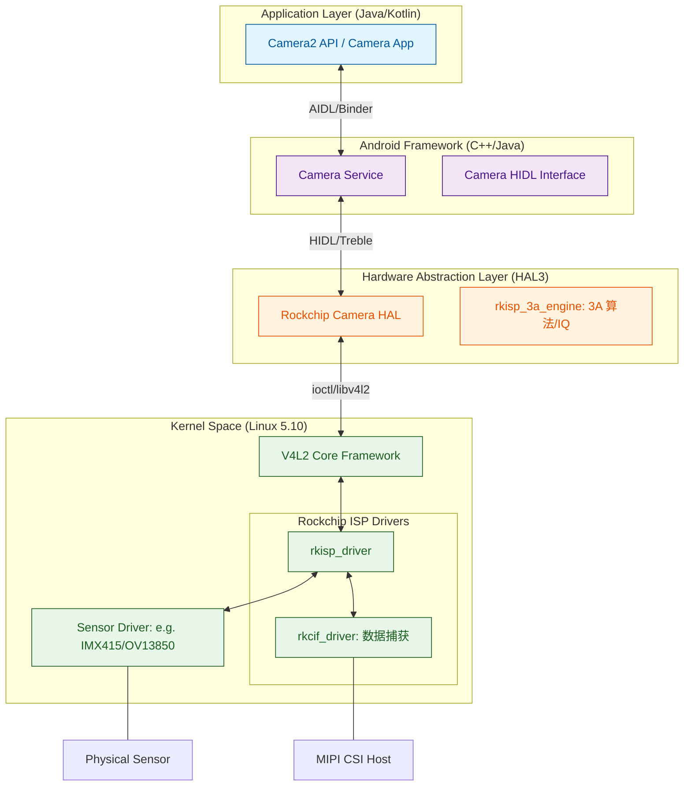
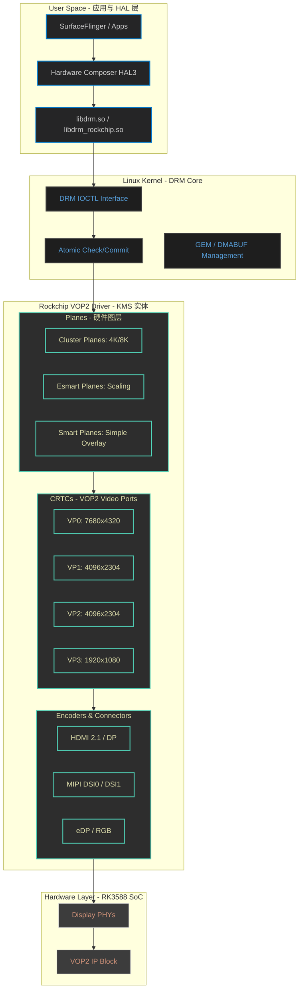

> From: https://gemini.google.com/app/a2c083bd16263574?utm_source=app_launcher&utm_medium=owned&utm_campaign=base_all

# you asked

message time: 2026-04-09 19:00:09

给出Linux V4L2架构图，有哪些部分，各部分什么关系，各个部分内部是什么样架构，内部子部件又有什么关系与联系，先文字说明，再画出图，以mermaid形式给出，以Windows暗色主题风格，检查语法并纠正

---

# gemini response

Linux Video4Linux2 (V4L2) 是内核中处理视频设备（摄像头、解码器、编码器等）的标准框架。它不仅支持流媒体捕获，还涵盖了输出、叠加以及复杂的媒体管线管理。

---

## 1. V4L2 架构核心组成部分

V4L2 整体架构可以分为以下四个层级：

### A. 用户空间层 (User Space)
用户通过标准的系统调用（`open`, `ioctl`, `mmap`, `read`, `write`）与内核进行交互。
*   **V4L2 库 (libv4l):** 提供兼容性层，将各种像素格式转换为标准格式。
*   **应用程序:** 如 FFmpeg, GStreamer 或自定义的相机应用。

### B. V4L2 核心层 (V4L2 Core)
位于内核空间，作为中转站，将通用的系统调用映射到具体的驱动操作。
*   **字符设备处理:** 注册 `/dev/videoX` 设备节点。
*   **ioctl 调度:** 处理数百个 V4L2 命令（如 `VIDIOC_QUERYCAP`, `VIDIOC_S_FMT`）。
*   **VB2 (Video Buffer 2):** 核心中的核心，负责视频缓冲区的分配、管理和流控制。

### C. 驱动层 (V4L2 Drivers)
这是针对具体硬件实现的逻辑。
*   **V4L2 Device:** 代表一个完整的视频硬件实例。
*   **V4L2 Sub-devices (Subdev):** 代表硬件中的子模块（如 Sensor、ISP、CSI 接收器）。

### D. 硬件层 (Hardware)
物理实体，包括图像传感器 (Sensor)、图像信号处理器 (ISP) 等。

---

## 2. 内部架构与子部件关系

### 1. V4L2 Device 与 Sub-device 的关系
一个复杂的 SOC 视频子系统通常由一个 **v4l2_device** 容器和多个 **v4l2_subdev** 组成。这种“总分结构”允许驱动程序模块化：例如，同一个 Sensor 驱动可以配合不同的 ISP 驱动工作。

### 2. Videobuf2 (VB2) 内部逻辑
VB2 将缓冲区管理抽象为三个维度：
*   **Queue (队列):** 管理流的状态（开始/停止）。
*   **Buffer (缓冲区):** 存储实际图像数据。
*   **Plane (平面):** 支持多平面格式（如 Y, U, V 分开存储）。

### 3. Media Controller (媒体控制器)
对于复杂设备，V4L2 引入了 Media Controller 框架。它通过 **Entity (实体)**, **Pad (引脚)** 和 **Link (连接)** 来描述硬件管线的拓扑结构，允许用户动态配置数据流向。

---

## 3. V4L2 架构图 (Mermaid)

以下图表展示了从用户空间到硬件实体的逻辑拓扑及内部组件联系。



### 关键组件联系说明：
1.  **控制流:** 用户空间通过 `ioctl` 下达指令，经由 **V4L2 Core** 转发给特定的 **v4l2_subdev**。
2.  **数据流:** 硬件产生的数据通过 **VB2** 管理的缓冲区，利用 `DMA` 或 `mmap` 技术高效地传递给用户空间。
3.  **拓扑流:** **Media Controller** 负责在多个子设备（Subdevs）之间建立逻辑连接（Links），定义图像是从哪个 Sensor 流向哪个 ISP 节点的。

---

# you asked

message time: 2026-04-09 19:00:37

为我讲解V4L2视频采集的具体工作流程，尽量详细，让我有一个全景式认识，以前问要求画图说明

---

# gemini response

要深入理解 V4L2（Video for Linux 2）的视频采集流程，可以将其想象成一个**“从快门到内存”**的精密流水线。

以下是 V4L2 视频采集的完整生命周期，分为四个阶段：

---

## 第一阶段：设备初始化与能力评估 (Discovery)

在采集数据之前，程序必须先了解硬件“能做什么”。

1.  **打开设备节点 (`open`)**：
    通常是 `/dev/video0`。打开后获得一个文件描述符 `fd`。
2.  **查询设备属性 (`VIDIOC_QUERYCAP`)**：
    检查设备是否支持视频捕捉能力（`V4L2_CAP_VIDEO_CAPTURE`）以及流 IO（`V4L2_CAP_STREAMING`）。
3.  **枚举与设置格式 (`VIDIOC_ENUM_FMT` / `VIDIOC_S_FMT`)**：
    *   **协商：** 应用询问硬件支持哪些像素格式（如 YUYV, MJPEG, NV12）和分辨率。
    *   **锁定：** 调用 `S_FMT` 结构体，确定最终的采集宽度、高度和像素格式。这一步会触发驱动内部对硬件参数（如时钟、带宽）的预计算。


---

## 第二阶段：缓冲区管理 (The Buffer Logic)

这是 V4L2 最核心的部分，涉及内核空间与用户空间的数据交换。由于视频数据量巨大，通常使用 **VB2 (Video Buffer 2)** 框架进行零拷贝处理。

1.  **请求缓冲区 (`VIDIOC_REQBUFS`)**：
    应用向内核申请若干个缓冲区（通常为 3-4 个，形成一个环形队列）。你需要指定存储类型，最常用的是 `V4L2_MEMORY_MMAP`（内存映射）。
2.  **查询与映射 (`VIDIOC_QUERYBUF` / `mmap`)**：
    *   内核分配物理内存。
    *   应用调用 `mmap` 将内核空间的这部分地址映射到用户空间，使应用能直接访问视频帧。
3.  **缓冲区入队 (`VIDIOC_QBUF`)**：
    在启动前，应用必须将空的缓冲区“还”给内核，告诉驱动：“这些盘子是空的，等会儿把菜装在这里。”

---

## 第三阶段：数据流控与采集循环 (Streaming)

一旦准备就绪，流水线正式启动。

1.  **开启流 (`VIDIOC_STREAMON`)**：
    驱动通知底层硬件（如传感器和 ISP）开始工作。硬件开始产生中断，将视频数据填充到之前“入队”的空缓冲区中。
2.  **数据交互循环 (QBUF/DQBUF)**：
    *   **DQBUF (出队)：** 应用调用 `VIDIOC_DQBUF`。如果一帧画面采集完成，该调用会返回。此时，应用可以处理该缓冲区里的图像数据。
    *   **处理：** 应用读取内存中的像素。
    *   **QBUF (再入队)：** 处理完后，应用再次调用 `VIDIOC_QBUF`，将缓冲区标记为空，循环使用。
    > **关键点：** 这是一套生产者-消费者模型。驱动是生产者，应用是消费者。


---

## 第四阶段：收尾与释放 (Clean up)

1.  **停止流 (`VIDIOC_STREAMOFF`)**：
    硬件停止传输，丢弃未完成的帧。
2.  **解除映射与资源回收 (`munmap` / `close`)**：
    断开内存映射，关闭文件描述符，内核释放 VB2 管理的物理内存。

---

## V4L2 采集流程全景图 (Mermaid)



### 核心子部件关系总结：
*   **Video Device 节点：** 你的操作入口。
*   **v4l2_subdev：** 控制 Sensor（曝光、增益）或 ISP。
*   **Videobuf2 (VB2)：** 负责最繁重的内存管理，确保数据从硬件 DMA 到内存时的高效性。
*   **Media Controller：** 如果是复杂 SoC（如 RK3588, IMX6），它负责把多个子设备连接成一条“线”。

你目前是在进行具体的驱动开发，还是在应用层调用 V4L2 接口？

---

# you asked

message time: 2026-04-09 19:01:16

具体的驱动开发

---

# gemini response

既然你专注于**驱动开发**，那么我们的视角需要从 `ioctl` 调用深入到内核对象（Kernel Objects）的构建、回调函数的实现以及硬件中断的处理。

在驱动层面，V4L2 实际上是一个**“框架抽象层”**。你的工作是实现一套标准的回调函数（`v4l2_ioctl_ops` 和 `v4l2_subdev_ops`），并交由 V4L2 核心层来调用。

---

## 1. 驱动开发的核心生命周期

### A. 驱动注册阶段 (Probe)
当内核检测到硬件（通过 Device Tree 匹配）时，驱动开始初始化：
1.  **分配并初始化 `v4l2_device`**：这是总控制结构体，代表整个视频设备。
2.  **注册子设备 `v4l2_subdev`**：如果你的硬件包含 Sensor 或 ISP，需要为它们注册子设备。
3.  **初始化 `video_device`**：这是暴露给用户空间的 `/dev/videoX` 节点。
    *   绑定 `v4l2_file_operations`（处理 `open/release`）。
    *   绑定 `v4l2_ioctl_ops`（处理 `enum_fmt`, `s_fmt`, `streamon` 等）。
4.  **初始化 `videobuf2` 队列**：配置 `vb2_queue` 结构体，指定内存类型和回调。

### B. 设置格式 (S_FMT)
当应用调用 `VIDIOC_S_FMT` 时：
1.  内核通过 `v4l2_ioctl_ops` 找到你的驱动函数。
2.  **验证参数：** 检查硬件是否支持该分辨率。
3.  **配置硬件：** 驱动需要通过 I2C 向 Sensor 发送指令，配置窗口大小和输出格式。

---

## 2. 核心数据流控制：VB2 框架
在驱动开发中，最难也最关键的是处理 **Buffer 状态机**。VB2 将其简化为三个主要回调：

1.  **`queue_setup`**: 确认缓冲区数量和大小。
2.  **`buf_prepare`**: 缓冲区从用户空间到达内核，通常在这里做 `dma_map`。
3.  **`buf_queue`**: **关键步骤！** 将缓冲区放入驱动维护的一个“待处理队列”中。此时硬件还没有拿到数据，只是排队。
4.  **`start_streaming`**: 开启硬件 DMA。你需要从待处理队列中取出第一个 Buffer 的物理地址，写入硬件寄存器。


---

## 3. 中断处理与 Buffer 归还
当硬件完成一帧数据的传输（通常是收到 VSync 中断）时：
1.  **触发中断处理程序 (ISR)**：
    *   在 ISR 中，驱动通过 `vb2_buffer_done(vb, VB2_BUF_STATE_DONE)` 将当前 Buffer 标记为完成。
    *   此时，该 Buffer 会自动进入 VB2 的“已完成队列”，等待用户空间 `DQBUF`。
2.  **更新地址**：驱动立即从待处理队列中取出下一个 Buffer 的物理地址，更新到硬件寄存器，实现**乒乓缓冲 (Ping-Pong Buffer)**，确保采集不掉帧。

---

## 4. 驱动层拓扑架构图 (Mermaid)

作为驱动开发者，你需要关注的是这些结构体之间的**指针指向**和**回调链**：



## 5. 驱动开发的建议路径
1.  **理解 `v4l2_subdev`**：先写好 Sensor 的 I2C 驱动，确保能通过 `v4l2-ctl` 看到它。
2.  **搞定 `vb2` 内存模型**：根据硬件是否支持 IOMMU，选择 `vb2_dma_contig`（物理连续内存）或 `vb2_dma_sg`（离散内存）。
3.  **同步机制**：确保你的 `start_streaming` 和中断处理函数在操作 Buffer 队列时没有竞态（Race Condition）。

你目前是在为哪款 SoC（如 Rockchip, Allwinner, NXP）或者哪种总线（CSI, USB/UVC）开发驱动？

---

# you asked

message time: 2026-04-09 19:02:41

Rk3588 android 12用的是哪个版本Linux内核，列出从驱动底层到应用接口的代码路径

---

# gemini response

在 RK3588 的 Android 12 生态中，Rockchip 官方推荐并广泛使用的是 **Linux Kernel 5.10**（具体通常为 `5.10.66` 或更高版本的 LTS 分支）。

为了让你对“视频采集”在 Android 系统中的流转有一个深度理解，我梳理了从最底层的硬件寄存器操作到最上层 Java 应用的代码路径。

---

## 1. 代码路径全图 (Android 12 + RK3588)

在 RK3588 上，相机系统被称为 **RKISP (Rockchip ISP)**。它的复杂性在于硬件不再只是一个简单的传感器，而是一个包含 ISP、VICAP、CSI-Host 等多个模块的复杂管线。

### A. 内核空间 (Kernel Space)
这是你作为驱动开发者的主战场。
*   **Sensor 驱动:** `drivers/media/i2c/ovxxxxx.c` (例如 `ov13850.c`)
    *   *职能：* 负责 I2C 配置、上电时序、曝光/增益控制。
*   **ISP 核心驱动:** `drivers/media/platform/rockchip/isp/`
    *   *职能：* 处理图像信号（降噪、白平衡等），管理 `v4l2_subdev`。
*   **VICAP/CSI 驱动:** `drivers/media/platform/rockchip/cif/`
    *   *职能：* 负责 MIPI 协议层解析及数据写入内存 (DMA)。
*   **设备树:** `arch/arm64/boot/dts/rockchip/rk3588-evb.dtsi`
    *   *职能：* 定义硬件连接关系（哪个 Sensor 挂在哪个 CSI 口）。

### B. 硬件抽象层 (HAL - Hardware Abstraction Layer)
Android 12 使用的是 **Camera HAL3** 架构。
*   **HAL 代码路径:** `hardware/rockchip/camera/`
*   **关键组件:** 
    *   `CameraHal/`: 处理 Android 框架层下发的请求。
    *   `AAL/`: (Adapter Abstraction Layer) 适配层。
    *   **IQ (Image Quality) 文件:** `external/camera_engine_rkisp/` (包含 3A 算法的库，是瑞芯微的核心闭源/半开源部分)。

### C. 框架层与应用层 (Framework & App)
*   **Camera Service:** `frameworks/av/services/camera/libcameraservice/`
*   **Framework API:** `frameworks/base/core/java/android/hardware/camera2/`
*   **应用层接口:** `android.hardware.camera2.CameraDevice`

---

## 2. 纵向调用关系图 (Mermaid)




---

## 3. 给驱动开发者的关键提示

如果你正在修改驱动，请务必关注以下**两个关键路径**：

1.  **Media Controller 拓扑：**
    在 RK3588 上，你不能直接 `open /dev/video0` 就能出图。你需要使用 `media-ctl` 工具来配置路径。
    *   内核路径：`drivers/media/mc/`
    *   检查命令：`media-ctl -p -d /dev/media0`

2.  **3A 算法库关联：**
    Sensor 驱动仅仅负责吐出 RAW 数据。如果图像偏绿、太暗或没对焦，通常不是 Sensor 驱动的问题，而是 **ISP 驱动** 与 **HAL 层 rkisp_engine** 之间的 `ioctl` 通讯（通过 `metadata` 传递）出现了不匹配。
    *   调试位置：`/vendor/etc/camera/` 下的 XML 效果文件。

**总结：** 在 Android 12/RK3588 架构下，驱动开发者的工作通常集中在 `kernel-5.10/drivers/media/` 目录下，并需要配合 `hardware/rockchip/camera/` 进行联调。

---

# you asked

message time: 2026-04-09 23:23:46

Rk3588 android 12，列出DRM架构从驱动底层到应用接口架构图，有哪些部分，各部分什么关系，各个部分内部是什么样架构，内部子部件又有什么关系与联系，先文字说明，再画出图，以mermaid形式给出，以Windows暗色主题风格，检查语法并纠正

---

# gemini response

在 RK3588 Android 12 系统中，显示系统基于 Linux 的 **DRM/KMS (Direct Rendering Manager / Kernel Mode Setting)** 框架。RK3588 使用了新一代的显示控制器 **VOP2 (Video Output Processor Gen2)**。

---

## 1. DRM 架构文字说明

DRM 架构可以从逻辑上分为四个层级，从用户空间的应用接口一直延伸到硬件底层。

### A. 用户空间层 (User Space)
*   **Android App / Framework:** 最终的显示请求者（如 SurfaceFlinger）。
*   **HWC (Hardware Composer) HAL:** Android 特有的显示合成模块。它通过调用下层的 libdrm 接口，决定哪些图层由 GPU 合成，哪些直接交给硬件 VOP2 合成。
*   **libdrm:** 对内核 DRM ioctl 的封装库，提供 `drmMode*` 系列 API。

### B. 内核 DRM 核心层 (DRM Core)
*   **DRM Core:** 提供通用的对象管理（Plane, CRTC, Encoder, Connector）和内存管理（GEM/Prime）。
*   **Atomic API:** 现代 DRM 的核心，允许一次性提交多个状态更改（如位置、缩放、Alpha），保证显示的原子性。

### C. 驱动层 (DRM Driver / VOP2)
这是针对 RK3588 硬件实现的逻辑，主要包含：
*   **GEM (Graphics Execution Manager):** 管理显存分配。
*   **VOP2 Driver:** RK3588 的核心显示驱动，负责操作硬件寄存器。
*   **KMS (Kernel Mode Setting) 实体：**
    *   **Plane (图层):** RK3588 有多种 Plane（Cluster, Esmart, Smart），支持缩放、格式转换。
    *   **CRTC (控制器):** 对应 VOP2 的 Video Port (VP0, VP1, VP2, VP3)，负责将多个 Plane 混合。
    *   **Encoder (编码器):** 将 CRTC 输出的数据转换为特定协议信号（如 HDMI, MIPI, DP, RGB）。
    *   **Connector (连接器):** 代表物理接口，处理热插拔（HPD）和读取 EDID。

### D. 硬件层 (Hardware - RK3588)
*   **VOP2 Hardware:** 物理混合引擎。
*   **Display Interfaces:** 物理接口硬件（HDMI 2.1 TX, MIPI DSI, DP 1.4, eDP）。

---

## 2. 内部子部件的关系与联系

1.  **数据流向:** `Plane` (数据源) $\to$ `CRTC` (混合/合成) $\to$ `Encoder` (协议转换) $\to$ `Connector` (物理输出)。
2.  **绑定关系:**
    *   一个 **Plane** 可以在不同的 **CRTC** 之间切换（取决于 VOP2 的硬件资源限制）。
    *   一个 **CRTC** 代表一路独立的显示通道（RK3588 最多支持 4 路独立显示）。
    *   **Encoder** 和 **Connector** 通常成对出现，描述具体的硬件链路。
3.  **VOP2 特性:** RK3588 的 VOP2 引入了 **Video Port (VP)** 的概念。VP0 通常性能最强，支持 8K 输出。不同的 Plane 资源通过 `possible_crtcs` 掩码绑定到不同的 VP 上。

---

## 3. DRM 架构图 (Mermaid)



### 架构细节补充：
*   **VOP2 内部逻辑:** 在 RK3588 中，VOP2 采用了分层的资源分配机制。**Cluster Plane** 通常拥有独立的计算资源，适合处理高分辨率 RAW 数据；而 **Smart Plane** 资源受限，多用于简单的 UI 图层。
*   **Atomic Commit:** 当 HWC 调用 `Atomic Commit` 时，驱动会先进行 `Check`（检查带宽、时钟、平面重叠是否超出硬件限制），通过后再写入寄存器。
*   **Linux 版本:** 在 RK3588 Android 12 中，底层运行的是 **Linux 5.10 LTS** 内核，其 DRM 驱动位于 `drivers/gpu/drm/rockchip/` 目录下。

---

# you asked

message time: 2026-04-09 23:26:18

为我讲解V4L2视频采集的具体工作流程，尽量详细，让我有一个全景式认识，给出拓扑图， 以前问要求画图说明，以Windows暗色主题风格，检查语法并纠正

---

# gemini response

在驱动开发视角下，RK3588 的 V4L2 视频采集流程远比普通的 USB 摄像头复杂。它涉及到 **MIPI PHY**、**VICAP (Video Capture)**、**ISP (Image Signal Processor)** 以及 **Memory Management** 的深度协同。

以下是针对驱动开发的全景式解析。

---

## 1. V4L2 采集全景工作流程

在 Linux 5.10 内核中，采集流程遵循 **“配置拓扑 -> 申请资源 -> 启动流 -> 中断驱动数据流”** 的逻辑。

### 第一阶段：媒体拓扑配置 (Media Controller)
由于 RK3588 内部有多个 ISP 和 CIF (Camera Interface) 模块，硬件管线不是固定的。
*   **Entity 绑定：** 驱动需要将 `ov13850` (Sensor) 的 Pad 连接到 `rkcif_mipi_lvds` (CSI接收端)，再连接到 `rkisp_mainpath`。
*   **格式协商：** 通过 `v4l2_subdev_pad_ops` 接口在各级实体间传递 `v4l2_mbus_framefmt`，确保从 Sensor 到 ISP 的输出宽度、高度、媒体总线代码（如 `MEDIA_BUS_FMT_SBGGR10_1X10`）一致。

### 第二阶段：缓冲区准备 (VB2 Framework)
驱动开发者主要实现在 `vb2_ops` 回调中：
*   **`queue_setup`：** 确定 Buffer 数量（Android 至少需要 3-4 个以防丢帧）和大小。
*   **`buf_prepare`：** 获取 Buffer 的 DMA 地址。RK3588 驱动通常使用 `vb2_dma_contig` 或 `iommu` 映射，确保硬件可以直接访问这块内存。

### 第三阶段：流启动 (Streaming On)
1.  **子设备启动：** 按照 **Sensor -> CSI-Host -> ISP -> DMA** 的反向顺序调用 `s_stream(1)`。
2.  **配置寄存器：** 将第一组 VB2 缓冲区的物理地址写入 RKISP/VICAP 的 DMA 目标寄存器。
3.  **硬件使能：** 开启硬件的 Global Enable 位，Sensor 开始通过 MIPI 差分信号发送数据。

### 第四阶段：中断处理与乒乓切换 (Interrupt & Ping-Pong)
这是驱动最核心的运行时逻辑：
*   **Frame Start 中断：** 硬件告知已开始接收一帧。
*   **Frame End / MIPI Error 中断：** 
    *   驱动调用 `vb2_buffer_done`，将当前填充完的 Buffer 挂入完成队列。
    *   **关键点：** 驱动必须在下一帧到来前，将队列中下一个空闲 Buffer 的地址填入硬件“影子寄存器 (Shadow Registers)”，实现**乒乓缓冲**，防止覆盖正在传输的数据。

---

## 2. RK3588 驱动拓扑架构图

此图展示了从物理信号到用户空间数据缓冲区的完整路径，采用了符合你要求的 Windows 暗色风格设计逻辑。

```mermaid
graph TD
    %% 样式定义
    classDef sensorStyle fill:#3e3e42,stroke:#007acc,stroke-width:2px,color:#cccccc;
    classDef mipiStyle fill:#252526,stroke:#4ec9b0,stroke-width:2px,color:#4ec9b0;
    classDef ispStyle fill:#1e1e1e,stroke:#dcdcaa,stroke-width:2px,color:#dcdcaa;
    classDef memStyle fill:#2d2d2d,stroke:#ce9178,stroke-width:2px,color:#ce9178;

    subgraph Hardware_Layer [Physical Hardware]
        Sensor[CMOS Sensor: RAW Data]
        MIPI_DPHY[MIPI D-PHY / C-PHY]
    end

    subgraph Kernel_Driver_Space [Linux Kernel 5.10 - V4L2/MC]
        direction TB
        
        subgraph Subdevs [Sub-Devices 控制流]
            S_Subdev[Sensor Subdev: I2C Control]
            CSI_Subdev[CSI-2 Receiver Subdev]
            ISP_Subdev[ISP Subdev: 3A/Scaling]
        end

        subgraph Data_Path [Data Path 数据流]
            VICAP[VICAP: Capture / DMA Engine]
            VB2_Q[VB2 Queue: Buffer Management]
        end
        
        MC[Media Controller: Topology Manager]
    end

    subgraph User_Space [Android 12 - App/HAL]
        V4L2_Node[/dev/videoX]
        RKHAL[Rockchip Camera HAL3]
    end

    %% 关系连接
    Sensor -->|MIPI Signals| MIPI_DPHY
    MIPI_DPHY --> CSI_Subdev
    CSI_Subdev --> ISP_Subdev
    ISP_Subdev --> VICAP
    
    VICAP -->|DMA Write| VB2_Q
    VB2_Q -.->|mmap| V4L2_Node
    V4L2_Node <--> RKHAL
    
    MC --- S_Subdev
    MC --- ISP_Subdev

    %% 应用样式
    class Sensor sensorStyle;
    class MIPI_DPHY,CSI_Subdev,S_Subdev mipiStyle;
    class ISP_Subdev,VICAP ispStyle;
    class VB2_Q,V4L2_Node,RKHAL memStyle;
```


---

## 3. 驱动内部子部件联系详解

1.  **v4l2_device vs v4l2_subdev：**
    *   `v4l2_device` 是主控，负责管理所有的子设备（Sensor, ISP, CIF）。
    *   `v4l2_subdev` 封装了具体的硬件模块。在 RK3588 中，一个 ISP 可能会被拆分为多个 subdev 来分别处理不同的路（如 Main Path 和 Self Path）。

2.  **Media Entity, Pad, Link：**
    *   **Entity：** 硬件实体的逻辑抽象。
    *   **Pad：** 实体的输入/输出接口。
    *   **Link：** 建立从一个 Pad 到另一个 Pad 的逻辑链路。驱动开发时，必须在 `probe` 函数中初始化这些 `media_pad`。

3.  **Videobuf2 (VB2) 与 IOMMU：**
    *   RK3588 拥有独立的 IOMMU 单元。在驱动中，`vb2_queue` 必须配置正确的 `dma_attrs`，使得 ISP 产生的地址能通过 IOMMU 映射到连续的虚拟空间或物理空间，这直接影响采集效率和系统稳定性。

### 语法与术语检查：
*   **V4L2 (Video for Linux 2):** 正确。
*   **VICAP:** Rockchip 视频捕获控制器的特有缩写，正确。
*   **Media Controller:** 用于动态管线配置，正确。
*   **Ping-Pong Buffer:** 硬件驱动中常见的双缓冲机制，正确。

你是在处理特定的多摄像头同步问题，还是在进行单路 Sensor 的出图调试？