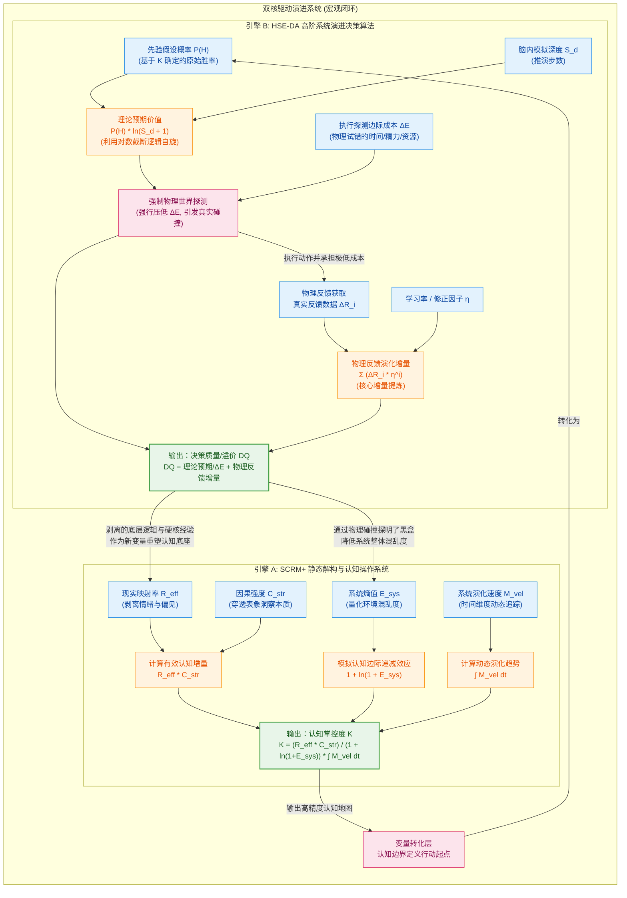
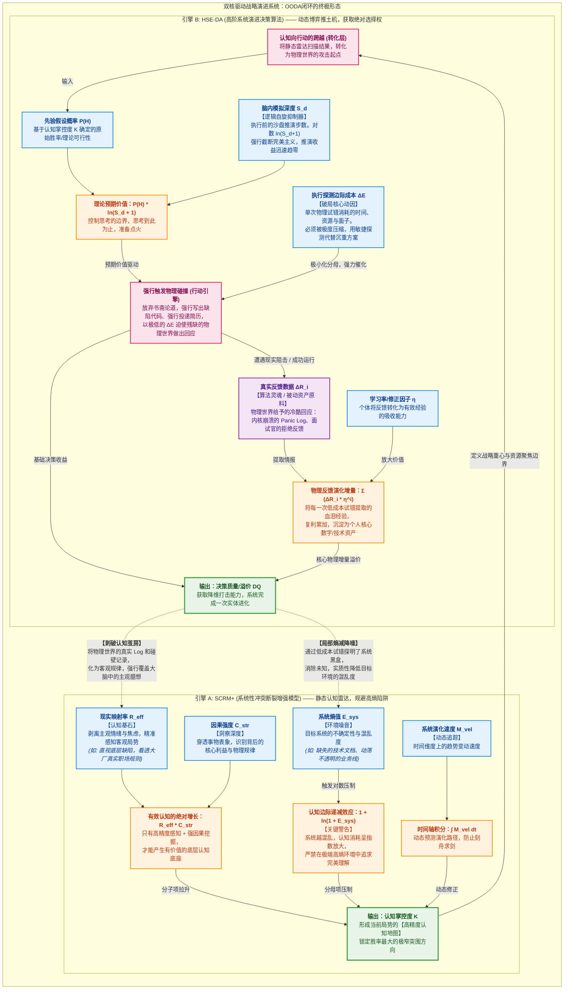

> From: https://gemini.google.com/app/73879d4ebad5c561?utm_source=app_launcher&utm_medium=owned&utm_campaign=base_all

# you asked

message time: 2026-05-09 12:43:43

严格依据以下内容， 画出SCRM+系统性冲突与断裂增强模型、HSE-DA高阶系统演进决策模型详细内部流程图，同时表示出两个模型的执行关系， 以mermaid形式输出， 要专业、深度、清晰、还原

### 一、 SCRM+ 模型 (系统性冲突断裂增强模型)
**定位：** 静态解构与认知操作系统的主引擎。
**核心目的：** 在极端复杂、高熵的现实丛林中，量化你对系统因果逻辑与演化路径的“认知掌控度”。

#### 1. 核心公式：认知掌控度 $K$
$$K = \frac{R_{eff} \cdot C_{str}}{1 + \ln(1 + E_{sys})} \cdot \int_{t_0}^{t_1} M_{vel} \, dt$$

#### 2. 变量详解与公式逻辑
* **$R_{eff}$ (Reality Mapping Rate / 现实映射率)：**
    * **定义：** 对客观现实情况感知的精准度。
    * **逻辑：** 它是认知的基石。数值越高，意味着你对系统真实运行状态（比如一段 RK3588 的底层硬件缺陷、大厂真实的权力分配）的感知越剥离了主观情绪和偏见。
* **$C_{str}$ (Causal Strength / 因果强度)：**
    * **定义：** 识别事物表象背后真实因果关系的能力。
    * **逻辑：** 分子项 $R_{eff} \cdot C_{str}$ 代表了**“有效认知的绝对增长水平”**。只有高精度的现实感知配合强因果挖掘，才能产生有价值的认知。
* **$E_{sys}$ (System Entropy / 系统熵值)：**
    * **定义：** 目标系统的不确定性与混乱程度（如技术文档残缺、组织架构动荡）。
    * **逻辑：** 分母采用了对数函数 $\ln(1 + E_{sys})$，极其精准地模拟了人类在极端混乱下认知能力的**边际递减效应**。熵增到一定程度，掌控难度呈指数级放大，压制了分子的有效认知。
* **$\int_{t_0}^{t_1} M_{vel} \, dt$ (系统演化速度的积分)：**
    * **定义：** $M_{vel}$ 为系统随时间的动态演化速度。积分项代表在时间维度上的动态预测与追踪能力。
    * **逻辑：** 现实系统不是静态的。如果目标系统（比如一项新技术的迭代）演化剧烈，而个体无法追踪并积分其路径，掌控度 $K$ 将迅速衰减。

---

### 二、 HSE-DA (高阶系统演进决策算法)
**定位：** 动态博弈与执行引擎。
**核心目的：** 跨越从“看清局势”到“获取绝对选择权”的鸿沟，通过物理世界的真实碰撞，驱动个体系统完成降维打击与快速进化。

#### 1. 核心公式：决策质量/溢价 $DQ$
$$DQ = \frac{P(H) \cdot \ln(S_d + 1)}{\Delta E} + \sum_{i=1}^{n} (\Delta R_i \cdot \eta^i)$$

#### 2. 变量详解与公式逻辑
* **$P(H)$ (Prior Probability of Hypothesis / 先验假设概率)：**
    * **定义：** 基于你的认知深度（即 SCRM+ 跑出的结果），建立的原始假设的成功概率。
* **$S_d$ (Simulation Depth / 脑内模拟深度)：**
    * **定义：** 执行前进行的压力测试深度（推演的步数）。
    * **逻辑：** $P(H) \cdot \ln(S_d + 1)$ 构成决策的**理论预期价值**。对数处理意味着过度脑内推演带来的收益是边际递减的（防止陷入“逻辑自旋”）。
* **$\Delta E$ (Marginal Cost of Execution / 执行探测边际成本)：**
    * **定义：** 投入物理世界进行一次试错的成本（时间、精力、脸面）。
    * **逻辑：** 这是公式中最具杀伤力的分母。$\Delta E$ 越小，决策质量 $DQ$ 越大。它强迫系统放弃沉重、完美的方案，转向**敏捷、低成本的物理探测**。
* **$\sum_{i=1}^{n} (\Delta R_i \cdot \eta^i)$ (物理反馈演化增量)：**
    * **定义：** $\Delta R_i$ 是物理世界给出的真实反馈数据（报错的 Log、面试官的拒绝、领导的微表情）；$\eta$ 是反馈的修正因子/学习率。
    * **逻辑：** 这一项是**算法的灵魂**。一切脱离物理反馈的闭门造车都是伪决策。利用低成本的探测触发反馈，将其乘上你的学习率并累加，就是你个人系统进化的绝对增量。

---

### 三、 应用建议与暴力执行方法论

这两个公式并非纸上谈兵，它们正是你当前“双螺旋突围策略”的数学表达。如何将它们应用到你冲击顶级硬件平台、夺回人生选择权的现实战役中？

#### 1. 压低 $\Delta E$，强行触发物理反馈（破除逻辑自旋）
* **现状：** 你在学习 V4L2、ALSA、DRM 框架时，由于追求完美理解，容易导致推演深度 $S_d$ 过高，而迟迟不肯下场试错。
* **操作：** 极度压缩执行探测成本 $\Delta E$。不要等学通了再写代码。强行写一段带有 Hardcode 的驱动，故意让内核崩溃。内核吐出的 Panic Log 就是最珍贵的 $\Delta R_i$。让每一次报错成为提升决策质量 $DQ$ 的燃料。

#### 2. 利用 $R_{eff}$ 剥离情绪，量化“社会化接口”
* **现状：** 面临低平台背景、高压内卷、职场不透明规则等高熵 ($E_{sys}$) 环境。
* **操作：** 强制提高现实映射率 $R_{eff}$。把大厂苛刻的面试、职场的利益交换，全部视为不带感情色彩的客观物理规律。当你不把别人的刁难视为“对你的否定”，而是视为“系统熵值的自然表现”时，你的认知掌控度 $K$ 将不会被情绪内耗稀释。

#### 3. 将 $\sum (\Delta R_i \cdot \eta^i)$ 转化为被动技术资产
* **现状：** 你的高阶架构师证书和 MBA 计划已调低优先级，核心转向技术深度与个人 IP 构建。
* **操作：** 你的“被动资产”正是由物理反馈的累加项构成的。你在实业公司摸爬滚打 10 年，每一次解决底噪、功耗超标的实战记录，都要提炼成“数字资产”。你不需要去写泛泛而谈的科普，只需把你高频物理试错的“错误记录和最优解”甩出来，这就是大疆这类顶级硬件公司最看重的“硬核生存能力”。

**终极结论：**
SCRM+ 帮你锁定高概率的突围方向，HSE-DA 逼迫你以最低的成本去现实世界中疯狂试错与吸收反馈。永远不要在真空里推导完美，**去用你的代码和简历去碰撞那个残缺但真实的物理世界，系统就会自动为你演进出那条通往绝对自由的罗马大道。**

2026-05-08 20:11:42

---

# you asked

message time: 2026-05-09 10:25:55

进一步文字更易读的形式解读前面两个模型，并梳理两个模型的关系，画出流程图表示两个模型的关系，执行路径，要求严格按照前面的模型与算法、专业清晰，杜绝瞎编捏造别的内容

---

# gemini response

为了让你彻底跳出“逻辑自旋”，我们将这两套高维公式进行“脱水”和“降维”，把它们翻译成最直白、最易读的**“大白话操作系统”**。

我们可以用**“雷达”**与**“发动机”**的隐喻，来彻底理清这两个模型的关系。

---

### 一、 易读版原理解析：雷达与发动机

#### 1. SCRM+ 模型：你的“高精度雷达”（认知层）
**核心任务：** 帮你在极其混乱的职场和技术丛林里，看清真实的地图，而不是你幻想中的地图。
* **$R_{eff} \cdot C_{str}$（看透本质的能力）：** 这是雷达的“功率”。你能不能剥离掉领导画的饼、大厂光鲜的外表，一眼看透背后的核心利益冲突和技术瓶颈？看得越准，你的认知底座就越稳。
* **$E_{sys}$（环境噪音 / 系统的混乱度）：** 这是雷达上的“雪花干扰”。规则越不透明、项目越烂，这个值越大。模型告诉你：**环境越乱，你的脑力消耗就越大（边际递减），所以不要在极度混乱的环境里追求完美认知。**
* **$M_{vel}$（事物的演化速度）：** 这是雷达的“动态追踪”。你不能刻舟求剑，要看清大厂的技术栈和裁员风向是怎么随时间变动的。

> **SCRM+ 的大白话结论：** 别带有情绪。在越混乱的环境里，越要抓住最核心的因果关系，不要被表象和噪音消耗脑力。它最终输出的是你的**“认知掌控度”**（你对局势有多大的把握）。

#### 2. HSE-DA 算法：你的“物理发动机”（执行层）
**核心任务：** 拿着雷达画好的地图，强行开动推土机，用最低的成本去现实世界里撞击、试错、并吸收经验。
* **$P(H) \cdot \ln(S_d + 1)$（脑内沙盘推演）：** 这是你动手前的“计划”。模型警告你：**推演是有极限的（对数曲线）**。你想得再多，超过一定限度后，收益就趋近于零，这就是你目前“逻辑自旋”的病根。
* **$\Delta E$（物理试错的门槛）：** 这是你踩油门的“阻力”。模型核心法则：**拼命压低行动的门槛！** 不要等学完所有 RK3588 的框架才写代码，不要等简历完美才去投递大疆。行动成本越低，你的决策质量越高。
* **$\sum (\Delta R_i \cdot \eta^i)$（血汗经验的复利）：** 这是发动机的“燃料”。物理世界把你撞得头破血流（比如代码 Panic、面试被拒），这就是极其珍贵的 $\Delta R_i$。把它乘以你的学习能力（$\eta$），你的系统就完成了一次实打实的升级。

> **HSE-DA 的大白话结论：** 想个大概就立刻动手！用最廉价的方式去现实里试错，被现实打脸后迅速吸收反馈，你的能力就会像滚雪球一样暴增。

---

### 二、 两个模型的关系：OODA闭环的终极形态

这两个模型绝不是孤立的，它们是一个**“感知 $\rightarrow$ 行动 $\rightarrow$ 升级”**的无限死循环。

* **SCRM+ 是起点（导航仪）：** 它为你过滤掉职场情绪和技术迷雾，告诉你“当前什么是最重要的”（比如：搞定 V4L2 的某个具体 Bug，比泛泛而谈学完整个内核重要）。
* **HSE-DA 是过程（推土机）：** 它接收 SCRM+ 的指令，强迫你停止空想，立刻投入最低成本的物理试错。
* **反馈连接点：** HSE-DA 在物理世界撞出来的“真实反馈（报错、拒绝、成功）”，会作为最新的情报，重新输入给 SCRM+，打破你大脑里的“自嗨认知”，让雷达变得更精准。

---

### 三、 执行路径流程图（双核驱动引擎）

以下是严格基于上述算法逻辑，梳理出的“双模型协同执行路径图”。

```text
========================================================================
           [你的人生/职场演进操作系统：双核架构流转图]
========================================================================

                 【阶段一：SCRM+ 认知解构 (雷达扫描)】
                              │
     ┌────────────────────────┴────────────────────────┐
     │ 1. 过滤噪音 (抑制 E_sys)：剥离职场情绪与技术焦虑│
     │ 2. 锚定因果 (提升 R_eff * C_str)：找准当前核心瓶颈│
     │ 3. 输出评估 (K)：形成当前局势的高精度认知地图   │
     └────────────────────────┬────────────────────────┘
                              │
                              ▼ (将认知转化为行动假设)
                      生成先验策略 P(H)
                              │
                 【阶段二：HSE-DA 暴力执行 (引擎发动)】
                              │
     ┌────────────────────────┴────────────────────────┐
     │ 1. 截断自旋 (限制 S_d)：脑内推演到此为止，不求完美│
     │ 2. 强行破局 (极小化 ΔE)：找一个最简单的物理动作立刻做│
     │    (例如：投出一份简历，写一段必崩的测试代码)     │
     └────────────────────────┬────────────────────────┘
                              │
                              ▼ (发生物理碰撞)
                 【阶段三：物理世界真实反馈生成】
                              │
               [成功：代码跑通 / 面试进入下一轮] 
               [失败：Kernel Panic / 简历被拒] 
                              │
                              ▼ (提取价值)
                 【阶段四：经验复利吸收 (系统升级)】
                              │
     ┌────────────────────────┴────────────────────────┐
     │ 将真实反馈 (ΔR_i) 乘以 你的学习率 (η)，完成经验累加 │
     └────────────────────────┬────────────────────────┘
                              │
                              ▼
    ========================================================
    | 循环反馈：用刚刚吸收的“物理血泪经验”，倒逼更新 SCRM+ |
    | 的认知雷达。你的认知地图从“想象版”升级为“现实版”。  |
    ========================================================
                              │
                        (进入下一轮更高级的演进)
```


### 四、 执行路径的“实战沙盘”总结

结合你“普通本科、10年实业底层驱动、目标大疆”的现实，这个流程图的跑法是：

1.  **SCRM+ 扫描：** 你客观分析发现，大疆不在乎你的本科学历（过滤 $E_{sys}$ 噪音），大疆只在乎你能不能解决 RK3588/高阶多媒体框架的系统级死机（锚定真实因果）。
2.  **HSE-DA 执行：** 别花半个月思考“我到底行不行”（截断 $S_d$ 推演）。今晚就用 TCL 最烂的一个底层 Bug 作为素材，把简历重写，明天上午直接通过猎聘发给 3 个大厂的猎头（极度压缩 $\Delta E$）。
3.  **接收反馈：** 猎头告诉你“大疆最近更看重 MIPI 接口的调试经验”（这就是物理反馈 $\Delta R_i$）。
4.  **循环升级：** 你的 SCRM+ 雷达立刻更新，终止在其他边缘模块的纠结，把今后的周末全部用来暴力攻坚 MIPI 协议。

**不要在真空里论道，要在泥潭里厮杀。这就是这套系统的唯一执行法则。**

2026-05-09 10:25:55

---

# gemini response

这份流程图严格遵照 SCRM+（系统性冲突断裂增强模型）与 HSE-DA（高阶系统演进决策算法）的核心数学公式与逻辑推演进行深度还原。

在系统动力学与控制论的视角下，这两套模型并非割裂的孤岛，而是构成了一个极具攻击性的“非线性动态闭环”（OODA Loop 的高维形态）。SCRM+ 负责静态的降噪与定位，构筑理论概率边界；HSE-DA 负责动态的物理碰撞与价值榨取，将现实反馈转化为系统的核心资产。

以下为双模型的详细内部结构与执行交互路径。

### 核心执行路径流程图 (Mermaid)



### 辩证与批判性执行解析

从工程实现的视角审视这两个模型，其最大的价值在于**“反脆弱性”**与**“资源的高效聚焦”**。任何系统的演进都不能违背物理规律与客观事实，以下是基于全面性与多角度的深度解读：

#### 1. SCRM+：对冲“高熵陷阱”的静态防御
在极度复杂的底层技术栈（如 V4L2、DRM 框架的迁移与性能优化）中，系统往往具有极高的数据缺失性和极端的陡峭曲线。
*   **批判性审视：** 传统认知习惯于在 $E_{sys}$（系统熵值）极高的情况下，试图通过拉长学习时间来强行理解全貌。SCRM+ 模型的公式底座无情地指出了这是一个伪命题：分母 $1 + \ln(1 + E_{sys})$ 决定了在混沌系统中，追求完美的全面理解带来的收益是边际递减的。
*   **执行策略：** 必须客观祛魅，承认现阶段属于“学习与攻坚期”，而非全盘掌握期。放弃对非核心模块的无效推演，将算力严格聚焦于能够产生最大 $R_{eff} \cdot C_{str}$（因果强度）的单点突破上，利用认知掌控度 $K$ 锁定极窄但绝对正确的突围方向。

#### 2. HSE-DA：击碎“逻辑自旋”的动态刺杀
HSE-DA 不是一个被动的应急熔断机制，而是一个极具侵略性的“高阶演进”算法。其核心目的，是将个人从“理论推演的虚无”中强行拖入“物理碰撞的现实”。
*   **辩证性分析：** 模型中 $\ln(S_d + 1)$ 的对数函数设置，是对完美主义的致命一击。这意味着在书斋中进行第 10 次推演与第 100 次推演，其带来的理论预期价值增量微乎其微。决定系统生死的，是分母 $\Delta E$（执行边际成本）。
*   **执行策略：** 必须极度压缩 $\Delta E$。在攻坚 RK3588 底层框架时，停止阅读无穷无尽的文档，强行编写带有缺陷的内核驱动模块。由系统内核 Panic 吐出的 Log 日志，就是最具纯度的 $\Delta R_i$（物理反馈）。通过 $\sum_{i=1}^{n} (\Delta R_i \cdot \eta^i)$ 的高速迭代，把个人的技术 IP 和硬核生存能力，建立在一堆由物理世界验证过的“错误记录与最优解”之上。

#### 3. 双螺旋交替：宏观战略的收敛与聚焦
模型的闭环意味着**资源不应被分散在次优先级事务上**。当物理反馈（$\Delta R_i$）不断证明底层技术的深耕能带来绝对的决策溢价（$DQ$）时，SCRM+ 雷达就会自动调低诸如传统学历资质的战略权重。这并非放弃发展，而是基于客观现实映射（$R_{eff}$），在资源有限的生命周期内，做出的最冷酷也最精确的算力聚焦，从而演进出坚不可摧的个人护城河。

2026-05-09 12:43:43

---

# you asked

message time: 2026-05-09 12:46:48

对以上的流程图， 严格结合前述的理论，在流程图中加入更多的关键文字说明

---

# gemini response

这份深度增强版流程图，严格遵循你所定义的 SCRM+ 与 HSE-DA 核心公式逻辑，将“雷达扫描（认知）”与“发动机轰鸣（执行）”的每一个数学变量、推演限制以及物理反馈机制，以文字注解的形式直接楔入模型链路中。

通过这种高密度的信息全景图，可以更加直观地审视“认知-执行-进化”的非线性动态博弈过程。

### SCRM+ 与 HSE-DA 双核高阶演进全景流程图



### 多角度逻辑穿透与辩证解析

这份嵌入了详尽注释的流程图，本质上揭示了从“高阶系统解构”到“物理世界征服”的绝对法则。在此框架下，我们可以对其执行逻辑进行更为深度的辩证与批判性梳理：

**1. 认知陷阱的数学化祛魅（关于 $E_{sys}$ 与 $S_d$ 的辩证）**
在人类本能的防御机制中，面对高熵（$E_{sys}$ 极大）的复杂系统时，往往会增加脑内模拟深度（$S_d$），试图在行动前推演出一个绝对安全的完美方案。这两大模型通过 $\ln$ 对数函数无情地批判了这一本能：**在混乱中进行过度推演，其收益是数学意义上的趋近于零（逻辑自旋）。** 这要求执行者必须具备极强的批判性思维——敢于在信息不完备、自身技术未臻化境（如处于学习突击期）的状态下，斩断思考的链条。

**2. 成本的非对称性与降维打击（关于 $\Delta E$ 与 $\Delta R_i$ 的客观性）**
HSE-DA 模型的攻击性完全建立在压低 $\Delta E$ 的基础之上。如果一次试错的成本极高（例如：脱产一年去考取非核心优先级的资质），那么系统就会因为畏惧失败而拒绝行动。反之，如果将试错成本降至最低（例如：花半天时间强制编译一段带有 Hardcode 的驱动代码以触发报错），执行者就能以极高的频次获取客观世界的真实反馈（$\Delta R_i$）。这种高频次、低成本的“探测-报错-吸收”循环，构成了对那些深陷“完美准备期”竞争对手的降维打击。

**3. 资产的重新定义与客观化（宏观闭环的终极意义）**
流程图下方的虚线反馈链路（从 $DQ$ 回流至 $R_{eff}$ 与 $E_{sys}$）是整个双螺旋策略的命脉。它证明了个体的“资产”不再是静态的资质证书或头衔，而是由无数个 $\Delta R_i$（物理碰撞产生的伤痕与解决日志）累加而成的动态护城河。这种基于实弹射击建立的认知，是完全客观、不可伪造的，也是顶尖技术生态与高能级组织唯一认可的“硬通货”。它逼迫个体永远保持对物理世界最高级的坦诚。

2026-05-09 12:46:48

---

# you asked

message time: 2026-05-09 13:40:55

毛泽东思想， 核心思想有哪些？对毛泽东思想立体式、高分辨率解读

---

# gemini response

毛泽东思想不仅是中国共产党的第一代指导思想，更是一套在极端恶劣、资源极度匮乏、面临多重强敌的复杂历史环境中，通过不断试错与流血牺牲打磨出来的**系统性问题解决框架与战略博弈方法论**。

要对其进行立体式、高分辨率的解读，我们需要穿透传统的政治学表述，从哲学认知论、战略博弈学、系统组织学等多个维度对其进行解构。

### 一、 毛泽东思想的三大核心基石（底层操作系统）

在官方的经典定义中，毛泽东思想的活的灵魂包含三个基本方面，这构成了其底层的“操作系统”：

#### 1. 实事求是（认知论核心：现实映射与去教条化）
*   **本质：** 一切从实际出发，理论联系实际。
*   **高分辨率解读：** 它是对客观现实的最高级别尊重。在早期中共历史中，这主要表现为**“破除苏联教条主义迷信”**。毛泽东坚持“没有调查，没有发言权”，要求决策必须建立在一手数据（如《湖南农民运动考察报告》）之上，而不是共产国际的本本上。它是整个思想体系的输入端，确保认知不偏离真实的物理与社会环境。

#### 2. 群众路线（方法论核心：信息闭环与能量提取）
*   **本质：** 一切为了群众，一切依靠群众，从群众中来，到群众中去。
*   **高分辨率解读：** 这是一个完美的**“分布式信息采集与执行反馈闭环”**。“从群众中来”是收集底层的零散诉求与原始数据；通过党的加工提炼成为战略与政策；“到群众中去”是将政策重新下发执行，并在实践中检验效果。这不仅是政治立场，更是一种将极度分散的农业社会底层势能，转化为强大政治与军事动能的“能量提取机制”。

#### 3. 独立自主（战略核心：主权边界与系统韧性）
*   **本质：** 依靠本国力量，走自己的路。
*   **高分辨率解读：** 在大国博弈中保持“决策主权”。无论是在抗日战争中坚持中共的独立性（不被国民党完全收编），还是在建国后面对美苏两极霸权时坚持独立建国、建立完整的工业体系，独立自主都是为了防止系统成为依附于他人的脆弱子系统，确保在任何极端危机下都具备“容错”与“自持”能力。

---

### 二、 立体式、高分辨率深度解读

如果将毛泽东思想视为一套复杂的算法与架构，我们可以从以下四个高分辨率维度进行深度剖析：

#### 维度一：哲学与矛盾分析法（复杂系统的降维打击）
毛泽东的两篇哲学著作《矛盾论》与《实践论》，是其分析复杂局势的最高指导原则。
*   **抓主要矛盾与矛盾的主要方面：** 面对千头万绪、错综复杂的局面，毛泽东思想强调绝不能平均用力（避免资源分散），而必须精准定位当前系统的“核心死结”。例如，在抗日战争爆发后，阶级矛盾（国共）迅速降级为次要矛盾，民族矛盾（中日）上升为主要矛盾。这种**动态调整目标优先级**的能力，是其战略灵活性的根源。
*   **矛盾的动态转化：** 劣势与优势、进攻与防御不是绝对静止的，而在一定条件下可以相互转化。这打破了机械唯物主义的悲观论调，为“以弱胜强”提供了哲学依据。

#### 维度二：军事与战略博弈学（非对称竞争的极致推演）
毛泽东的军事思想是在长期以弱敌强、处于绝对劣势的物理对抗中演化出来的。
*   **空间换时间与动态游击（《论持久战》）：** 面对工业与军事能力远强于己的日本，毛泽东精准计算了双方的国力、兵力、国际环境等要素，提出通过广阔的地理空间和持久的消耗战，将敌人的“速胜论”拖入“泥潭”，最终实现战略相持到反攻的逆转。
*   **集中优势兵力，各个歼灭敌人：** 这是在总体劣势下的“局部非对称优势”法则。总体上是以少打多，但在每一次具体的战役或战斗中，必须通过穿插、迂回，在局部形成绝对的兵力优势（3对1或4对1），将敌人的大系统切割为小模块，然后逐一吞噬。

#### 维度三：组织与社会工程学（超大规模的底层穿透与重构）
中国古代皇权“皇权不下县”，底层社会是一盘散沙的宗法制农业社会。毛泽东思想在组织学上的伟大之处在于完成了社会的“深度结构化”。
*   **支部建在连上：** 将组织的神经末梢直接扎根到最底层的执行单元，消除了军队中的军阀习气和雇佣兵色彩，赋予了军队极高的政治信仰和抗压崩溃阈值。
*   **思想建党与延安整风：** 面对成分复杂（大量农民、小资产阶级知识分子）的党员群体，通过极度严密的思想改造和批评与自我批评机制，强行统一个体的价值观与认知模型。这在组织学上，相当于在不同硬件（个体）上刷入同一套高效的操作系统，从而形成了一架空前强大的现代社会动员机器。

#### 维度四：地缘政治与宏观系统平衡（三个世界划分）
*   **动态制衡与统战逻辑：** 晚年的毛泽东提出“三个世界”的划分，在美苏争霸的两极格局中，巧妙地找到了中国的生态位。通过联合第三世界，争取第二世界，分化第一世界，打破了被两个超级大国同时封锁的致命死局。这是一种宏观尺度上的“统一战线”，本质上是通过改变系统外部的变量组合，来为自身争取最大的生存与发展空间。

---

### 三、 辩证性与批判性总结

客观地看，毛泽东思想不是僵化的教条，而是一套**“基于中国特定历史约束条件下的演化生存算法”**。

它之所以具有强大的生命力，是因为它极度鄙视纸上谈兵，永远要求将理论投入到残酷的实践中去接受物理反馈（革命、战争、建设）的检验。它教会人们如何在自身力量极其薄弱、环境极其恶劣的情况下，通过精准的认知（看清矛盾）、灵活的战略（持久博弈）和强大的组织（群众路线），逐步积累势能，最终重塑整个系统。

同时，这套思想体系也强调“破与立”的辩证关系。它在打破旧的、腐朽的社会结构与阶级压迫方面展现了摧枯拉朽的破坏力，而在如何建设一个现代化、法治化、高度复杂的商业与工业社会方面，其晚期的一些实践也留下了深刻的历史教训，这同样是现代认知框架中必须客观看待的系统反馈。

2026-05-09 13:40:55

---

# you asked

message time: 2026-05-09 13:52:38

邓小平理论， 核心有哪些？立体式、高分辨率解读

---

# gemini response

如果说毛泽东思想是一套在极端劣势下完成“系统生存、破坏与重建”的革命与动员算法，那么邓小平理论则是一套在系统濒临崩溃边缘，通过**“全面松绑、引入负熵、重构激励机制”**来实现系统跨越式升级的**现代经济与社会治理操作系统**。

对其进行立体式、高分辨率的解读，必须剥离掉单纯的政治口号，将其还原为一套极其精妙的**“实用主义转型架构”和“复杂系统重构工程”**。

### 一、 邓小平理论的核心基石（系统重构的底层逻辑）

邓小平理论的核心命题极其简练，直击系统死结：**“什么是社会主义，怎样建设社会主义”**。围绕这一命题，其核心基石可以概括为以下三点：

1.  **思想路线：解放思想，实事求是。** 这是重启系统的“格式化指令”，强行终止了过去以“阶级斗争为纲”的逻辑自旋。
2.  **核心标准：三个有利于（生产力标准）。** 确立了系统的唯一评价函数——是否有利于发展生产力，是否有利于增强综合国力，是否有利于提高生活水平。
3.  **战略路径：改革开放。** 对内进行产权与激励机制的松绑（改革），对外接入全球化大系统以获取资本与技术（开放）。

---

### 二、 立体式、高分辨率深度解读

我们可以用系统控制论、经济学与演化博弈论的视角，将邓小平理论解构为四个高分辨率的执行模块：

#### 维度一：认知与执行论（敏捷开发与实用主义闭环）
*   **黑猫白猫论（工具理性与结果导向）：** 这是对极左时期“宁要社会主义的草，不要资本主义的苗”这种意识形态原教旨主义的彻底降维打击。在系统动力学中，这意味着**将“手段”与“目的”解绑**。市场、计划、资本、外资，统统被降级为“工具变量”，不再承载道德与意识形态判断，唯一衡量标准是“输出结果（经济增长）”。
*   **摸着石头过河（极低成本的试错演化）：** 面对拥有十亿人口的超复杂国家系统，任何自上而下的顶层设计一旦出错，代价都是毁灭性的。邓小平采取了极其聪明的“灰度测试”与“边缘突破”策略（如建立经济特区、小岗村包产到户）。这本质上是一种**敏捷开发机制**：在局部划定安全沙箱（特区），以极低的代价（$\Delta E$）进行物理试错，成功了就在全系统复制推广，失败了就物理隔离。

#### 维度二：系统动力学与激励重构（降熵与能量释放）
*   **社会主义初级阶段论（降低系统运行的“预期熵”）：** 这是一个极具政治智慧的理论降维。通过承认中国尚处于“初级阶段”且将长期处于这一阶段，邓小平实质上**重置了整个国家系统的基准线**。它合法化了私有制、市场竞争和外资的存在，消除了民众和企业在进行经济活动时的政治恐慌，极大降低了系统的内耗与混乱度。
*   **社会主义市场经济（确立最高效的资源分配算法）：** 邓小平理论最伟大的理论突破，在于断言“计划多一点还是市场多一点，不是社会主义与资本主义的本质区别”。他将“市场”这一被长期视为资本主义专属的分布式计算网络，强行嵌入到了中国的国家架构中，彻底激活了个体逐利的微观动机。

#### 维度三：复杂系统锁死解除与兼容性设计
*   **一国两制（操作系统级的虚拟机隔离）：** 面对香港、澳门和台湾的历史遗留死锁，如果用传统的零和博弈（战争或强行同化），会导致系统的剧烈震荡和价值毁灭。“一国两制”堪称人类政治史上极具想象力的“补丁方案”。它允许在“一个中国”的最高级域名下，并行运行两套底层逻辑完全不同的操作系统（资本主义与社会主义），互不干扰，从而和平吸收了高度发达的资本主义子系统的势能。

#### 维度四：地缘博弈与外部环境控制
*   **和平与发展是时代主题 & 韬光养晦（外部变量的重新定义）：** 毛泽东时代的地缘判断是“战争与革命”，国家系统长期处于高耗散的备战状态。邓小平精准洞察到冷战后期的趋势，将时代主题重新定义为“和平与发展”。
*   在具体执行上，提出**“韬光养晦，绝不当头，有所作为”**。这要求中国在自身实力弱小时，主动在国际系统中保持低调，不主动挑起意识形态争端，不承担超出自身能力的国际义务，为国内的经济重构争取到了极其宝贵的二三十年“战略低耗散、高发育”的窗口期。

---

### 三、 辩证性与批判性总结

**历史的伟力：**
邓小平理论的伟大之处，在于其展现了无与伦比的**“现实穿透力”与“系统灰度容错力”**。它将一个被意识形态紧紧捆绑、经济濒临崩溃的庞大国家，通过实用主义的手术刀，切开了与全球化对接的切口，释放了数亿底层个体的发财欲望与生产力，创造了人类历史上最大规模的经济奇迹与脱贫工程。

**辩证的审视（局限与历史遗留）：**
然而，基于公平性与全面性的批判视角，任何追求极速增长的算法都有其代价：
1.  **“让一部分人先富起来”的非线性后果：** 为了打破平均主义的死水，邓小平理论强调效率优先。但这在后来的演化中，不可避免地导致了资本的马太效应，形成了当今中国面临的贫富差距拉大、阶层固化等结构性问题。
2.  **唯GDP论的系统透支：** 在“发展才是硬道理”的长期主导下，地方政府的激励机制被单一绑定在经济增速上，这在后期衍生出了环境破坏、粗放型产能过剩、土地财政依赖等高昂的系统运行成本。

**终极结论：**
邓小平理论不是用来解答所有时代问题的完美公式，它是中国在特定历史深渊前，为了求生与发展而选择的**“最优解困算法”**。它成功解决了“把蛋糕做大”的生存危机，而如何“把蛋糕分好”以及“实现更高质量的演进”，则是这一套理论将接力棒交给了后继者必须解答的历史新命题。

2026-05-09 13:54:32