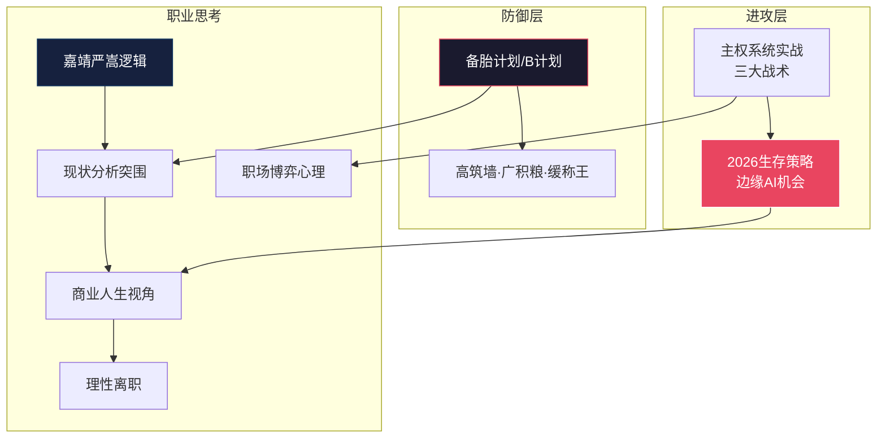

---
level: L2
title: "策略与计划"
subtitle: "从思想到行动的执行层——定义护城河、备胎计划、2026突围路径及职场博弈战术。"
status: "active"
last_updated: "2026-06-13"
tags:
  - MOC
  - DomainIndex
  - Strategy
  - Planning
  - Career
domain: [策略与计划]
parent: "[[L1-README-知识图谱索引.md]]"
children_count: 16
subdomains:
  - "核心策略"
  - "职业思考"
  - "备胎计划"
  - "2026突围"
  - "价值评估"
  - "职场博弈"
purpose: "作为所有战略规划和执行计划的根节点，导航至关于个人发展、职业突围、财务规划和风险管理的具体行动方案。"
---

---
level: L2
title: "策略与计划"
date: 2024-07-29
description: "An index for the Strategy and Planning domain (L2), which serves as the execution layer for translating thought into action. It defines how to build moats, maintain backup plans, the breakout path for 2026, and tactics for workplace game theory."
keywords: [策略, 计划, 护城河, 备胎计划, 2026, 职场, 博弈, 职业规划]
concepts: ["Strategic Planning", "Career Development", "Risk Management", "Execution Plan", "Workplace Dynamics", "Personal Moat Building"]
file_path: "知识图谱/L2-三-策略与计划.md"
---

# 📋 L2 · 策略与计划（16 篇）

> **层级**：L2 父树根 ← [L1 根索引](../README-知识图谱索引.md)  
> **定位**：从思想到行动的执行层——护城河怎么建、备胎怎么养、2026怎么突围、职场博弈怎么打、终极战略产出怎么落地  
> **覆盖**：2 个子域 · 16 篇笔记（+12 篇新增·含 2026-06-13 极客战略家 + 3 篇战略产出）  
> **下级**：→ L3 子域索引（3.1 核心策略 / 3.2 职业思考系列）

---

## 📂 目录结构

```
L1 ROOT: README-知识图谱索引.md
  └── L2 三、策略与计划  ← 当前文件
        ├── L3 3.1 核心策略 (8篇，+4)
        │     ├── [精华][策略] 备胎计划与护城河
        │     ├── [计划][策略] 生存突围与高筑墙
        │     ├── [沟通][职场] 个人主权系统迭代与实战
        │     ├── [无标签] 2026生存策略与边缘AI
        │     ├── [新增] 🆕 深度剖析高熵环境下的极客战略家
        │     ├── [产出] 💰 个人市场价值评估报告
        │     ├── [产出] 🗺️ 1-3-5年职业规划路线图
        │     └── [产出] ⚔️ 简历与面试武器库
        │
        └── L3 3.2 职业思考系列 (5篇，新增)
              ├── [新增] 职业思考：嘉靖用严嵩的政治逻辑到职场
              ├── [新增] 职业思考2：现状分析与突围策略
              ├── [新增] 职业思考3：商业与人生战略视角
              ├── [新增] 职场生存：理性离职与价值交换
              └── [新增] 职场博弈与心理驱动解析
```

---

## 🔷 3.1 核心策略（4 篇）

> **子域定位**：个人生存突围的四大支柱——护城河、高筑墙、主权实战、2026行动

### 3.1.1 备胎计划与护城河 `[精华][策略]`

| 维度 | 细化内容 |
|------|----------|
| **文件** | `./[精华][策略]职业规划："备胎计划""B计划"--技术"护城河"的建立.md` |
| **核心公式** | 技术护城河 = 技术深度 × 不可替代性 = 博弈筹码 |
| **战略定位** | "备胎计划"不是逃跑方案，而是对抗职场边缘化的主动防御——在公司旧领地做减法，在个人新领地做乘法 |
| **三阶段执行** | ① **定向**：确定核心技术方向（RK3588+V4L2+端侧AI）——标准：市场需求增长×个人兴趣交集×公司资源可利用 ② **蓄力**：设定里程碑→利用公司"公费研发期"积累个人资产 ③ **切换**：当个人资产>公司依赖时，实现"软着陆"式转型 |
| **博弈筹码量化** | 技术深度（0-10）× 不可替代性（0-10）= 博弈筹码（0-100）——筹码>60可谈判，筹码>80可主导 |
| **跨域关联** | → [高筑墙](#312) · → [2026生存](#314) · → [职场实战](#313) |

### 3.1.2 生存突围与高筑墙 `[计划][策略]`

| 维度 | 细化内容 |
|------|----------|
| **文件** | `./[计划][策略]生存突围与"高筑墙"策略与计划.md` |
| **九字方针** | **高筑墙**（技术壁垒三层：底层Linux内核→中层AI推理→上层产品化）+ **广积粮**（财务缓冲6-12月+知识资产+人脉网络）+ **缓称王**（不急于头衔，蛰伏蓄势） |
| **分阶段里程碑** | 4月底→5月底→3个月驱动开发计划——每阶段有明确交付物和验证标准 |
| **跨域关联** | → [备胎计划](#311) · → [2026生存](#314) · → [认知终极盘](../知识图谱/L2-一-认知体系与思维模型.md#111) |

### 3.1.3 个人主权系统迭代与实战 `[沟通][职场]`

| 维度 | 细化内容 |
|------|----------|
| **文件** | `./[沟通][职场]个人主权系统迭代与实战应用.md` |
| **AI Agent四要素** | 大脑（LLM推理）/ 规划（子任务拆解+反思）/ 记忆（短期Context+长期向量库）/ 工具（API/Python/SMTP） |
| **L3→L4代偿机制** | L3（人际层）亏空时→L4（技术层）超频漏电——过度沉迷技术细节以逃避人际焦虑；须通过"流量管制"切断 |
| **三大实战战术** | ① **"教父协议"**：别人不问我不说，问我说一半——信息是权力，不要免费赠送 ② **BOM签批·边界切割+风险仪表盘**：责任边界画清楚，风险量化成领导看得懂的仪表盘 ③ **"反向确认/默认值攻击"**：不给开放式选择，给默认值——"方案A已就绪，如无异议明天执行" |
| **核心洞察** | 把横向冲突转换为纵向压力——让领导的领导去施压（职场博弈的"杠杆原理"） |
| **跨域关联** | → [沟通心理](../知识图谱/L2-四-关系与沟通.md) · → [备胎计划](#311) · → [告别内耗](../知识图谱/L2-七-实践与IP.md) |

### 3.1.4 2026生存策略与边缘AI `[无标签]`

| 维度 | 细化内容 |
|------|----------|
| **文件** | `./暴力执行：2026生存策略、普通程序员在边缘AI的机会.md` |
| **社会定位量化** | 收入（全国前3-5%，深圳前20-30%）/ 学历（全国前5%）/ 35岁节点（职业生命周期转型期——不是危机，是"执行者→架构者"强制转型窗口） |
| **联姻结构抗风险** | "技术精英 + 建制内专业人士（法官助理）"= 一方市场中搏杀，一方体制内稳定——现代版"耕读传家" |
| **边缘AI机会矩阵** | ① 模型压缩（TinyBERT→MobileLLM）② NPU优化（RK3588 NPU）③ 垂直场景（智能眼镜/工业视觉）——找"大厂看不上、小厂做不了"的缝隙 |
| **跨域关联** | → [备胎计划](#311) · → [高筑墙](#312) · → [PAN构想](../知识图谱/L2-五-科技与技术.md) |

### 3.1.5 高熵环境下的极客战略家 `[新增][策略]`

| 维度 | 细化内容 |
|------|----------|
| **文件** | `./深度剖析高熵环境下的极客战略家.md` |
| **核心定位** | 将个人全部方法论进行元分析——回答"我是谁·我能成为什么·我该怎么走"，并输出三大战略交付物 |
| **跨域关联** | → [认知终极盘](../L2-一-认知体系与思维模型.md) · → [市场估值](#316) |

### 3.1.6 个人市场价值评估报告 `[产出][策略]`

| 维度 | 细化内容 |
|------|----------|
| **文件** | `./产出①-个人市场价值评估报告.md` |
| **核心输出** | 硬/软资产盘点·深圳薪资锚点（高级系统SE 35-50K）·目标企业匹配度·竞争力差距诊断·风险矩阵 |
| **跨域关联** | ← [极客战略家](#315) · → [路线图](#317) · → [科技与技术](../L2-五-科技与技术.md) |

### 3.1.7 1-3-5年职业规划路线图 `[产出][策略]`

| 维度 | 细化内容 |
|------|----------|
| **文件** | `./产出②-1-3-5年职业规划路线图.md` |
| **核心输出** | 1年卡位→3年破圈→5年自主·IP差异化赛道·PAN里程碑·财务路径·退出打工条件 |
| **跨域关联** | ← [市场估值](#316) · → [面试武器](#318) · → [实践与IP](../L2-七-实践与IP.md) |

### 3.1.8 简历与面试武器库 `[产出][策略]`

| 维度 | 细化内容 |
|------|----------|
| **文件** | `./产出③-简历与面试武器库.md` |
| **核心输出** | 简历叙事重构·3个STAR标杆故事·5组面试话术·方法论大厂黑话翻译·薪资谈判策略 |
| **跨域关联** | ← [路线图](#317) · → [沟通博弈](../L2-四-关系与沟通.md) · → [Sovereignty OS](../L2-二-核心模型与框架.md) |

---

## 🔷 3.2 职业思考系列（5 篇·新增）

> **子域定位**：从大明权力逻辑到理性离职——将历史政治智慧转化为职场生存的微观操作

### 3.2.1 嘉靖用严嵩的政治逻辑到职场 `[新增][职业思考]`

| 维度 | 细化内容 |
|------|----------|
| **文件** | `./职业思考：嘉靖用严嵩的政治逻辑到职场.md` |
| **核心类比** | 嘉靖-严嵩-徐阶三角 → 现代企业领导-"白手套"-"救火队"：领导用边缘人执行不受欢迎的活，保留道德清白和可否认性 |
| **严嵩悖论** | 不能停止贪腐（失去派系忠诚）；不能被移除（对皇帝有用）；陷入升级逻辑无法自拔 |
| **徐阶功能** | 代表"救火队"——备用，当主力工具烧毁时清理残局；不太显眼但道德更完整 |
| **三大突围策略** | ① 在领导生态系统外建立替代合法性 ② 让不可替代性对**上一级**权威可见 ③ 制造撤换成本（IP捕获、制度知识、关键节点单一依赖） |
| **跨域关联** | → [大明1566](../知识图谱/L2-六-历史与典籍.md) · → [职场实战](#313) |

### 3.2.2 职业思考2：现状分析与突围策略 `[新增][职业思考]`

| 维度 | 细化内容 |
|------|----------|
| **文件** | `./职业思考2：现状分析与突围策略.md` |
| **"组件陷阱"完整逻辑** | "太可靠"→无动力提拔/投入（成本思维 vs 投资思维）→被安排紧急但不光鲜的工作→绩效透明化缺失→在绩效评审中不可见 |
| **三大突围机制** | ① 关键节点单点主导（成为不可或缺——但需警惕"组件陷阱"的反面）② IP品牌外部化（降低组织依赖——这是最终的出路）③ 校准曝光度（让高层直接见证价值——而非通过中层过滤） |
| **杠杆点** | 把 TCL 实习期当作"付费实验室"；记录专有框架；建立外部可信度；过渡到创始/顾问阶段 |
| **心理重构** | 从"边缘化受害者"→"护城河建设的战略休假期" |
| **跨域关联** | → [备胎计划](#311) · → [组件→操盘手](../知识图谱/L2-一-认知体系与思维模型.md#116) |

### 3.2.3 职业思考3：商业与人生战略视角 `[新增][职业思考]`

| 维度 | 细化内容 |
|------|----------|
| **文件** | `./职业思考3：商业与人生战略视角.md` |
| **价值交换透镜** | 雇佣=交易（劳动↔报酬），非情感——公司不"欠"你幸福，你不欠忠诚超越合同 |
| **沉没成本谬误** | "为既得利益而留"= 如果机会成本>保留价值，则在扔好钱追坏钱 |
| **谈判不对称** | 雇主持有信息优势（晋升标准/退出条款）；通过外部可信度+竞争性offer平衡 |
| **时机模型** | 当个人股价 > 市场估值时离开；当投资于平台可选性时留下 |
| **跨域关联** | → [职场生存](#324) · → [2026生存](#314) |

### 3.2.4 职场生存：理性离职与价值交换 `[新增][职场]`

| 维度 | 细化内容 |
|------|----------|
| **文件** | `./职场生存：理性离职与价值交换.md` |
| **劳动即合同** | 雇主支付产出（KPI/薪资），不支付情绪福祉；反向同理——你不欠忠诚超越合同 |
| **切换成本计算** | 职业中断+入职损失+声誉摩擦——必须超过当前环境损害才能证明退出的合理性 |
| **有害环境例外** | 如果环境主动损害健康（骚扰/不公追诉/心理虐待），"理性退出"包含健康成本 |
| **最优退出条件** | ① 新角色提供实质性升级（头衔/薪酬/学习/网络）② 积累的技能已转化为外部品牌 ③ 竞争性offer展示市场价值重置 |
| **跨域关联** | → [职业思考3](#323) · → [告别内耗](../知识图谱/L2-七-实践与IP.md) |

### 3.2.5 职场博弈与心理驱动解析 `[新增][职场]`

| 维度 | 细化内容 |
|------|----------|
| **文件** | `./职场博弈与心理驱动解析.md` |
| **公共排名现象** | 排行榜效应触发基因级地位焦虑——超越逻辑不解除杏仁核；来自跨部门任务数据的同侪压力 |
| **控制恢复冲动** | 将被动压力反应重构为"通过超预期表现回收代理权"——将羞辱转化为自我导向的掌控 |
| **延迟升级策略** | 扣留曝光度直到高层关注被捕获→廉价信号努力呈现为危机救援（更高感知价值）——但谨慎使用 |
| **隐藏风险** | 频繁使用→中层管理者察觉被当作"传输媒介"→他们硬化行政约束（缩小谈判空间） |
| **最优形式** | 保留策略用于高赌注时刻；维护善意层；确保跟进执行的声誉 |
| **跨域关联** | → [沟通心理](../知识图谱/L2-四-关系与沟通.md) · → [职场实战](#313) |

---

## 🗺️ 域内概念图



---

## 📖 域内推荐阅读路线

```
策略执行路径（从防御到进攻）：
1. [精华][策略] 备胎计划与护城河           ← 理解博弈逻辑
2. [计划][策略] 生存突围与高筑墙           ← 制定执行计划
3. [沟通][职场] 个人主权系统实战           ← 职场战术落地
4. 2026生存策略与边缘AI                    ← 进攻方向选择

职场博弈路径：
1. 职业思考：嘉靖用严嵩的政治逻辑到职场    ← 历史政治智慧→职场
2. 职业思考2：现状分析与突围策略          ← 诊断+突围方案
3. 职场博弈与心理驱动解析                  ← 微观心理战
4. 职业思考3：商业与人生战略视角           ← 经济理性框架
5. 职场生存：理性离职与价值交换            ← 退出决策模型
```

---

## 🔗 跨域链接

| 目标 L2 域 | 关联强度 | 关键连接点 |
|-----------|---------|-----------|
| [L2-一 认知体系与思维模型](./L2-一-认知体系与思维模型.md) | ⭐⭐⭐⭐⭐ | 认知→策略的直接转化链 |
| [L2-二 核心模型与框架](./L2-二-核心模型与框架.md) | ⭐⭐⭐⭐⭐ | HSE-DA 驱动策略决策 |
| [L2-四 关系与沟通](./L2-四-关系与沟通.md) | ⭐⭐⭐⭐ | 职场实战与沟通博弈互补 |
| [L2-六 历史典籍与社会分析](./L2-六-历史与典籍.md) | ⭐⭐⭐⭐ | 大明1566→嘉靖职场逻辑 |

---

> **下一级**：L3 将对每篇策略笔记展开，细化到具体行动计划、量化指标、时间节点和验证标准。
