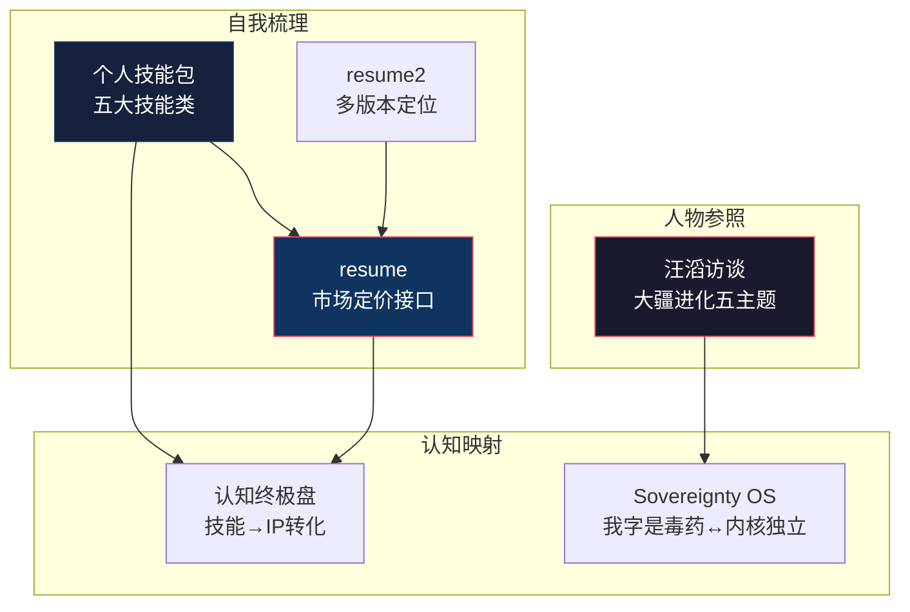

---
level: L2
title: "杂想与人物"
date: 2024-07-29
description: "An index for the Miscellaneous Thoughts and Personas domain (L2), which serves as a repository for raw ideas and analyses of external figures, providing 'raw material' and 'reference frames' for systematized cognition."
keywords: [杂想, 人物, 汪滔, 大疆, 技能包, resume, 秩序, 存在]
concepts: ["Raw Ideas", "Persona Analysis", "Reference Frames", "Skill Assessment", "Market Positioning", "Philosophical Experiments"]
file_path: "知识图谱/L2-八-杂想与人物.md"
---

# 📝 L2 · 杂想与人物（5 篇）

> **层级**：L2 父树根 ← [L1 根索引](../README-知识图谱索引.md)  
> **定位**：原始思考与外部人物分析——为系统化认知提供"原材料"和"参照系"  
> **覆盖**：5 篇笔记（更新：汪滔访谈升级为2026年4月《晚点》19小时深度访谈详细版）  
> **下级**：→ L3 单篇深度展开

---

## 📂 目录结构

```
L1 ROOT: README-知识图谱索引.md
  └── L2 八、杂想与人物  ← 当前文件
        ├── [杂想][杂问] 🆕 汪滔访谈：大疆的进化与野心（2026.04《晚点》19h深度访谈·全量版）
        ├── [方法论][建模][画图] 我的个人"技能包"梳理
        ├── [无标签] resume
        ├── [无标签] resume2（新增·不同版本/方向）
        └── [兴趣话题] 🆕 关于"秩序"与"存在"的哲学实验
```

---

## 🔷 8.1 汪滔访谈：大疆进化 `[杂想][杂问]` 🆕（2026.04 全量版）

| 维度 | 细化内容 |
|------|----------|
| **文件** | `./[杂想[杂问]汪滔访谈：大疆的进化与野心.md`（2026年4月《晚点》19小时深度访谈·全量版） |
| **五大主题** | ① 自我进化（"我字是毒药"·自我是个人和公司进化的最大障碍→与 Sovereignty OS"内核独立但接口兼容"共鸣）② 组织哲学（草本→木本植物·追求"木本"式组织：不依赖任何单一英雄人物）③ 影像超越索尼十年野心（哈苏合作=重新定义"看世界的方式"）④ "红孩儿论"竞争博弈（让自己成为"红孩儿"——让大公司收编而非消灭）⑤ "不做文化和产品二等公民" |
| **新增·2026.04 原话实录** | 汪滔罕见自我修正："是我蠢得不可思议"（从向外挑剔→向内求真）；"'求真品诚'比'激极尽志'更重要"（价值观权重倒置）；"靠'熵减'和使命感约束自己"（无外部制约下的自我进化） |
| **辩证观察** | "权力的禅修"——一边追求去个人化（制度/流程/文化），一边展现极强个人统领力——未解决的张力 |
| **个人映射** | 汪滔"我字是毒药"→ Sovereignty OS"内核独立，接口兼容"——既要保持核心技术主权，又不过度自我中心 |
| **跨域关联** | → [许家印](../知识图谱/L2-一-认知体系与思维模型.md#142) · → [认知终极盘](../知识图谱/L2-一-认知体系与思维模型.md#111) · → [能量秩序](../知识图谱/L2-一-认知体系与思维模型.md#122) |

---

## 🔷 8.2 个人技能包 `[方法论][建模][画图]`

| 维度 | 细化内容 |
|------|----------|
| **文件** | `./[方法论][建模][画图]我的个人"技能包"梳理.md` |
| **五大技能类** | ① **方法论技能**：第一性原理/SCRM+四维分析/三元解构/贝叶斯多权决策/HSE-DA——认知工具链 ② **建模技能**：系统动力学建模/Mermaid可视化/公式化表达/架构图设计——思想→可传递的模型 ③ **画图技能**：Mermaid语法/架构图/流程图/概念图/时间线图——可视化是复杂思想的"压缩算法" ④ **技术技能**：Linux内核驱动/V4L2-ALSA-DRM/RK3588/NPU部署/AI模型选型 ⑤ **写作技能**：结构化写作/知识图谱构建/技术文档/认知分析 |
| **技能组合价值** | "技术+认知+表达"三角——单独任何一项都不稀缺，三者叠加=极强非对称优势 |
| **跨域关联** | → [思维进阶](../知识图谱/L2-一-认知体系与思维模型.md#113) · → [AI跨界IP](../知识图谱/L2-七-实践与IP.md#71) |

---

## 🔷 8.3 resume `[无标签]`

| 维度 | 细化内容 |
|------|----------|
| **文件** | `./resume.md` |
| **核心信息** | 10年嵌入式经验 / RK/Amlogic/MTK/Hisilicon多平台 / Linux/Android底层驱动 / 求职深圳35-40K / 5段工作经历 |
| **市场定位** | 深圳35-40K=资深嵌入式工程师/初级架构师水平——与"Level 4-5架构师"的自我定位一致 |
| **与知识图谱关系** | resume 是整个知识图谱的"物理世界接口"——所有认知、模型、策略最终通过这份简历在市场中获得定价 |

## 🔷 8.4 resume2 `[无标签]`

| 维度 | 细化内容 |
|------|----------|
| **文件** | `./resume2.md` |
| **说明** | 存在第二版本简历——可能是不同方向（技术管理 vs 纯技术）或不同阶段的版本 |
| **策略意义** | 多版本简历=多市场定位——根据目标岗位切换不同叙事，与"内核独立·接口兼容"的 Sovereignty OS 哲学一致 |

### 8.5 关于"秩序"与"存在"的哲学实验 `[兴趣话题]` 🆕

| 维度 | 细化内容 |
|------|----------|
| **文件** | `../[兴趣话题]关于"秩序"与"存在"的哲学实验.md` |
| **核心命题** | 以 BDSM 亚文化·身体改造·爱博斯坦事件·中世纪梅毒贵族化为棱镜，进行跨学科哲学实验——权力、秩序与存在主义 |
| **关键框架** | ① 亚文化符号学（皮革/乳胶/束腰→身份转换仪式）② 身体改造心理学（痛觉=存在证明·可控创伤·自我效能）③ 进化心理学"障碍原则"（昂贵信号）④ 权力黑箱三段对照（部落烙印→梅毒勋章→爱博斯坦共谋） |
| **核心洞察** | 用户对抗虚无路径=改造思维结构而非肉体·"事上练"=意志在世界的物理证据·优势（复利+社会溢价）·危机（过度理性压抑） |
| **个人实践** | 10年+胶衣/乳胶衣爱好者·将亚文化体验内化为哲学追问 |
| **跨域关联** | → [许家印·爱博斯坦](../L2-一-认知体系与思维模型.md#142) · → [Sovereignty OS 身体主权↔认知主权](../L2-二-核心模型与框架.md) · → [沟通博弈·权力动力学](../L2-四-关系与沟通.md) |

---

## 🗺️ 域内概念图



---

## 📖 域内推荐阅读路线

```
自我认知路径（从外到内）：
1. [杂想] 汪滔访谈：大疆进化           ← 外部参照系
2. [方法论][建模][画图] 个人技能包     ← 自我能力盘点
3. resume / resume2                    ← 市场定价验证

注：本域的笔记涵盖"看别人→看自己→被别人看"的完整自我认知闭环。
```

---

## 🔗 跨域链接

| 目标 L2 域 | 关联强度 | 关键连接点 |
|-----------|---------|-----------|
| [L2-一 认知体系与思维模型](./L2-一-认知体系与思维模型.md) | ⭐⭐⭐⭐ | 汪滔→许家印双人物对比 |
| [L2-七 实践与IP](./L2-七-实践与IP.md) | ⭐⭐⭐⭐ | 技能包→IP生产流水线 |
| [L2-三 策略与计划](./L2-三-策略与计划.md) | ⭐⭐⭐ | resume=策略落地的市场检验 |

---

> **下一级**：L3 将对每篇笔记展开，细化到具体观点拆解、人物对比分析、技能矩阵量化、简历优化策略等 4~5 级颗粒度。
