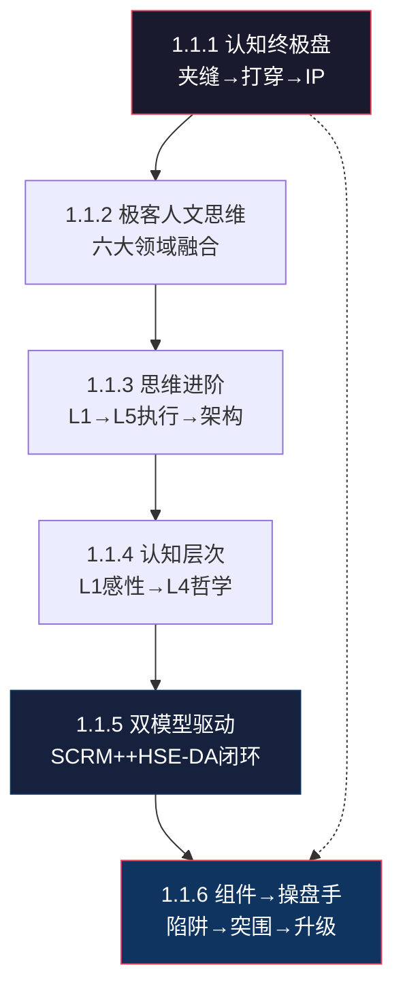

# 🌿 L3 · 1.1 顶层架构·全局总结（6 篇）

> **层级**：L3 子树根 ← [L2 认知体系](./L2-一-认知体系与思维模型.md) ← [L1 根索引](../README-知识图谱索引.md)  
> **定位**：认知体系的"总纲"——6 篇笔记定义了个人进化的层级、路径、瓶颈与突围方向  
> **下级**：→ L4 单篇深度展开

---

## 📂 树路径

```
L1 ROOT: README-知识图谱索引.md
  └── L2 一、认知体系与思维模型
        └── L3 1.1 顶层架构·全局总结  ← 当前文件
              ├── 1.1.1 [精华+][全局总结] 认知体系的终极盘
              ├── 1.1.2 [精华+][认知演进][策略总结] 极客人文思维的深度梳理
              ├── 1.1.3 [认知总结] 思维进阶：从执行到架构
              ├── 1.1.4 [新增] 认知层次与思考深度解析
              ├── 1.1.5 [新增] 双模型驱动的系统演进
              └── 1.1.6 [新增] 认知6："工业组件"到"觉醒操盘手"
```

---

## 🔷 1.1.1 认知体系的终极盘 `[精华+][全局总结]`

| 颗粒度 | 细化内容 |
|--------|----------|
| **文件** | `./[精华+][全局总结]认知体系的终极盘.md` |
| **核心命题** | 生意人 vs 企业家的"杠杆化转型"——从"生存驱动"到"价值驱动"的范式转换 |
| **▸ 夹缝求生** | **定义**：利用公司平台/行业红利期快速积累技术深度与领域认知。**关键产出**：可迁移的"原始数据"（行业痛点清单/技术瓶颈地图/人脉网络节点）。**退出信号**：当平台不再提供新数据时，夹缝已从"学校"变成"牢笼" |
| **▸ 单点打穿** | **定义**：将积累数据转化为可复用算法/工具/方法论。**核心要求**：技术壁垒必须**产品化/工具化**而非只存在于脑中——代码仓库>脑子里的知识。**验证标准**：别人用你的工具能解决同类问题，无需你在场 |
| **▸ 个人IP** | **定义**：算法→品牌传播。**本质纠正**：IP≠粉丝数，IP=**行业定价权**——当你的名字与某技术领域划等号时，你拥有议价权。**数字资产**：博客/GitHub/开源项目24h为信用背书 |
| **▸ 防火墙机制** | 利润30%强制投入壁垒研发+内容杠杆；设定"退出夹缝时间点"（日历上的具体日期，而非模糊的"以后"） |
| **▸ 风险警示** | "在夹缝中待久了，会失去单点打穿的锐气"——**最大风险不是没赚到钱，而是用极度勤奋掩盖战略懒惰** |
| **核心公式** | $个人进化 = \frac{技术深度 \times 认知高度}{环境依赖}$——分母越小，进化越快 |
| **关联** | → [1.1.2 极客人文思维](#112) · → [L3-3.1 核心策略](L3-3.1-核心策略.md) |

### ▸▸ 五级概念分解

```
认知体系终极盘
├── 夹缝求生（阶段1）
│   ├── 数据来源：公司项目/行业活动/技术社区
│   ├── 数据类型：痛点×瓶颈×人脉
│   ├── 退出条件：平台不再提供新数据
│   └── 风险：待太久→锐气钝化
├── 单点打穿（阶段2）
│   ├── 转化：数据→算法→工具
│   ├── 产品化：脑子里的知识→代码仓库
│   ├── 验证：别人用你的工具独立解决问题
│   └── 决断力：主动退出夹缝
├── 个人IP（阶段3）
│   ├── 本质：行业定价权（非粉丝数）
│   ├── 杠杆：数字资产24h为信用背书
│   └── 护城河：名字=技术领域
└── 防火墙
    ├── 现金流→资产：利润30%强制投入
    ├── 退出时间点：日历具体日期
    └── 内容杠杆：写作×开源×演讲
```

---

## 🔷 1.1.2 极客人文思维的深度梳理 `[精华+][认知演进][策略总结]`

| 颗粒度 | 细化内容 |
|--------|----------|
| **文件** | `./[精华+][认知演进][策略总结]极客人文思维的深度梳理--高筑墙，广积粮，缓称王.md` |
| **▸ 领域① 嵌入式底层技术** | RK3588/V4L2/ALSA/DRM——**不仅是技术栈，更是物理世界的"根能力"**。区别于应用层开发者：你能触达硬件寄存器、DMA缓冲区、中断处理——这是无法被AI轻易替代的"物理锚点" |
| **▸ 领域② 认知方法论** | 第一性原理（从公理推导而非类比学习）/ 因果建模（识别根因而非相关性）/ 批判性思维（对自己的信念保持怀疑）——从"how"到"why"的跃迁 |
| **▸ 领域③ 职场战略与PMP** | 权力结构分析（谁真正有决策权）/ 边界管理（不做什么比做什么更重要）/ 向上管理（让领导的领导看到你的价值）——**不是厚黑学，是系统论** |
| **▸ 领域④ 历史人文与哲学** | 资治通鉴（长因果训练）/ 王阳明心学（知行合一）/ 大明1566（权力矩阵原型）——**历史是认知的验证数据集** |
| **▸ 领域⑤ 生活经营与社会关系** | 亲密关系鲁棒性（双重职业的家庭抗风险结构）/ 家庭风险对冲（"技术精英+建制内专业人士"组合） |
| **▸ 领域⑥ AI工具与方法论** | 模型选型四大家族 / 提示工程 / PAN构想——**工具是思维的延伸，不是替代** |
| **▸ 九字方针溯源** | "高筑墙·广积粮·缓称王"首次在此文中**系统化提出**——源自朱元璋的帝王术（朱升建议），转化为个人生存策略 |
| **核心结论** | 已从"问题解决者"进化为**"系统构建者"**——不仅关心代码怎么写，更关心系统怎么运行、社会怎么运作、人应当如何自处 |
| **关联** | → [1.1.1 认知终极盘](#111) · → [1.1.3 思维进阶](#113) · → [L2-二 Sovereignty OS](../L2-二-核心模型与框架.md) |

### ▸▸ 五级概念分解

```
极客人文思维
├── 技术根能力
│   ├── RK3588平台：多核异构SoC
│   ├── V4L2：视频采集管线
│   ├── ALSA：音频环缓冲区
│   ├── DRM：显示原子更新
│   └── 不可替代性：物理寄存器=AI盲区
├── 认知工具链
│   ├── 第一性原理：公理→推导
│   ├── 因果建模：根因≠相关性
│   └── 批判性思维：自我信念定期审查
├── 职场系统论
│   ├── 权力结构：决策者×影响者×执行者
│   ├── 边界管理：说不的能力=战略能力
│   └── 向上管理：让上层看到价值
├── 历史验证集
│   ├── 资治通鉴：10-20年后果链
│   ├── 王阳明：知而不行=未知
│   └── 大明1566：权力矩阵原型
├── 关系硬架构
│   ├── 鲁棒性：允许失调·恢复力强
│   └── 风险对冲：双职业结构
└── AI工具链
    ├── Gemini：全量加载
    ├── Claude：代码质量
    ├── ChatGPT：多步推理
    └── DeepSeek：中文优化
```

---

## 🔷 1.1.3 思维进阶：从执行到架构 `[认知总结]`

| 颗粒度 | 细化内容 |
|--------|----------|
| **文件** | `./[认知总结]思维进阶：从执行到架构.md` |
| **▸ 四维进阶·逐维展开** | ① **广度→深度**：从"点状突破"（会用API/调库）到"底层深挖"（理解内核态/写驱动/改设备树）——**深度=不可替代性的唯一来源** ② **零散→系统**：从碎片信息到"知识熵减"——用模型（SCRM+/三元解构）收拢信息，而非被信息淹没 ③ **局部→整体**：从执行到"全局建模"——不只做一个好零件，要设计整台机器 ④ **模糊→具体**：从愿景到"灰度认知"——在不确定中做可执行决策，接受不完美信息 |
| **▸ 五级成长阶梯** | L1（模仿者·照抄代码）→ L2（熟练工·独立完成任务）→ L3（优秀执行者·可带小项目）→ **L4（架构师·设计系统）→ L5（战略家·定义问题）** |
| **▸ L4-L5 能力标志** | ① 能**定义问题**而非仅解决问题 ② 能**设计系统**而非仅使用系统 ③ 能在**灰度中决策**而非等待完全信息 ④ 能**跨域迁移**——将A领域的模式应用于B领域 |
| **最终结论** | "技术壁垒为核，哲学修养为盾，系统思维为矛"——三位一体的个人生存系统 |
| **关联** | → [1.1.1 认知终极盘](#111) · → [1.1.4 认知层次](#114) |

### ▸▸ 五级概念分解

```
思维进阶L1→L5
├── L1 模仿者
│   └── 照抄代码·无自主设计
├── L2 熟练工
│   └── 独立完成任务·模式匹配
├── L3 优秀执行者
│   ├── 可带小项目
│   └── 技术深度开始形成
├── L4 架构师 ← 当前突破点
│   ├── 设计系统（非使用系统）
│   ├── 跨域迁移（模式复用）
│   └── 技术决策权
└── L5 战略家
    ├── 定义问题（非解决问题）
    ├── 灰度决策（不完全信息）
    └── 行业影响力
```

---

## 🔷 1.1.4 认知层次与思考深度解析 `[新增]`

| 颗粒度 | 细化内容 |
|--------|----------|
| **文件** | `./认知层次与思考深度解析.md` |
| **▸ L1 感性表象（70-80%）** | **特征**：二元思维（对/错·好/坏）、事件驱动（只看发生了什么）、叙事依赖（需要故事框架才能理解）。**局限**：无法处理系统性复杂问题，容易被情绪和修辞操控 |
| **▸ L2 逻辑经验（15-20%）** | **特征**：因果链推理、专业领域模式匹配、能用数据支撑论证。**典型人群**：熟练工程师/医生/律师。**局限**：在自己的领域内很强，跨领域则退回L1 |
| **▸ L3 系统结构（3-5%）** | **特征**：识别反馈回路、利益相关者依赖、二阶/三阶后果。**典型人群**：高管/架构师/系统思考者。**关键能力**：在行动前预演"如果X则Y则Z"的连锁反应 |
| **▸ L4 哲学本质（<1%）** | **特征**：第一性原理推导、跨域不变性识别、文明尺度模式。**典型人群**：历史学家/战略家/罕见综合者。**关键能力**：从具体中抽象出"无论什么领域都成立"的元原则 |
| **▸ 自我定位** | 处于 **L3-L4 边界**——系统建模能力（L3成熟）+ 哲学追问意识（L4发展中）。**优势**：能同时做"系统架构"和"本质追问"——这在技术圈极罕见。**代价**：社会孤立——极少同侪，大多数人无法理解你的思维层级 |
| **关联** | → [1.1.3 思维进阶](#113) · → [L2-二 Sovereignty OS](../L2-二-核心模型与框架.md) |

### ▸▸ 五级概念分解

```
认知层次金字塔
├── L1 感性表象 70-80%
│   ├── 二元思维：对/错
│   ├── 事件驱动：只看发生了什么
│   └── 叙事依赖：需要故事框架
├── L2 逻辑经验 15-20%
│   ├── 因果链推理
│   ├── 专业模式匹配
│   └── 局限：跨领域退回L1
├── L3 系统结构 3-5%
│   ├── 反馈回路识别
│   ├── 利益相关者映射
│   └── 二阶三阶后果
└── L4 哲学本质 <1%
    ├── 第一性原理
    ├── 跨域不变性
    └── 自我定位：L3-L4边界
```

---

## 🔷 1.1.5 双模型驱动的系统演进 `[新增]`

| 颗粒度 | 细化内容 |
|--------|----------|
| **文件** | `./双模型驱动的系统演进.md` |
| **▸ 核心贡献** | 首次将 SCRM+（静态系统映射·诊断）与 HSE-DA（动态决策执行·处方）**统一为闭环**——含 Mermaid 流程图可视化两者交互关系 |
| **▸ SCRM+ 公式逐项** | $K = \frac{R_{eff} \cdot C_{str}}{1 + \ln(1 + E_{sys})} \cdot \int M_{vel} \, dt$——① $R_{eff}$=单位资源认知增量（读论文vs刷短视频的巨大差异）② $C_{str}$=因果链理解深度 ③ $E_{sys}$=分母对数级压制·环境越乱K越低 ④ $\int M_{vel}$=迭代速度时间积分·复利效应 |
| **▸ HSE-DA 公式逐项** | $DQ = \frac{P(H) \cdot \ln(S_d + 1)}{\Delta E} + \sum (\Delta R_i \cdot \eta^i)$——左半=单次决策性价比（成功概率×安全边际÷能量消耗）；右半=连续博弈复利（微小收益×杠杆累积） |
| **▸ 执行信条** | 拒绝"逻辑自旋"（过度心智模拟·在脑中反复推演不行动）→ 拥抱**快速低成本物理探测**（最小可行行动→真实世界反馈→校准模型） |
| **▸ 模型闭环** | SCRM+ 诊断系统状态（当前在哪）→ HSE-DA 开出行动处方（下一步做什么）→ 现实反馈（结果是什么）→ 校准双方模型 |
| **关联** | → [L2-二 SCRM+](../L2-二-核心模型与框架.md#213) · → [L2-二 HSE-DA](../L2-二-核心模型与框架.md#212) |

---

## 🔷 1.1.6 从"工业组件"到"觉醒操盘手" `[新增][认知]`

| 颗粒度 | 细化内容 |
|--------|----------|
| **文件** | `./认知6："工业组件"到"觉醒操盘手".md` |
| **▸ 组件陷阱·完整链条** | 高技术可靠性 → 被分配"地基"任务（只有你能做）→ 因"太有价值而无法移动"→ 晋升评审中不可见（你的贡献是"基础设施"而非"业务成果"）→ 被锁定在"高可靠·低维护成本"的工业组件角色 |
| **▸ 三大突围机制** | ① **关键节点单点主导**：在某个不可替代的技术节点建立绝对优势 ② **IP品牌外部化**：建立不依赖公司平台的独立影响力（博客/GitHub/开源）③ **校准曝光度**：让**高层直接**见证你的价值，而非通过中层过滤 |
| **▸ 杠杆点** | ① 可见的**架构决策**（非实现细节·"选择了XX方案因为YY"）② **跨职能影响力**（非仅技术正确性·"我说服了硬件团队改变设计"）③ **清晰表达的观点**（非仅响应驱动·"我预判了这个风险并提前布局"） |
| **▸ 时间线与标志** | **6-12个月**完成信誉转型——技术成就（完成深度工作·可展示的产出）+ 外部放大（IP存在感·行业认知）|
| **关联** | → [L3-3.2 职业思考系列](L3-3.2-职业思考系列.md) · → [L3-3.1 备胎计划](L3-3.1-核心策略.md) |

### ▸▸ 五级概念分解

```
组件→操盘手
├── 组件陷阱（诊断）
│   ├── 高可靠→地基任务
│   ├── 不可替代→无法移动
│   ├── 基础设施贡献→不可见
│   └── 锁定→工业组件角色
├── 突围机制（行动）
│   ├── 单点主导：技术绝对优势
│   ├── IP外部化：独立影响力
│   └── 曝光校准：高层直接见证
├── 杠杆点（加速）
│   ├── 架构决策（非实现细节）
│   ├── 跨职能影响（非仅技术）
│   └── 清晰观点（非响应驱动）
└── 时间线（节奏）
    ├── 6-12月信誉转型
    ├── 技术成就+外部放大
    └── 身份升级：资源→决策者
```

---

## 🗺️ 子域概念图



---

## 📖 子域阅读路径

```
1. 1.1.3 思维进阶        ← 理解自己当前的思维层级（L3→L4突破）
2. 1.1.4 认知层次        ← 定位自己在金字塔中的位置（L3-L4边界）
3. 1.1.1 认知终极盘      ← 掌握三阶段进化框架（夹缝→打穿→IP）
4. 1.1.2 极客人文思维    ← 确认自己的跨域特质（六大领域融合）
5. 1.1.5 双模型驱动      ← 理解SCRM++HSE-DA的闭环逻辑
6. 1.1.6 组件→操盘手     ← 执行身份升级的具体路径
```

---

> **下一级**：L4 将对每篇笔记逐篇展开到公式推导、案例拆解、行动清单等 5 级颗粒度。
