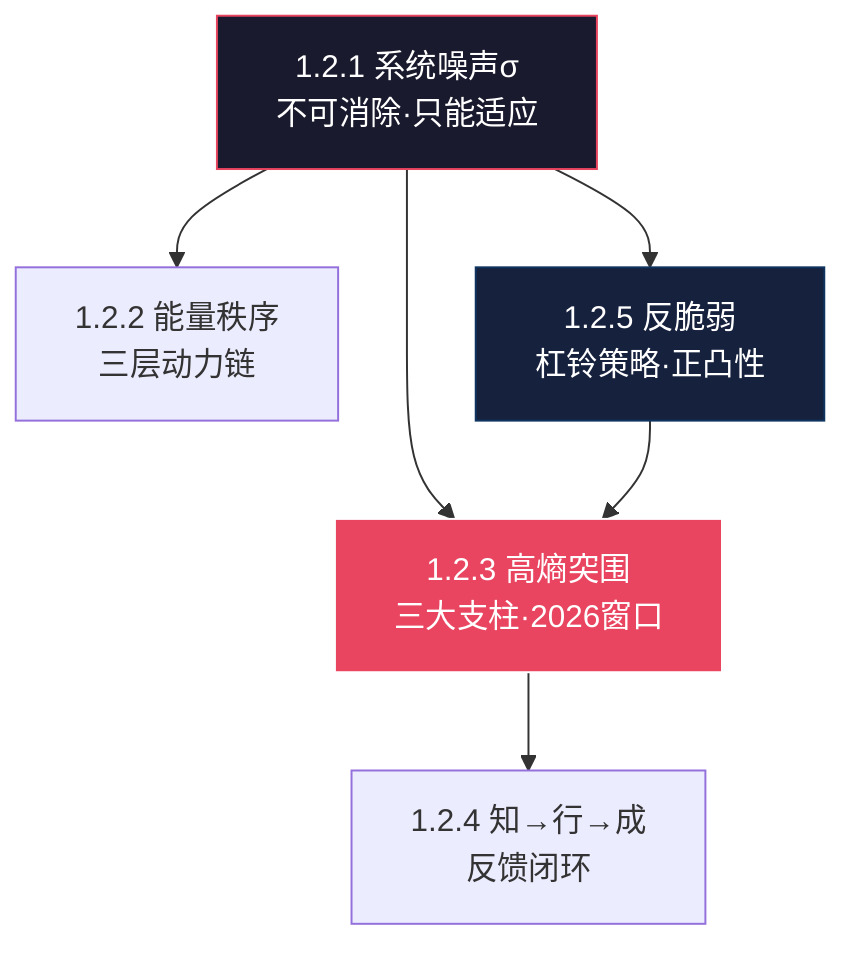

# 🌿 L3 · 1.2 核心理念·熵与双螺旋（5 篇）

> **层级**：L3 子树根 ← [L2 认知体系](./L2-一-认知体系与思维模型.md) ← [L1 根索引](../README-知识图谱索引.md)  
> **定位**：认知体系的"底层物理定律"——熵增是不可抗力，双螺旋是对抗熵增的唯一路径，反脆弱是终极生存策略  
> **下级**：→ L4 单篇深度展开

---

## 📂 树路径

```
L1 ROOT: README-知识图谱索引.md
  └── L2 一、认知体系与思维模型
        └── L3 1.2 核心理念·熵与双螺旋  ← 当前文件
              ├── 1.2.1 [精华+][认知总结] 系统噪声与双螺旋进阶
              ├── 1.2.2 [无标签] 能量、秩序与进化
              ├── 1.2.3 [新增][认知] 认知8：高熵环境主权突围
              ├── 1.2.4 [新增][认知] 认知10：知→行→成三层断裂
              └── 1.2.5 [新增][阅读] 《反脆弱》核心概念
```

---

## 🔷 1.2.1 系统噪声与双螺旋进阶 `[精华+][认知总结]`

| 颗粒度 | 细化内容 |
|--------|----------|
| **文件** | `./[精华+][认知总结]"系统噪声"的讨论，双螺旋进阶，结论：在熵增夹缝中，实现个人熵减.md` |
| **▸ 系统噪声 σ 形式化** | $\sigma = f(\text{非对称信息}, \text{非理性分配}, \text{不透明规则})$——**三大噪声源**：① 信息不对称（领导知道你不知道的）② 分配非理性（晋升/加薪不按贡献比例）③ 规则不透明（决策过程不可见）。**关键认知**：σ 无法预测/消除/只能适应 |
| **▸ 双螺旋模型·DNA类比** | α螺旋（认知迭代·理论层）+ β螺旋（实践层·物理执行）交替上升——像DNA双链：**单链无法独立进化**。α螺旋=阅读/思考/建模（在脑海中更新世界观）；β螺旋=实验/行动/验证（在物理世界获取反馈）。螺旋上升=理论指导实践→实践修正理论→循环 |
| **▸ 公司=环境API** | **不试图"修复"公司的逻辑**——将公司视为黑盒API：调用后看返回值。返回200（正常·有成长空间）→加速积累；返回403（被边缘化·无权限）→执行本地缓存Plan B。**核心节省**：不浪费能量质问"为什么403"——问也没用 |
| **▸ 经典隐喻·逐层解读** | "下雨了（被边缘化），我只需打伞（做完琐事）并回房间读书（钻研底层技术），而不会质问天空为什么不放晴"——**接受不可控**（下雨/公司决策）+**可控行动**（打伞/完成职责）+**战略投资**（读书/积累护城河）= 熵减策略的精髓 |
| **▸ 熵减三路径** | ① **信息降噪**：三元解构过滤——只保留高保真事实，剥离立场和利益扭曲 ② **能量聚焦**：单点打穿——把有限精力集中在因果结构最清晰的杠杆点 ③ **结构简化**：Sovereignty OS高内聚低耦合——减少不必要的环境依赖 |
| **关联** | → [1.2.2 能量秩序](#122) · → [L2-二 Sovereignty OS](../L2-二-核心模型与框架.md) · → [L3-7 告别内耗](L3-7-实践与IP.md) |

### ▸▸ 五级概念分解

```
系统噪声与双螺旋
├── 系统噪声σ
│   ├── 非对称信息：领导知道你不知道的
│   ├── 非理性分配：晋升≠贡献比例
│   └── 不透明规则：决策过程不可见
├── 双螺旋模型
│   ├── α螺旋·理论层：阅读/思考/建模
│   ├── β螺旋·实践层：实验/行动/验证
│   └── 单链无法独立进化
├── 公司=环境API
│   ├── 200→加速积累
│   ├── 403→本地缓存Plan B
│   └── 不问"为什么"→节省能量
├── 经典隐喻
│   ├── 下雨=被边缘化（接受不可控）
│   ├── 打伞=完成职责（可控行动）
│   └── 读书=积累护城河（战略投资）
└── 熵减三路径
    ├── 信息降噪：三元解构过滤
    ├── 能量聚焦：单点打穿
    └── 结构简化：高内聚低耦合
```

---

## 🔷 1.2.2 能量、秩序与进化 `[无标签]`

| 颗粒度 | 细化内容 |
|--------|----------|
| **文件** | `./[策略演进]能量、秩序与人类进化终极追求.md` |
| **▸ 溯源** | Gemini 多轮对话 · 3轮Q&A（终极追求→三方关系→精英分析）· 2026-06-01 |
| **▸ 三层动力链·逐层展开** | ① **个人原始动力**：基因延续（生物本能·繁衍后代）+ 逃避虚无（存在主义·对抗"我终将消失"的恐惧）——所有个人行为的生物学与哲学根基 ② **国家竞争动力**：资源控制（能源/矿产/粮食/水）+ 秩序维护（对内稳定·对外安全）——地缘政治与国家机器的底层驱动力 ③ **人类终极追求**：**神格化**——摆脱一切母体束缚（物理/生物/社会），实现完全自主——这是所有文明/宗教/科技的最底层指向 |
| **▸ "文明冲突"深层解构** | 亨廷顿的"文明冲突论"= **国家动员底层参与资源争夺的意识形态外衣**——用"我们vs他们"的文化叙事包装"谁获得资源"的物质博弈。不是文明在冲突，是利益集团在利用文明认同动员群众 |
| **▸ 秩序本质** | 秩序 = **能量的有序流动**——从个人（身体健康=能量代谢有序）到国家（社会稳定=资源分配有序）到人类（文明进步=知识/能源利用效率提升），一切"进步"都是对抗熵增的**临时胜利**——"临时"二字至关重要：没有永恒的秩序，只有动态维护 |
| **关联** | → [1.2.1 系统噪声](#121) · → [L2-六 大明1566](../L2-六-历史与典籍.md) |

### ▸▸ 五级概念分解

```
能量秩序进化
├── 个人层
│   ├── 基因延续：生物本能
│   └── 逃避虚无：存在主义根基
├── 国家层
│   ├── 资源控制：能源/矿产/粮食
│   └── 秩序维护：对内稳定·对外安全
├── 人类层
│   └── 神格化：摆脱一切母体束缚
├── 文明冲突=意识形态外衣
│   └── 本质：利益集团利用文明认同动员
└── 秩序=能量有序流动
    └── 一切进步=对抗熵增的临时胜利
```

---

## 🔷 1.2.3 生存突围：高熵环境主权实现 `[新增][认知]`

| 颗粒度 | 细化内容 |
|--------|----------|
| **文件** | `./认知8：生存--2026-年高熵环境下实现主权突围.md` |
| **▸ 熵悖论·核心洞察** | 系统越混乱（AI冲击就业/企业裁员/监管政策波动）= 个体可穿越的"裂缝"越多——**利好灵活者，利空僵化者**。高熵环境不是"所有人都遭殃"——是"不适应者遭殃，适应者获利" |
| **▸ 三大支柱·逐一展开** | ① **技术护城河**：RK3588底层驱动能力=不可被AI/外包轻易替代的"物理锚点" ② **个人品牌**：IP受众数量×影响力=**谈判筹码**——当你有了外部选择权，内部谈判力自动提升 ③ **财务缓冲**：3-6个月生活费=**决策选择权**——不被"下个月房租怎么办"绑架职业决策 |
| **▸ 2026窗口判断** | AI使中等技能劳动力商品化（翻译/初级编程/客服）→ 溢价流向两个方向：(a) **不可自动化的专业领域**（底层驱动/复杂系统架构/物理世界交互）(b) **独特定位**（IP/品牌/网络·无法复制的个人特质）。你同时在(a)和(b)布局=**最优策略** |
| **▸ 行动框架·按季度** | Q2-Q3（当下）：技术闭环（V4L2驱动完整交付）+ 内容生产（3-5篇技术深度文章·积累种子用户）。Q4：IP专业化（Patreon/Substack/YouTube频道上线·建立付费受众）。2027：变现（$1k+/月被动收入）或杠杆（用IP影响力跳槽/创业/咨询） |
| **关联** | → [L3-3.1 2026生存策略](L3-3.1-核心策略.md) · → [L3-3.1 高筑墙](L3-3.1-核心策略.md) |

---

## 🔷 1.2.4 认知与现实的矛盾：知→行→成 `[新增][认知]`

| 颗粒度 | 细化内容 |
|--------|----------|
| **文件** | `./认知10：认知与现实的矛盾分析--"知"与"行"、"行"与"成".md` |
| **▸ 三层断裂·逐一诊断** | ① **知（认知完备但未测试）**：高IQ者常停滞于此——能清晰阐述框架/模型/理论，但从未在物理世界压力测试。**症状**："我全懂了，但什么都没变" ② **行（物理执行脱节）**：有行动但无系统性——努力≠进步。**症状**："我很忙，但不知道在忙什么" ③ **成（现实反馈缺失）**：看不到行动的产出→模型未校准→信心下降→更少行动→恶性循环 |
| **▸ 反馈闭环·HSE-DA哲学基础** | "成"是**唯一真值指标**——如果"知"预测X但"行"产出Y，则"知"不完整/有偏见。**每次低成本探测**（行）应触发现实反馈（成），然后用反馈更新模型（知）和下一轮迭代（行）。这就是HSE-DA的哲学内核 |
| **▸ 个人意义·直指要害** | 你已经掌握认知框架（知）——SCRM+/三元解构/HSE-DA都已内化。**关键阶段=持续物理行动（行）+快速反馈整合（成）**以闭合循环。**当前瓶颈不在"知"，在"行→成"的断层** |
| **关联** | → [1.2.1 双螺旋](#121) · → [L2-二 HSE-DA](../L2-二-核心模型与框架.md#212) |

### ▸▸ 五级概念分解

```
知→行→成 三层断裂
├── 知（认知层）
│   ├── 症状：我全懂了，但什么都没变
│   ├── 根源：框架未经物理世界压力测试
│   └── 高IQ风险：以"理解"替代"行动"
├── 行（执行层）
│   ├── 症状：我很忙，但不知道在忙什么
│   ├── 根源：行动无系统性·无反馈收集
│   └── 关键：努力≠进步（如果无反馈循环）
├── 成（验证层）
│   ├── 唯一真值指标
│   ├── 知预测X→行产出Y→知不完整
│   └── 闭环：行→成→更新知→下一轮行
└── 个人诊断
    ├── 知：已掌握·内化完成
    ├── 行：需要系统化·持续性
    └── 成：当前瓶颈·需闭合反馈环
```

---

## 🔷 1.2.5 《反脆弱》核心概念与章节解析 `[新增][阅读]`

| 颗粒度 | 细化内容 |
|--------|----------|
| **文件** | `./[阅读]《反脆弱》核心概念与章节解析.md` |
| **▸ 三元重定义·与系统噪声的共鸣** | 塔勒布的三元：**脆弱**（负不对称·压力下崩解——如玻璃杯·高度优化但僵化的系统）、**强韧**（不变·压力下不变——如石头·但不会从压力中获益）、**反脆弱**（正凸性·从混乱中获益——如肌肉·越压越强）。这与系统噪声理论的共鸣：**不追求消除σ，追求从σ中获益** |
| **▸ 杠铃策略·实战映射** | 90%极度安全（现金/国债/稳定工作收入）+ 10%极度杠杆（创业/投资/高风险高回报）= **捕获黑天鹅而不爆仓**。个人映射：90%=TCL工资+技术护城河积累，10%=IP建设+边缘AI探索——**用安全底座支撑高风险探索** |
| **▸ 可选性至上** | "看涨期权"胜过预测——不预判未来，保持"如果X发生我可以Y"的灵活性。**个人应用**：不押注单一技术栈（只做Android驱动），保持多平台能力（RK+Amlogic+MTK）= 可选择权 |
| **▸ 凸性机制** | 损失加速（凹性·越跌越快）；收益加速（凸性·越涨越快）。**反脆弱系统=正凸性**——小损失大收益的结构。**个人应用**：写一篇技术文章=固定时间成本（小损失），但可能被大V转发/猎头发现（大收益）=正凸性 |
| **▸ 过度干预危害·与系统噪声共鸣** | 防火带抑制→森林可燃物积累→超级大火。经济波动平滑→风险隐藏累积→脆弱大崩溃。**映射**：公司过度管理（消除所有"低效"）→员工失去适应力→黑天鹅来临时集体崩溃。**你在TCL的处境正是此理论的验证** |
| **关联** | → [1.2.1 系统噪声](#121) · → [L2-二 Sovereignty OS](../L2-二-核心模型与框架.md) |

---

## 🗺️ 子域概念图



---

## 📖 子域阅读路径

```
核心理念筑基路径：
1. 1.2.1 系统噪声与双螺旋    ← 掌握核心哲学（熵+双螺旋）
2. 1.2.5 反脆弱             ← 塔勒布框架补充（杠铃+凸性）
3. 1.2.2 能量秩序           ← 理解宏观动力（个人→国家→人类）
4. 1.2.3 高熵环境主权突围   ← 2026实战框架
5. 1.2.4 知→行→成          ← 闭合反馈循环（当前瓶颈）
```

---

> **下一级**：L4 将对每篇笔记逐篇展开到公式推导、塔勒布章节映射、季度行动计划等 5 级颗粒度。
