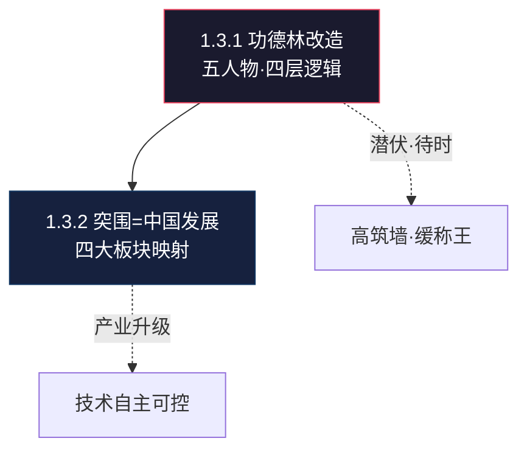

# 🌿 L3 · 1.3 历史宏观视角（2 篇）

> **层级**：L3 子树根 ← [L2 认知体系](./L2-一-认知体系与思维模型.md) ← [L1 根索引](../README-知识图谱索引.md)  
> **定位**：以历史为镜——从功德林战犯改造到中国产业升级，历史是个人认知的"验证数据集"  
> **下级**：→ L4 单篇深度展开

---

## 📂 树路径

```
L1 ROOT: README-知识图谱索引.md
  └── L2 一、认知体系与思维模型
        └── L3 1.3 历史宏观视角  ← 当前文件
              ├── 1.3.1 [精华+][认知] 功德林战犯改造史
              └── 1.3.2 [精华][认知演进] 个人突围类比中国发展
```

---

## 🔷 1.3.1 功德林战犯改造史 `[精华+][认知]`

| 颗粒度 | 细化内容 |
|--------|----------|
| **文件** | `./[精华+][认知]历史宏观角度看待个人生存与发展.md` |
| **▸ 五人物·逐一剖析** | ① **杜聿明**（黄埔一期/远征军司令）：从"我是抗日名将"到"我确实有罪"——**认知重构的极端案例**。在功德林种菜/缝纫→打破"将军不需要动手"的特权意识→思想学习（马列/毛著系统教育·替换意识形态OS）→自我批评（用自己的嘴否定自己的过去·这是最痛苦的环节）→最终转变 ② **王耀武**（74军军长/抗日铁军）：最积极配合改造的"聪明人"——最早认清现实、最早获特赦。**策略智慧**：不是投降，是"识时务"——在不可抗力面前选择生存而非殉道 ③ **宋希濂**（鹰犬将军）：改造最曲折，最终彻底转变——**曲线最长但终点最深** ④ **黄维**（土木系/"花岗岩脑袋"）：最后一批特赦，拒不认罪——**刚性对抗的代价** ⑤ **沈醉**（军统特务头子）：从情报思维（搜集/分析/操控）到"向人民交代"——**职业惯性的瓦解** |
| **▸ 四层改造逻辑·逐层解析** | ① **体力劳动**：打破特权意识——让将军种菜/缝纫/养猪。**心理学机制**：身体劳动=重置身份锚点——你不再是"将军"，你是一个"劳动者" ② **思想学习**：马列/毛著系统教育——**替换意识形态操作系统**。不是删除旧系统，是安装新系统并证明新系统更完整 ③ **自我批评**：逻辑重构——用自己的嘴否定自己的过去。**最痛苦的环节**：不是别人骂你，是你自己骂自己 ④ **统战宣传**：政治象征——改造成功者的示范效应（"看，连杜聿明都转变了"） |
| **▸ 张铁石事件** | 在香港自杀——**台湾当局对"被洗脑"将领的心理战恐惧**。改造vs洗脑的本质区别：是否允许被改造者保留"逻辑自洽"——真正的改造是**你自己推导出新结论**，洗脑是**强行灌输不容质疑** |
| **▸ 个人映射** | "潜伏"与"待时"——在不利环境中保持核心能力（底层技术），等待时机（行业窗口/IP影响力成熟）。这与"高筑墙·缓称王"形成**跨时代历史佐证** |
| **关联** | → [L2-六 大明1566](../L2-六-历史与典籍.md) · → [L3-3.1 职场实战](L3-3.1-核心策略.md) |

### ▸▸ 五级概念分解

```
功德林改造
├── 五人物轨迹
│   ├── 杜聿明：名将→认罪（最完整转变）
│   ├── 王耀武：聪明人→最早特赦（识时务）
│   ├── 宋希濂：最曲折→最彻底（长曲线）
│   ├── 黄维：花岗岩→最后特赦（刚性代价）
│   └── 沈醉：军统→交代（职业惯性瓦解）
├── 四层改造逻辑
│   ├── 体力劳动：打破特权·身份重置
│   ├── 思想学习：替换OS·安装新系统
│   ├── 自我批评：逻辑重构·自己否定自己
│   └── 统战宣传：示范效应·政治象征
├── 改造vs洗脑
│   └── 区别：是否保留逻辑自洽
├── 张铁石事件
│   └── 台湾对"被洗脑"的心理战恐惧
└── 个人映射
    └── 潜伏·待时=高筑墙·缓称王
```

---

## 🔷 1.3.2 个人突围类比中国发展 `[精华][认知演进]`

| 颗粒度 | 细化内容 |
|--------|----------|
| **文件** | `./[精华][认知演进]将个人生存突围类比中国的发展突围.md` |
| **▸ 四大板块映射·逐板展开** | ① **沪深主板**（蓝筹稳定·银行/能源/消费）= **个人的稳定收入+核心技能**——基本盘。类比：大秦铁路/工商银行=你的TCL工资+10年嵌入式经验。稳定但增速有限 ② **科创板**（硬科技/半导体·中芯国际/海光信息）= **个人的技术壁垒/不可替代性**——护城河。类比：RK3588底层驱动能力——高投入·高壁垒·高回报 ③ **创业板**（高成长·宁德时代/迈瑞医疗）= **个人的新兴方向/AI边缘计算**——增长极。类比：NPU模型部署+端侧AI——增速最快·风险也最高 ④ **北交所**（专精特新·细分龙头）= **个人的细分领域深度**——差异化。类比：V4L2驱动开发——极窄但极深·大厂看不上·小厂做不了 |
| **▸ 产业升级类比** | 个人突围 = 中国从"低端加工"（来料加工·CRUD业务代码）→"中端制造"（自主品牌·独立模块开发）→"核心技术自主可控"（底层驱动+端侧AI+PAN全栈）。**三个阶段不是跳跃的，是叠加的**——你不能跳过"中端制造"直接做"核心技术" |
| **▸ 关键类比逻辑** | ① 技术自主=国家芯片自主——不依赖外部平台（不被单一公司锁死）② 产业升级=个人能力升级——从执行到架构 ③ 内需市场=个人IP受众——国内市场支撑中国制造=个人IP支撑职业选择 |
| **关联** | → [L3-7 股市博弈](L3-7-实践与IP.md) · → [L3-3.1 备胎计划](L3-3.1-核心策略.md) |

### ▸▸ 五级概念分解

```
个人突围=中国发展
├── 沪深主板→基本盘
│   ├── 稳定收入（TCL工资）
│   └── 核心技能（10年嵌入式）
├── 科创板→护城河
│   ├── RK3588底层驱动
│   └── 高壁垒·高回报
├── 创业板→增长极
│   ├── NPU模型部署
│   └── 端侧AI
├── 北交所→差异化
│   ├── V4L2驱动开发
│   └── 极窄极深
└── 升级路径
    ├── 低端加工→CRUD代码
    ├── 中端制造→独立模块
    └── 核心技术→底层+AI+PAN
```

---

## 🗺️ 子域概念图



---

> **下一级**：L4 将对每篇逐篇展开到历史事件时间线、人物关系图、产业升级对照表等 5 级颗粒度。
