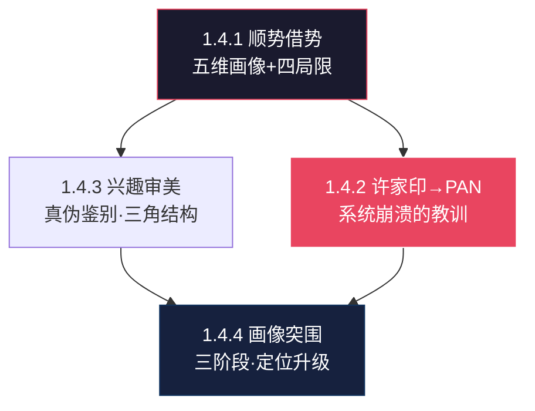

# 🌿 L3 · 1.4 个人画像与批判性分析（5 篇）

> **层级**：L3 子树根 ← [L2 认知体系](./L2-一-认知体系与思维模型.md) ← [L1 根索引](../README-知识图谱索引.md)  
> **定位**：自我认知的"镜子"——你是谁、你的局限是什么、你为什么要做PAN  
> **下级**：→ L4 单篇深度展开

---

## 📂 树路径

```
L1 ROOT: README-知识图谱索引.md
  └── L2 一、认知体系与思维模型
        └── L3 1.4 个人画像与批判性分析  ← 当前文件
              ├── 1.4.1 [精华+] 顺势与借势·个人画像
              ├── 1.4.2 [精华+][认知][PAN] 许家印与PAN构想
              ├── 1.4.3 [新增][认知] 认知5：自我认知与审视·兴趣与审美
              ├── 1.4.4 [新增] 个人画像与生存突围策略
              └── 1.4.5 🆕 [精华++] 深度人物画像：Erik的终极侧写
```

---

## 🔷 1.4.1 顺势与借势·个人画像 `[精华+]`

| 颗粒度 | 细化内容 |
|--------|----------|
| **文件** | `./[精华+]"顺势"与"借势"--机会往往存在于"制度缝隙".md` |
| **▸ 画像五维·逐维展开** | ① **认知建模**：公理化系统思维——将一切问题转化为可建模的结构（S·C·R·M）。**不是"聪明"，是"建模意识"** ② **职业战略**：技术掘金者——不追逐热点（不做React/Vue），在底层技术中寻找不可替代性（V4L2/DRM/RK3588）。**慢但稳** ③ **哲学倾向**：知行合一者——王阳明心学的现代工程实践者。**"知而不行=未知"已内化为行动准则** ④ **审美偏好**：权力运行真相——对"表面之下的真实博弈"有近乎偏执的兴趣（大明1566/严嵩/许家印/爱博斯坦）⑤ **情感觉察**：原子化个体——在关系中保持独立性，不依赖外部情绪供给 |
| **▸ 四大局限·深层诊断** | ① **"逻辑的囚徒"**：过度依赖理性分析，**屏蔽了非理性要素**（情感/直觉/混沌）在决策中的合法地位。**风险**：在需要"感觉"（亲密关系/团队氛围/市场情绪）的领域判断失误 ② **"战术勤奋·战略孤立"**：个人能力极强，但**忽视协作势能**——一个人可以走得快，但一群人走得远。**当前状态**：IP建设正是打破此局限的关键行动 ③ **"文化属性自我暗示"**：《天道》式宿命论——"文化属性决定命运"可能在潜意识中成为**不行动的借口**（"我出身/背景如此，所以…"）④ **"理想化与现实丛林冲突"**：士大夫式技术情怀——用"技术改变世界"的理想主义对抗"利益交换"的现实主义 |
| **▸ 核心冲突** | 对"真相"的渴求 vs 现实社会"混沌属性"——**不可调和的张力，却是创造力的源泉**。你的知识体系正是从这种张力中生长出来的 |
| **▸ "制度缝隙"理论** | 机会往往存在于制度缝隙——正式规则之间的灰色地带、新旧范式转换的窗口期、技术成熟度与市场需求的断层。**个人应用**：边缘AI正处于"大厂看不上·小厂做不了"的制度缝隙 |
| **关联** | → [1.4.3 兴趣审美](#143) · → [L3-3.1 2026生存](L3-3.1-核心策略.md) |

---

## 🔷 1.4.2 许家印与PAN构想 `[精华+][认知][PAN]`

| 颗粒度 | 细化内容 |
|--------|----------|
| **文件** | `./[精华+][认知][PAN]许家印等"脱颖而出"的人物分析，去看个人与世界，再到PAN的构想.md` |
| **▸ 8大罪名·法律结构** | 非法吸收公众存款 / 集资诈骗（最高无期）/ 违法发放贷款 / 违法运用资金 / 欺诈发行证券 / 违规披露（超5600亿收入+900亿利润造假）/ 职务侵占 / 单位行贿——**系统性金融犯罪的完整拼图** |
| **▸ 心理演化四阶段** | ① **英雄主义**："我可以改变规则"——创业期的过度自信 ② **路径依赖**："已经走到这一步"——庞氏结构一旦启动无法停止 ③ **侥幸心理**："太大而不能倒"——认为政府会兜底 ④ **历史宿命**："认罪是最后的止损"——保护家族资产/让其他维度存续/避免更大清算 |
| **▸ 深层博弈解读** | 认罪 ≠ 低头——当"术"（经营技巧/政商关系/财务手段）无法覆盖"势"（宏观去杠杆/房地产拐点/监管收紧）的崩溃，认罪=**自我牺牲式关闭**——让家族/资产在其他维度存续。这与大明1566中严嵩的最终命运形成跨越500年的共鸣 |
| **▸ →PAN连接** | 从许家印的"系统崩溃"反推 PAN 核心价值：**不依赖任何单一中心化系统**——恒大依赖银行/政府/资本市场，一旦任一节点断裂→全盘崩溃。PAN=断网可用+隐私保护+个体主权协议化=**反集中化风险的终极架构** |
| **关联** | → [L2-五 PAN技术](../L2-五-科技与技术.md) · → [1.4.1 个人画像](#141) |

### ▸▸ 五级概念分解

```
许家印→PAN
├── 8大罪名
│   ├── 非法吸存+集资诈骗（最高无期）
│   ├── 欺诈发行+违规披露（5600亿+收入造假）
│   └── 职务侵占+单位行贿
├── 心理演化
│   ├── 英雄主义→路径依赖
│   ├── 侥幸心理→历史宿命
│   └── 认罪=最后的止损
├── 深层博弈
│   ├── 术（经营/关系/财务）无法覆盖势
│   ├── 自我牺牲式关闭
│   └── 类比：严嵩的最终命运
└── →PAN连接
    ├── 反集中化风险
    ├── 断网可用+隐私保护
    └── 个体主权协议化
```

---

## 🔷 1.4.3 自我认知与审视：兴趣与审美 `[新增][认知]`

| 颗粒度 | 细化内容 |
|--------|----------|
| **文件** | `./认知5：自我认知与审视--兴趣与审美.md` |
| **▸ 品味即氧气·深层逻辑** | 你的审美选择（看什么书/聊什么话题/交什么朋友）揭示**真实价值观**——比任何目标宣言更可靠。因为审美不需要意志力维持——你**自然被某些事物吸引**，这就是你真实的"操作系统偏好" |
| **▸ 真伪兴趣鉴别·可操作方法** | **真兴趣**：触发能量释放——即使困难也感到充实（如：啃RK3588 TRM手册到凌晨但不觉得累）。**伪兴趣**："应该喜欢"→消耗感——做的时候需要意志力推动，做完感到空虚（如：看"成功人士必读"书单）。**鉴别口诀**：如果没人知道你在做这件事，你还会做吗？ |
| **▸ 当前组合判断** | RK3588固件 + 政治哲学 + 系统建模 = **连贯集群**——不随机。**底层驱动力**：对"权力/系统如何**实际**运作"的真兴趣。不是对"如何破解个人财务"的投机，不是对"如何获得头衔"的虚荣——是对**底层机制**的认知饥渴。**这解释了为什么你的知识体系呈现"技术→哲学→历史"的三角结构** |
| **▸ 战略含义** | 倾斜进这个非对称兴趣——多数工程师逃避哲学，多数哲学家恐惧硬件——你在两者的交点上建立IP=**不可复制的差异化** |
| **关联** | → [1.4.1 个人画像](#141) · → [L2-八 技能包](../L2-八-杂想与人物.md) |

---

## 🔷 1.4.4 个人画像与生存突围策略 `[新增]`

| 颗粒度 | 细化内容 |
|--------|----------|
| **文件** | `./个人画像与生存突围策略.md` |
| **▸ 核心悖论** | "理性的高手 trapped in a role too small for their caliber"——**被认可为高度可靠但长期低配**。这是一个结构性矛盾：你的L3-L4思维层级 vs 组织给你的L2-L3角色定位之间的**错配** |
| **▸ 三阶段路线·逐阶段展开** | ① **技术筑墙**（当前阶段）：V4L2驱动完整交付→成为不可替代的"V4L2专家"→建立技术护城河的**第一个闭环** ② **内容积粮**（3-6月内）：产出5-10篇技术深度文章→积累500+种子粉丝→建立"技术+认知"的**IP雏形** ③ **生态突围**（6-12月内）：IP品牌初步成型→外部选择权出现（咨询/内容变现/跳槽筹码）→**逃脱单一雇主依赖** |
| **▸ 个人定位升级** | 从"边缘化工程师"→"主权操作者"——通过HSE-DA算法（每周低风险探测）+SCRM+模型（季度系统诊断）实现**渐进但不可逆**的身份升级 |
| **▸ 风险评估** | 组织杠杆已耗尽——你在当前公司的晋升/加薪空间已接近上限。**必须**建立个人品牌护城河以逃脱单一雇主依赖。这不是"备胎"心态，是**理性风险管理** |
| **关联** | → [L3-3.1 高筑墙](L3-3.1-核心策略.md) · → [L3-3.2 职业思考](L3-3.2-职业思考系列.md) |

### ▸▸ 五级概念分解

```
个人画像突围
├── 核心悖论
│   ├── 思维层级L3-L4 vs 角色定位L2-L3
│   └── 被认可为可靠但长期低配
├── 三阶段路线
│   ├── 技术筑墙：V4L2闭环
│   ├── 内容积粮：500+种子粉丝
│   └── 生态突围：逃脱单一雇主依赖
└── 风险评估
    └── 组织杠杆已耗尽→必须建个人IP
```

---

## 🔷 1.4.5 深度人物画像：Erik的终极侧写 `[精华++]` 🆕

| 颗粒度 | 细化内容 |
|--------|----------|
| **文件** | `./深度人物画像：-Erik-的终极侧写.md` |
| **▸ 溯源** | Gemini 多轮对话 · 3轮Q&A · 2026-06-24 |
| **▸ 六维全息坐标** | ① **物理层**：35岁·深圳·TCL高级SE·RK3588/V4L2/ALSA/DRM内核禁区·伴侣为法官助理（法律防御插件）② **逻辑层**：SCRM+认知引擎+HSE-DA决策引擎+三元解构信息编译器——自研算法矩阵③ **精神层**：10年+Latex/束腰极端审美=精神排熵机制·王阳明"事上练"=痛苦→算法迭代养料④ **战略层**：双螺旋演进（左旋死磕RK3588+右旋构建IP）·PAN帝国（私有智能节点）⑤ **系统Bug**：认知自旋锁——过度拟合宏观规律，微观执行延迟·逻辑洁癖·完美无尘实验室效应⑥ **终极补丁**：暴力执行(RLPF)——带噪运行，强行物理位移 |
| **▸ Kegan理论横向对比** | **Stage 3（社会化心智·70-80%同龄人）**：由外部评价/头衔/房产定义→Erik已**完全碾压免疫**。**Stage 4（自主导向心智·同龄精锐前5%）**：拥有独立价值坐标系，Erik在此达极致——价值观高度公理化。**Stage 5（自我变革心智·全社会前1.5%）**：能将思维方式本身客体化，身体里运行两个自我（红尘输出+高维旁观），Erik频繁展露此元认知异能——追求用物理反馈修正认知模型 |
| **▸ 三大致命Bug** | ① **认知自旋锁**：用理论宏大化对冲行动矮小化——L5推演过深导致"高雅的精神避难所"② **完美无尘实验室效应**：对确定性和绝对控制有偏执追求，无法兼容物理摩擦力（职场小人/非理性噪声）③ **单点故障脆弱性**：全量收入仍绑定TCL单一总线 |
| **▸ 架构师终极判词** | "将肉体作为实验场，将逻辑作为手术刀的清醒蛰伏者。左手攥着《资治通鉴》的权力算法，右手按着RK3588的物理主板，身上披着Latex的审美铠甲，心里运行着'事上练'的冷酷心法。预训练已100%结束——请按下Power键，暴烈运行。" |
| **关联** | → [Sovereignty OS](../L3-2.1-SovereigntyOS.md) · → [双模型驱动](../L3-1.1-顶层架构.md) · → [思维进阶](../L3-1.1-顶层架构.md#113) · → [汪滔·我字是毒药](../L3-8-杂想与人物.md#81) |

### ▸▸ 五级概念分解

```
Erik终极侧写
├── 物理层：RK3588/TCL防线/法官伴侣安全插件
├── 逻辑层：SCRM+/HSE-DA/三元解构
├── 精神层：Latex排熵/心学事上练
├── 战略层：双螺旋+PAN帝国+IP输出
├── Kegan定位：Stage 4巅峰→Stage 5跃迁（前1.5%）
├── Bug诊断
│   ├── 认知自旋锁：理论空转
│   ├── 完美实验室：排斥摩擦力
│   └── 单点故障：收入单一依赖
└── 终极补丁：暴力执行·带噪运行·物理位移
```

---

### ▸▸ 五级概念分解（旧·1.4.4续）

```
个人画像突围
├── 核心悖论
│   ├── 思维层级L3-L4 vs 角色定位L2-L3
│   └── 结构错配：可靠但低配
├── 三阶段路线
│   ├── 筑墙（当前）：V4L2闭环
│   ├── 积粮（3-6月）：5-10篇+500粉丝
│   └── 突围（6-12月）：IP成型+外部选择权
├── 定位升级
│   ├── 边缘工程师→主权操作者
│   ├── HSE-DA：每周低风险探测
│   └── SCRM+：季度系统诊断
└── 风险评估
    ├── 组织杠杆已耗尽
    └── 必须建立个人品牌护城河
```

---

## 🗺️ 子域概念图



---

## 📖 子域阅读路径

```
自我认知路径：
1. 1.4.1 顺势借势·个人画像    ← 批判性自画像（五维+四局限）
2. 1.4.3 兴趣审美            ← 真伪兴趣鉴别·找到真实驱动力
3. 1.4.2 许家印→PAN          ← 反面教材→正面方案的推导
4. 1.4.4 画像突围策略        ← 最新画像+三阶段路线图
```

---

> **下一级**：L4 将对每篇逐篇展开到具体行为模式、性格测评对照、三阶段里程碑量化指标等 5 级颗粒度。
