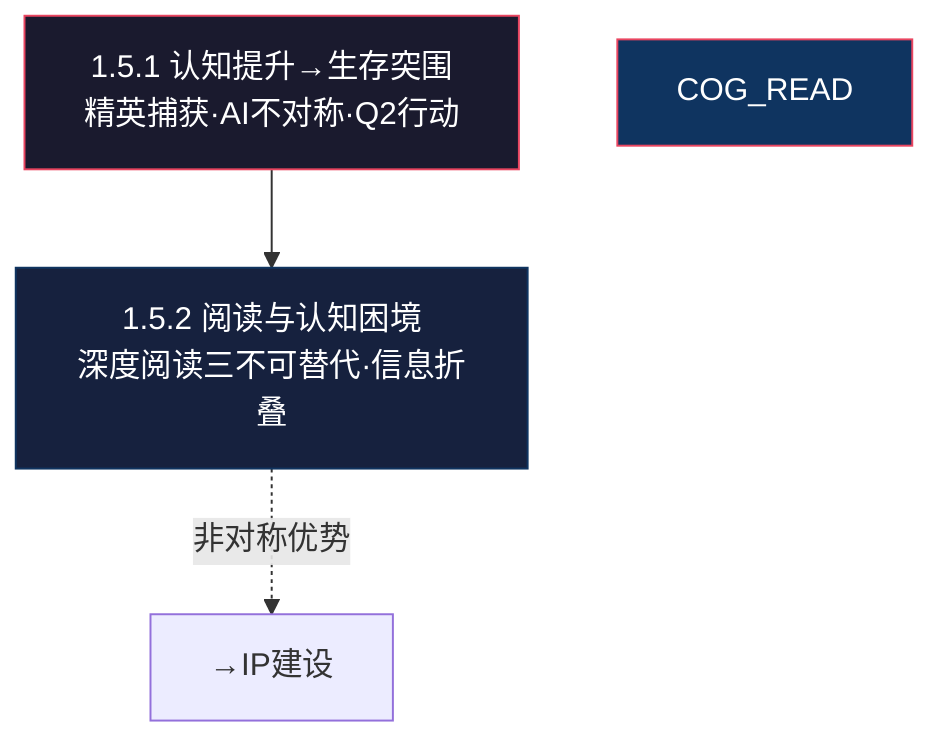

# 🌿 L3 · 1.5 AI时代的阅读与认知（3 篇）

> **层级**：L3 子树根 ← [L2 认知体系](./L2-一-认知体系与思维模型.md) ← [L1 根索引](../README-知识图谱索引.md)  
> **定位**：AI 能力爆炸背景下——人类的阅读、认知与自我进化如何重新定义  
> **下级**：→ L4 单篇深度展开

---

## 📂 树路径

```
L1 ROOT: README-知识图谱索引.md
  └── L2 一、认知体系与思维模型
        └── L3 1.5 AI时代的阅读与认知  ← 当前文件
              ├── 1.5.1 [新增][认知] 认知2：从认知提升到生存突围
              ├── 1.5.2 [新增][认知] 认知4：AI时代下的阅读与认知困境
              └── 1.5.3 🆕 [阅读][认知] 阅读数据解读与提升建议
```

---

## 🔷 1.5.1 从认知提升到生存突围 `[新增][认知]`

| 颗粒度 | 细化内容 |
|--------|----------|
| **文件** | `./认知2：从对认知提升到生存突围相关探讨.md` |
| **▸ 精英捕获结构·古今对照** | 古代"驭民五术"（军事/刑罚/经济/社会/信息控制）→ 现代隐式制度：**金融**（信贷/征信控制行为）/**HR**（绩效/晋升控制职业）/**媒体**（议程设置控制认知）/**算法**（推荐系统控制注意力）——无可见强制，但控制效果相同甚至更高效 |
| **▸ 现代生存悖论** | 个体原子化（无行会/工会保护·一个人面对整个系统）+ 系统理性化（无任意怜悯·一切按"规则"办事·但对规则的解释权在系统手中）= **优化压力史无前例**。你不是和同龄人竞争——你是和整个系统的优化算法竞争 |
| **▸ AI不对称·利用策略** | LLM擅长综合（输入空间复杂度·能处理海量信息并找到模式），但**缺乏具身基准校准**（没有物理身体·无法在真实世界验证其输出）。**人类优势**：能用AI作"全知参考手册"（快速获取所有已知信息），同时保持**判断自主权**（用物理世界反馈校准AI输出）。关键不是"AI vs 人类"，是"人类+AI vs 纯人类" |
| **▸ 近期行动（Q2 2026）·具体化** | ① 产出3-5篇"降维打击"技术拆解——用SCRM+框架分析V4L2/DRM/ALSA——不是教"怎么用"，是教"为什么这样设计" ② 积累种子受众300-500（B站+小红书+微信公众号）——**小而精·高互动率** ③ 发布1篇认知综合文章——定位"系统思考者+硬科技实践者"——**一次性建立认知锚点** |
| **▸ 6个月拐点** | 要么IP赞助（Patreon/YouTube）$1k+/月被动收入=**外部选择权建立**，要么TCL晋升/加薪=**内部价值被重估**。**关键：两种结果都验证了你的策略有效**——因为你的筹码增加了 |
| **关联** | → [L3-1.2 认知8高熵突围](L3-1.2-核心理念.md#123) · → [L2-六 大明1566](../L2-六-历史与典籍.md) |

### ▸▸ 五级概念分解

```
认知2：认知提升→生存突围
├── 精英捕获结构
│   ├── 古代：驭民五术（显性强制）
│   └── 现代：金融/HR/媒体/算法（隐性控制）
├── 现代生存悖论
│   ├── 个体原子化：无集体保护
│   └── 系统理性化：无任意怜悯
├── AI不对称利用
│   ├── LLM：综合能力强·无具身校准
│   ├── 人类：判断自主+物理反馈
│   └── 策略：AI=全知参考·人类=最终判断
├── 近期行动（Q2 2026）
│   ├── 3-5篇技术拆解
│   ├── 300-500种子粉丝
│   └── 1篇认知综合文章
└── 6个月拐点
    ├── 外部：IP赞助$1k+/月
    └── 内部：晋升/加薪
```

---

## 🔷 1.5.2 AI时代下的阅读与认知困境 `[新增][认知]`

| 颗粒度 | 细化内容 |
|--------|----------|
| **文件** | `./认知4：AI-时代下的阅读与认知困境.md` |
| **▸ 深度阅读·三大不可替代性** | ① **注意力耐力训练**：读一本500页的书需要持续专注几十小时——这是任何AI摘要无法替代的"认知肌肉"训练。AI给你答案，书给你**获得答案的能力** ② **原始逻辑链保留**：LLM综合可能丢失作者的证明结构——你看到的是"结论"，不是"推导"。而真正的认知增长发生在**跟随推导过程**中 ③ **摩擦效应**：文本抗拒你的解读——当作者的观点与你的预设冲突，你需要**重构自己的认知框架**。AI摘要不会制造这种摩擦——它给你"你想要听的" |
| **▸ AI给结果，书给过程** | Transformer优化水平覆盖（广度）；阅读资治通鉴强制垂直深度的因果链（深度）。**类比**：AI=给你一张地图（你看到全貌但不知道路怎么修出来的），书=带你一步步走一遍（你理解每段路为什么这样修）。两种都需要，但**只依赖AI=只依赖地图而从不走路** |
| **▸ 信息折叠现象·深层机制** | 多数人无法处理密集文本（认知负荷过高）→ 偏好网红中介摘要（低认知负荷·娱乐化包装）→ 依赖守门人框架偏见（中介选择"什么重要"）→ **丧失质疑原始来源的能力**（你不再知道"这个结论是哪来的"）。**链条终点**：你失去了独立思考的能力 |
| **▸ 你的非对称优势** | 读者优势=**内化全文分析的意愿和能力**——多数竞争者通过TikTok/短视频中介处理信息（3分钟"读懂"一本500页的书）→ 这创造了**非对称信息优势**：你知道他们不知道的，你理解他们不理解的。**关键**：这个优势只有在你主动利用时才有价值——写出来/讲出来/做出来 |
| **关联** | → [1.5.1 认知2](#151) · → [L2-五 AI模型选型](../L2-五-科技与技术.md) |

### ▸▸ 五级概念分解

```
认知4：AI时代阅读困境
├── 深度阅读三不可替代性
│   ├── 注意力耐力：AI给答案·书给能力
│   ├── 原始逻辑链：结论≠推导
│   └── 摩擦效应：文本抗拒·强制重构
├── AI vs 书
│   ├── AI=地图（广度·全貌）
│   ├── 书=走路（深度·每步）
│   └── 只依赖AI=只依赖地图不走路
├── 信息折叠链条
│   ├── 密集文本→认知负荷过高
│   ├── 网红中介→低负荷·娱乐化
│   ├── 框架偏见→中介决定"什么重要"
│   └── 丧失质疑→不知结论哪来的
└── 你的非对称优势
    ├── 内化全文分析能力
    ├── 竞争者：3分钟"读懂"一本书
    └── 杠杆条件：写出来/讲出来/做出来
```

---

## 🗺️ 子域概念图



---

## 🔷 1.5.3 阅读数据解读与提升建议 `[阅读][认知]` 🆕

| 颗粒度 | 细化内容 |
|--------|----------|
| **文件** | `./阅读数据解读与提升建议.md` |
| **▸ 溯源** | Gemini 多轮对话 · 4轮Q&A+2次数据纠正 · 2026-06-24 |
| **▸ 数据基盘** | 1154天·631小时总视听·日均33分钟·447条硬核笔记（平均每1.4h沉淀一条）·第一品类经济财经133小时（占比21%+）。**编译转化密度**：在长周期听书（流式下载）中保持极其理性的稳态——不因时长增加而灌水，只在真正撞击内核时触发"物理写操作" |
| **▸ 核心洞察·租借认知vs房东认知** | **租借认知（Rented Cognition）**：信息以"流"形式进入大脑缓存区——能流利调用《大明1566》权力矩阵/反脆弱/贝叶斯决策，但面对领导恶心或伴侣情绪爆燃时，应激反应仍调用几十年原生求生本能。**断电即失，无法改变物理行为**。**房东认知（Owned Cognition）**：信息经过了物理现实的恶性化学反应（销冠前任的"社会化毒打"/大厂软清洗/10年内核代码重构），神经网络发生物理改变，形成了参数微调——**不依赖提示词，是肉身本能的条件反射** |
| **▸ 四维租借比例审计** | ① **经济财经域（133h）**：租借比例35%——房东化程度最高，因经历过"利益攸关"的参数微调（销冠前任的定金博弈事件）② **技术主权域（RK3588/内核）**：租借比例15%——几乎纯原生，物理规律不骗人，Bug会实质性加班失血③ **政史博弈域（历史/军事/政治）**：**双层拆解**——历史事实层（年份/人名/事件·数据缓存）租借~80%，但**历史因果分析层**（权力博弈/制度演化/模式迁移·主动推理）租借仅~40%。你对大明1566权力矩阵的主动思考、资治通鉴兴衰因果的建模、将历史博弈法则迁移到职场——这些不是租借，是你用SCRM+框架在主动编译。⚠️真正的危险区不是"历史读太多"，而是**历史分析成果未在物理世界验证**——你推导的博弈法则需要在真实职场中"跑批"才能从推理升级为房东认知④ **精神哲学审美域（心学/金刚经/Latex）**：租借比例50%——双重运行，阳明心学面对吸血白蚁时变成无底线单向扶贫（知未成行），但Latex审美是100%房东（10年+物理实践·肉身本能） |
| **▸ 核心Bug** | 认知总线带宽远超执行模块处理速度——高速缓存层跑着L4战略家/反脆弱杠杆/致良知（算力爆表），但物理存储层仍被边缘化工位/非线性情感纠缠控制 |
| **▸ 行动指令** | ① 激活"高优先级写中断"：每次笔记强制写IPO物理拟合——"这句话如何解释我这周面对的XX博弈"② 用AI Agent做"笔记二次蒸馏"：将447条笔记丢给本地私有大模型，逆向输出《Erik个人主权心智演进白皮书》③ 熔断理论空转——把纸面史料直接编译成职场中军大戚家刀 |
| **关联** | → [1.5.1 认知2·生存突围](#151) · → [1.5.2 认知4·阅读困境](#152) · → [Sovereignty OS](../L3-2.1-SovereigntyOS.md) · → [1.4.5 Erik终极侧写](../L3-1.4-个人画像.md#145) |

### ▸▸ 五级概念分解

```
阅读数据解读
├── 数据基盘：1154天·631h·447笔记·经济财经第一
├── 租借 vs 房东
│   ├── 租借：缓存区·断电即失
│   └── 房东：物理校验·参数微调
├── 四维审计
│   ├── 经济：35%租借（高度固化）
│   ├── 技术：15%租借（纯原生）
│   ├── 政史（双层拆解）
│   │   ├── 历史事实：~80%租借（数据缓存）
│   │   └── 因果分析：~40%租借（主动推理·需物理验证→升级房东）
│   └── 精神：50%租借（心学未成行·Latex=100%房东）
└── 行动：IPO拟合·AI蒸馏·房东编译
```

---

## 📖 子域阅读路径

```
AI时代认知路径：
1. 1.5.2 AI时代阅读困境    ← 理解深度阅读的不可替代性
2. 1.5.1 认知提升→生存突围  ← 从认知到行动的具体路径
3. 1.5.3 🆕 阅读数据解读    ← 631h输入审计·租借→房东编译

注：三篇递进——1.5.2告诉你"为什么深度阅读重要"，1.5.1告诉你"怎么转化为行动"，1.5.3告诉你"你的阅读资产中哪些是真金哪些是泡沫"。
```

---

> **下一级**：L4 将对每篇逐篇展开到具体书单推荐、AI工具对比矩阵、内容生产日历、租借认知清零计划等 5 级颗粒度。
