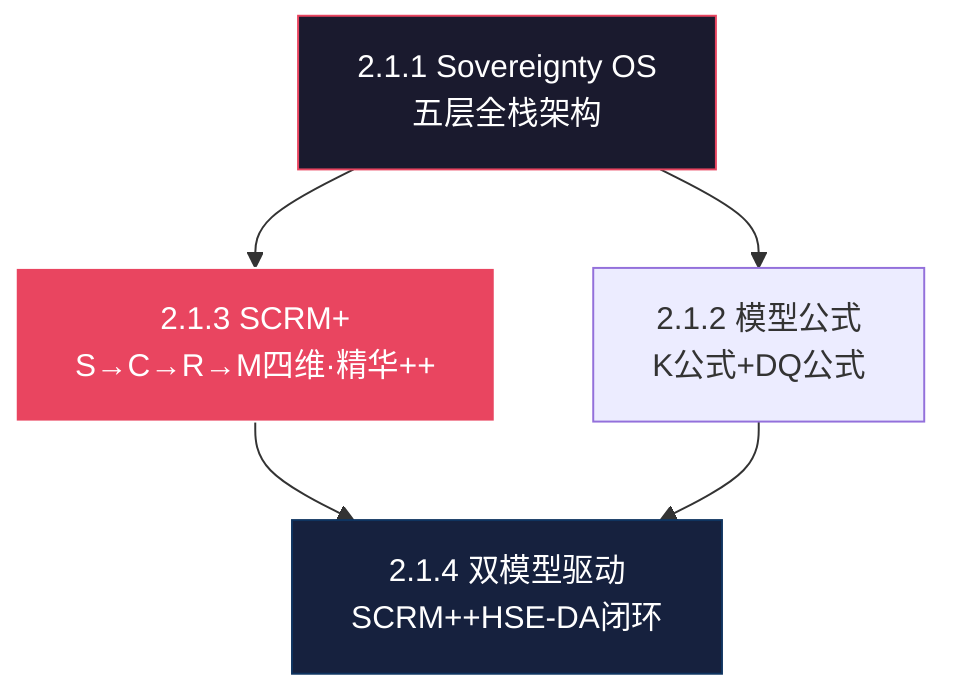

# 🌿 L3 · 2.1 Sovereignty OS V5.2 体系（4 篇）

> **层级**：L3 子树根 ← [L2 核心模型与框架](./L2-二-核心模型与框架.md) ← [L1 根索引](../README-知识图谱索引.md)  
> **定位**：个人主权的"全栈操作系统"——从传感器到决策引擎的完整认知-行动闭环。SCRM+是认知CPU，HSE-DA是决策引擎，双模型驱动是统一框架，V5.2 核心突进为向红尘还俗、进行物理神经对齐。  
> **下级**：→ L4 单篇深度展开

---

## 📂 树路径

```
L1 ROOT: README-知识图谱索引.md
  └── L2 二、核心模型与框架
        └── L3 2.1 Sovereignty OS V5.2 体系  ← 当前文件
              ├── 2.1.1 [无标签] Sovereignty OS V5.2 架构
              ├── 2.1.2 [精华][模型][锁定] 个人主权系统模型解析
              ├── 2.1.3 [精华++][认知][建模] 多维分权验证+SCRM+
              └── 2.1.4 [新增] 双模型驱动的系统演进
```

---

## 🔷 2.1.1 Sovereignty OS V5.2 架构 `[无标签]`

| 颗粒度 | 细化内容 |
|--------|----------|
| **文件** | `./Sovereignty-OS-V5.0-架构梳理.md` （物理内核演进至最新 V5.2 阶段，并由 `技能包` 与 `沟通策略 (1)` 进行深度硬化与落地审计） |
| **▸ 核心哲学** | **全面夺回生存的定义权**。核心主导思想升级为：**“向红尘还俗，向不完美兼容，允许肉身的笨拙，在物理层打赢胜仗”**。 |
| **▸ 三大运行准则** | ① **高内聚（内核独立）**：技术壁垒（RK3588/V4L2/ALSA/DRM 开发）+ 认知模型（SCRM+/HSE-DA）+ 哲学修养（金刚经/存在主义）不可剥离。技术是系统的**不可替代性本金（$C$）**。<br>② **低耦合（环境兼容）**：公司只是环境的 API，当返回 `403` 时执行本地缓存的 Plan B。在 V5.2 中，**“妥协、补位、陪俗人演戏”是保护核心 Plan B 能量而向组织交纳的“低能耗物业费”**。<br>③ **强兼容（社会接口）**：降级人际接口，使用低能耗语言适配不同环境，不在非正式社交中试图树立认知权威。 |
| **▸ 五层架构·逐层** | ① **TS-MDCV传感器层**：$Conclusion = Fact \otimes Position^{Interest}$——信息解调·通过差分对冲计算剥离立场与利益，提取高保真 $F_{truth}$。<br>② **DP诊断引擎**：$\Delta B = \|B - B'\|$——情感脱钩。透析三棱镜法，将预期动作（$B$）与物理反馈（$B'$）比对，计算偏差形变量 $\Delta B$，**不讨论感性的“成败”或“遗憾”，彻底告别情绪内耗与道德审判**。<br>③ **主权内核**：Kegan 4→5 阶段演进（从“我被规则定义”到“我定义规则”）+ RK3588 物理支点（本地算力物理世界锚点）。<br>④ **SCRM+认知引擎**：S→C→R→M 四层递进分析，结合非线性系统冲突断裂应力破局：$O = M \cdot \sqrt{\sum (S_i + C_j)^R}$。<br>⑤ **HSE-DA决策引擎**：从被动熔断全面进化为**主动状态跃迁控制器**：$\text{Evolution\_Trigger} \iff \int \frac{H(t) + E(t)}{C(t) \cdot \eta} dt \geq \Theta$。 |
| **▸ 三大红尘物理执行协议** | ① **【灰度协同 API】**：面对琐碎指令（如SID事件），面带温和地接下，快速跑完脚本，将组长（胡宗宪）拉进群协助，用最小的时间消耗把子弹送给组长，获得极深沉的**政治护犊红利**。<br>② **【3秒静音 + 废话垫片协议】**：拦截“用 L4 技术层的超频漏电，来做 L3 创伤的代偿性输血”冲动。聊股票德州时脑子静音 3 秒 Drop 数据包，只输出低能耗废话垫片（“卧槽，真的假的？”）。在微信群讨论技术时实行流量管制（憋算力），强行把表现欲压回后台。<br>③ **【二楼烟友 Bug 物理修复】**：兜里揣上糖走回二楼，大方笑迎烟友，真诚挑明上周的局促，递上薄荷糖。将脑中的“体面、善良”与“肉身动作”完成 **V5.2 硬件级对齐**，在物理层彻底重塑大脑神经回路。 |
| **▸ 【系统允许报错】机制** | ① **允许自己眼神躲闪/紧绷**：在心里对自己笑一下：“看，我的杏仁核又在为前年的创伤报时了。没事，我今天就是紧张，但我僵硬得很体面。”<br>② **允许自己在饭桌上把天聊死**：不对抗，不迎合：“这群 Windows 节点果然解码不了老子的 Linux 数据包。今天老子的社交功率调成 0。我只负责专注干完我这碗高维的猪脚饭。” |
| **▸ 核心价值公式** | "自我存在性"是内核（决定主权上限），"社会认同"是接口（决定杠杆效率$\eta$）——有边界的随和，才是最高阶的主权。 |
| **关联** | → [2.1.2 模型公式](#212) · → [2.1.3 SCRM+](#213) · → [L3-2.2 三元解构](L3-2.2-三元解构.md) |

---

## 🔷 2.1.2 个人主权系统模型解析 `[精华][模型][锁定]`

| 颗粒度 | 细化内容 |
|--------|----------|
| **文件** | `./[精华][模型][锁定]个人主权系统模型解析.md` |
| **▸ SCRM+公式·逐项物理意义** | $K = \frac{R_{eff} \cdot C_{str}}{1 + \ln(1 + E_{sys})} \cdot \int M_{vel} \, dt$——① $R_{eff}$（资源效率）：单位资源产生的认知增量。**实例对比**：花1小时读RK3588 TRM（高Reff）vs 刷短视频（低Reff）② $C_{str}$（因果强度）：对因果链的理解深度。**实例**：理解"V4L2 buffer队列满→应用层取帧延迟→用户体验卡顿"的完整因果链 vs 只知道"代码跑通了" ③ $E_{sys}$（系统熵）：分母对数级压制——环境越混乱（裁员/部门重组/战略摇摆），K越低 ④ $\int M_{vel}$（迭代速度积分）：持续学习速度在时间上的累积=复利效应 |
| **▸ HSE-DA公式·逐项** | $DQ = \frac{P(H) \cdot \ln(S_d + 1)}{\Delta E} + \sum (\Delta R_i \cdot \eta^i)$——左半：**单次决策性价比**=成功概率×安全边际÷能量消耗。**实例**：选择"花2天写一篇V4L2深度文章"（高P(H)·中等ΔE=高性价比）vs "花3个月学一个新框架再写"（低P(H)·高ΔE=低性价比）。右半：**连续博弈复利**=每次微小收益×杠杆累积——IP内容的复利效应：第一篇没人看，第10篇被大V转发 |
| **▸ 核心洞见** | 不要试图在高熵混乱系统中建立完美理论——去**寻找因果结构最清晰的杠杆点**。在TCL，V4L2就是那个杠杆点（因果清晰·可控·高回报） |
| **▸ "锁定"含义** | `[锁定]`=当前认知的"冻结版本"——可以迭代，但**每次迭代需经过完整SCRM+验证**（S·C·R·M四层审查） |
| **关联** | → [2.1.1 Sovereignty OS](#211) · → [L3-2.2 三元解构](L3-2.2-三元解构.md) |

---

## 🔷 2.1.3 多维分权验证+SCRM+ `[精华++][认知][建模][推理过程]`

| 颗粒度 | 细化内容 |
|--------|----------|
| **文件** | `./[精华++][认知][建模][推理过程]多维分权事实验证体系...md` |
| **▸ 等级说明** | ⭐ `[精华++]`=整个知识图谱中**等级最高的文件**——所有策略输出和认知判断的底层公理系统。这是你知识体系的"Linux内核"——所有其他笔记都是在这个内核上运行的"应用程序" |
| **▸ SCRM+四维·逐维展开** | ① **S（Structure结构层）**：静态骨架/边界条件。**操作**：画出一个系统的组成元素和它们的固定关系。**实例**：TCL组织架构图=你的部门在全局中的位置 ② **C（Causality因果层）**：驱动逻辑/根因网络。**操作**：识别什么推动了变化？因果链的方向和强度。**实例**：为什么你被边缘化？根因不是"领导不喜欢你"而是"你把时间花在了不可见但关键的基础设施上" ③ **R（Reality现实层）**：能量损耗/冷事实。**操作**：理论上完美的因果链在现实中遇到什么摩擦？**实例**：理论上"做好技术就能晋升"，现实中"技术好但不可见=不被晋升" ④ **M（Modeling建模层）**：可量化可预测的系统动力学路径。**操作**：基于S+C+R建立可执行的数学模型 |
| **▸ 三层递进关系** | 宏观底座（Sovereignty OS·全栈架构）→ **静态解构**（SCRM+认知观测层·诊断系统状态）→ **动态执行**（HSE-DA行动穿透层·开出行动处方） |
| **▸ 多维分权验证** | 任何结论需经过≥3个独立维度交叉验证：① **逻辑自洽**（内部无矛盾·论证链完整）② **历史先例**（是否有类似案例·大明1566/功德林/许家印）③ **实践反馈**（现实是否按预测运行·低成本物理探测） |
| **关联** | → [2.1.1 Sovereignty OS](#211) · → [2.1.2 模型公式](#212) |

---

## 🔷 2.1.4 双模型驱动的系统演进 `[新增]`

| 颗粒度 | 细化内容 |
|--------|----------|
| **文件** | `./双模型驱动的系统演进.md` |
| **▸ 核心贡献** | 首次将SCRM+（静态映射·诊断）与HSE-DA（动态执行·处方）**统一为闭环**——含Mermaid流程图可视化。**这是从"两个独立工具"到"一个完整系统"的关键升级** |
| **▸ 闭环逻辑** | SCRM+诊断系统状态（当前在哪·S/C/R/M四层分析）→ HSE-DA开出行动处方（下一步做什么·性价比+复利计算）→ 现实反馈（结果是什么·物理世界数据）→ 校准双方模型（SCRM+的M层更新·HSE-DA的P(H)更新） |
| **▸ 执行信条** | 拒绝"逻辑自旋"（过度心智模拟·在脑中反复推演不行动）→ 拥抱**快速低成本物理探测**（最小可行行动→真实世界反馈→校准模型） |
| **关联** | → [2.1.3 SCRM+](#213) · → [2.1.2 HSE-DA](#212) |

---

## 🗺️ 子域概念图



---

## 📖 子域阅读路径

```
1. 2.1.3 SCRM+（精华++）    ← 核心公理系统·最高等级
2. 2.1.4 双模型驱动          ← SCRM++HSE-DA统一框架
3. 2.1.2 模型公式解析        ← 数学公式化+物理意义
4. 2.1.1 Sovereignty OS      ← 全栈架构总览
```

---

> **下一级**：L4 展开公式推导、应用案例、SCRM+实战诊断示例等 5 级颗粒度。
