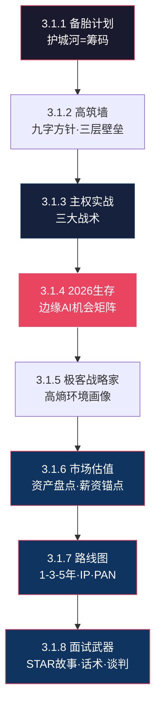

# 🌿 L3 · 3.1 核心策略（8 篇）

> **层级**：L3 子树根 ← [L2 策略与计划](./L2-三-策略与计划.md) ← [L1 根索引](../README-知识图谱索引.md)  
> **定位**：个人生存突围的五大支柱 + 三大战略产出——从护城河、高筑墙、主权实战、2026行动、极客战略家画像，到市场估值、路线图、面试武器库  
> **下级**：→ L4 单篇深度展开

---

## 📂 树路径

```
L1 ROOT: README-知识图谱索引.md
  └── L2 三、策略与计划
        └── L3 3.1 核心策略  ← 当前文件
              ├── 3.1.1 [精华][策略] 备胎计划与护城河
              ├── 3.1.2 [计划][策略] 生存突围与高筑墙
              ├── 3.1.3 [沟通][职场] 个人主权系统迭代与实战
              ├── 3.1.4 [无标签] 2026生存策略与边缘AI
              ├── 3.1.5 [新增] 🆕 深度剖析高熵环境下的极客战略家
              ├── 3.1.6 [产出] 💰 个人市场价值评估报告
              ├── 3.1.7 [产出] 🗺️ 1-3-5年职业规划路线图
              └── 3.1.8 [产出] ⚔️ 简历与面试武器库
```

---

## 🔷 3.1.1 备胎计划与护城河 `[精华][策略]`

| 颗粒度 | 细化内容 |
|--------|----------|
| **文件** | `./[精华][策略]职业规划："备胎计划""B计划"--技术"护城河"的建立.md` |
| **▸ 核心公式** | 技术护城河 = 技术深度 × 不可替代性 = **博弈筹码** |
| **▸ 战略定位·纠正误解** | "备胎计划"**不是逃跑方案**——是对抗职场边缘化的**主动防御**。**操作原则**：在公司旧领地做减法（减少对不可见基础设施的投入），在个人新领地做乘法（增加IP/开源/技术博客投入） |
| **▸ 三阶段执行·详细步骤** | ① **定向**：确定核心技术方向（RK3588+V4L2+端侧AI）。**选择标准**：市场需求增长（嵌入式AI岗位增加）× 个人兴趣交集（你已经喜欢底层）× 公司资源可利用（TCL有RK平台·"公费研发期"）② **蓄力**：设定里程碑（如：3个月内完成V4L2驱动完整交付）→利用公司"公费研发期"积累个人资产——**把公司的项目变成个人的技术积累和GitHub仓库** ③ **切换**：当个人资产（技术深度×外部认可）> 公司依赖时，实现"软着陆"式转型——不是裸辞，是"被挖"或"独立" |
| **▸ 博弈筹码量化表** | 技术深度评分（0-10）× 不可替代性评分（0-10）= 博弈筹码（0-100）。**判断标准**：筹码<30=被动接受；筹码30-60=可以谈判；筹码>60=开始主导；筹码>80=完全自主 |
| **关联** | → [3.1.2 高筑墙](#312) · → [3.1.4 2026生存](#314) |

---

## 🔷 3.1.2 生存突围与高筑墙 `[计划][策略]`

| 颗粒度 | 细化内容 |
|--------|----------|
| **文件** | `./[计划][策略]生存突围与"高筑墙"策略与计划.md` |
| **▸ 九字方针·三层展开** | ① **高筑墙**（技术壁垒三层结构）：底层（Linux内核/驱动/V4L2——最深但最稳·不可替代性的根基）+ 中层（AI推理/模型部署/NPU优化——增长最快·2026窗口）+ 上层（产品化/工具化/个人IP——杠杆最高·影响力放大）② **广积粮**（三类储备）：财务缓冲（6-12月生活费——所有策略的物理基础）+ 知识资产（技术博客/GitHub/开源——24h为你工作的数字资产）+ 人脉网络（弱连接>强连接——跨界信息的关键来源）③ **缓称王**（不急于头衔·蛰伏蓄势）：在"隐身"状态下积累真正的不可替代性——当足够强时，头衔会来找你 |
| **▸ 分阶段里程碑** | 4月底（V4L2框架理解完成）→ 5月底（第一个完整驱动交付）→ 3个月驱动开发计划（多设备适配+性能优化+文档化）。每阶段有**明确交付物**（代码/文档/博客）和**验证标准**（功能测试/性能基准/读者反馈） |
| **关联** | → [3.1.1 备胎计划](#311) · → [3.1.4 2026生存](#314) |

### ▸▸ 五级概念分解

```
高筑墙·广积粮·缓称王
├── 高筑墙（技术壁垒三层）
│   ├── 底层：Linux内核/驱动/V4L2（最深最稳）
│   ├── 中层：AI推理/模型部署/NPU优化（增长最快）
│   └── 上层：产品化/工具化/IP（杠杆最高）
├── 广积粮（三类储备）
│   ├── 财务：6-12月生活费（物理基础）
│   ├── 知识：博客/GitHub/开源（数字资产）
│   └── 人脉：弱连接>强连接（跨界信息）
└── 缓称王（蛰伏蓄势）
    ├── 不急于头衔
    ├── 隐身积累不可替代性
    └── 足够强时·头衔来找你
```

---

## 🔷 3.1.3 个人主权系统迭代与实战 `[沟通][职场]`

| 颗粒度 | 细化内容 |
|--------|----------|
| **文件** | `./[沟通][职场]个人主权系统迭代与实战应用.md` |
| **▸ AI Agent四要素·职场应用** | ① **大脑**（LLM推理）：不同场景选不同模型——Gemini做全局分析·Claude写代码·ChatGPT做算法验证 ② **规划**（子任务拆解+反思）：将大目标拆解为LLM可执行的子任务链 ③ **记忆**（短期Context+长期向量库）：短期=当前对话窗口·长期=RAG向量数据库（你的全部笔记）④ **工具**（API/Python/SMTP）：让AI能实际操作世界（自动发邮件/生成报告/分析数据） |
| **▸ L3→L4代偿机制** | L3（人际层）亏空时→L4（技术层）**超频漏电**——过度沉迷技术细节以逃避人际焦虑。**识别信号**：你发现自己连续3天只在写代码而不回复任何消息→可能是在代偿。**解决方案**："流量管制"——主动切断技术沉迷，强制15分钟人际互动 |
| **▸ 三大实战战术·逐术展开** | ① **"教父协议"**：别人不问我不说，问我说一半。**原理**：信息是权力——不要免费赠送。**应用**：领导问"这个技术问题怎么解决？"→给出解决方向而非完整方案（"可以考虑X方案，具体实现需要进一步评估"）② **BOM签批·边界切割+风险仪表盘**：把责任边界画清楚，把风险量化成领导看得懂的仪表盘。**话术模板**："按照目前的方案，风险点有3个：A（概率30%·影响高）B（概率10%·影响中）C（概率50%·影响低）。建议优先处理A，需要XX部门的配合" ③ **"反向确认/默认值攻击"**：不给开放式选择，给默认值。**话术模板**："方案A已就绪，如无异议明天执行"（而非"你觉得哪个方案好？"） |
| **▸ 核心洞察** | 把**横向冲突**（你vs同事）转换为**纵向压力**（让领导的领导去施压）——这是职场博弈的"杠杆原理" |
| **关联** | → [L2-四 沟通心理](../L2-四-关系与沟通.md) · → [3.1.1 备胎计划](#311) |

---

## 🔷 3.1.4 2026生存策略与边缘AI `[无标签]`

| 颗粒度 | 细化内容 |
|--------|----------|
| **文件** | `./暴力执行：2026生存策略、普通程序员在边缘AI的机会.md` |
| **▸ 社会定位·量化画像** | 收入（全国前3-5%·深圳前20-30%）/ 学历（全国前5%）/ **35岁节点**（职业生命周期转型期——不是危机，是"执行者→架构者"的**强制转型窗口**） |
| **▸ 联姻结构·抗风险能力** | "技术精英 + 建制内专业人士（法官助理）"= 一方市场中搏杀（高回报高风险），一方体制内稳定（低回报高稳定）——**现代版"耕读传家"**。社会抗风险能力极强 |
| **▸ 边缘AI机会矩阵** | ① **模型压缩**（TinyBERT→MobileLLM）：把大模型塞进小设备——技术壁垒高·需求增长快 ② **NPU优化**（RK3588 NPU）：端侧推理的工程化落地——你已有RK3588平台经验 ③ **垂直场景**（智能眼镜/工业视觉）：找"大厂看不上·小厂做不了"的缝隙——这是PAN的核心定位 |
| **▸ 暴力度执行** | 从温和改良转向**坚决行动**——不再等"完美时机"，因为完美时机不存在。普通程序员在边缘AI领域的机会窗口正在**快速关闭**（大厂正在进入·窗口期6-18个月） |
| **关联** | → [3.1.1 备胎计划](#311) · → [3.1.2 高筑墙](#312) · → [L2-五 PAN构想](../L2-五-科技与技术.md) |

---

## 🔷 3.1.5 高熵环境下的极客战略家 `[新增][策略]`

| 颗粒度 | 细化内容 |
|--------|----------|
| **文件** | `./深度剖析高熵环境下的极客战略家.md` |
| **▸ 溯源** | 源文档·单篇分析 |
| **▸ 核心定位** | 将个人知识体系的全部方法论（Sovereignty OS·SCRM+·HSE-DA·三元解构·高筑墙·备胎计划）进行**元分析**——回答"我是谁·我能成为什么·我该怎么走" |
| **▸ 三大战略输出** | 市场价值评估（资产→估值→差距诊断）· 1-3-5年路线图（卡位→破圈→自主）· 简历面试武器库（叙事重构→STAR故事→话术博弈） |
| **关联** | → [3.1.6 市场估值](#316) · → [3.1.7 路线图](#317) · → [3.1.8 面试武器](#318) · → [L2-一 认知体系](../L2-一-认知体系与思维模型.md) |

---

## 🔷 3.1.6 个人市场价值评估报告 `[产出][策略]`

| 颗粒度 | 细化内容 |
|--------|----------|
| **文件** | `./产出①-个人市场价值评估报告.md` |
| **▸ 溯源** | 战略产出·单篇 |
| **▸ 硬资产估值** | Linux内核驱动 V4L2/DRM/ALSA（★★★★☆·全球<1000人）· RK3588（★★★★☆）· 10年嵌入式（★★★★☆）· NPU端侧部署（★★★☆☆·上升中） |
| **▸ 软资产估值** | PMP（★★★★☆）· 系统架构能力（★★★★★·万中无一）· 跨域认知（★★★★★·全网绝无仅有）· 博弈认知（★★★★☆·高管级） |
| **▸ 深圳薪资锚点** | 高级系统SE 30-50K/月·技术PM 35-55K/月·底层主管 35-60K/月——首选赛道：高级系统SE |
| **▸ 竞争力差距** | 🔴代码手感（1-2月突击）· 🟡行业人脉（6-12月IP建设）· 🟢车载行业知识（入职后可补） |
| **关联** | ← [3.1.5 极客战略家](#315) · → [3.1.7 路线图](#317) · → [L2-五 科技与技术](../L2-五-科技与技术.md) |

---

## 🔷 3.1.7 1-3-5年职业规划路线图 `[产出][策略]`

| 颗粒度 | 细化内容 |
|--------|----------|
| **文件** | `./产出②-1-3-5年职业规划路线图.md` |
| **▸ 溯源** | 战略产出·单篇 |
| **▸ 三阶段路线** | 第1年卡位（Q3简历→Q4入职→Q1站稳→Q2 IP启动）→ 第2-3年破圈（B站/公众号/抖音·PAN原型·$1-3k/月被动收入）→ 第4-5年自主（独立顾问/轻量化创业/高阶CXO·140-235万年收入） |
| **▸ IP差异化赛道** | 「硬核技术人的认知与破局指南」——技术+认知双融合·全网无竞品 |
| **▸ 退出打工条件** | IP月收入>月薪50% + 12月财务缓冲 + 人脉可独立获客 + PAN可演示原型 |
| **关联** | ← [3.1.6 市场估值](#316) · → [3.1.8 面试武器](#318) · → [L3-7 实践与IP](../L3-7-实践与IP.md) · → [L3-5.2 新兴硬件](../L3-5.2-新兴硬件.md) |

---

## 🔷 3.1.8 简历与面试武器库 `[产出][策略]`

| 颗粒度 | 细化内容 |
|--------|----------|
| **文件** | `./产出③-简历与面试武器库.md` |
| **▸ 溯源** | 战略产出·单篇 |
| **▸ 简历叙事重构** | "10年嵌入式驱动开发"→"资深系统SE·产品软件技术专家"· 核心能力证据表· 3个STAR完整故事 |
| **▸ 5组面试话术** | ①回应"4年没写代码" ②技术深挖升维打击 ③跨部门博弈（利益对齐+权责卡点） ④为何选管理而非纯IC ⑤反问面试官 |
| **▸ 方法论翻译表** | Sovereignty OS→"系统生命周期管理"· SCRM+→"结构化问题诊断"· HSE-DA→"技术选型性价比评估"· 三元解构→"剥离立场与利益" |
| **▸ 薪资谈判策略** | HR初筛不先报价→技术面展示价值→终面基于市场数据+竞品offer筹码 |
| **关联** | ← [3.1.7 路线图](#317) · → [L3-4.2 沟通博弈](../L3-4.2-沟通博弈.md) · → [L3-2.1 Sovereignty OS](../L3-2.1-SovereigntyOS.md) |

---

## 🗺️ 子域概念图



---

> **下一级**：L4 展开筹码计算表、里程碑甘特图、战术话术模板库、市场估值公式、路线图里程碑、STAR标杆故事等 8 级颗粒度。
