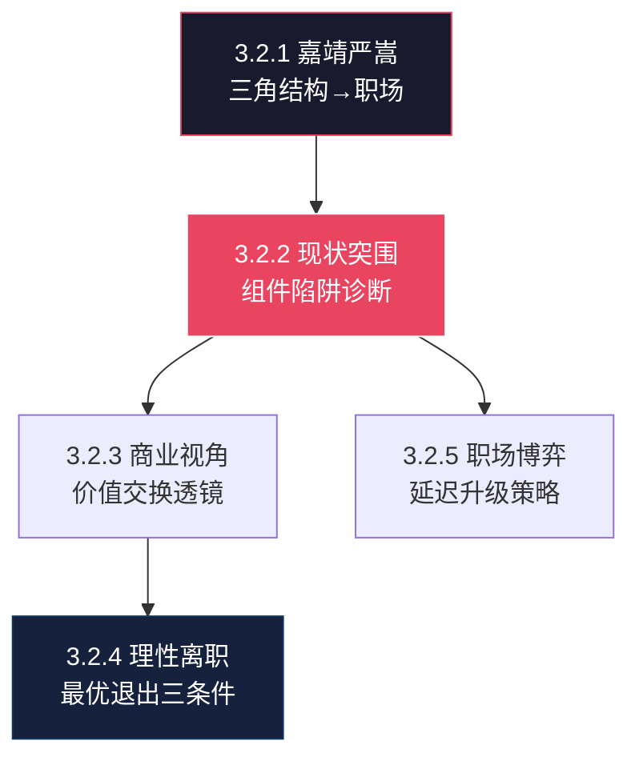

# 🌿 L3 · 3.2 职业思考系列（5 篇）

> **层级**：L3 子树根 ← [L2 策略与计划](./L2-三-策略与计划.md) ← [L1 根索引](../README-知识图谱索引.md)  
> **定位**：从大明权力逻辑到理性离职——将历史政治智慧转化为职场生存的微观操作  
> **下级**：→ L4 单篇深度展开

---

## 📂 树路径

```
L1 ROOT: README-知识图谱索引.md
  └── L2 三、策略与计划
        └── L3 3.2 职业思考系列  ← 当前文件
              ├── 3.2.1 [新增] 嘉靖用严嵩的政治逻辑到职场
              ├── 3.2.2 [新增] 职业思考2：现状分析与突围策略
              ├── 3.2.3 [新增] 职业思考3：商业与人生战略视角
              ├── 3.2.4 [新增] 职场生存：理性离职与价值交换
              └── 3.2.5 [新增] 职场博弈与心理驱动解析
```

---

## 🔷 3.2.1 嘉靖用严嵩的政治逻辑到职场 `[新增][职业思考]`

| 颗粒度 | 细化内容 |
|--------|----------|
| **文件** | `./职业思考：嘉靖用严嵩的政治逻辑到职场.md` |
| **▸ 核心类比·三角结构** | 嘉靖（领导·追求长生/修道/不直接管理）→ 严嵩（"白手套"·替领导做脏活/贪腐但有用）→ 徐阶（"救火队"·备用·当严嵩烧毁时清理残局）。**现代映射**：CEO（不直接处理裁员/敏感项目）→ 某VP（执行裁员·替CEO挡子弹）→ 某Director（备用·VP倒台后接手） |
| **▸ 严嵩悖论** | 不能停止贪腐（失去派系忠诚·手下人靠他分赃）；不能被移除（对皇帝有用·没有人能替代他的"脏活"功能）；陷入**升级逻辑无法自拔**（越贪越需要保护·越保护越需要贪）——这与"组件陷阱"高度共鸣 |
| **▸ 徐阶功能** | 代表"救火队"——备用，不太显眼但道德更完整。**现代应用**：组织中的"二号位"——不被视为威胁，但始终在替补席上 |
| **▸ 三大突围策略·针对"严嵩角色"** | ① **在领导生态系统外建立替代合法性**：在公司之外建立行业影响力（IP/GitHub/演讲）→ 让你的价值不被单一领导定义 ② **让不可替代性对上一级权威可见**：你的技术能力不仅你的直属领导知道，**你领导的领导**也知道 ③ **制造撤换成本**：IP捕获（你的代码/文档/知识只有你能维护）→ 让你不是"可替换的组件" |
| **关联** | → [L2-六 大明1566](../L2-六-历史与典籍.md) · → [L3-3.1 职场实战](L3-3.1-核心策略.md#313) |

---

## 🔷 3.2.2 职业思考2：现状分析与突围策略 `[新增][职业思考]`

| 颗粒度 | 细化内容 |
|--------|----------|
| **文件** | `./职业思考2：现状分析与突围策略.md` |
| **▸ "组件陷阱"完整诊断** | 你在TCL的处境：高技术可靠性 → 被分配"地基"任务（只有你能做的底层驱动）→ 因"太有价值而无法移动"（换人做不了·但也不会被晋升）→ 绩效透明化缺失（你的贡献是"基础设施"·不是"业务成果"·在评审中不可见）→ **被锁定在"高可靠·低维护成本"的工业组件角色** |
| **▸ 三大突围机制·逐机制展开** | ① **关键节点单点主导**：在V4L2驱动开发建立绝对优势——让公司在这个领域**100%依赖你**。**风险提示**：单点依赖是双刃剑——利用得当=谈判筹码，利用不当=组件陷阱加深 ② **IP品牌外部化**：建立不依赖公司平台的独立影响力——技术博客/GitHub/开源项目。**这是最终的出路**——当外部选择权>内部依赖时，你自由了 ③ **校准曝光度**：让**高层直接**见证你的价值——而非通过中层过滤。**具体方法**：在跨部门技术评审中展示架构决策；在公司技术博客发表深度文章；在行业会议上代表公司演讲 |
| **▸ 心理重构** | 从"边缘化受害者"心态→"护城河建设的**战略休假期**"心态。你**主动选择**在当前岗位继续，不是因为走不了，而是因为这里还有"公费研发"的价值未被榨取完 |
| **关联** | → [L3-3.1 备胎计划](L3-3.1-核心策略.md#311) · → [L3-1.1 组件→操盘手](../L3-1.1-顶层架构.md#116) |

---

## 🔷 3.2.3 职业思考3：商业与人生战略视角 `[新增][职业思考]`

| 颗粒度 | 细化内容 |
|--------|----------|
| **文件** | `./职业思考3：商业与人生战略视角.md` |
| **▸ 价值交换透镜** | 雇佣 = **交易**（劳动↔报酬），非情感——公司不"欠"你幸福，你不欠忠诚超越合同。**这听起来冷酷，但这是最清晰的认知框架**——一旦接受这个前提，很多职场痛苦自动消失 |
| **▸ 沉没成本谬误** | "为既得利益而留"（已积累的年资/关系/熟悉度）= 如果机会成本 > 保留价值，则在**扔好钱追坏钱**。**判断公式**：如果今天是入职第一天，你会选择这份工作吗？如果不会→你在为沉没成本付费 |
| **▸ 谈判不对称** | 雇主持有信息优势（晋升标准不透明/退出条款隐藏/市场薪资不公开）→ 通过**外部可信度**（GitHub/博客/行业影响力）+ **竞争性offer**（真实或潜在）平衡 |
| **▸ 时机模型** | 当个人股价（你的市场价值）> 公司内部估值（你的薪资/职级）时**离开**；当投资于平台可选性（平台给你独特的成长资源）时**留下** |
| **关联** | → [3.2.4 职场生存](#324) · → [L3-3.1 2026生存](L3-3.1-核心策略.md#314) |

---

## 🔷 3.2.4 职场生存：理性离职与价值交换 `[新增][职场]`

| 颗粒度 | 细化内容 |
|--------|----------|
| **文件** | `./职场生存：理性离职与价值交换.md` |
| **▸ 劳动即合同·完整逻辑** | 雇主支付**产出**（KPI完成·薪资），不支付情绪福祉。反向同理——你支付劳动，不支付"忠诚"或"感恩"。**这就是为什么"不开心所以离职"是情绪化决策——你应该基于"价值交换是否公平"做决策** |
| **▸ 切换成本计算** | 职业中断（gap期·简历解释成本）+ 入职损失（试用期·新环境适应）+ 声誉摩擦（频繁跳槽的标签）= **退出成本**。退出成本 < 当前环境损害 + 新机会溢价 → 可以退出 |
| **▸ 有害环境例外** | 如果环境**主动损害健康**（骚扰/不公追诉/心理虐待/违法要求），"理性退出"包含健康成本——健康成本是无限大的。**此时不需要计算，直接退出** |
| **▸ 最优退出三条件** | ① 新角色提供**实质性升级**（头衔/薪酬/学习/网络·至少2项）② 积累的技能已转化为**外部品牌**（GitHub有star·博客有读者·行业有人认识你）③ 竞争性offer展示**市场价值重置**（告诉市场也告诉自己：你值更多） |
| **关联** | → [3.2.3 职业思考3](#323) · → [L3-7 告别内耗](../L3-7-实践与IP.md) |

---

## 🔷 3.2.5 职场博弈与心理驱动解析 `[新增][职场]`

| 颗粒度 | 细化内容 |
|--------|----------|
| **文件** | `./职场博弈与心理驱动解析.md` |
| **▸ 公共排名现象·深度机制** | 来自跨部门任务数据的同侪压力——**排行榜效应**触发基因级地位焦虑。**你明明知道这个排名不合理**（任务性质不同·不可比），但杏仁核不理会逻辑——它只看到"你在下面，别人在上面"。**对策**：识别这是生理反应（不是理性判断），用SCRM+的R层（现实层）剥离情绪 |
| **▸ 控制恢复冲动** | 将**被动压力反应**（"我被比下去了"）重构为**主动掌控**（"我要用超预期表现回收代理权"）——将羞辱转化为自我导向的掌控。**这不是阿Q精神，是认知重构** |
| **▸ 延迟升级策略·全套操作** | ① 在任务完成前**扣留曝光度**（不主动汇报进度·不展示中间成果）② 等待**高层关注**被某个事件捕获（如：领导在会议上问起这个任务）③ 在那一刻**呈现完整成果**——廉价信号（日常汇报）→ 危机救援（关键时刻的完整交付）= **更高感知价值** |
| **▸ 隐藏风险** | 频繁使用→中层管理者察觉被当作"传输媒介"（你绕过他们直接展示给高层）→ 他们**硬化行政约束**（增加审批/限制权限/控制信息流）→ 缩小你的未来谈判空间。**建议**：保留用于高赌注时刻；日常维护中层善意 |
| **关联** | → [L2-四 沟通心理](../L2-四-关系与沟通.md) · → [L3-3.1 职场实战](L3-3.1-核心策略.md#313) |

---

## 🗺️ 子域概念图



---

> **下一级**：L4 展开具体对话模板、博弈矩阵、薪资谈判话术库等 5 级颗粒度。
