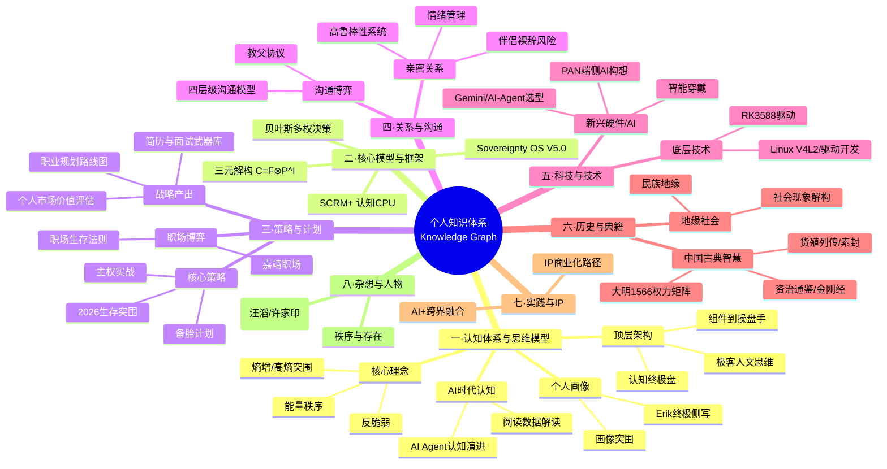
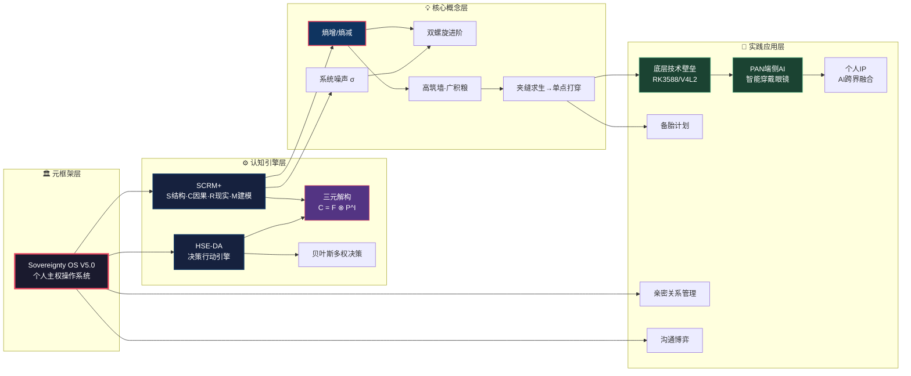
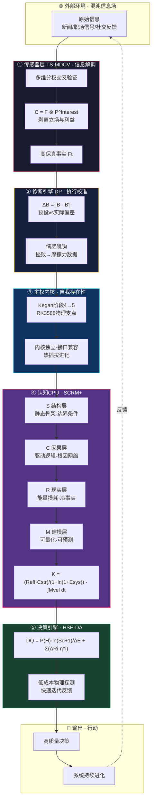
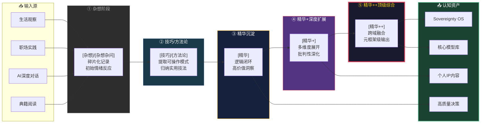
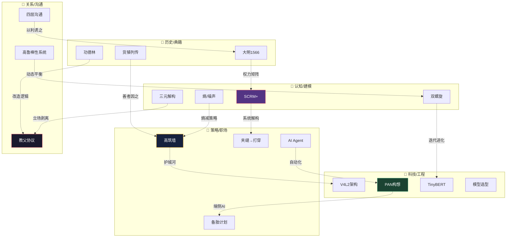
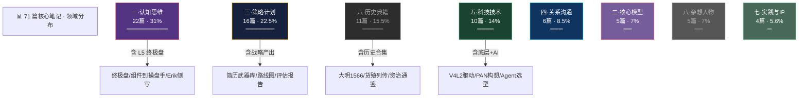
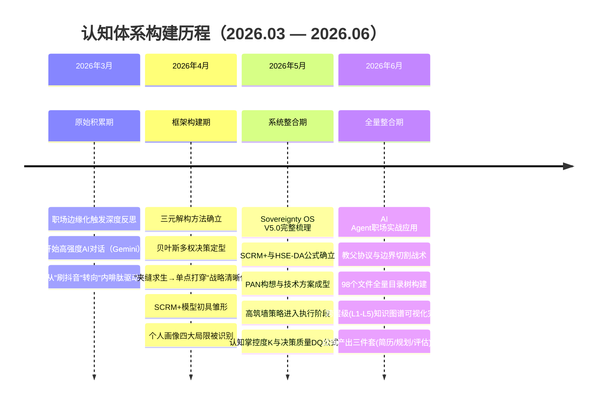
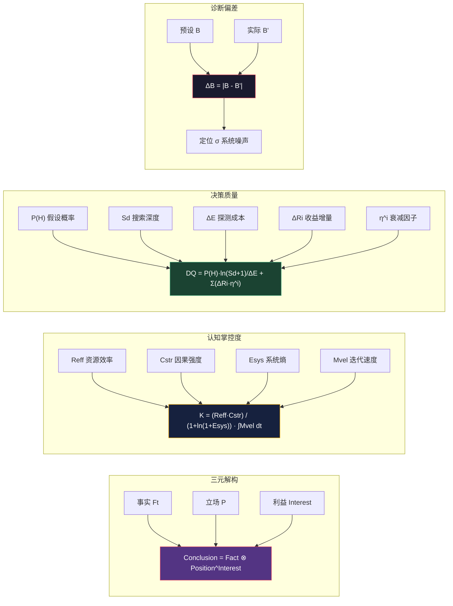
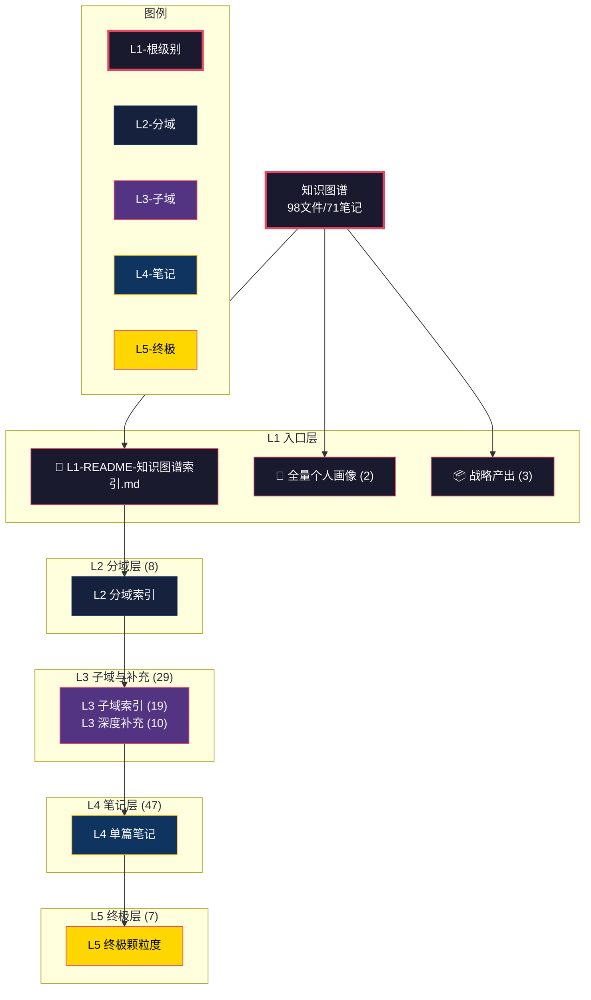

# 🗺️ 个人知识图谱 · 可视化全集

> 生成日期：2026-06-25  
> 数据口径：98 个文件 · 覆盖 71 篇实质笔记 · 层级 L1 → L5

---

## 一、知识领域全景图（Mindmap）

---

## 二、核心概念关系网络（Graph）

---

## 三、Sovereignty OS V5.0 全栈架构图（Flowchart）

---

## 四、标签体系层级图（Taxonomy Tree）

```mermaid
graph TB
    ROOT["📑 标签体系"]

    ROOT --> PRIORITY["优先级标签<br/>（认知沉淀深度）"]
    ROOT --> DOMAIN["领域标签<br/>（知识范畴）"]
    ROOT --> SPECIAL["特殊标记<br/>（功能定位）"]

    PRIORITY --> ZX["[杂想]/[杂想杂问]<br/>原始思考·初始探索"]
    PRIORITY --> JQ["[技巧]/[方法论]/[实践策略]<br/>实用技法·操作知识"]
    PRIORITY --> JH["[精华]<br/>打磨后的高价值洞察"]
    PRIORITY --> JHP["[精华+]<br/>深度扩展分析"]
    PRIORITY --> JHPP["[精华++]<br/>跨域顶级综合"]

    DOMAIN --> COG["[认知]/[认知演进]/[认知总结]<br/>心智模型·思维进化"]
    DOMAIN --> MODEL["[建模]/[模型]/[推理过程]<br/>框架构建·逻辑推导"]
    DOMAIN --> STRAT["[策略]/[计划]<br/>战略规划·行动方案"]
    DOMAIN --> CAREER["[职场]/[沟通]<br/>职业发展·人际互动"]
    DOMAIN --> REL["[亲密关系]/[关系博弈]<br/>情感管理·博弈分析"]
    DOMAIN --> TECH["[科技]<br/>技术深度·工程实践"]
    DOMAIN --> HIST["[历史]/[典籍]<br/>历史鉴往·经典解读"]

    SPECIAL --> GLOBAL["[全局总结]<br/>跨域元综合"]
    SPECIAL --> LOCK["[锁定]<br/>定稿版本"]
    SPECIAL --> IP_TAG["[IP]<br/>个人品牌相关"]
    SPECIAL --> PAN_TAG["[PAN]<br/>端侧AI构想"]
    SPECIAL --> MODEL_T["[模型]<br/>具体框架定义"]

    style ROOT fill:#1a1a2e,stroke:#e94560,stroke-width:3px,color:#fff
    style PRIORITY fill:#533483,stroke:#e94560,color:#fff
    style DOMAIN fill:#16213e,stroke:#0f3460,color:#fff
    style SPECIAL fill:#1b4332,stroke:#52b788,color:#fff
```

---

## 五、知识进化管道（Evolution Pipeline）

---

## 六、跨域连接热力图（Cross-Domain Matrix）

---

## 七、文件分布统计（按 L2 分域）

---

## 八、认知成长时间线（Timeline）

---

## 九、公式图谱（Formula Map）

---

## 十、知识库结构概览 (Structure Overview)

---

> **使用方法**：在 VS Code 中打开此文件，按 `Ctrl+K V` 打开 Markdown 预览，即可渲染所有 Mermaid 图表。  
> 各图表可独立复制到对应笔记中使用。
