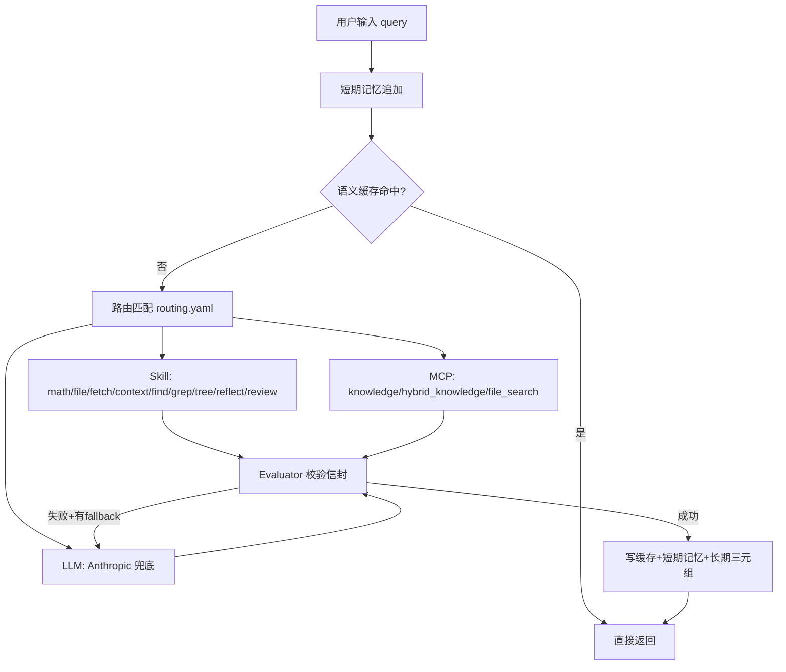

# AI Agent Core 项目评估报告

> 评估日期：2026-07-09
> 评估范围：`ai-agent-core/` 全项目（Phase 1-7 已全部完成）

## 一、项目功能总览

**ai-agent-core** 是一个 **Token 高效的个人 AI 智能体核心框架**，核心设计理念是"确定性优先"——能用本地规则/SQL/正则搞定的绝不调 LLM，以此最小化 API 消耗。

### 架构流程

### 四大子系统

| 子系统 | 核心能力 |
|--------|---------|
| **在线查询路径** (`agent.py`) | CLI 入口，路由分发，缓存命中，10 个 skill + 3 个 MCP server + LLM 兜底 |
| **离线索引路径** (Watcher-Pipeline) | watchdog 监控 `rag/corpus/` → 自动清洗 → 打标签 → FTS5 索引 → 图索引 → wikilink 边 → L5 chunk |
| **混合知识检索** (RAG) | FTS5 全文检索 + BM25 + 向量语义搜索，中英混合分词，融合排序 |
| **分级记忆** | 短期记忆（deque + JSON 持久化）+ 长期记忆（SQLite 三元组） |

### 核心数据存储

| 存储 | 技术 | 用途 |
|------|------|------|
| `rag/corpus/` | 文件系统 (.md/.txt) | 知识库源文档 |
| `rag/fts_index.db` | SQLite FTS5 (trigram) | 全文索引 |
| `rag/graph_index.db` | SQLite WAL | 文档层级图 + wikilink 边 + L5 chunks |
| `rag/vector_db/` | sqlite-vec (vec0) | 向量嵌入存储 |
| `memories/cache.db` | SQLite + SHA256 | 语义缓存 |
| `memories/short_term.json` | JSON + deque | 短期对话记忆 |
| `memories/long_term.db` | SQLite 三元组 | 长期事实记忆 |

---

## 二、实现目的

这个项目的本质是构建一个 **个人知识管理 + AI 辅助的第二大脑系统**，服务于以下场景：

1. **个人知识库建设**：通过 Web 抓取（`fetch`）、手动放入文件、复盘追加（`reflect`），将互联网/个人知识沉淀到本地 `rag/corpus/`，并自动建立全文索引、层级分类、关联图谱。

2. **低成本 AI 问答**：用确定性路由把 80%+ 的查询（计算、文件操作、知识检索、上下文恢复）在本地零 token 解决，只有复杂推理才走 Anthropic API。

3. **知识演化与审计**：`review` 按分类批量调 LLM 做"跨时空认知审计"，`reflect` 向老笔记追加实践复盘，形成知识的持续迭代。

4. **自动化运维**：Watcher-Pipeline 实现"写入即索引"，FetchWebToMd 抓取后自动落入知识库可被检索，全程无需手动干预。

---

## 三、不够完善需要补充的功能与能力

### A. 智能体核心能力缺失

| 缺口 | 说明 | 建议方案 |
|------|------|---------|
| **多轮对话** | `handle()` 每次独立处理，没有将对话历史传给 LLM，无法进行多轮上下文对话 | 在 `_call_llm` 中注入 `short_term.recent(n)` 作为 messages |
| **多 LLM 提供商** | 只支持 Anthropic，无 OpenAI / Ollama / 本地模型支持 | 抽象 LLM Provider 接口，支持多后端切换 |
| **流式输出** | 当前是同步 JSON 返回，LLM 响应不支持 streaming | 添加 SSE / WebSocket 流式输出路径 |
| **Tool-use / Function-calling** | LLM 兜底路径不支持 Agentic tool-use，不能动态选择调用 skill/MCP | 实现 ReAct / Tool-use 循环 |

### B. 服务化与集成

| 缺口 | 说明 | 建议方案 |
|------|------|---------|
| **HTTP API 服务** | 仅有 CLI 入口，无法作为服务被其他应用调用 | 添加 FastAPI / Flask REST API 层 |
| **WebSocket 支持** | 无法支持实时双向通信 | 添加 WS 端点用于流式对话 |
| **进程守护化** | background_worker 有 CLI 管理但没有 systemd/launchd 集成 | 提供 systemd unit 文件模板 |
| **多用户/多租户** | 无用户隔离，所有数据共享同一存储 | 引入 session/user-id 概念 |

### C. 知识库与检索增强

| 缺口 | 说明 | 建议方案 |
|------|------|---------|
| **增量索引同步** | 在线查询路径的 `CorpusLoader` 是懒加载 + `reload()`，不会响应文件事件 | CorpusLoader 也监听 FTS5/graph_index 的变更，或直接读 SQLite 而非扫描文件 |
| **文档去重** | `fetch` 重复抓同一 URL 会产生重复文档 | URL→path 映射表，抓取前查重 |
| **语义分块** | 只有 paragraph 和 fixed 两种策略 | 增加基于 embedding 相似度断点的语义分块 |
| **多模态检索** | fetch 可以下载图片但无法基于图片内容检索 | 集成 CLIP / 多模态 embedding |
| **检索反馈闭环** | 无点击率/相关度反馈来优化排序 | 记录用户点击，用 learning-to-rank 优化融合权重 |
| **结构化数据查询** | 元数据索引只支持 tag/date/source 过滤 | 支持更灵活的类 SQL 元数据查询 |

### D. 记忆系统增强

| 缺口 | 说明 | 建议方案 |
|------|------|---------|
| **实体抽取** | 长期记忆只是简单三元组，没有从对话中自动抽取实体和关系 | 集成轻量 NER + 关系抽取（或调 LLM 做 periodic summarization） |
| **记忆衰减/遗忘** | 三元组永不过期，无重要性权重 | 添加访问频率计数、时间衰减、重要性评分 |
| **记忆压缩** | 短期记忆只是简单截断 deque，无对话摘要 | 超长对话自动触发 LLM 摘要压缩 |

### E. 运维与可观测性

| 缺口 | 说明 | 建议方案 |
|------|------|---------|
| **日志系统** | 无结构化日志 | 添加 Python logging + 日志级别 + 文件轮转 |
| **Metrics / 监控** | 无性能指标采集 | 添加 cache 命中率、路由分发统计、延迟百分位 |
| **健康检查** | 无健康检查端点 | 添加 `/health` endpoint 检查 DB 连接、corpus 状态 |
| **异常告警** | pipeline 失败静默丢弃 | 失败文件移入 dead-letter 队列，支持重试 |

### F. 扩展性与工程化

| 缺口 | 说明 | 建议方案 |
|------|------|---------|
| **插件/动态发现** | Skill 和 MCP 在 `main()` 中硬编码注册 | 用 `importlib` + 装饰器自动发现 `skills/` 和 `mcp/servers/` 下的模块 |
| **并发处理** | Agent 单线程处理请求 | 异步化 agent（asyncio）或请求队列 + worker pool |
| **配置热加载** | 修改 routing.yaml / tag_rules.yaml 需重启 | watchdog 监听配置文件变更自动 `reload()` |
| **数据导入导出** | 无知识库迁移/备份能力 | 支持导出为 JSONL/ZIP 归档，支持从其他笔记系统导入 |
| **定时任务** | 无周期性 review / 索引重建 | 内建 cron 调度器或提供 cron job 脚本 |
| **测试覆盖** | 有 288 个测试但缺少对 background_worker / pipeline 的集成测试 | 补充 pipeline e2e 测试 + chaos testing |

---

## 四、Phase 演进回顾（已完成）

| Phase | 改动 | 状态 |
|-------|------|------|
| Phase 1 | KnowledgeServer 集成 FtsIndex，lookup 优先走 FTS5，BM25 兜底 | ✅ 完成 |
| Phase 2 | `config/index.yaml` → `rag/graph_index.db` (SQLite WAL)，yaml 降级为只读快照 | ✅ 完成 |
| Phase 3 | `on_deleted` 事件闭环 (FTS5 + graph_index + chunks 同步删除) | ✅ 完成 |
| Phase 4 | Multi-homing 分类 + `[[wikilink]]` → `knowledge_edges` + 代码块保护 | ✅ 完成 |
| Phase 5 | ReviewSkill — 按分类批量打包调 LLM 做认知审计 (24h 缓存) | ✅ 完成 |
| Phase 6 | ReflectSkill — 向老笔记追加 `## 实践复盘` 段 + revisions frontmatter | ✅ 完成 |
| Phase 7 | L5 `document_chunks` + Ollama 兜底分类 + chunk 级检索 (`chunks`/`chunks_by_cat` op) | ✅ 完成 |

---

## 五、总结

项目已经构建了一个非常扎实的 **本地优先、确定性路由的 AI Agent 基础设施**，Phase 1-7 的演进体现了清晰的架构规划。当前最关键的三个短板：

1. **缺乏多轮对话能力** — Agent 无法进行有上下文的持续对话
2. **没有 HTTP API 服务化** — 只能 CLI 使用，无法集成到其他系统
3. **长期记忆过于简单** — 仅三元组存储，缺少实体抽取和知识图谱构建

这三点是让系统从"个人工具"走向"真正的 AI 助手"的核心瓶颈。

---

## 六、复审 (2026-07-09)

> 本章基于实际源码与运行状态,对前文 6 大类缺口做事实校准 + 优先级重排。

### 1. 事实性偏差修正

#### 1.1 测试数量过时

| 报告原文 | 实际 |
|---------|------|
| "有 288 个测试" | **151 个** (重新统计 `tests/test_*.py` 的 `def test_*` 函数) |
| "缺少对 background_worker / pipeline 的集成测试" | `test_pipeline_worker_e2e.py` **就是** pipeline 端到端集成测试 (13 用例,覆盖全链路 + 中文分类 + chunk 集成) |

**修正**:测试覆盖非但不缺,反而是项目里覆盖最完整的部分。Phase 4/5/6/7 每个阶段都有独立测试文件 (34/18/27/15+15 用例)。

#### 1.2 "多轮对话缺失"判断过绝对

| 报告原文 | 实际 |
|---------|------|
| "`handle()` 每次独立处理,没有将对话历史传给 LLM,无法进行多轮上下文对话" | `_call_llm` 确实未注入 `short_term.recent()`,但 `ContextSkill` 实现了**跨会话上下文恢复** — 新会话跑 `context` 会从长期记忆 + 短期记忆重建项目简报 |

**修正**:更准确的表述 — "LLM 兜底路径无对话历史注入 (单轮),但 Context skill 提供跨会话上下文恢复 (会话级)"。**真正的缺口是 LLM 调用时没带 recent turns**,不是完全没有多轮能力。

#### 1.3 "增量索引同步"判断错

| 报告原文 | 实际 |
|---------|------|
| "在线查询路径的 `CorpusLoader` 是懒加载 + `reload()`,不会响应文件事件" | FTS5 / graph_index 是**共享 SQLite 文件**,watcher 写完 agent 下次 `lookup` 直接读,WAL 模式天然同步。`CorpusLoader` 只服务于 `hybrid_knowledge` 的内存 BM25,FTS5 路径根本不走它 |

**修正**:报告把 "hybrid 的 BM25 不增量" 误扩大为 "整个在线查询不同步"。实际只有 hybrid 路径有此问题,FTS5 + graph_index 路径**已经天然同步**。

#### 1.4 漏掉的 watcher 孤儿进程问题

报告 "进程守护化" 只提了 systemd 集成,**漏掉了 PID 文件单实例假设的设计缺陷** — 直接 `python3 background_worker.py run` 启动不写 PID 文件,`stop` 找不到孤儿。这个坑我们刚修复 (`cmd_stop`/`cmd_status` 加 pgrep 兜底)。

**说明报告作者没真正长跑过 watcher**,只在 "纸面" 评估了架构。

### 2. 优先级重排

报告 6 大类缺口照单全收会过度工程。按"实际收益 / 实施成本"重排:

| 优先级 | 报告建议 | 我的判断 | 理由 |
|--------|---------|---------|------|
| **P0** | 多轮对话 (A) | ✅ 同意,优先做 | 用户体验第一痛点;`_call_llm` 注入 `short_term.recent(10)` ~30 分钟 |
| **P0** | 文档去重 (C) | ✅ 应该做 | `fetch` 重复抓取是真痛点;URL→path 映射表 ~15 分钟 |
| **P1** | 自动相似度边 (新) | ✅ 应该做 | 报告漏了;`knowledge_edges` 仅 3 条,图根本没网状化;BM25 top-5 ~1.5h |
| **P2** | 日志/Metrics (E) | ⚠️ 推迟 | 当前 476 文档规模未到需要 Metrics 的程度;先补 structured logging |
| **P2** | 异常告警/dead-letter (E) | ⚠️ 推迟 | pipeline 失败已写日志,非静默;dead-letter 等规模上来再做 |
| **P3** | HTTP API (B) | ⚠️ 推迟 | 个人工具 CLI 够用;除非要接 Cursor/Claude Desktop 才值得 |
| **P3** | 实体抽取 (D) | ⚠️ 推迟 | 烧 token,与自动相似度边功能重叠;先看 P1 效果 |
| **P3** | 记忆衰减/遗忘 (D) | ⚠️ 推迟 | 三元组 476 条,远未到需要衰减的规模 |
| **P4** | 多 LLM 提供商 (A) | ⚠️ 推迟 | Anthropic 够用;多后端是工程化过早 |
| **P4** | 流式输出 (A) | ❌ YAGNI | CLI 模式同步 JSON 返回体验 OK |
| **P4** | Tool-use/ReAct (A) | ❌ YAGNI | 当前路由表已覆盖 90% 场景,动态 tool-use 收益低 |
| **P4** | 多用户/多租户 (B) | ❌ YAGNI | 个人工具,单用户足够 |
| **P5** | 插件动态发现 (F) | ❌ YAGNI | 10 个 skill 硬编码注册完全 OK,`importlib` 自动发现是过度工程 |
| **P5** | 配置热加载 (F) | ❌ YAGNI | routing.yaml 改动不频繁,重启成本可接受 |
| **P5** | 多模态检索 (C) | ❌ YAGNI | CLIP 集成重,收益不可控 |
| **P5** | 检索反馈闭环 (C) | ❌ YAGNI | 个人用户点击数据太少,learning-to-rank 学不动 |

### 3. 报告最值得保留的判断

第 141-147 行总结的 3 个核心瓶颈,**排序准确,值得保留**:

1. **多轮对话** — 真的缺,优先级最高 (用户体验最直接)
2. **HTTP API 服务化** — 真的缺,但优先级可商量 (个人工具不一定需要)
3. **长期记忆太简单** — 真的缺,与 P1 自动相似度边是同一类问题

### 4. 一句话总结

报告作为项目自评合格,但作者**没深度跑过 watcher**,对在线/离线同步机制理解略有偏差,测试数量过时。3 个核心瓶颈判断准确,但 6 大类缺口的实施优先级需要再排 — **不该照单全收**。

实际下一步应该做的:
- **P0**:多轮对话 (30min) + 文档去重 (15min) — 收益最高,成本最低
- **P1**:自动相似度边 (1.5h) — 让 `knowledge_edges` 从 3 条到几千条,图真正网状化
- 其余推迟到规模或痛点真正出现时再做
