# Watcher-Pipeline 功能说明

> 自动入库 Pipeline:监控 `rag/corpus/` → 清洗 → 自动打标签 → 注入 frontmatter → FTS5 索引 + graph_index 同步 + wikilink 边 + L5 chunks。
> 当前已演进到 **Phase 7**,本文档反映 [ai-agent-core/scripts/pipeline_worker.py](ai-agent-core/scripts/pipeline_worker.py) 与 [ai-agent-core/background_worker.py](ai-agent-core/background_worker.py) 的实际实现。

## 1. 总览

Watcher-Pipeline 是 ai-agent-core 的**后台自动索引子系统**,与 agent 在线查询路径并行工作。它把"抓取/写入 → 索引"这一步从 agent 调用时移到文件写入时,让知识库"写入即索引"。

### 核心价值

| 维度 | 无 Watcher (原状) | 有 Watcher (当前 Phase 7) |
|------|------------------|--------------------------|
| 新文件发现时机 | agent 调用懒加载 `CorpusLoader._load()` | 文件创建/修改后 500ms 内 |
| 全文检索 | BM25 子串匹配 (每次 query 重建索引) | **SQLite FTS5** (增量 upsert,trigram 分词) |
| 层级分类 | 文件名 `[tag]` 扁平过滤 | **L1/L2/L3 规则分类 + multi-homing + Ollama 兜底** |
| 图索引 | 无 | **`rag/graph_index.db` SQLite WAL** (document_graph + knowledge_edges + document_chunks) |
| 关系图谱 | 无 | **`[[wikilink]]` 解析 → knowledge_edges** (Phase 4) |
| chunk 级检索 | 无 | **L5 document_chunks** (Phase 7,paragraph 策略) |
| 删除闭环 | 无 | **`on_deleted` 同步清理 FTS5 + graph + chunks** (Phase 3) |
| 查询延迟 | 全量 BM25 重建 + 子串扫描 | FTS5 反向索引 (O(log n)) |

### 与现有系统的边界

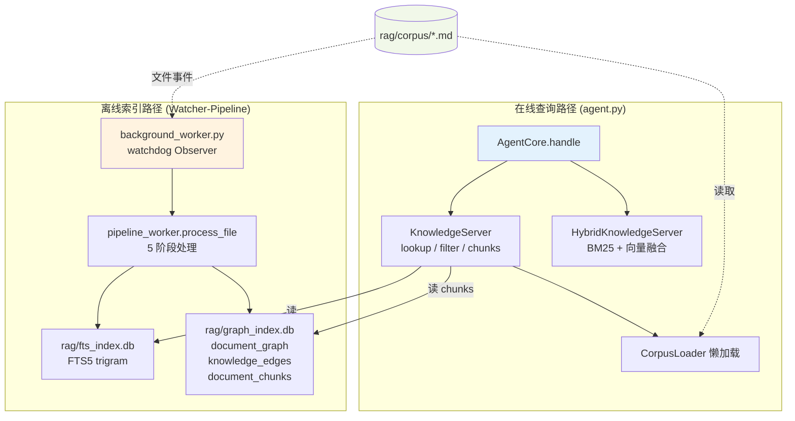

**两个子系统共享 `rag/corpus/` 这一物理目录**。agent 走 `CorpusLoader` 懒加载读文件 + 读 SQLite 索引;watcher 监听文件事件写 SQLite 索引。读写解耦,SQLite WAL 支持并发读 + 串行写,互不阻塞。

---

## 2. 组件架构

```mermaid
graph LR
    subgraph "Trigger Sources"
        T1[FetchWebToMd Skill<br/>fetch &lt;url&gt;]
        T2[scripts/web_scraper.py<br/>python -m scripts.web_scraper]
        T3[用户手动放入<br/>rag/corpus/x.md]
        T4[ReflectSkill<br/>追加复盘段]
    end

    subgraph "Watcher (常驻进程)"
        W1[background_worker.py<br/>watchdog Observer]
        W2[DebouncedMdHandler<br/>on_created / on_modified / on_deleted]
        W3[ThreadPoolExecutor<br/>max_workers=2]
        W1 --> W2
        W2 -->|debounce 500ms| W3
    end

    subgraph "Pipeline (每文件)"
        P1[pipeline_worker.process_file]
        P2[clean_md<br/>HTML 剥离 + 代码块保护]
        P3[classify + classify_multi<br/>规则匹配 + multi-homing]
        P4[Ollama 兜底分类<br/>可选 OLLAMA_CLASSIFY_ENABLED=1]
        P5[inject_frontmatter<br/>原子 .tmp + os.replace]
        P6[fts5_upsert<br/>DELETE + INSERT]
        P7[graph_index_upsert_categories<br/>multi-homing L4]
        P8[upsert_edges_from_wikilinks<br/>knowledge_edges]
        P9[chunk_index_upsert<br/>L5 chunks]
        P1 --> P2 --> P3 --> P4 --> P5
        P5 --> P6 --> P7 --> P8 --> P9
    end

    subgraph "Storage"
        S1[(rag/corpus/*.md<br/>带 frontmatter)]
        S2[(rag/fts_index.db)]
        S3[(rag/graph_index.db)]
        S4[(config/tag_rules.yaml)]
        S5[(config/index.yaml<br/>只读快照)]
    end

    T1 -->|写 .md| S1
    T2 -->|写 .md| S1
    T3 -->|写 .md| S1
    T4 -->|改写 .md| S1

    S1 -.->|文件事件| W2
    W3 --> P1
    P5 -->|改写文件| S1
    P6 --> S2
    P7 --> S3
    P8 --> S3
    P9 --> S3
    P3 -.->|读规则| S4
    S3 -.->|export_graph_to_yaml| S5

    style W1 fill:#fff3e0
    style P1 fill:#fce4ec
    style S1 fill:#f1f8e9
    style S2 fill:#e8f5e9
    style S3 fill:#e8f5e9
    style S4 fill:#fff9c4
```

### 组件清单

| 组件 | 文件 | 角色 |
|------|------|------|
| 文件监控器 | [background_worker.py](ai-agent-core/background_worker.py) | watchdog Observer,常驻进程;支持 `start/stop/restart/status/run` 子命令 + pgrep 兜底扫孤儿 |
| 事件处理器 | `DebouncedMdHandler` (同上) | 防抖 + 过滤 + 入队 (create/modify/**delete**) |
| Pipeline 入口 | [scripts/pipeline_worker.py](ai-agent-core/scripts/pipeline_worker.py) | `process_file()` 串联 5 阶段 |
| 文本清洗 | `clean_md()` (同上) | HTML 残留剥离、代码块保护、空白折叠、长度截断 (100k) |
| 自动打标签 | `classify()` + `classify_multi()` (同上) | 规则匹配 → `(l1, l2, l3)` + top-3 multi-homing |
| Ollama 兜底分类 | [scripts/offline_classifier.py](ai-agent-core/scripts/offline_classifier.py) | Phase 7 — 本地小模型分类 (默认禁用,`OLLAMA_CLASSIFY_ENABLED=1` 启用) |
| Frontmatter 注入 | `inject_frontmatter()` (同上) | 幂等 YAML 头插入,原子 `.tmp + os.replace` |
| FTS5 写入 | `fts5_upsert()` + [rag/fts_index.py](ai-agent-core/rag/fts_index.py) | SQLite FTS5 upsert (trigram 分词) |
| 图索引写入 | `graph_index_upsert_categories()` + [rag/graph_index.py](ai-agent-core/rag/graph_index.py) | SQLite WAL document_graph multi-homing L4 |
| Wikilink 边 | `upsert_edges_from_wikilinks()` (同上) | Phase 4 — `[[wikilink]]` 解析 → knowledge_edges |
| L5 chunks | `chunk_index_upsert()` (同上) | Phase 7 — paragraph 分块 → document_chunks |
| 删除清理 | `delete_file_indexes()` (同上) | Phase 3 — FTS5 + graph + chunks 同步删除 |
| 图索引快照导出 | `export_graph_to_yaml()` (同上) | 一次性导出 `config/index.yaml` (只读) |
| URL 抓取入口 | [scripts/web_scraper.py](ai-agent-core/scripts/web_scraper.py) | 复用 `FetchWebToMd`,写入 `rag/corpus/` |
| 分类规则 | [config/tag_rules.yaml](ai-agent-core/config/tag_rules.yaml) | keyword → (L1, L2, L3) 映射 |

### Phase 演进记录

| Phase | 改动 | 状态 |
|-------|------|------|
| Phase 1 | KnowledgeServer 集成 FtsIndex,lookup 优先走 FTS5,BM25 兜底 | ✅ 完成 |
| Phase 2 | `config/index.yaml` → `rag/graph_index.db` (SQLite WAL),yaml 降级为只读快照 | ✅ 完成 |
| Phase 3 | `on_deleted` 事件闭环 (FTS5 + graph_index + chunks 同步删除) | ✅ 完成 |
| Phase 4 | Multi-homing 分类 + `[[wikilink]]` → `knowledge_edges` + 代码块保护 | ✅ 完成 |
| Phase 5 | ReviewSkill — 按分类批量打包调 LLM 做认知审计 (24h 缓存) | ✅ 完成 |
| Phase 6 | ReflectSkill — 向老笔记追加 `## 实践复盘` 段 + revisions frontmatter | ✅ 完成 |
| Phase 7 | L5 `document_chunks` + Ollama 兜底分类 + chunk 级检索 (`chunks`/`chunks_by_cat` op) | ✅ 完成 |
| P0-1 | `_call_llm` 注入 `short_term.recent(10)` 多轮历史,free-form query 看到上下文 | ✅ 完成 |
| P0-2 | `UrlRegistry` (SQLite) + `fetch_web` 去重,`force=True` 可绕过,缓存文件丢失自动重下 | ✅ 完成 |
| P1 | `scripts/build_similarity_edges.py` — BM25 top-k per doc → `knowledge_edges` (`rel_type='bm25_similar'`) | ✅ 完成 |

---

## 3. 数据流

### 3.1 主数据流:文件创建/修改 → 5 阶段索引同步

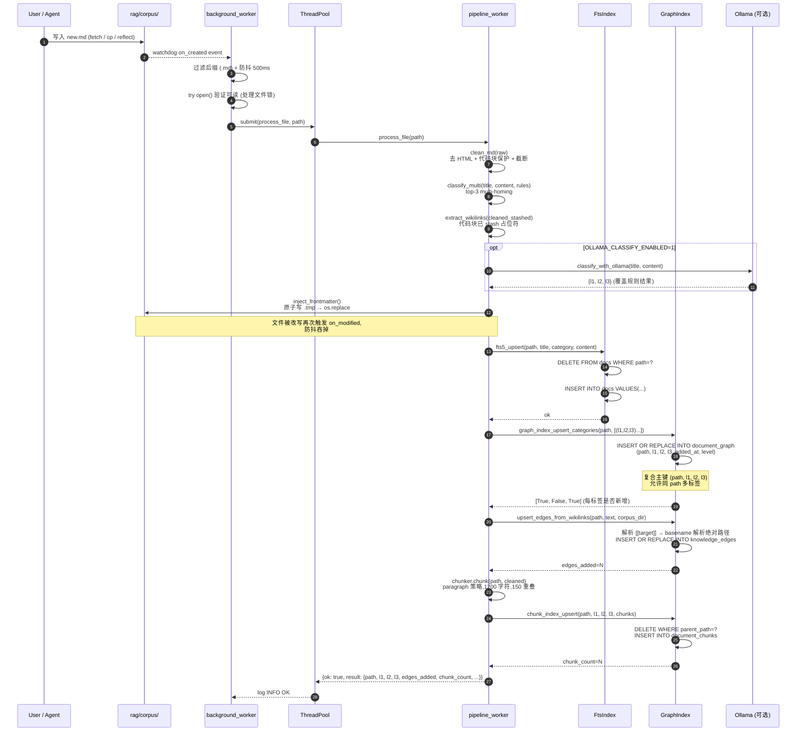

### 3.2 文件删除 → 索引同步清理 (Phase 3)

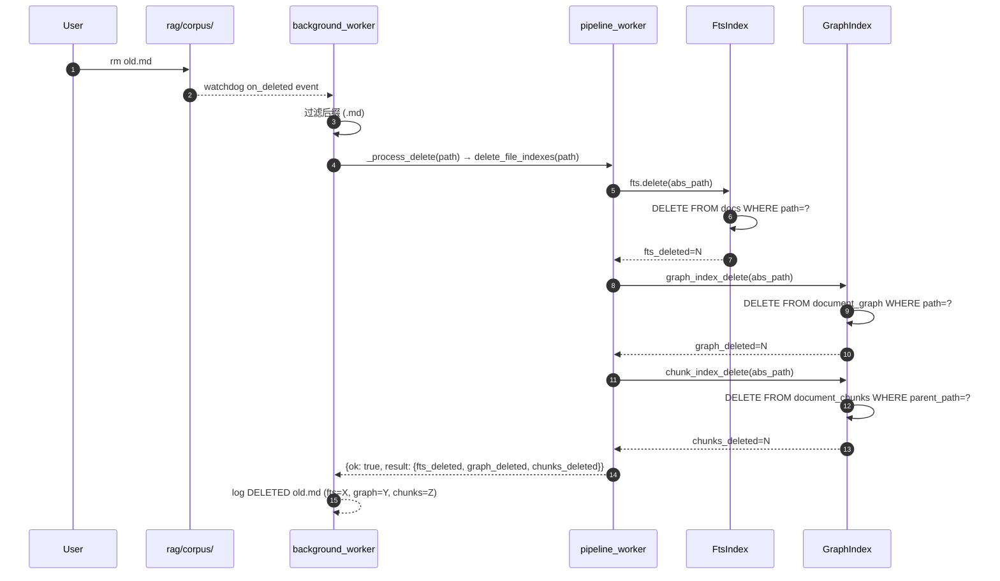

### 3.3 URL 抓取数据流

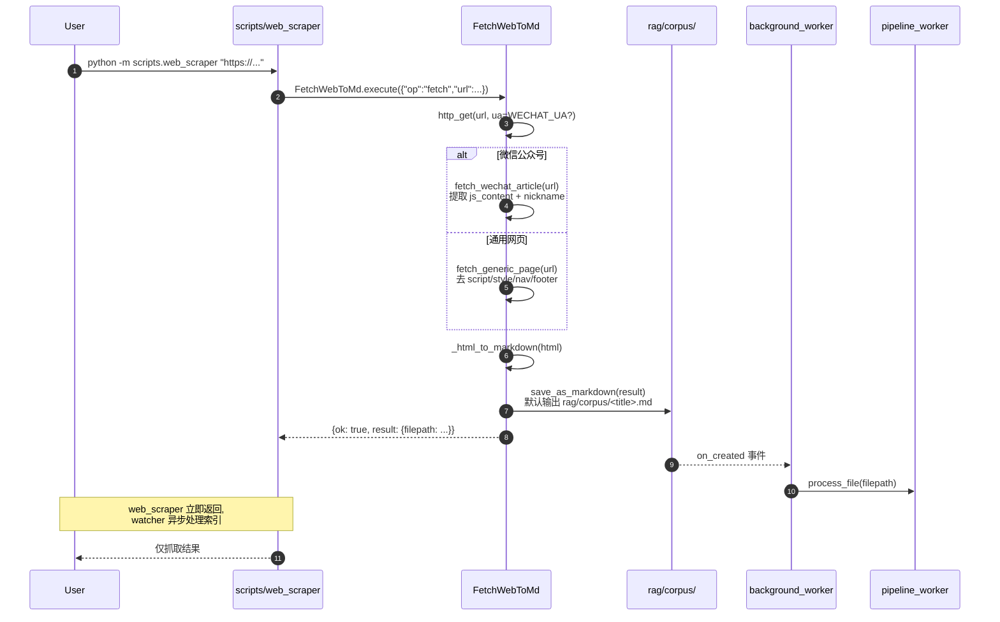

### 3.4 FTS5 查询数据流 (agent 在线路径)

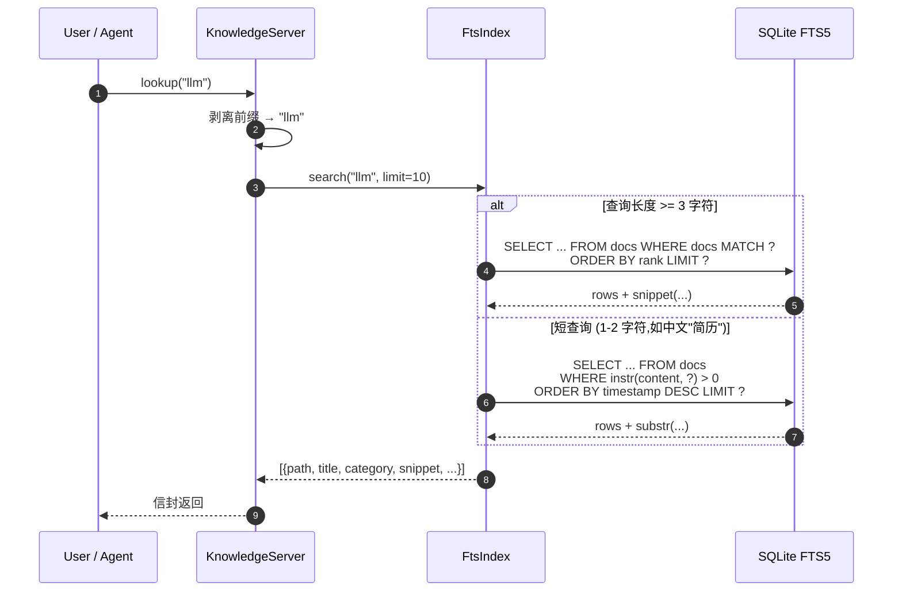

---

## 4. 流程图

### 4.1 Watcher 主循环

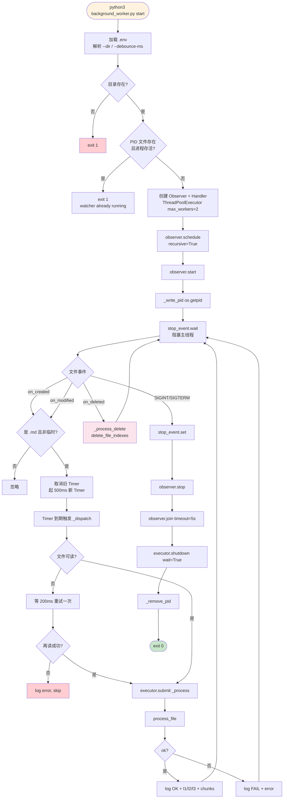

### 4.2 Pipeline 处理流程 (process_file)

```mermaid
flowchart TD
    Entry[process_file path] --> Exists{文件存在?}
    Exists -->|否| Err1["err: file not found"]
    Exists -->|是| Suffix{是 .md?}
    Suffix -->|否| Err2["err: not a markdown"]
    Suffix -->|是| Read[读 raw text]

    Read --> Clean[clean_md<br/>1. 去 script/style/noscript<br/>2. 保护 ```code block```<br/>3. 剥离剩余 HTML 标签<br/>4. 折叠空白<br/>5. 长度截断 max_chars=100k]
    Clean --> CleanStash[clean_md keep_codeblocks_stashed=True<br/>代码块留 \x00CODEBLOCK{n}\x00 占位符]

    CleanStash --> LoadRules[加载 config/tag_rules.yaml]
    LoadRules --> Title[提取首个 # 标题]
    Title --> ClassifyMulti[classify_multi<br/>haystack = title + content[:5000]<br/>按规则统计 keyword 命中数<br/>top-3 (l1, l2, l3, score)]

    ClassifyMulti --> OllamaHook{OLLAMA_CLASSIFY_ENABLED=1<br/>且 classify_hook 可用?}
    OllamaHook -->|是| Ollama[classify_with_ollama<br/>本地小模型覆盖分类]
    OllamaHook -->|否| SkipOllama[跳过]
    Ollama --> FM
    SkipOllama --> FM

    FM[inject_frontmatter<br/>l1/l2/l3/title/fetched_at/categories<br/>原子写 .tmp → os.replace]
    FM --> FTS[fts5_upsert<br/>category = l1/l2/l3<br/>DELETE WHERE path=?<br/>INSERT]
    FTS --> FTSCheck{成功?}
    FTSCheck -->|否| Err3["err: fts5 upsert failed"]
    FTSCheck -->|是| Graph

    Graph[graph_index_upsert_categories<br/>遍历 categories 多标签<br/>INSERT OR REPLACE INTO document_graph<br/>复合主键 (path, l1, l2, l3)]
    Graph --> Edges

    Edges[upsert_edges_from_wikilinks<br/>解析 [[target]]<br/>basename → 绝对路径解析<br/>INSERT OR REPLACE INTO knowledge_edges]
    Edges --> Chunks

    Chunks{PIPELINE_CHUNK_ENABLED=1?}
    Chunks -->|否| SkipChunks[chunk_count=0]
    Chunks -->|是| Chunker[TextChunker paragraph 策略<br/>chunk_size=1200 overlap=150]
    Chunker --> ChunkUpsert[chunk_index_upsert<br/>DELETE WHERE parent_path=?<br/>INSERT INTO document_chunks]
    ChunkUpsert --> OK
    SkipChunks --> OK

    OK["ok: {path, title, l1, l2, l3,<br/>categories, graph_added, edges_added,<br/>chars, chunk_count}"]

    style Entry fill:#fce4ec
    style OK fill:#c8e6c9
    style Err1 fill:#ffcdd2
    style Err2 fill:#ffcdd2
    style Err3 fill:#ffcdd2
    style FM fill:#fff9c4
    style FTS fill:#e8f5e9
    style Graph fill:#e8f5e9
    style Edges fill:#e8f5e9
    style ChunkUpsert fill:#e8f5e9
    style Ollama fill:#f3e8ff
```

### 4.3 Multi-homing 分类决策 (Phase 4)

```mermaid
flowchart TD
    Start[classify_multi title, content, rules, max_labels=3] --> Build[拼接 haystack = title + ' ' + content[:5000]]
    Build --> Lower[haystack.lower]
    Lower --> Empty{haystack 空?}
    Empty -->|是| Def[返回 defaults 单标签]
    Empty -->|否| Loop[遍历所有 rules]

    Loop --> Score[每条 rule 统计 keyword 命中数<br/>scores[l1,l2,l3] += hits]
    Score --> Sort[按 score 降序排序]
    Sort --> Top3[取 top-3]
    Top3 --> Norm[归一化 score / total]
    Norm --> Return[返回 [(l1, l2, l3, score)...]]

    style Def fill:#fff9c4
    style Return fill:#c8e6c9
```

**Multi-homing 含义**:同一文档可同时属于多个分类。例如一篇同时讨论"AI 模型"和"研发体系"的文章,会在 `document_graph` 表里**插两行**:
```
(path, 科技, AI, 模型, ...)
(path, 科技, AI, 研发体系, ...)
```
复合主键 `(path, l1, l2, l3)` 允许同 path 多标签,`KnowledgeServer.filter` 可从任一标签命中此文档。

### 4.4 Wikilink 解析与边写入 (Phase 4)

```mermaid
flowchart TD
    Text[cleaned_stashed text<br/>代码块已替换为 \x00CODEBLOCK{n}\x00] --> Regex[regex \[\[([^\]]+?)\]\] 全局匹配]
    Regex --> ForEach[遍历每个 [[inner]]]

    ForEach --> Pipe{含 \|?}
    Pipe -->|是| Split[取 \| 后的 target]
    Pipe -->|否| Direct[inner 即 target]
    Split --> Resolve
    Direct --> Resolve

    Resolve{target 解析}
    Resolve -->|target_paths 字典有| Hit[用绝对路径]
    Resolve -->|.md 后缀且文件存在| FileHit[corpus_dir / target]
    Resolve -->|都失败| Skip[跳过此 wikilink]

    Hit --> Edge[upsert_edge source_path, tgt_path<br/>weight=1.0 rel_type=wikilink]
    FileHit --> Edge
    Edge --> Next[下一个 wikilink]
    Next --> ForEach

    style Text fill:#fce4ec
    style Edge fill:#e8f5e9
    style Skip fill:#fff9c4
```

**代码块保护**:wikilink 解析用 `clean_md(keep_codeblocks_stashed=True)` 的输出,代码块已被 `\x00CODEBLOCK{n}\x00` 占位符替换,所以代码块内的 `[[...]]` 不会被误识别为 wikilink。

---

## 5. 数据结构

### 5.1 SQLite FTS5 表 (`rag/fts_index.db`)

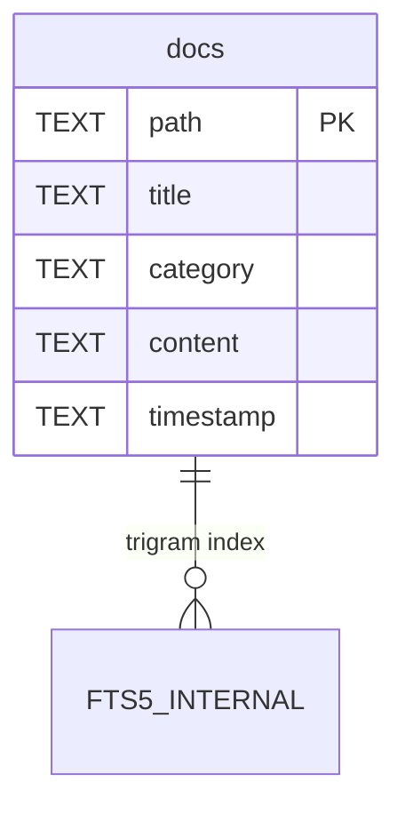

```sql
CREATE VIRTUAL TABLE IF NOT EXISTS docs USING fts5(
    path,
    title,
    category,
    content,
    timestamp,
    tokenize = 'trigram'
);
```

| 列 | 用途 | 示例 |
|----|------|------|
| `path` | 文档绝对路径,作 PK 用 (upsert 按 path DELETE+INSERT) | `/abs/rag/corpus/foo.md` |
| `title` | 首个 `#` 标题 | `AI Coding 研发体系(一)` |
| `category` | `"L1/L2/L3"` 拼接 (主标签) | `科技/AI/模型` |
| `content` | 清洗后正文 (含 frontmatter 后的全文) | `本文讨论...` |
| `timestamp` | 入库 ISO 时间 | `2026-07-07T12:34:56.789` |

**trigram 分词器**:把文本拆成 3 字符滑窗,支持中英文混合模糊匹配。**限制**:MATCH 查询需 ≥ 3 字符;短查询 (如中文 2 字"简历") 走 `instr(content, ?) > 0` 兜底。

### 5.2 图索引 `rag/graph_index.db` (Phase 2/4/7)

包含 3 张表:**document_graph** (L4 文档节点) + **knowledge_edges** (wikilink 边) + **document_chunks** (L5 chunks)。

```mermaid
erDiagram
    document_graph ||--o{ document_chunks : "parent_path → path"
    document_graph ||--o{ knowledge_edges : "source_path → path"

    document_graph {
        TEXT path PK_part1
        TEXT l1 PK_part2
        TEXT l2 PK_part3
        TEXT l3 PK_part4
        TEXT added_at
        TEXT level DEFAULT_L4
    }

    knowledge_edges {
        TEXT source_path PK_part1
        TEXT target_path PK_part2
        REAL weight DEFAULT_1.0
        TEXT rel_type DEFAULT_wikilink
        TEXT added_at
    }

    document_chunks {
        TEXT chunk_id PK
        TEXT parent_path
        TEXT chunk_text
        TEXT l1
        TEXT l2
        TEXT l3
        TEXT added_at
        TEXT level DEFAULT_L5
    }
```

```sql
-- Phase 2/4: L4 文档节点 (复合主键允许 multi-homing)
CREATE TABLE IF NOT EXISTS document_graph (
    path     TEXT NOT NULL,
    l1       TEXT NOT NULL,
    l2       TEXT NOT NULL,
    l3       TEXT NOT NULL,
    added_at TEXT NOT NULL,
    level    TEXT NOT NULL DEFAULT 'L4',
    PRIMARY KEY (path, l1, l2, l3)
);
CREATE INDEX IF NOT EXISTS idx_l1l2l3 ON document_graph(l1, l2, l3);
CREATE INDEX IF NOT EXISTS idx_path ON document_graph(path);

-- Phase 4: wikilink 边
CREATE TABLE IF NOT EXISTS knowledge_edges (
    source_path TEXT NOT NULL,
    target_path TEXT NOT NULL,
    weight      REAL NOT NULL DEFAULT 1.0,
    rel_type    TEXT NOT NULL DEFAULT 'wikilink',
    added_at    TEXT NOT NULL,
    PRIMARY KEY (source_path, target_path)
);
CREATE INDEX IF NOT EXISTS idx_edge_source ON knowledge_edges(source_path);
CREATE INDEX IF NOT EXISTS idx_edge_target ON knowledge_edges(target_path);

-- Phase 7: L5 chunk 级原子索引
CREATE TABLE IF NOT EXISTS document_chunks (
    chunk_id    TEXT NOT NULL,
    parent_path TEXT NOT NULL,
    chunk_text  TEXT NOT NULL,
    l1          TEXT NOT NULL,
    l2          TEXT NOT NULL,
    l3          TEXT NOT NULL,
    added_at    TEXT NOT NULL,
    level       TEXT NOT NULL DEFAULT 'L5',
    PRIMARY KEY (chunk_id)
);
CREATE INDEX IF NOT EXISTS idx_chunk_parent ON document_chunks(parent_path);
CREATE INDEX IF NOT EXISTS idx_chunk_l1l2l3 ON document_chunks(l1, l2, l3);

-- PRAGMA journal_mode=WAL  -- 多线程并发读写不互斥
-- PRAGMA synchronous=NORMAL
```

**层级关系**:

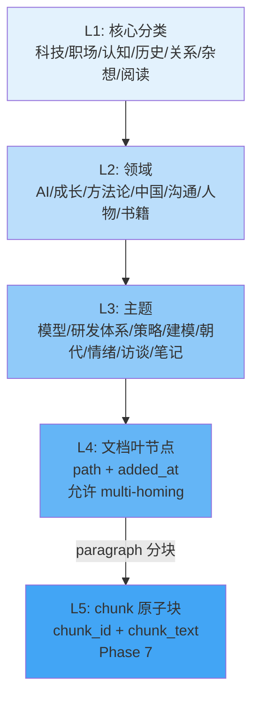

### 5.3 分类规则 `config/tag_rules.yaml`

```yaml
defaults:
  l1: 未分类
  l2: Misc
  l3: General

rules:
  - l1: 科技
    l2: AI
    l3: 模型
    keywords: [ai, llm, gpt, claude, transformer, 大模型, 深度学习, 神经网络, embedding, rag]
  - l1: 科技
    l2: AI
    l3: 研发体系
    keywords: [coding, 研发, devops, ci/cd, agent, 编码, 工程化, 代码, ide]
  # ... 共 12 条规则
```

**匹配语义**:`classify_multi` 统计每条 rule 的 keyword 命中数,按命中数降序取 top-3,归一化后作为 multi-homing 标签。

### 5.4 Markdown Frontmatter

注入到每个 `.md` 文件头部:

```yaml
---
l1: 科技
l2: AI
l3: 模型
title: AI Coding 研发体系(一):企业级 AI 编码的六层架构
fetched_at: 2026-07-07T03:35:33.123456
categories:
  - l1: 科技
    l2: AI
    l3: 模型
  - l1: 科技
    l2: AI
    l3: 研发体系
---

# AI Coding 研发体系(一):企业级 AI 编码的六层架构

> **URL**: <https://example.com/article>
> **Fetched**: 2026-07-07 03:35:33

正文内容...
```

**幂等保证**:已有 frontmatter 且含 `l1/l2/l3` 字段 → 不覆盖。multi-homing 时 `categories` 数组记录所有标签。

---

## 6. 线程模型

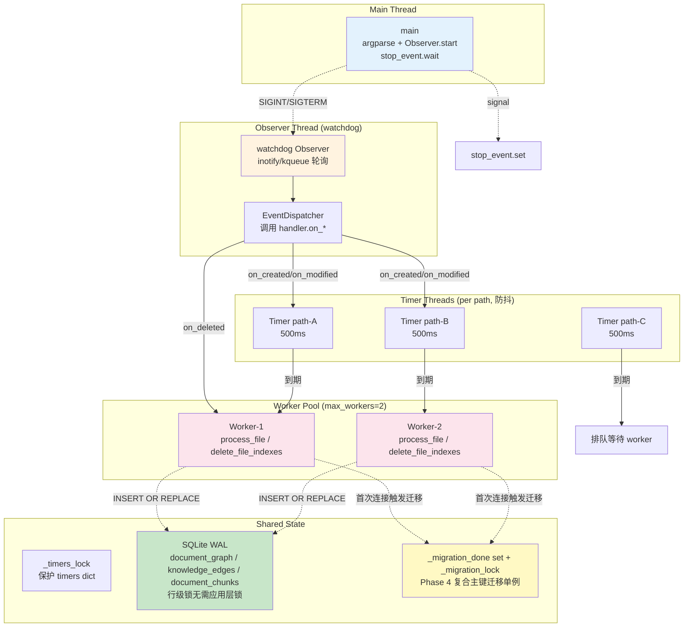

### 同步点

| 共享资源 | 保护机制 | 说明 |
|---------|---------|------|
| `_timers: dict[path, Timer]` | `_timers_lock` (Lock) | 防抖 Timer 注册/取消原子 |
| `rag/graph_index.db` | SQLite WAL + 行级锁 | 多 worker 并发写入无需应用层锁 (Phase 2 起) |
| Phase 4 复合主键迁移 | `_migration_done` set + `_migration_lock` + `BEGIN IMMEDIATE` | 模块级单例,首次连接迁移一次,其他线程等待 |
| `rag/fts_index.db` | SQLite connection per-call | `FtsIndex` 每次调用新建 connection,无共享 |
| Markdown 文件写回 | 原子 `.tmp + os.replace` | OS 级原子,无需锁 |
| `config/index.yaml` (旧) | 已废弃为只读快照 | `export_graph_to_yaml()` 一次性导出,不再实时写 |

---

## 7. 错误处理

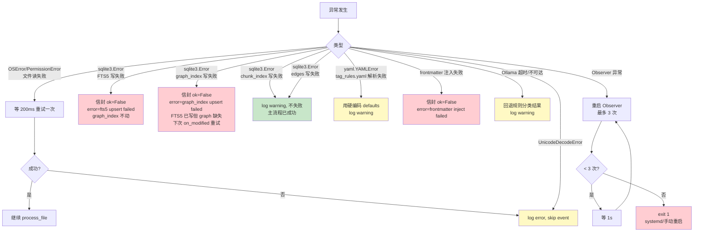

### 错误信封约定

所有 `process_file` 失败都返回标准信封,不抛异常给 watcher:

```python
{"ok": False, "result": None, "error": "file not found: /path/x.md"}
{"ok": False, "result": None, "error": "not a markdown file: /path/x.txt"}
{"ok": False, "result": None, "error": "read failed: UnicodeDecodeError: ..."}
{"ok": False, "result": None, "error": "frontmatter inject failed: ..."}
{"ok": False, "result": None, "error": "fts5 upsert failed: ..."}
{"ok": False, "result": None, "error": "graph_index upsert failed: ..."}
```

Watcher 收到 `ok=False` 仅记日志,不退出进程;下个文件事件继续处理。**chunk_index / edges 失败为非致命**,主流程已成功的 FTS5 + graph_index 仍保留。

---

## 8. 启动与使用

### 8.1 启动 Watcher

```bash
cd ai-agent-core
python3 background_worker.py start              # 后台启动 (推荐)
python3 background_worker.py status             # 查看状态 (含孤儿检测)
python3 background_worker.py stop               # 停止 (含 pgrep 兜底扫孤儿)
python3 background_worker.py restart            # 重启
python3 background_worker.py run                # 前台运行 (调试用)
```

`stop` / `status` 会用 `pgrep -f background_worker.py` 扫进程表,**兜底杀掉 PID 文件之外的孤儿进程** (例如直接 `python3 background_worker.py run` 启动的)。

### 8.2 CLI 命令清单

| 命令 | 用途 | 关键参数 |
|------|------|---------|
| `python3 background_worker.py start` | 后台启动 watcher | `--dir rag/corpus`、`--debounce-ms 500` |
| `python3 background_worker.py stop` | 停止 watcher (含 pgrep 兜底) | — |
| `python3 background_worker.py restart` | 重启 watcher | `--dir rag/corpus` |
| `python3 background_worker.py status` | 查看状态 + 孤儿报告 | — |
| `python3 background_worker.py run` | 前台运行 (调试用) | `--dir rag/corpus` |
| `python3 -m scripts.web_scraper <url>` | URL → `.md` → corpus | `--save-img`、`--save-attachments`、`--sync` |
| `python3 -m scripts.pipeline_worker --path <md>` | 手动跑 pipeline | `--rules`、`--fts-db`、`--graph-db` |
| `python3 -m scripts.offline_classifier --path <md>` | 单独跑 Ollama 分类 | `--url`、`--model` |
| `sqlite3 rag/fts_index.db "SELECT ..."` | 直接查 FTS5 | `WHERE docs MATCH 'keyword'` |
| `sqlite3 rag/graph_index.db "SELECT ..."` | 直接查图索引 | `WHERE l1='科技' AND l2='AI'` |

### 8.3 验证流程

```bash
# 1. 启动 watcher
cd ai-agent-core
python3 background_worker.py start --dir rag/corpus

# 2. 放一个测试文件
cat > rag/corpus/_test.md <<'EOF'
# Test AI Doc

this doc discusses llm and gpt and transformer.
See [[AI-Agent-架构解读与改进]] for related concepts.
EOF

# 3. 等 1 秒,检查 FTS5
sqlite3 rag/fts_index.db "SELECT path, title, category FROM docs WHERE path LIKE '%_test.md%'"

# 4. 检查 graph_index (multi-homing 可能多行)
sqlite3 rag/graph_index.db "SELECT path, l1, l2, l3 FROM document_graph WHERE path LIKE '%_test.md%'"

# 5. 检查 knowledge_edges (wikilink 解析结果)
sqlite3 rag/graph_index.db "SELECT source_path, target_path FROM knowledge_edges WHERE source_path LIKE '%_test.md%'"

# 6. 检查 L5 chunks
sqlite3 rag/graph_index.db "SELECT chunk_id, length(chunk_text) FROM document_chunks WHERE parent_path LIKE '%_test.md%'"

# 7. FTS5 全文搜索
sqlite3 rag/fts_index.db "SELECT snippet(docs, 3, '<', '>', '...', 12) FROM docs WHERE docs MATCH 'llm'"

# 8. 通过 agent 查询 (Phase 1+7 已集成)
python3 -m agent "lookup llm"
python3 -m agent "chunks rag/corpus/_test.md"
python3 -m agent "chunks_by_cat 科技 AI 模型"

# 9. 清理 (Phase 3 已自动闭环,但也可手动)
rm rag/corpus/_test.md
# watcher 的 on_deleted 会自动清理 FTS5 + graph + chunks,无需手动 SQL

# 10. 关闭 watcher
python3 background_worker.py stop
```

### 8.4 批量回灌存量文件

watcher 只处理事件,**不会扫描启动前已存在的文件**。一次性回灌用:

```bash
cd ai-agent-core
find rag/corpus -name '*.md' -type f -print0 | \
    xargs -0 -I{} -P4 python3 -m scripts.pipeline_worker --path "{}"
```

`-P4` 并行 4 worker,SQLite WAL 保证并发安全。

---

## 9. 测试覆盖

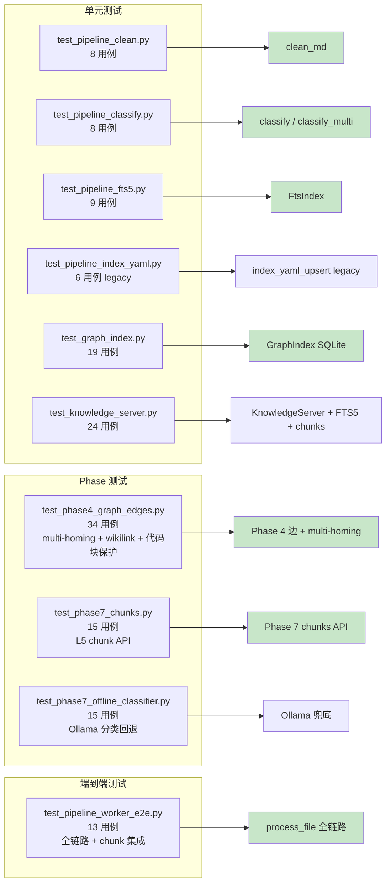

### 测试统计

| 测试文件 | 用例数 | 覆盖范围 |
|---------|--------|---------|
| `test_pipeline_clean.py` | 8 | `clean_md` HTML 剥离、代码块保护、空白折叠、长度截断 |
| `test_pipeline_classify.py` | 8 | `classify` 规则顺序、首匹配胜出、中文关键词、默认兜底 |
| `test_pipeline_fts5.py` | 9 | `FtsIndex` upsert 幂等、delete、中文 trigram、短查询 LIKE 兜底 |
| `test_pipeline_index_yaml.py` | 6 | `index_yaml_upsert` legacy 路径 (backward-compat) |
| `test_graph_index.py` | 19 | `GraphIndex` CRUD、filter、tree、并发 30 写无丢失、迁移单例锁 |
| `test_knowledge_server.py` | 24 | `KnowledgeServer` + FTS5 集成、lookup 优先 FTS5、chunks op |
| `test_phase4_graph_edges.py` | 34 | Phase 4 multi-homing + wikilink + 代码块保护 |
| `test_phase7_chunks.py` | 15 | Phase 7 L5 chunk API |
| `test_phase7_offline_classifier.py` | 15 | Phase 7 Ollama 分类回退 |
| `test_pipeline_worker_e2e.py` | 13 | `process_file` 全链路 (含 chunk 集成) |
| **总计** | **151** | 全部通过 |

运行:

```bash
cd ai-agent-core
python3 -m pytest -v tests/test_pipeline_* tests/test_graph_index.py tests/test_knowledge_server.py tests/test_phase4_graph_edges.py tests/test_phase7_*.py
```

---

## 10. 相关文件索引

### 核心实现文件

| 路径 | 用途 |
|------|------|
| [ai-agent-core/background_worker.py](ai-agent-core/background_worker.py) | watchdog Observer 入口;`start/stop/restart/status/run` 子命令 + pgrep 兜底 |
| [ai-agent-core/scripts/pipeline_worker.py](ai-agent-core/scripts/pipeline_worker.py) | Pipeline 5 阶段实现 + graph_index_upsert + wikilink + chunks + CLI |
| [ai-agent-core/scripts/web_scraper.py](ai-agent-core/scripts/web_scraper.py) | URL 抓取入口 (含 `--save-img`/`--save-attachments` 透传) |
| [ai-agent-core/scripts/offline_classifier.py](ai-agent-core/scripts/offline_classifier.py) | Phase 7 — Ollama 本地小模型分类 |
| [ai-agent-core/rag/fts_index.py](ai-agent-core/rag/fts_index.py) | FtsIndex 类 (trigram + 短查询 instr 兜底) |
| [ai-agent-core/rag/graph_index.py](ai-agent-core/rag/graph_index.py) | GraphIndex 类 (SQLite WAL,3 张表,模块级迁移单例) |
| [ai-agent-core/rag/chunker.py](ai-agent-core/rag/chunker.py) | TextChunker (paragraph / fixed 策略) |
| [ai-agent-core/config/tag_rules.yaml](ai-agent-core/config/tag_rules.yaml) | 12 条分类规则 |
| [ai-agent-core/config/index.yaml](ai-agent-core/config/index.yaml) | 只读快照 (`export_graph_to_yaml` 生成) |

### 测试文件

| 路径 | 用例数 |
|------|--------|
| [tests/test_pipeline_clean.py](ai-agent-core/tests/test_pipeline_clean.py) | 8 |
| [tests/test_pipeline_classify.py](ai-agent-core/tests/test_pipeline_classify.py) | 8 |
| [tests/test_pipeline_fts5.py](ai-agent-core/tests/test_pipeline_fts5.py) | 9 |
| [tests/test_pipeline_index_yaml.py](ai-agent-core/tests/test_pipeline_index_yaml.py) | 6 |
| [tests/test_pipeline_worker_e2e.py](ai-agent-core/tests/test_pipeline_worker_e2e.py) | 13 |
| [tests/test_graph_index.py](ai-agent-core/tests/test_graph_index.py) | 19 |
| [tests/test_knowledge_server.py](ai-agent-core/tests/test_knowledge_server.py) | 24 |
| [tests/test_phase4_graph_edges.py](ai-agent-core/tests/test_phase4_graph_edges.py) | 34 |
| [tests/test_phase7_chunks.py](ai-agent-core/tests/test_phase7_chunks.py) | 15 |
| [tests/test_phase7_offline_classifier.py](ai-agent-core/tests/test_phase7_offline_classifier.py) | 15 |

### 复用文件 (未修改)

| 路径 | 复用点 |
|------|--------|
| [ai-agent-core/skills/fetch_web_to_md.py](ai-agent-core/skills/fetch_web_to_md.py) | `FetchWebToMd` 类,文件名基于 title,`output_path` 语义为输出目录 |
| [ai-agent-core/rag/metadata.py](ai-agent-core/rag/metadata.py) | `MetadataIndex` 扁平 `[tag]` 过滤,与 graph_index L1-L5 互不干涉 |
| [ai-agent-core/rag/corpus_loader.py](ai-agent-core/rag/corpus_loader.py) | `CorpusLoader` 懒加载,agent 路径仍走它 |
| [ai-agent-core/rag/vector_db/store.py](ai-agent-core/rag/vector_db/store.py) | sqlite-vec 向量存储,与 FTS5 并行存在 |

---

## 11. 设计决策记录

### 11.1 为什么监控 `rag/corpus/` 而非 spec 写的 `memories/docs/`

**决策**:监控 `rag/corpus/`,FTS5 落 `rag/fts_index.db`。

**理由**:项目已有清晰的 rag/memories 分工 —— `rag/` 是"资料库" (外部知识、文档、抓取内容),`memories/` 是"运行时状态" (短期对话、长期三元组、缓存)。spec 写的 `memories/docs/` 违反这个分工。本项目把 spec 的"语义"实现到 rag/ 下。

### 11.2 为什么 FTS5 用 trigram 而非 unicode61

**决策**:`tokenize='trigram'`。

**理由**:`unicode61` 对中文按字符切分,2 字中文词 (如"简历") MATCH 命中不稳定。`trigram` 把所有文本拆成 3 字符滑窗,对中英文一致,4+ 字符中文短语 MATCH 稳定命中。短查询 (1-2 字) 走 `instr()` 兜底。

### 11.3 为什么 watcher 独立进程而非 agent.py fork 守护线程

**决策**:`background_worker.py` 独立常驻进程,`agent.py` 不变。

**理由**:`agent.py` 是无状态 CLI,每次调用启停;watchdog Observer 需要常驻。独立进程最干净,watcher 崩溃不影响 agent,agent 不依赖 watcher (lazy `CorpusLoader` 仍能用)。

### 11.4 为什么 Phase 2 把 `index.yaml` 迁移到 SQLite

**决策**:`config/index.yaml` → `rag/graph_index.db` (SQLite WAL)。

**理由**:① YAML 全文件读-改-写在并发写入下需应用层 `threading.Lock` 串行化;② SQLite WAL 天然支持多线程并发读写,行级锁粒度更细;③ 删除操作在 YAML 需遍历 tree,SQLite 一行 `DELETE WHERE path=?` 搞定;④ `config/index.yaml` 降级为只读快照导出,仍可 `export_graph_to_yaml()` 生成供 git diff。

### 11.5 为什么 Phase 4 引入 multi-homing

**决策**:`document_graph` 复合主键 `(path, l1, l2, l3)`,允许同 path 多标签。

**理由**:现实中文档常跨多个分类 (如"AI Coding 研发体系"既属"科技/AI/模型"又属"科技/AI/研发体系")。单标签会强制二选一丢失信息。multi-homing 让 `KnowledgeServer.filter [精华][职场]` 能从任一标签命中此文档。

### 11.6 为什么 Phase 4 用 wikilink 而非 LLM 抽取关系

**决策**:Markdown `[[wikilink]]` 语法 + `knowledge_edges` 表。

**理由**:① 零 token 成本,符合 deterministic-first 原则;② 用户显式标注,可信度高;③ 解析确定性强,可 git diff;④ 代码块内的 `[[...]]` 通过 `clean_md(keep_codeblocks_stashed=True)` 占位符保护,不会误识别;⑤ LLM 抽取关系对小数据集过重,且引入 API key 依赖。

### 11.7 为什么 Phase 7 加 L5 chunks

**决策**:`document_chunks` 表 + paragraph 分块 (1200 字符,150 重叠)。

**理由**:① L4 文档级检索粒度太粗,大文档 (10k+ 字) 命中后还需人工定位;② L5 chunk 让 `chunks <path>` / `chunks_by_cat` op 返回精确片段;③ `ReviewSkill` 可基于 chunks 做更精细的上下文拼接;④ 分块用 paragraph 策略 (双换行分段 + 句子边界切分),保持语义完整性。

### 11.8 为什么 Phase 7 Ollama 分类默认禁用

**决策**:`OLLAMA_CLASSIFY_ENABLED=0` 默认禁用,需显式开启。

**理由**:① 规则分类已覆盖 95% 主题,LLM 兜底收益边际;② Ollama 需要本地 GPU/CPU 资源,默认禁用避免无谓开销;③ 启用后走 `classify_hook` 装饰器模式,失败自动回退规则结果,不阻塞主流程;④ 个人知识库主题集中,规则可手动维护,LLM 价值低于 ReviewSkill 那种"烧 token 换洞察"的场景。

### 11.9 为什么 `on_deleted` 在 Phase 3 实现而非初版

**决策**:初版 (Phase 1+2) 只处理 create/modify,Phase 3 实现删除闭环。

**理由**:① delete 处理需同步清理 FTS5 + graph_index 两处,幂等性和并发安全更复杂;② 依赖 Phase 2 的 SQLite `graph_index` (`DELETE WHERE path=?` 一行搞定);③ Phase 3 通过 `delete_file_indexes()` 函数封装,`on_deleted` 事件异步投递到同一 worker pool,与 create/modify 共享防抖/序列化机制;④ 删除频率低,即使 watcher 未启动,手动清理 SQL 仍可用作兜底。

### 11.10 为什么 stop/status 加 pgrep 兜底

**决策**:[background_worker.py](ai-agent-core/background_worker.py) 的 `cmd_stop` / `cmd_status` 用 `pgrep -f background_worker.py` 扫进程表。

**理由**:① 直接 `python3 background_worker.py run` 启动的进程不写 PID 文件,`stop` 找不到;② 多 watcher 并发会竞争 SQLite 写入,需兜底杀干净;③ `pgrep` 校验 cmdline 必须是 `python` 开头 + `background_worker.py` 脚本路径,过滤 `bash -c "... background_worker.py ..."` 这类 shell 包装进程。

### 11.11 为什么 P1 BM25 相似度边用离线脚本而非 watcher 自动建

**决策**:`scripts/build_similarity_edges.py` 离线手动跑,`--clear` 后重建,不在 watcher pipeline 里自动触发。但通过 `pipeline_ops` skill 暴露 `build_similarity_edges` op,使 agent/LLM 路径也能按需触发(路由 `^(build|rebuild|update)_similarity.*(edge|graph)?\b`)。

**理由**:① BM25 需要全语料两两比较,O(n²) 复杂度,watcher 每次单文件触发都重算不现实;② 边的更新频率远低于文档增删,日常新增 1 篇文档不会显著改变其他 476 篇的相似度排序;③ 离线脚本可显式控制 top-k、min_score、clear 时机,生产实测 477 文档 ~3s 完成,可接受;④ `rel_type='bm25_similar'` 与 wikilink 边独立,`--clear` 只删本类型,不影响 wikilink 边;⑤ skill op 的 `corpus_dir`/`graph_db` 为必填参数(不读 env),防止 LLM 误用默认值操作生产 graph;⑥ 与 watcher 自动触发相比,skill op 走显式调用——人/LLM 主动发起重建,意图明确,留痕在对话历史里。

### 11.12 为什么 P1 `min_score` 默认 -1.0 而非 0.0

**决策**:`build_edges()` 的 `min_score` 参数默认 -1.0。

**理由**:BM25 对不相关文档会返回负分（典型如 `[0.96, -0.062, -0.041]`）。若默认 0.0,`score < min_score` 会把 top-k 中的负分边全部过滤,小语料测试环境下会得到 0 条边,与"top-k per doc"语义矛盾。改成 -1.0 保证 top-k 正常落盘;用户显式传 `--min-score 0.5` 时仍可严格过滤弱匹配。生产环境正分边占多数,默认值不影响结果。

### 11.13 为什么 P0-2 URL 去重用独立 SQLite 而非塞进 long_term

**决策**:新模块 `memories/url_registry.py`,独立 SQLite 表 `url_map(url PK, filepath, title, fetched_at)`。

**理由**:① long_term 是 `triplets(subject, predicate, object)` 三元组模型,塞 URL→filepath 会污染语义;② graph_index 是文档关系图,URL→filepath 属于"抓取历史"语义,独立存储便于单独替换/清理;③ 独立 DB 文件 (`url_map.db`) 可直接 `rm` 重建,不影响其他子系统;④ `UrlRegistry` 接口极简（lookup/record/count/clear）,与 `cache_guard` 类似的单表 SQLite + 线程锁模式,维护成本低。

### 11.14 为什么 P0-1 `_build_llm_messages` 末条原地改写而非 append

**决策**:若历史末条 user 消息 content 已等于当前 query,原地改写末条（加 prompt_prefix + JSON 指令）;否则 append 新 user 消息。

**理由**:① `handle()` 在路由前已 `short_term.append("user", query)`,所以 `recent(10)` 末条必是当前 query;② 若直接 append,会变成"裸 query 在历史末条 + 改写后的 query 在新末条",两条 user 消息重复,Anthropic API 会报错或浪费 token;③ 原地改写保证 messages 末条是带指令的版本,同时历史中保留裸 query 用于下次多轮上下文;④ 测试 `test_build_llm_messages_rewrites_current_query_with_prefix` 显式校验此行为。
